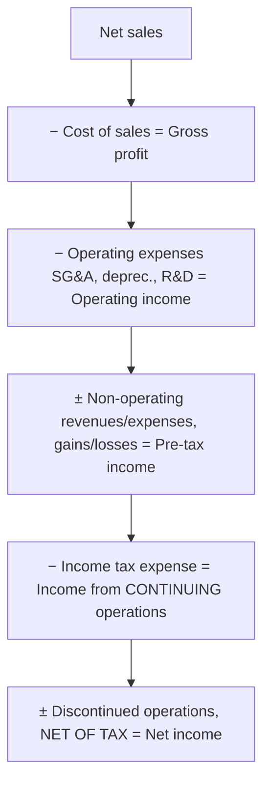
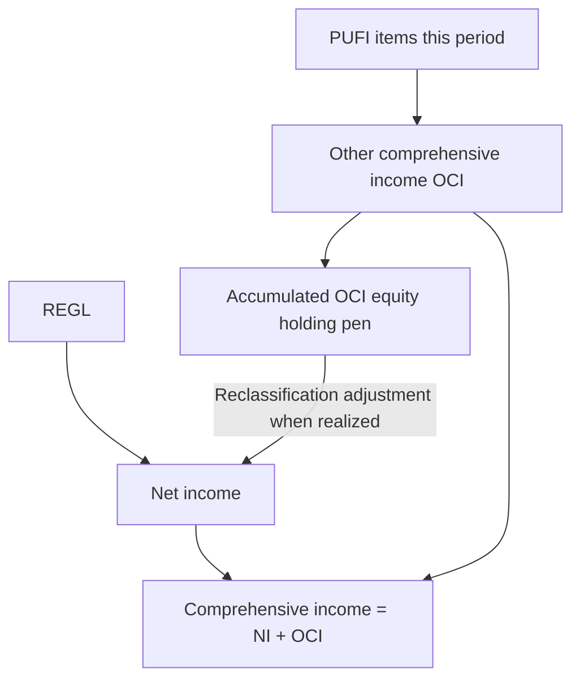

## 1. The Full Set of Financial Statements and the Balance Sheet

U.S. GAAP defines a **full set of general purpose financial statements** (statements **plus** footnotes):

| Statement | Answers | Risk lens |
|---|---|---|
| **Balance sheet** (statement of financial position) | What is owned and owed **as of a date** | Financial risk — liquidity, long-term solvency |
| **Income statement** (statement of earnings) | Performance **over a period** | Operating/performance risk |
| **Statement of comprehensive income** | Reconciles net income → comprehensive income (adds OCI) | — |
| **Statement of cash flows** | Why cash changed | Earnings quality, growth potential |
| **Statement of stockholders' (owners') equity** | How equity changed | — |

The balance sheet may be **classified** (current vs. non-current split) or, if permitted, ordered by **liquidity**. It is a **cumulative** measure as of a date.

**Accounting equation:** `Assets = Liabilities + Owners' equity` (equity = net assets). Liabilities hold the **first (preemptive) claim**; equity is the **residual interest**. Claim order in liquidation: creditors → preferred stock → common stock.

- **Assets** — probable future economic benefit. Categories: current assets, investments/other funds (not used in operations), PP&E (tangible, used in operations), intangibles (used in operations, no physical substance), other non-current.
- **Liabilities** — have a maturity/due date: current (satisfied with current assets) vs. long-term (financial).
- **Equity** — **contributed capital** (common/preferred stock + APIC) and **earned capital** (retained earnings + accumulated OCI); **treasury stock** is a contra-equity reduction.

> [!TRAP]
> The balance sheet does **not** show fair/market value of the entity. Many items sit at **historical cost** (a fully depreciated building worth millions shows at ~$0), and estimates plus policy choices (LIFO/FIFO, straight-line/accelerated) further distort carrying amounts.

## 2. The Income Statement — Structure, REGL, and Presentation

Purpose: report **performance over time** and operating risk (stable vs. volatile sales/operating income). Volatility is gauged by **standard deviation** of figures over time.

> [!MNEMONIC]
> **REGL** — the income statement is **R**evenues, **E**xpenses, **G**ains, **L**osses.

**Operating vs. non-operating:**

- **Operating** revenues/expenses = the core business, shown **gross** (revenue and COGS separated, not netted).
- **Non-operating** = unusual/infrequent/non-core items (interest income for a non-bank, write-downs, selling a fixed asset or investment). **Gains and losses are shown net** (e.g., "gain on sale," not proceeds vs. cost separately).
- **Extraordinary items** (both unusual **and** infrequent) are a **retired** category — everything now lands as ordinary non-operating.

**Period vs. unexpired costs:** period costs are expensed immediately (selling, G&A, R&D). **Unexpired costs** are paid now but benefit the future → recorded as **assets**, then moved to expense under the **matching principle** (inventory → COGS; prepaid insurance → insurance expense; fixed assets → depreciation; patent → amortization).

**Income from continuing operations** = operating **and** non-operating REGL — because the business keeps doing both. Its counterpart, **discontinued operations**, is reported **separately, below** continuing operations and **net of tax**.

**Presentation formats:**

| Format | Path to net income | Trade-off |
|---|---|---|
| **Single-step** | All revenues/gains grouped, all expenses/losses grouped → one subtraction | Simple; **no** operating vs. non-operating split → weak for ratios |
| **Multi-step** | Series of subtotals (sales → gross profit → operating income → pre-tax → continuing ops → net income) | Separates core from incidental; supports ratio analysis |

**Limitations / management bias:** the income statement is subjective (estimates, accrual basis, accounting-method choices). **Aggressive** = book more revenue / less expense (premature revenue, capitalizing period costs, longer useful lives, higher salvage). **Conservative** = the reverse (defer revenue, front-load via double-declining balance, higher bad-debt/warranty accruals). Reclassifying items **between operating and non-operating** is another way to shape the story (a loss moved to non-operating reads as "one-off").



## 3. Multi-Step Income Statement — Comprehensive Example

Trial-balance charts of accounts key the **first digit** to a category: 4xxx revenue, 5xxx operating expense, 6xxx/7xxx non-operating, 8xxx discontinued (net of tax). Watch the split notes: of $70 salaries, $20 is **selling**, $50 is **G&A (officers)**; a $100 **restructuring** of a service division is **infrequent → non-operating**, not discontinued. **Freight-out is a selling expense; freight-in is part of inventory cost.**

**Q — Assemble a multi-step income statement down to net income from the accounts below: split the $70 salaries into $20 selling / $50 G&A, treat the $100 restructuring as non-operating (infrequent, not discontinued), place freight-out in selling, and show every subtotal (gross profit → operating income → pre-tax → continuing ops → net income).**

```schedule
{"caption": "Multi-step income statement (000s) — internally consistent build",
 "columns": ["Line", "Amount"],
 "rows": [
   ["Net sales (350 product net of returns + 200 service + 100 rental)", "650"],
   ["− Cost of sales", "(410)"],
   ["= Gross profit", "240"],
   ["− Selling expense", "(100)"],
   ["− General & administrative", "(70)"],
   ["− Depreciation", "(80)"],
   ["= Operating income (loss)", "(10)"],
   ["+ Other revenues & gains (interest revenue + gain on AFS sale + other revenue)", "350"],
   ["− Other expenses & losses (interest expense + loss on FA sale + restructuring 100)", "(190)"],
   ["= Income before taxes", "150"],
   ["− Income tax expense (effective 66.7%)", "(100)"],
   ["= Income from continuing operations", "50"],
   ["− Discontinued operations, net of tax", "(25)"],
   ["= Net income", "25"]
 ]}
```

Ratios the statement feeds: **gross margin** 240 ÷ 650 = **37%**; **operating margin** (10) ÷ 650 = **−1.5%**; **net margin** 25 ÷ 650 ≈ **4%**; **effective tax rate** 100 ÷ 150 = **66.7%**. Ratios raise questions (why did a 37% gross margin fall below zero at operating?) more than they answer them — compare to prior years and competitors.

## 4. Discontinued Operations — Accounting Rules

A discontinued operation is a **conscious strategic withdrawal** (a component, group of components, or whole business/NFP activity) that represents a **strategic shift with a major effect** on operations and financial results (exiting a geography, abandoning an equity-method investment, dropping a major line). It is reported **below continuing operations, net of tax** (because income tax expense lives in continuing operations).

**Qualifies if either:** (a) **disposed of** during the year, or (b) **classified as held for sale**. Held for sale requires **all six**:

1. Management **commits** to a plan to sell;
2. Asset is **available for immediate sale** as-is (buyer walks in → keys hand over);
3. **Active program** to locate a buyer (e.g., engaged an agent);
4. Sale is **probable** and expected **within one year** (need not *close* within the year);
5. **Actively marketed at a price reasonable** vs. fair value;
6. **Significant changes to the plan are unlikely** (won't pull it back off the market).

Fail any criterion → reverts to **held and used** (ordinary long-term asset). Held-for-sale assets **stop being depreciated/amortized**.

**Three amounts flow into discontinued operations:**

1. **Operating results** of the component for the **entire year** (all of it, even months before the decision) and until sold;
2. **Impairment loss** at held-for-sale classification — write down to **net realizable value** (fair value − cost to sell) when NRV < carrying value;
3. **Gain/loss on actual sale/disposal** (selling price vs. carrying value).

> [!RULE]
> Impairment may later be **reversed if fair value recovers, but never above the original carrying amount** (reversal capped at the loss originally recognized). On the balance sheet the asset sits at the **lower of NRV or book value**.

> [!EXAM]
> Whenever a problem states a **tax rate**, pause — discontinued operations, and each of their component amounts, are shown **net of tax**. Multiply pre-tax figures by (1 − rate).

## 5. Discontinued Operations — Comprehensive Example (All Sports golf division)

**Q — A golf division (carrying value $4.0M) is classified held-for-sale 4/30 Yr 1 when NRV is $2.2M, then sold 6/30 Yr 2 for $2.0M; it loses $200K/month; tax rate 40%; income from continuing operations is $4,875K (Yr 1) and $5,200K (Yr 2). Present the discontinued-operations section net of tax and compute net income for each year.**

Work: held-for-sale NRV $2.2M vs. carrying $4.0M → **impairment $1.8M (Yr 1)**; sold for $2.0M → additional **$0.2M loss on disposal (Yr 2)**. Operating loss = $200K/month → **$2.4M** Yr 1 (12 months) and **$1.2M** Yr 2 (6 months to sale). Apply the net factor 60% (1 − 40% tax) to each pre-tax component.

> [!EXAM] **Income from continuing operations is usually *derived*, not given.** Back it out of the total-company trial balance by removing the discontinued division's own accounts, then tax-effect. Here is where the $4,875 comes from (Yr 1):

```schedule
{"caption": "Deriving income from continuing operations = total company − golf division (000s)",
 "columns": ["Line", "All Sports (total)", "− Golf division", "= Continuing"],
 "rows": [
   ["Revenue (4xxx accounts)", "21,000", "(2,500)", "18,500"],
   ["Operating expenses (5xxx: COGS → depreciation)", "(16,605)", "4,900", "(11,705)"],
   ["= Operating income", "—", "—", "6,795"],
   ["+ Non-operating, net (6xxx gains − 7xxx interest; exclude impairment)", "—", "—", "1,330"],
   ["= Income from continuing operations, pre-tax", "—", "—", "8,125"],
   ["− Income tax (40%)", "—", "—", "(3,250)"],
   ["= Income from continuing operations", "—", "—", "4,875"]
 ]}
```

The golf division's own accounts (2,500 revenue − 4,900 operating expenses = **$2,400 operating loss** = $200K/month × 12) confirm the full-year discontinued operating loss that flows below. The division's **impairment** stays in discontinued operations — it is *not* netted into the continuing-ops derivation.

```schedule
{"caption": "Discontinued operations presentation (000s, net of 40% tax)",
 "columns": ["Line", "Year 1", "Year 2"],
 "rows": [
   ["Income from continuing operations", "4,875", "5,200"],
   ["Discontinued: operating loss, net of tax", "(1,440)", "(720)"],
   ["Discontinued: impairment loss, net of tax", "(1,080)", "—"],
   ["Discontinued: loss on disposal, net of tax", "—", "(120)"],
   ["Net income", "2,355", "4,360"]
 ]}
```

Year 1 = impairment + full-year operating loss; Year 2 = operating loss to sale + loss on disposal. The whole year's activity is discontinued, regardless of when in the year the board decided.

## 6. Individual Foreign Currency Transactions

Triggered by **importing (foreign payable)** or **exporting (foreign receivable)** denominated in a foreign currency and settled **later** — the exchange rate can move in between. (Intercompany **financing** moves between a parent and subsidiary are **not** foreign currency transactions.)

- **Direct rate:** domestic cost of **one** foreign unit (1 euro = $1.47).
- **Indirect rate:** foreign units per **one** domestic unit ($1 = 0.68 euro).
- **Current / spot rate:** the rate right now.

**Gain/loss direction:** a stronger foreign currency **raises** a receivable (gain) and **raises** the cost of a payable (loss); a weaker foreign currency does the reverse. Remeasure at the **balance sheet date** (unrealized gain/loss) and again at **settlement**.

**Q — Millinio (USD functional) buys goods for 100,000 pesos on 12/1/Yr 1 and pays on 2/1/Yr 2; spot rates are $0.10 (12/1), $0.08 (12/31 balance-sheet date), $0.09 (2/1 settlement). Record the purchase, the year-end remeasurement, and the settlement, and state the net FX effect.**

```journal
{"desc": "12/1 — purchase on credit at $0.10 (100,000 pesos)",
 "dr": [["Purchases / Inventory", 10000]],
 "cr": [["Accounts payable", 10000]]}
```

```journal
{"desc": "12/31 — remeasure payable to $0.08 (unrealized FX gain)",
 "dr": [["Accounts payable", 2000]],
 "cr": [["Foreign exchange gain", 2000]]}
```

```journal
{"desc": "2/1 — settle at $0.09; payable carried at 8,000",
 "dr": [["Accounts payable", 8000], ["Foreign exchange loss", 1000]],
 "cr": [["Cash", 9000]]}
```

Net: a $2,000 gain at year-end, then a $1,000 loss on the partial rebound — still ahead overall.

## 7. Comprehensive Income — OCI, PUFI, and Reclassification

Some items are **not yet** realized enough to be REGL on the income statement, yet don't fit the definition of an asset/liability — so GAAP parks them in **other comprehensive income (OCI)**, which accumulates in equity as **accumulated OCI (AOCI)**.

> [!MNEMONIC]
> **PUFI** — the OCI items: **P**ension adjustments; **U**nrealized holding gains/losses (available-for-sale **debt** securities and derivatives used as **cash-flow hedges**); **F**oreign currency **translation** items; **I**nstrument-specific credit risk.

**Comprehensive income = net income + OCI** — another **subtotal**, like gross profit or operating income.

> [!TRAP]
> Three near-identical terms: **comprehensive income** (the subtotal = NI + OCI), **other comprehensive income** (the PUFI activity *this period*), and **accumulated OCI** (the equity "holding pen," like retained earnings). Comprehensive income does **not** equal OCI.

Comprehensive income is the change in equity from **all non-owner** transactions (owner contributions, withdrawals, and dividends are excluded). Foreign currency **translation** here (consolidating a euro subsidiary into dollars) is different from the **transaction** gains/losses of Section 6.

**Reclassification adjustment:** when a PUFI item is finally realized, it moves **out of AOCI onto the income statement** (recognized in net income **once**, then flows to retained earnings) — the adjustment prevents **double-counting**.



## 8. Reporting Comprehensive Income and Other Issues

Presentation must be with **equal prominence**, via one of two formats:

| Approach | Structure | Giveaway |
|---|---|---|
| **Single-statement** | One statement: revenue → net income → OCI → comprehensive income | **Starts at revenue** |
| **Two-statement** | Income statement (→ net income), then a separate statement of comprehensive income | **Starts at net income** |

OCI items and comprehensive income are shown **net of tax**. Comprehensive income is **not** required for **not-for-profits**, is **not** presented **per share**, and is unnecessary if the entity has **no** PUFI items. It **is** required for **interim/condensed** statements.

**Tax effects** of each PUFI component may be shown on the **face** of the statement **or** reconciled in the **notes**. Required disclosures: a **reconciliation of AOCI by component** (beginning balance, current-year activity, reclassification adjustments, ending balance), **total AOCI in equity**, and detail of **significant items reclassified out** of AOCI (which must cross-reference/agree to the reconciliation).

```recap
1. Full set of statements = balance sheet, income statement, comprehensive income, cash flows, equity — plus footnotes; A = L + E, equity is the residual; balance sheet is historical cost, not fair value.
2. Income statement = REGL; operating (gross) vs. non-operating (net); multi-step gives subtotals (gross profit → operating income → pre-tax → continuing ops → net income) for ratios; watch freight-out (selling) vs. freight-in (inventory) and salary splits.
3. Continuing operations = operating + non-operating; discontinued operations sit below it, net of tax.
4. Discontinued: held-for-sale needs all six criteria; three amounts — full-year operating results, impairment to NRV, gain/loss on disposal; reversal capped at original loss; stop depreciating; carry at lower of NRV or book.
5. FX transactions: stronger foreign currency helps a receivable, hurts a payable; remeasure at balance sheet date (unrealized) and at settlement.
6. Comprehensive income = NI + OCI (PUFI), a subtotal; AOCI is the equity holding pen; reclassification moves realized items to the income statement once, avoiding double counting.
7. Report single-statement (starts at revenue) or two-statement (starts at net income), net of tax; disclose AOCI reconciliation by component; not required for NFPs or per share; required for interim.
```
