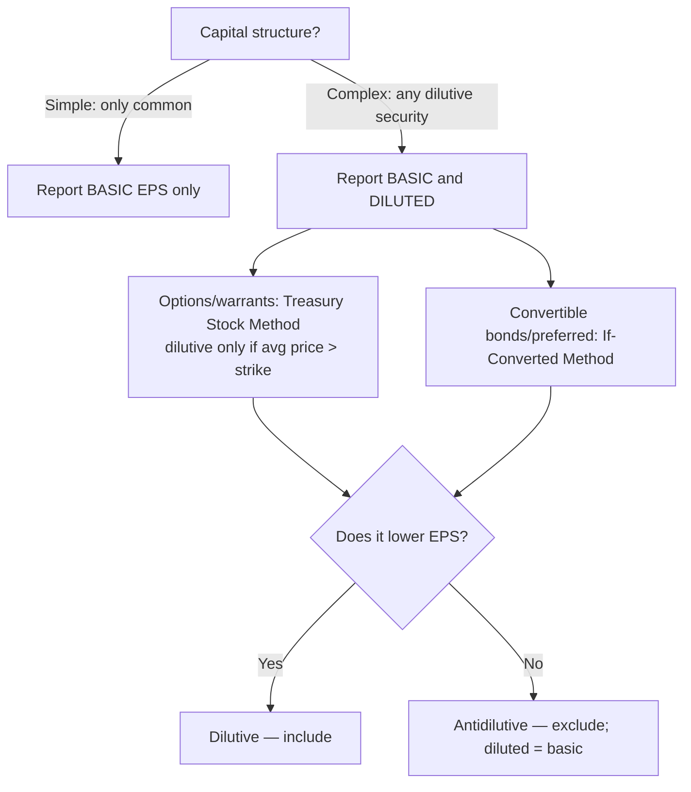

## 1. SEC Filings and the Form 10-K

The SEC requires 50+ forms filed electronically through **EDGAR** (Electronic Data Gathering, Analysis, and Retrieval) — publicly searchable. The **Form 10-K** is the **annual report** of a U.S. registered company, aimed at current and prospective investors: the business, risk factors, financial/operating results, and leadership's view.

**Filer categories drive the 10-K deadline** (bigger = faster):

```schedule
{"caption": "10-K filing deadlines by filer status",
 "columns": ["Filer", "Test (worldwide public float / revenue)", "10-K deadline"],
 "rows": [
   ["Large accelerated", "Public float ≥ $700M", "60 days"],
   ["Accelerated", "Float $75M–$700M AND revenue ≥ $100M", "75 days"],
   ["All other (non-accelerated)", "Below the above", "90 days"]
 ]}
```

**Key 10-K items (from an accounting lens):**

- **Item 7 — MD&A** (Management's Discussion and Analysis): management's own-words view of financial condition and results — liquidity and capital resources, key results, **trends, risks, and uncertainties**, material changes vs. prior period, and critical estimates/assumptions. The subjective complement to the numbers.
- **Item 7A — Quantitative and qualitative disclosures about market risk:** exposure to interest rates, FX, and other market factors. Quantitative choice of **three**: a tabular presentation, a **sensitivity analysis**, or **value at risk**; plus qualitative discussion of exposures, management strategy, and changes/expectations.
- **Item 8 — Financial statements and supplementary data:** the full **audited** statements + notes.

> [!RULE]
> 10-K period coverage — **"three years, except the balance sheet."** Income statement, cash flows, and changes in equity: **three** fiscal years. Balance sheet: **two** most recent fiscal years. Include the auditor's report plus **CEO and CFO certifications** attesting to accuracy and completeness.

## 2. The 10-Q and the 8-K

**Form 10-Q** — quarterly report for **Q1–Q3** (Q4 is subsumed by the 10-K). Deadline: **40 days** (accelerated/large accelerated) or **45 days** (all other).

- Financials are **reviewed, not audited** — quarterly reporting favors **timeliness over reliability** (the year-end 10-K flips that priority).
- May be **condensed**; must include adjustments needed to fairly state the interim period, with a note saying so. Normal recurring adjustments get a statement to that effect; unusual/non-recurring ones are **described** (nature and amount).

**Required periods** (illustrated as of a 6/30/Yr2 filing, calendar-year entity):

```schedule
{"caption": "10-Q period requirements",
 "columns": ["Statement", "Required periods", "Optional"],
 "rows": [
   ["Balance sheet", "End of most recent quarter (6/30/Yr2) + end of preceding fiscal year (12/31/Yr1)", "Prior-year quarter (6/30/Yr1) if seasonal"],
   ["Income statement / comprehensive income", "Most recent quarter + year-to-date, and the same periods last year", "Cumulative 12 months"],
   ["Statement of cash flows", "Year-to-date current + year-to-date prior year", "Cumulative 12 months"]
 ]}
```

The 10-Q also carries **MD&A** (Item 2, Part 1) and market-risk disclosures, emphasizing **changes** since the last fiscal year-end.

**Form 8-K** — a "press release" filing for any **material event**, due within **4 business days** (no filer-status distinction). Triggers: bankruptcy, significant acquisition/disposition of assets, **change of auditors**, changes in the trading market, changes in directors/officers, bylaw/charter amendments, change of fiscal year-end, material new agreement, or significant change in the financial statements.

## 3. Basic EPS and the Simple Capital Structure

**Earnings per (common) share** is presented on the **face of the income statement** by all public companies (or those that have filed for a public offering).

| Capital structure | Contains | Present |
|---|---|---|
| **Simple** | Only common stock — nothing convertible into common (no convertible bonds/preferred, no options/warrants, no contingent shares) | **Basic EPS** only |
| **Complex** | Any potentially dilutive security | **Basic *and* diluted** EPS |

EPS is shown for **income from continuing operations** and **net income** (both on the face). **Discontinued operations** EPS may be shown on the **face or in the notes** ("the disco is the exception").

**Basic EPS = income available to common stockholders ÷ WACSO**, where **income available to common = net income − preferred dividends.**

- **Cumulative** preferred: subtract the **annual dividend that accrues** (shares × par × rate) — **whether or not declared**.
- **Non-cumulative** preferred: subtract only the amount **declared**.
- If income already stated as "available to common," do **not** subtract preferred dividends again.

> [!TRAP]
> With a **net loss**, subtracting preferred dividends **increases** the loss per share (a negative minus a positive gets more negative). Watch the sign.

**WACSO (denominator):** weight shares by the fraction of the period they were outstanding (monthly for exam purposes). Issuances raise it; treasury buybacks lower it.

> [!EXAM]
> **Stock splits and stock dividends are applied retroactively** to the **beginning of the period** — restate every balance *before* the split date. This holds even for a split/dividend occurring **after year-end but before the statements are issued**. Shares issued in a **business combination** are weighted from the **combination date**.

**Q — 1,000,000 shares are outstanding on 1/1; a 2-for-1 stock split occurs 3/31; 3,000,000 new shares are issued 4/1; 500,000 shares are bought back 12/1. Compute weighted-average common shares outstanding (WACSO), applying the split retroactively to the beginning of the year.**

```schedule
{"caption": "WACSO example — 2-for-1 split on 3/31 (retroactive to 1/1)",
 "columns": ["Date / event", "Shares", "After split adj.", "Fraction of year", "Weighted"],
 "rows": [
   ["1/1 beginning 1,000,000 × 2 (split)", "1,000,000", "2,000,000", "3/12", "500,000"],
   ["4/1 issue 3,000,000 (after split — no adj.)", "+3,000,000", "5,000,000", "8/12", "3,333,333"],
   ["12/1 buy back 500,000", "(500,000)", "4,500,000", "1/12", "375,000"]
 ],
 "totals": ["WACSO", "", "", "", "4,208,333"]}
```

Sanity check: WACSO (4,208,333) falls between the split-adjusted start (2,000,000) and year-end (4,500,000).

## 4. Diluted EPS — Options and Warrants (Treasury Stock Method)

Diluted EPS reflects the **bad-news** scenario: what EPS would be if dilutive securities converted. By **conservatism**, only include a security if it **lowers** EPS; an **antidilutive** security (would raise EPS) is **excluded**, and diluted EPS is then reported **equal to basic**.

**Options/warrants — treasury stock method.** Dilutive **only if average market price > strike (exercise) price** (in the money). If no average is given, use year-end price. Steps:

1. Confirm average price > strike → dilutive.
2. Assume options exercised → shares **issued** at the strike price; company collects cash.
3. Use the cash to **repurchase** shares at the **average** price.
4. **Net increase = shares issued − shares repurchased**, added to the denominator (numerator unchanged → EPS falls).

**Q — A company has 1,000 options with a $15 strike; the average market price is $20 (in the money → dilutive). Using the treasury stock method, compute the net increase in shares added to the diluted-EPS denominator.**

```schedule
{"caption": "Treasury stock method — 1,000 options, strike $15, average price $20",
 "columns": ["Step", "Amount"],
 "rows": [
   ["Shares issued on exercise", "1,000"],
   ["Cash proceeds (1,000 × $15)", "$15,000"],
   ["Shares repurchased ($15,000 ÷ $20)", "(750)"],
   ["Net increase to WACSO", "250"]
 ]}
```

## 5. Diluted EPS — If-Converted Method, Antidilution, and Disclosures

**Convertible bonds / convertible preferred — if-converted method.** Assume conversion at the **beginning of the period** (or at **issuance date** if issued mid-year — then weight, and count interest saved only for months outstanding).

| Security | Numerator adjustment | Denominator adjustment |
|---|---|---|
| **Convertible bonds** | Add back **interest saved × (1 − tax rate)** (losing the interest also loses its tax deduction) | + shares from conversion (bonds ÷ $1,000 par × shares per bond) |
| **Convertible preferred** | Add back the **preferred dividends** (no tax effect — dividends aren't deductible) | + shares from conversion |

**Q — Net income $100,000; $500,000 of 6% convertible bonds outstanding all year, each $1,000 bond convertible into 10 common shares; WACSO 100,000; tax rate 34%. Compute basic and diluted EPS and state whether the bonds are dilutive.**

```schedule
{"caption": "If-converted (bonds) — NI $100,000; $500,000 of 6% bonds, 10 shares/bond; tax 34%",
 "columns": ["", "Basic", "Diluted"],
 "rows": [
   ["Numerator: NI − pref. div.", "100,000", "100,000"],
   ["+ interest saved net of tax (30,000 × 66%)", "—", "19,800"],
   ["= Income to common", "100,000", "119,800"],
   ["Denominator: WACSO", "100,000", "100,000"],
   ["+ conversion shares (500 bonds × 10)", "—", "5,000"],
   ["= Shares", "100,000", "105,000"],
   ["EPS", "$1.00", "$1.14 → antidilutive"]
 ]}
```

Diluted $1.14 > basic $1.00 → **antidilutive** → exclude the bonds; report basic **and** diluted both at **$1.00**.

**Q — Carlin: net income $100,000; 10,000 shares of convertible preferred paying $20,000 in dividends, each convertible into 5 common shares; WACSO 100,000. Compute basic and diluted EPS and state whether the preferred is dilutive.**

```schedule
{"caption": "If-converted (preferred) — Carlin: NI $100,000; 10,000 conv. pref., div $20,000, 5 common/share",
 "columns": ["", "Basic", "Diluted"],
 "rows": [
   ["Income to common (100,000 − 20,000 / add back for diluted)", "80,000", "100,000"],
   ["Shares (100,000 + 10,000 × 5)", "100,000", "150,000"],
   ["EPS", "$0.80", "$0.67 → dilutive, report it"]
 ]}
```

**Sequencing:** with multiple potentially dilutive securities, add them **most-dilutive to least-dilutive** (options/warrants first — they add only to the denominator), stopping before any becomes antidilutive.

**Other dilutive items:** a contract settleable in **cash or stock** is presumed settled in **stock**. **Contingent shares** count only once **all conditions are met** — and once met, they are included **retroactively** to the beginning of the period, in **both basic and diluted** EPS.

**Disclosures:** reconcile numerator and denominator between basic and diluted; show the preferred-dividend effect; and put readers on notice of securities that were **antidilutive this year** but could dilute later. **Cash flow per share is *not* reported.**



```recap
1. SEC filings via EDGAR: 10-K (annual, audited) deadlines 60/75/90 days by filer status; three years of income/cash-flow/equity statements, two years balance sheet; MD&A (Item 7), market risk (7A), financials (Item 8), CEO/CFO certification.
2. 10-Q (quarterly Q1–Q3, reviewed not audited) due 40/45 days; timeliness over reliability; 8-K for material events within 4 business days.
3. Basic EPS = (net income − preferred dividends) ÷ WACSO; cumulative preferred subtract whether declared or not, non-cumulative only if declared; a loss makes preferred dividends worsen LPS.
4. WACSO weights shares by time outstanding; stock splits/dividends retroactive to period start (even if after year-end but before issuance); business-combination shares weighted from the combination date.
5. Diluted: options/warrants via treasury stock method (dilutive only when average price > strike); convertible bonds add back interest net of tax + conversion shares; convertible preferred add back dividends (no tax) + conversion shares.
6. Include a security only if it lowers EPS; antidilutive securities are excluded and diluted equals basic; sequence most- to least-dilutive; contingent shares count (retroactively, in basic too) once conditions are met; cash flow per share is not reported.
```
