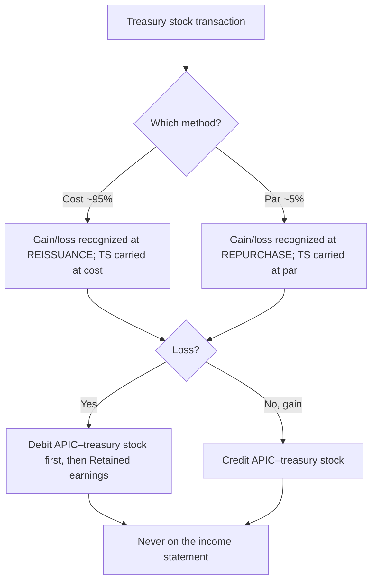

## 1. Stockholders' Equity Overview and Legal Capital

Equity is the owners' **residual interest** (net assets = assets − liabilities); it is the last balance-sheet section. Components must be **clearly classified**:

| Bucket | Contains |
|---|---|
| **Contributed (paid-in) capital** | **Capital stock** (legal/stated capital = shares issued × par) + **additional paid-in capital (APIC)** |
| **Earned capital** | **Retained earnings** + **accumulated OCI** |
| Contra-equity | **Treasury stock** (subtract) |
| Below total | **Noncontrolling interest** — the portion of a consolidated subsidiary not owned; added to reach **total equity** |

**Legal (stated) capital = shares issued × par** — set aside for **creditor protection** and **cannot be used to pay dividends**. Amounts above par go to **APIC in excess of par**; a few states allow dividends out of APIC (capital surplus) when retained earnings is exhausted, but **never** out of stated capital.

- **Authorized** (max issuable) → **issued** (sold) → **outstanding** (issued − treasury). EPS, voting, and dividends use shares **outstanding**.
- Common stock **usually** has par but need not — "must have par" is a **wrong** answer; no-par stock may carry a **stated value** the board sets in good faith.
- **Preemptive right** (only if granted in the articles) lets a holder buy new issues to preserve proportionate voting strength.
- Common = last in a Chapter 7 liquidation (creditors → preferred → common), variable return, votes; preferred generally no vote, lower/fixed return, priority.

> [!RULE]
> **Book value per common share** = common stockholders' equity ÷ shares outstanding, where common equity = total equity − **preferred stock (at the greater of call price or par)** − **dividends in arrears** (cumulative preferred only). Using the higher preferred amount is the conservative choice.

## 2. Preferred Stock Features and Participating Dividends

Preferred "preferences": priority on **dividends** and on **liquidation** (which must appear **on the face** of the balance sheet, not buried in notes). Features that **raise** value:

- **Cumulative** — unpaid dividends accumulate as **dividends in arrears** (disclosed, **not a liability** — dividends require board declaration) and must be paid before any common dividend. If the word "cumulative" is absent, assume **non-cumulative** (missed dividends are simply lost).
- **Participating** — after both classes get their base rate, preferred shares in the excess **pro rata**. **Fully** participating = no cap; **partially** = capped.
- **Convertible** — holder may convert to common (a hedge; usually priced at a premium).

Features that **lower** value to the holder: **callable/redeemable** (the **issuer** holds the option to buy back at a call price — caps upside). **Mandatorily redeemable** preferred has a maturity date → classified as a **liability**.

**Fully participating + cumulative example (Sam Co.):** preferred par $250,000 @ 8%, common par $500,000 @ 8%; no dividend in Yr 1; **$101,000** declared in Yr 2.

```schedule
{"caption": "Participating dividend allocation — $101,000 in Year 2",
 "columns": ["Step", "Preferred", "Common"],
 "rows": [
   ["Arrears (Yr 1: 250,000 × 8%)", "20,000", "—"],
   ["Current year (each par × 8%)", "20,000", "40,000"],
   ["Participate in remainder $21,000 pro rata (1/3 : 2/3)", "7,000", "14,000"],
   ["Total", "47,000", "54,000"]
 ]}
```

## 3. Additional Paid-in Capital, Retained Earnings, and AOCI

**APIC** most commonly arises when issue price exceeds par — but **not only** then (also treasury-stock gains, liquidating dividends, debt-to-equity conversion, small stock dividends). Beware absolute words — **all/always/never/must/only** usually mark a wrong answer.

**Retained earnings** = accumulated profit not yet distributed. Reduced when a dividend is **declared** (not paid):

| Dividend type | Reduce RE by | On statement of cash flows? |
|---|---|---|
| Cash | Cash amount | Yes (financing outflow) |
| Property | **Fair value** of property | No |
| Stock | Small vs. large rule (see F1/M4) | No |

Other RE effects: **prior-period adjustments** (error corrections; non-GAAP→GAAP) recorded **net of tax**; **changes in accounting principle** applied **retrospectively, net of tax** — but **not all** method changes (LIFO adoption and depreciation-method changes are **changes in estimate → prospective**).

**Appropriated/restricted RE** puts holders on notice that a portion is unavailable for dividends (debt covenants, expansion, contingencies). The entry moves within equity (DR unappropriated RE / CR appropriated RE) — **total RE and total equity are unchanged**. Appropriations **cannot** absorb losses or be routed to income.

**AOCI** is the equity holding-pen for gains/losses kept **off** the income statement (PUFI: pensions, unrealized gains on AFS debt securities and hedges, foreign-currency translation, instrument-specific credit risk). Rollforward: beginning AOCI ± current-year OCI ± reclassification adjustments = ending AOCI. **Comprehensive income = net income + current-year OCI** (≠ OCI, ≠ AOCI).

## 4. Treasury Stock — Cost Method

Reacquired shares are **contra-equity** (debit balance, not an asset); the purchase is a **financing outflow**. Treasury shares have **no vote** and **no dividends**. Two methods — under the **cost method** (~95% of companies), the "gain/loss" is deferred to **reissuance**; treasury stock is always carried **at cost**.

> [!TRAP]
> Treasury-stock "gains and losses" **never** touch the income statement under **either** method — a gain raises equity (APIC–treasury stock), a loss lowers it.

Issue 10,000 shares ($10 par) at $15; buy back 200 at $20; reissue 100 at $22, then 100 at $13.

```journal
{"desc": "Original issuance (10,000 × $15)",
 "dr": [["Cash", 150000]],
 "cr": [["Common stock (par)", 100000], ["APIC in excess of par", 50000]]}
```

```journal
{"desc": "Cost method — buy back 200 at $20 (no gain/loss)",
 "dr": [["Treasury stock (at cost)", 4000]],
 "cr": [["Cash", 4000]]}
```

```journal
{"desc": "Cost method — reissue 100 at $22 (gain $200 to APIC-TS)",
 "dr": [["Cash", 2200]],
 "cr": [["Treasury stock (at cost)", 2000], ["APIC — treasury stock", 200]]}
```

```journal
{"desc": "Cost method — reissue 100 at $13 (loss $700: exhaust $200 APIC-TS, rest to RE)",
 "dr": [["Cash", 1300], ["APIC — treasury stock", 200], ["Retained earnings", 500]],
 "cr": [["Treasury stock (at cost)", 2000]]}
```

Reissuance gain (price > cost) → credit **APIC–treasury stock**. Loss → debit APIC–treasury stock first; only after it is exhausted, debit **retained earnings**.

## 5. Treasury Stock — Par Value Method

Under the **par (stated/legal) method** (~5% of companies), the "gain/loss" is recognized **at repurchase**, and treasury stock is carried **at par**. At repurchase you **reverse the original issuance** (par + the original APIC premium) and plug the difference.

```journal
{"desc": "Par method — buy back 200 at $20 (loss: reverse par $2,000 + $5 premium $1,000; plug RE)",
 "dr": [["Treasury stock (at par)", 2000], ["APIC in excess of par (reverse)", 1000], ["Retained earnings", 1000]],
 "cr": [["Cash", 4000]]}
```

```journal
{"desc": "Par method — buy back 200 at $12 (gain $600 to APIC-TS)",
 "dr": [["Treasury stock (at par)", 2000], ["APIC in excess of par (reverse)", 1000]],
 "cr": [["Cash", 2400], ["APIC — treasury stock", 600]]}
```

```journal
{"desc": "Par method — reissue 100 (of the $12 lot) at $22 ($12 premium)",
 "dr": [["Cash", 2200]],
 "cr": [["Treasury stock (at par)", 1000], ["APIC in excess of par", 1200]]}
```

> [!EXAM]
> The **method never changes total equity** — same shares, same par, same ending shareholders' equity. It only **shifts amounts** among treasury stock, APIC, and retained earnings.



## 6. Treasury Stock — Retirement and Donated Shares

**Retiring** shares removes them permanently. Write off the treasury stock and the **original** common stock at par plus its APIC premium; resolve the difference:

```journal
{"desc": "Cost method — retire 200 shares held at $20 (issued $10 par + $5 premium)",
 "dr": [["Common stock (par)", 2000], ["APIC in excess of par", 1000], ["Retained earnings", 1000]],
 "cr": [["Treasury stock (at cost)", 4000]]}
```

Under the **par method** the gain/loss was already handled at repurchase, so retirement is just par-for-par: DR Common stock $2,000 / CR Treasury stock $2,000.

**Direct repurchase-and-retire** (never enters treasury) parallels the par method — reverse common + APIC, plug to **APIC–retired stock**, and only if that is exhausted (on a loss/excess cost) to **retained earnings**:

```journal
{"desc": "Repurchase & retire 200 at $8 (issued $10 par + $5 premium) — gain $1,400",
 "dr": [["Common stock (par)", 2000], ["APIC in excess of par", 1000]],
 "cr": [["Cash", 1600], ["APIC — retired stock", 1400]]}
```

**Donated shares:** a shareholder returns stock to the company. Record treasury stock at **fair value**; **total equity does not change**, so the credit goes to **APIC** (not common stock, not RE):

```journal
{"desc": "Receive donated treasury stock at fair value",
 "dr": [["Donated treasury stock", 5000]],
 "cr": [["APIC — donated capital", 5000]]}
```

On reissuing donated shares, cash vs. the fair-value carrying amount routes to **APIC** (debit if sold below FV, credit if above) — again never through income.

```recap
1. Equity = contributed (capital stock at par + APIC) + earned (retained earnings + AOCI) − treasury stock; NCI is added to reach total equity; legal capital protects creditors and can't fund dividends.
2. Shares: authorized → issued → outstanding (issued − treasury); EPS/voting/dividends use outstanding; book value per share subtracts preferred at greater of call/par and cumulative dividends in arrears.
3. Preferred: cumulative (arrears, not a liability), participating (full/partial, pro rata on excess), convertible raise value; callable/redeemable lower it; mandatorily redeemable = liability.
4. APIC arises from more than stock issuance; RE falls when dividends are declared (property at fair value); prior-period adjustments and principle changes are net of tax (LIFO/depreciation changes are prospective); appropriations stay within equity.
5. Treasury stock is contra-equity; cost method defers gain/loss to reissuance (TS at cost), par method recognizes it at repurchase (TS at par) — method never changes total equity; gains/losses never hit income (loss: APIC-TS then RE).
6. Retirement writes off original par + premium (excess to APIC-retired then RE); donated shares recorded at fair value with the credit to APIC, leaving total equity unchanged.
```
