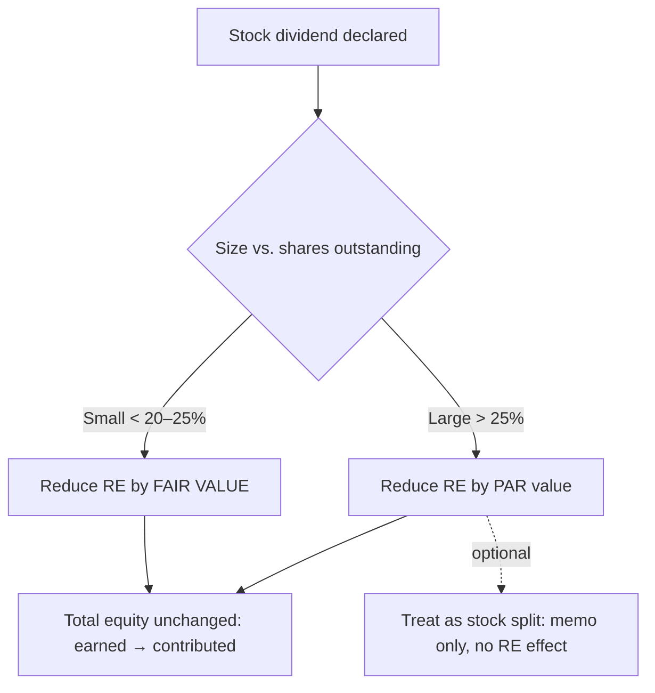

## 1. Stock Issuances — Par Variations and Subscriptions

Issuing stock is a **financing inflow**. Always credit the stock account at **par (legal capital)**; the difference plugs to **APIC**.

```journal
{"desc": "Issue below par — $7 sold, $10 par (discount debited to APIC)",
 "dr": [["Cash", 7], ["APIC in excess of par", 3]],
 "cr": [["Common stock (par)", 10]]}
```

At par: DR Cash / CR Common stock (no APIC). Above par: the excess credits APIC. Below par, the **discount** is technically a liability of that **shareholder** to the corporation; if the extra is later paid, credit APIC (never re-credit common stock).

**Stock subscriptions** — a contract to buy shares later; certificates aren't issued until **paid in full**. Debit **subscriptions receivable** (not A/R or N/R) and credit **common stock subscribed** at par.

**Q — A subscriber contracts for 1,000 shares at $100 each ($10 par); $85,000 of the subscription price is later collected; certificates are then issued for the 800 fully paid shares. Record the subscription, the collection, and the certificate issuance.**

```journal
{"desc": "Subscribe 1,000 shares at $100 ($10 par)",
 "dr": [["Subscriptions receivable", 100000]],
 "cr": [["Common stock subscribed (par)", 10000], ["APIC in excess of par", 90000]]}
```

```journal
{"desc": "Collect $85,000 of subscriptions",
 "dr": [["Cash", 85000]],
 "cr": [["Subscriptions receivable", 85000]]}
```

```journal
{"desc": "Issue certificates for 800 fully paid shares ($10 par)",
 "dr": [["Common stock subscribed (par)", 8000]],
 "cr": [["Common stock (par)", 8000]]}
```

> [!TRAP]
> **Subscriptions receivable is contra-equity, not an asset** — *except* when collected **after year-end but before the statements are issued**, when it may be reported as an asset. Don't credit ordinary common stock at subscription; use **common stock subscribed**.

**Default/forfeiture** (subscriber never pays in full) gives the corporation **three** options — issue shares **pro rata** to cash paid, **refund** the money, or (where allowed) **keep it as liquidated damages**:

```journal
{"desc": "Forfeit 200 subscribed shares ($10 par), retain cash as damages",
 "dr": [["Common stock subscribed (par)", 2000]],
 "cr": [["APIC — forfeited subscriptions", 2000]]}
```

## 2. Stock Rights and Stock Issued for Services

**Stock rights** let existing shareholders buy more shares (usually below market) — **no journal entry, only a memo entry, until exercised**. On exercise: DR Cash (shares × **exercise** price) / CR Common stock at par / plug APIC.

**Stock issued for services** is recorded at the **fair value of the stock** (its trading price if public):

```journal
{"desc": "Pay a consultant with stock — FV $9,000 ($10 par × 500 shares = $5,000)",
 "dr": [["Professional services expense", 9000]],
 "cr": [["Common stock (par)", 5000], ["APIC in excess of par", 4000]]}
```

The expense lowers net income → retained earnings, while common stock + APIC rise by the same amount, so **total equity is unchanged**.

## 3. Distributions to Shareholders

Dividends are **not** an expense (never on the income statement), are **pro rata** within a class, and generally come out of **retained earnings** (some states allow APIC when RE is exhausted; **never** stated capital). Dividends require **board declaration** — they are never legally required, even fixed-rate preferred.

**Three dates:** **declaration** (DR Retained earnings / CR Dividends payable — equity down, liability up), **record** (who receives it — no entry), **payment** (DR Dividends payable / CR Cash — a **financing outflow** in the U.S.). Dividends are paid only on shares **outstanding** (not treasury).

| Dividend | Mechanics |
|---|---|
| **Cash** | Standard; financing outflow |
| **Property (in-kind)** | Restate asset to **fair value** (recognize gain/loss on the income statement), reduce RE by **FV**; no cash flow |
| **Scrip** | A special **note payable** substituting for cash (cash shortage); may bear interest |
| **Liquidating** | Portion **exceeding RE** is a return of capital: reduce RE, then **APIC**, then **capital stock** |

```journal
{"desc": "Property dividend — asset cost 70, A/D 40 (NBV 30), fair value 50",
 "dr": [["Retained earnings", 50], ["Accumulated depreciation", 40]],
 "cr": [["PP&E", 70], ["Gain on property distributed", 20]]}
```

```journal
{"desc": "Liquidating dividend — $20 cash, only $15 in RE",
 "dr": [["Retained earnings", 15], ["APIC in excess of par", 3], ["Common stock", 2]],
 "cr": [["Cash", 20]]}
```

## 4. Stock Dividends, Splits, and the Statement of Changes in Equity

A **stock dividend** is **no cash outflow** and **no dividend income** to the holder (their per-share basis drops, share count rises). The size sets how much RE is reduced:

| Size | Threshold | Reduce RE by |
|---|---|---|
| **Small** | < 20–25% of shares outstanding | **Fair value** (small dividends don't move market price) |
| **Large** | > 20–25% | **Par value** (or, optionally, treat as a **stock split**) |

```journal
{"desc": "Small (5%) stock dividend — 5,000 shares, $10 par, FV $15",
 "dr": [["Retained earnings", 75000]],
 "cr": [["Common stock (par)", 50000], ["APIC in excess of par", 25000]]}
```

```journal
{"desc": "Large (40%) stock dividend — 400,000 shares, $10 par (at par)",
 "dr": [["Retained earnings", 4000000]],
 "cr": [["Common stock (par)", 4000000]]}
```

Either way **total equity is unchanged** — earned capital falls, contributed capital rises. **Stock splits** are a **memo entry only**: shares outstanding rise and par per share falls proportionately so **stated capital is unchanged** (a 2-for-1 turns 10,000 shares @ $10 into 20,000 @ $5). A **reverse split** does the opposite (fewer shares, higher par/price). Neither dividends nor splits apply to **treasury stock**.



The **statement of changes in stockholders' equity** explains, for the **period**, why each equity component moved — a rise from **earned** capital (profit/OCI) is stronger than one from merely **contributed** capital (new shares dilute EPS).

**Q — Beginning total equity $30,000,000; net income $1,200,000; dividends declared $700,000; other comprehensive income (gains) $200,000; common stock issued $1,000,000. Build the statement of changes in equity to find ending total equity, and compute comprehensive income for the year.**

```schedule
{"caption": "Statement of changes in equity — why equity rose $1,700,000",
 "columns": ["Component", "Change"],
 "rows": [
   ["Beginning total equity", "30,000,000"],
   ["Net income", "+1,200,000"],
   ["Dividends declared", "(700,000)"],
   ["Other comprehensive income (gains)", "+200,000"],
   ["Common stock issued", "+1,000,000"],
   ["Ending total equity", "31,700,000"]
 ]}
```

Comprehensive income here = net income $1,200,000 + OCI $200,000 = **$1,400,000**.

```recap
1. Issue stock at par (credit stated capital), excess to APIC; below par debits APIC (discount is the shareholder's liability); stock-for-services is recorded at the stock's fair value as an expense.
2. Subscriptions: debit subscriptions receivable (contra-equity, except collected after year-end before issuance) and common stock subscribed at par; certificates issue only when paid in full; forfeiture gives three options.
3. Stock rights are memo-only until exercised (then priced at the exercise price).
4. Dividends aren't expenses, come from RE, need board declaration; declaration/record/payment dates; cash is a financing outflow; property at fair value (with gain/loss); scrip is a note payable; liquidating dividends reduce RE then APIC then capital.
5. Stock dividends: small (<20–25%) reduce RE by fair value, large (>25%) by par (or treat as a split); total equity unchanged; splits are memo-only (shares up, par down, stated capital flat); treasury shares get neither.
6. The statement of changes in equity shows, for the period, whether equity grew from earned capital (profit/OCI) or merely contributed capital.
```
