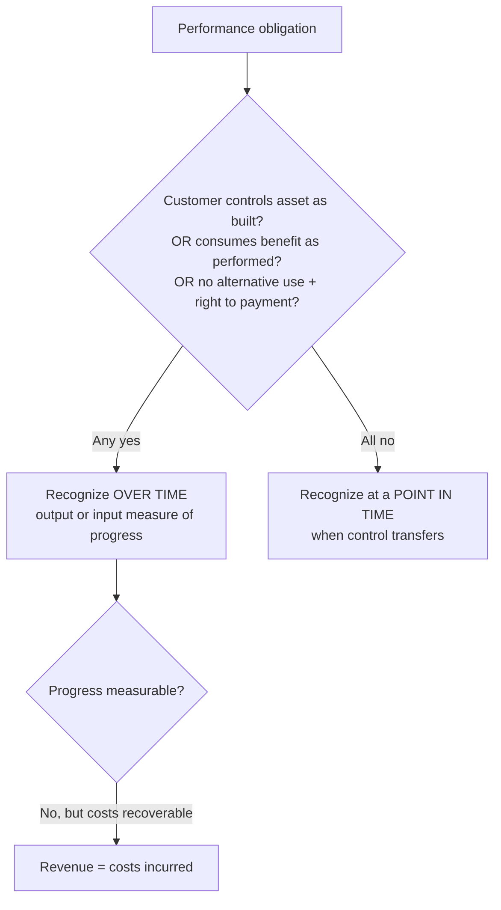

## 1. The Five-Step Approach — Part 1 (Contract and Performance Obligations)

Revenue is recognized when a **performance obligation is satisfied**, measured at the consideration the entity **expects to be entitled to**. Scoped out (own standards): leases, insurance, non-warranty guarantees, financial instruments.

> [!MNEMONIC]
> **ISTAR — "I am a STAR":** **I**dentify the contract → **S**eparate performance obligations → **T**ransaction price → **A**llocate the price → **R**ecognize revenue.

### Step 1 — Identify the contract

Written, **verbal, or implied** by customary business practice. All five criteria required:

1. All parties **approved and committed**;
2. Each party's **rights identified**;
3. **Payment terms identified**;
4. **Commercial substance** (future cash flows change);
5. Collection is **probable**.

Assessed at inception; reassess only on **significant changes** (and a failed contract is re-tested — criteria can be met later). If criteria are never met, consideration received is a **liability** — recognized as revenue only when the consideration is nonrefundable **and** either the entity has fully performed or the contract is terminated.

**Combine contracts** entered at/near the same time with the same (or related) customer when negotiated as a package, consideration is interlinked, or the promises form a single performance obligation. **Modifications** = a **new contract** if scope adds **distinct** goods/services at their standalone price; otherwise account as an adjustment of the existing contract.

### Step 2 — Separate performance obligations

A promise to transfer a **distinct** good or service (or a bundle, or a series of substantially similar items transferred alike). Distinct = both:

- **Capable of being distinct:** the customer can benefit from it alone or with readily available resources;
- **Separately identifiable within the contract:** not integrated with, not customizing/modifying, and not highly dependent on/interrelated with other promises.

Contrasts: a construction contract to build a unit (procurement, piping, wiring, finishing) = **one** combined obligation — everything is integrated into the unit. A software deal (license, installation, updates, tech support, each sold separately, each independently useful) = **four** obligations.

## 2. The Five-Step Approach — Part 2 (Price and Allocation)

### Step 3 — Transaction price

Expected consideration, incorporating:

| Element | Treatment |
|---|---|
| **Variable consideration** | Estimate by **expected value** (probability-weighted) or **most likely amount** — whichever predicts better; include only to the extent a **significant revenue reversal is not probable** |
| **Significant financing** | Discount when payment timing spans **> 1 year**; ≤ 1 year — ignore |
| **Noncash consideration** | Fair value at inception |
| **Consideration payable to the customer** (rebates, incentives) | Reduces revenue |

Financing example: furniture sold 1/1/Yr 5 for $4,000, payable in 3 years "interest-free," 8% rate → recognize revenue at PV **3,175**; the 825 difference is **interest income** over Years 5–7.

### Step 4 — Allocate

Allocate the transaction price to obligations by **relative standalone selling prices** (observable, else estimated). Bundle discounts spread proportionately. Variable consideration may be allocated entirely to one obligation if it relates only to that one. Later price changes are allocated on the **original** basis; standalone-price changes after inception are ignored.

```schedule
{"caption": "Software bundle — allocate 250,000 by standalone prices",
 "columns": ["Obligation", "Standalone price", "Ratio", "Allocated"],
 "rows": [
   ["License", "160,000", "160/270", "148,148"],
   ["Installation", "20,000", "20/270", "18,519"],
   ["Tech support (3 yrs @ 30,000)", "90,000", "90/270", "83,333"]
 ],
 "totals": ["", "270,000", "", "250,000"]}
```

```journal
{"desc": "Cash received; license and installation complete; support deferred",
 "dr": [["Cash", 250000]],
 "cr": [["Revenue — license", 148148], ["Revenue — installation", 18519], ["Contract liability — support", 83333]]}
```

Then monthly: DR Contract liability / CR Service revenue 83,333 ÷ 36 = 2,315.

## 3. The Five-Step Approach — Part 3 (Recognition and Presentation)

### Step 5 — Over time vs. point in time

**Over time** if any one:

1. Performance **creates or enhances an asset the customer controls** as work occurs;
2. Customer **simultaneously receives and consumes** the benefit (subscriptions, services);
3. Asset has **no alternative use** to the entity **and** the entity has an **enforceable right to payment** for performance to date.

Measure progress by **output** methods (units delivered, milestones, time elapsed, surveys/appraisals) or **input** methods (cost-to-cost, labor hours, resources consumed) — use whichever faithfully depicts completion; straight-line is fine when inputs are even. If progress can't be reliably measured but costs are recoverable → recognize revenue **equal to cost** until estimates improve.

**Point in time** — when **control** transfers: acceptance, present right to payment, physical possession, legal title, risks and rewards.



### Contract assets vs. receivables vs. liabilities

- **Receivable** — an **unconditional** right to payment (only time need pass).
- **Contract asset** — work performed but the right is **conditional** on something else (e.g., delivering item 2).
- **Contract liability** — consideration received (or unconditionally due) before performing.

**Excavator timing drill** (noncancelable contract 1/1; payment due 2/1; paid 3/1; delivery 4/1): 1/1 — **no entry**; 2/1 — DR Receivable / CR Contract liability 350,000 (unconditional right, nothing earned); 3/1 — DR Cash / CR Receivable; 4/1 — DR Contract liability / CR Revenue. Two-excavator variant (payment conditional on both deliveries): first delivery → **contract asset** + revenue; second delivery → swap to a 700,000 receivable, recognize the second revenue.

## 4. Long-Term Construction Contracts — Part 1

Construction usually qualifies **over time** (customer controls the WIP, or no alternative use + right to payment). Progress: **input, cost-to-cost** = cost incurred to date ÷ total estimated cost — requires estimable profitability and reliable measurement.

Balance sheet: **construction in progress (CIP)** accumulates cost **plus recognized gross profit** (think inventory); **progress billings** is its contra. Net position per contract: CIP > billings → **current asset**; billings > CIP → **current liability**. Receivables from billings are always a separate asset.

> [!TRAP]
> "Estimated **total** cost" = all years combined; "estimated **cost to complete**" = remaining years only. Total = incurred to date + cost to complete. Read which one the fact pattern gives.

## 5. Long-Term Construction Contracts — Part 2 (four-step computation and losses)

Four steps each period: ① total expected GP = contract price − estimated total cost; ② % complete = cost to date ÷ total cost; ③ GP earned to date = ① × ②; ④ **current-period GP = ③ − GP recognized in prior years**.

**Loss contracts: recognize the entire loss immediately** (jump to 100%) — under **both** over-time and point-in-time methods; over-time must also reverse previously recognized profit.

```schedule
{"caption": "$4,000,000 contract — over time vs. point in time",
 "columns": ["Year", "Est. total cost", "Total GP/(loss)", "% complete", "GP to date", "Over-time P&L", "Point-in-time P&L"],
 "rows": [
   ["1", "3,000,000", "1,000,000", "50%", "500,000", "500,000", "0"],
   ["2", "3,200,000", "800,000", "75%", "600,000", "100,000", "0"],
   ["3", "4,200,000", "(200,000)", "loss → 100%", "(200,000)", "(800,000)", "(200,000)"],
   ["4", "4,300,000", "(300,000)", "100%", "(300,000)", "(100,000)", "(100,000)"]
 ]}
```

Point-in-time (completed-contract style): CIP holds **costs only**; profit deferred to completion; on completion, billings → revenue, CIP → cost. Journal entries for costs, billings (DR AR / CR Progress billings), and collections are identical under both approaches — only the profit entry differs.

## 6. Other Applications — Part 1 (contract costs; principal vs. agent)

**Costs to obtain a contract:** capitalize **incremental** costs that would not exist without the contract (sales **commissions**, legal fees to draft the winning contract) and amortize; expense costs incurred win-or-lose (proposal **travel**, salaries).

**Costs to fulfill:** capitalize when they relate directly to the contract, enhance resources used to perform, and are recoverable (e.g., a workstation bought for the engagement). Expense G&A, abnormal spoilage/waste, costs of already-satisfied obligations, and allocated wages of **existing** employees (assigned, not hired → no incremental cost).

**Principal vs. agent:**

| Indicator | Principal (gross revenue) | Agent (fee/commission only) |
|---|---|---|
| Responsible for fulfilling | Yes | No — a third party is |
| Inventory risk | Bears it | None |
| Price discretion | Sets the price | No control over it |

Travel-agent pattern: collect 20,000, remit 18,000 to the airline → **revenue 2,000**. Anderson excavator pattern (sets specs, bears re-work risk, sets 385,000 price over the manufacturer's 350,000) → **principal**, gross revenue despite the fee-like margin.

## 7. Other Applications — Part 2 (repurchase agreements)

| Agreement | Repurchase price vs. original | Accounting |
|---|---|---|
| **Forward** (must buy back) or **call** (right to buy back) | Less than original price | **Lease** |
| Forward or call | Equal or more | **Financing arrangement** |
| **Put** (customer can force buyback) at less than original | Customer has **significant economic incentive** | **Lease** |
| Put at less than original | No significant incentive | **Sale with right of return** |
| Put at ≥ original price | Depends on incentives | Financing, or sale with right of return |

**Financing mechanics** (call at 385,000 on a 350,000 sale): DR Cash / CR **Financial liability** 350,000; accrue **interest expense 35,000** up to the liability of 385,000; if the option lapses, derecognize the liability and **recognize revenue** at that date. Put example: buyback 315,000 vs. expected market value 275,000 → strong incentive to exercise → **lease**.

## 8. Other Applications — Part 3 (bill-and-hold, consignment, warranties, refunds)

**Bill-and-hold** — billing without delivery is **not** revenue unless **all four**: substantive reason (customer requested); product **separately identified** as the customer's; **ready for immediate transfer**; entity **cannot use or redirect** it. Custodial (storage) services are a separate obligation earned over time.

**Consignment** — consignor keeps the inventory and recognizes **no revenue until the dealer sells to an end customer** (or the dealer's obligation becomes unconditional). Indicators: entity controls goods until a specified event, dealer has no unconditional payment obligation, entity can recall or redirect the goods.

**Warranties** — separately **purchasable** warranty = a distinct **service obligation** (allocate price to it; recognize over the coverage period). Assurance-type warranty (legally required, short, only guarantees agreed specs) = not a separate obligation → warranty cost accrual.

**Refund liabilities / right of return** — recognize revenue only for the amount expected to be kept:

```journal
{"desc": "Cash sale 50,000 with 10% expected returns",
 "dr": [["Cash", 50000]],
 "cr": [["Sales revenue", 45000], ["Refund liability", 5000]]}
```

Actual returns debit the refund liability; unused liability is released to revenue (a return **asset** is set up for expected recovered goods).

```recap
1. ISTAR: contract (5 criteria, else consideration is a liability) → distinct obligations (capable + separately identifiable) → transaction price (variable, financing > 1 yr, noncash at FV, customer payments reduce) → allocate by relative standalone prices → recognize over time or at a point.
2. Over time needs one of: customer-controlled asset, simultaneous consumption, or no-alternative-use + right to payment; measure with output or input (cost-to-cost) methods; unmeasurable-but-recoverable → revenue = cost.
3. Contract asset = conditional right; receivable = unconditional; contract liability = paid/payable before performance.
4. Construction: 4-step GP computation; CIP (with profit if over time) vs. progress billings nets to a current asset or liability per contract; **losses in full immediately, either method**.
5. Capitalize only incremental win-dependent contract costs (commissions) and direct fulfillment costs; expense proposal travel and existing salaries.
6. Principal = fulfillment responsibility + inventory risk + price discretion → gross; agent → net fee.
7. Repurchase: forward/call below original = lease, at/above = financing; puts hinge on the customer's economic incentive.
8. Bill-and-hold needs 4 conditions; consignment defers revenue until end-customer sale; purchasable warranties are separate obligations; expected refunds are liabilities, not revenue.
```
