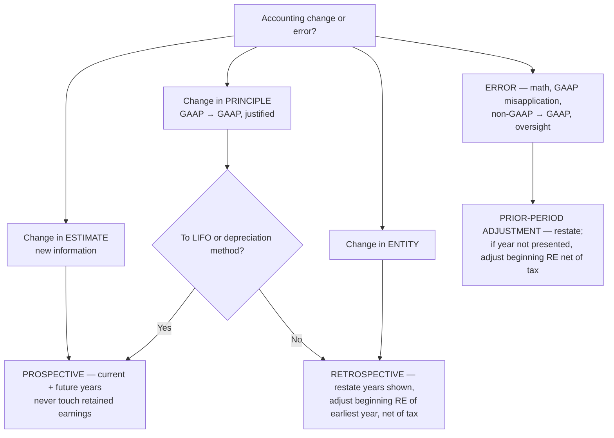

## 1. Changes in Accounting Estimate

New or better information → new estimate. **Not an error**, so never restate prior years or retained earnings — apply **prospectively** in the current year and future years. Affects income from continuing operations (and usually a balance-sheet account too).

Common examples: useful life or salvage of an asset, allowance for credit losses, obsolete-inventory write-downs, litigation and settlement accruals, warranty percentages, revisions of impairment estimates.

**Disclosure:** required when the change affects **future periods** (e.g., a useful-life revision); routine, immaterial estimate updates need no disclosure.

**Worked example — Carlin's truck:** cost 90,000, no salvage, original 10-year life; during Year 3 the total life is revised to 5 years:

```schedule
{"caption": "Prospective depreciation after a life revision",
 "columns": ["Step", "Computation", "Amount"],
 "rows": [
   ["Years 1–2 (unchanged)", "90,000 ÷ 10 per year", "9,000 / yr"],
   ["NBV at start of Year 3", "90,000 − 18,000", "72,000"],
   ["Remaining life", "5 total − 2 elapsed", "3 years"],
   ["Years 3–5 depreciation", "72,000 ÷ 3", "24,000 / yr"]
 ]}
```

A change that raises expense (shorter life) is the **conservative** direction — lower income, retained earnings, equity.

## 2. Changes in Accounting Principle or Entity

**Change in principle** = switching from one **acceptable** GAAP method to another (non-GAAP → GAAP is an **error**, never a principle change). Must be **justified** — required by new GAAP or preferable (more fairly presents results). **Income smoothing is not justification.** General rule: **retrospective** application.

- **Comparative statements presented:** restate **every year shown** under the new method and adjust **beginning retained earnings of the earliest year presented, net of tax**.
- **Noncomparative:** adjust beginning retained earnings of the current year, net of tax, for the cumulative effect.

**Harbor example:** switch FIFO → weighted average 1/1/Yr 5 (noncomparative); pre-tax income before Yr 5: 600,000 old method vs. 800,000 new; tax 30% → adjust beginning retained earnings **up 140,000** (200,000 × 70%) — the gross 200,000 is the classic wrong answer.

> [!RULE]
> Two principle changes are handled **prospectively** (inseparable from a change in estimate / impracticable to restate): **① a change TO LIFO** and **② a change in depreciation method**. "To LIFO" — from LIFO to something else is retrospective.

**Change in accounting entity** — the composition of the consolidated group changes (merger, acquisition, divestiture): **retrospective** — restate all prior periods presented as if the new group had always existed, with full disclosure.



## 3. Error Correction (Prior-Period Adjustment)

Errors: mathematical mistakes, misapplication of GAAP, oversight or misuse of facts, and **changes from non-GAAP to GAAP** (e.g., cash basis → accrual; direct write-off → allowance).

- Error occurred in a **year presented** → correct that year's statements directly.
- Error in a year **not presented** → adjust **beginning retained earnings of the earliest year presented, net of tax**.
- Noncomparative → adjust beginning retained earnings of the only year shown, net of tax.

**Jordan example (Yr 4 only presented, tax 40%):**

1. Depreciation of 4,500,000 never recorded in Yrs 1–2 (error): retained earnings overstated → adjust beginning RE **down 2,700,000** (4.5M × 60%).
2. Same year, change LIFO → FIFO (principle change, retrospective): cumulative pre-tax difference 750,000 + 2,100,000 + 2,150,000 = 5,000,000 → beginning RE **up 3,000,000** (× 60%).
3. Net adjustment: **+300,000** to beginning retained earnings.

> [!TRAP]
> Every retained-earnings adjustment — error or principle change — is **net of tax**. And read the direction of an inventory switch: **to** LIFO is prospective; **from** LIFO (to FIFO) is retrospective with a cumulative-effect computation.

```recap
1. Estimate change → prospective, never restate; disclose if future periods are affected. Recompute: remaining NBV ÷ remaining new life.
2. Principle change (GAAP→GAAP, justified) → retrospective: restate years shown, adjust earliest beginning RE **net of tax** — except **to LIFO** and depreciation-method changes, which are prospective.
3. Entity change (consolidation composition) → retrospective restatement of all periods presented.
4. Errors (including non-GAAP→GAAP) → prior-period adjustment: fix the year if shown; otherwise beginning RE of earliest year presented, net of tax.
```
