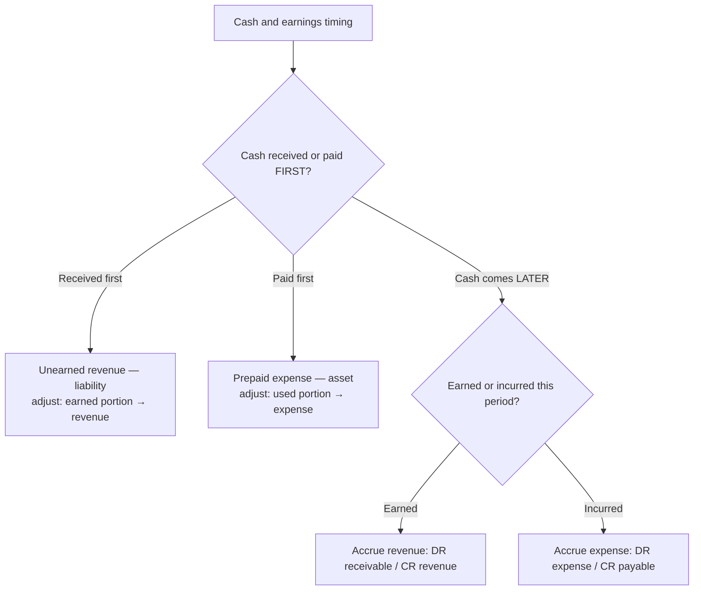

## 1. Adjusting Journal Entries — Part 1 (the four patterns)

Accrual accounting records revenue **when earned** and expenses **in the period incurred** (matching) — never when cash moves. **Accrue** = record without an exchange of cash. Adjusting entries put revenue and expense in the correct period.

> [!RULE]
> A true year-end adjusting entry touches **one income statement account and one balance sheet account — never cash**. (Only error corrections can involve cash.)

| Pattern | Cash timing | Original entry | Year-end adjustment |
|---|---|---|---|
| **Unearned (deferred) revenue** | Cash first | DR Cash / CR Unearned revenue | DR Unearned revenue / CR Revenue (portion earned) |
| **Prepaid expense** | Cash first | DR Prepaid / CR Cash | DR Expense / CR Prepaid (portion used) |
| **Accrued revenue** | Cash later | — | DR Accounts receivable / CR Revenue |
| **Accrued expense** | Cash later | — | DR Expense / CR Accrued liability |

Later cash settlement (collecting the receivable, paying the payable) is **not** an adjusting entry — it just swaps balance-sheet accounts.

**Worked examples:**

Received $250,000 on **December 1** for services performed evenly over December–January:

```journal
{"desc": "December 31 — half the work is now earned (250,000 ÷ 2)",
 "dr": [["Unearned revenue", 125000]],
 "cr": [["Service revenue", 125000]]}
```

Borrowed $2,000,000 on **November 1** at 3%, interest payable annually next November: monthly interest = 2,000,000 × 3% ÷ 12 = $5,000 → two months accrued:

```journal
{"desc": "December 31 — accrue November + December interest",
 "dr": [["Interest expense", 10000]],
 "cr": [["Interest payable", 10000]]}
```

## 2. Adjusting Journal Entries — Part 2 (correcting errors)

Error corrections differ: someone recorded the **wrong** entry (or none), so first reconstruct **what was done**, then **what should exist at year-end**, then bridge the gap. Corrections can hit any account — including two balance-sheet accounts, or cash if cash itself was misrecorded.

**Titan Co. — unadjusted Yr 2 pre-tax income $8,000; eight fixes:**

```schedule
{"caption": "Error-correction workbench (Year 2)",
 "columns": ["#", "Error", "Correcting entry", "Income effect"],
 "rows": [
   ["1", "3-yr $300 insurance policy fully expensed 1/1/Yr 2", "DR Prepaid insurance 200 / CR Insurance expense 200", "+200"],
   ["2", "$2,000 credit sales never recorded", "DR Accounts receivable 2,000 / CR Sales 2,000", "+2,000"],
   ["3", "$3,000 advance booked as revenue; only 30% earned", "DR Sales 2,100 / CR Unearned revenue 2,100", "(2,100)"],
   ["4", "$450 December utility bill unrecorded", "DR Utilities expense 450 / CR Accounts payable 450", "(450)"],
   ["5", "4-yr $4,000 prepaid rent (from Yr 1) — Yr 2 usage unrecorded", "DR Rent expense 1,000 / CR Prepaid rent 1,000", "(1,000)"],
   ["6", "$650 write-off done direct method; allowance method in use", "DR Allowance for credit losses 650 / CR Credit loss expense 650", "+650"],
   ["7", "$1,300 raw materials in transit FOB shipping point excluded", "DR Raw materials 1,300 / CR Accounts payable 1,300", "—"],
   ["8", "AFS/FVOCI debt securities not marked 1,500 → 2,000", "DR Investment 500 / CR OCI — unrealized gain 500", "— (OCI, not income)"]
 ],
 "totals": ["", "Adjusted pre-tax income: 8,000 + 200 + 2,000 − 2,100 − 450 − 1,000 + 650", "", "7,300"]}
```

Key reads:

- **#5:** prior-year portions are assumed already correct — fix only the current year; ending prepaid = 4,000 − 2 years × 1,000 = **2,000**.
- **#6:** under the allowance method, write-offs never touch expense — reverse the wrong debit to credit loss expense and charge the allowance.
- **#7 and #8** affect only balance-sheet/OCI accounts — income unchanged.
- **#8:** fair-value-through-OCI (available-for-sale) unrealized gains bypass the income statement.



```recap
1. Accrue = record revenue/expense with no cash exchange; adjusting entries place amounts in the correct period.
2. Four patterns: unearned revenue and prepaid expense (cash first, then allocate); accrued revenue and accrued expense (record now, cash later).
3. Standard adjusting entries hit one income-statement + one balance-sheet account and never cash; later settlements only swap balance-sheet accounts.
4. Error fixes: reconstruct what was done vs. what should be, then bridge — they can touch any accounts, including two balance-sheet accounts or OCI.
5. Landmines: FOB shipping point inventory in transit belongs to the buyer; allowance-method write-offs bypass expense; FVOCI marks go to equity, not income.
```
