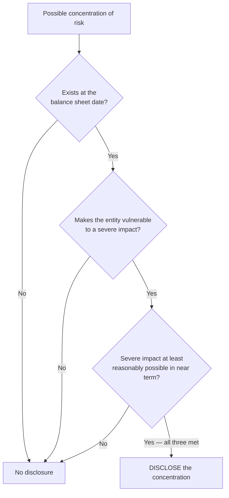

## 1. Summary of Significant Accounting Policies

U.S. GAAP requires a description of **all significant accounting policies** — customarily footnote 1 (or 2), easy for readers to find. It covers the **measurement basis** and the principles and methods chosen: depreciation and amortization methods, inventory pricing, use of estimates, revenue recognition policies, and similar.

**Not in the policies note (but elsewhere in the footnotes):** composition and amounts of balance-sheet line items, details of a change in accounting principle, debt maturity dates and payoff amounts, computed depreciation amounts. The policies note says **how**; other notes give the **details and numbers**.

## 2. The Rest of the Footnotes

Anything **relevant to decision makers**: details of specific assets/liabilities, changes in stockholders' equity, marketable-securities disclosures, significant fair-value estimates, contingencies (losses and highly probable gains), commitments and contractual obligations, pension plans, segment disclosures (public companies), subsequent events, and new accounting standards adopted.

### Risks and uncertainties

Required disclosures about the nature of operations (major products, markets, geographies, relative importance of businesses) and the use of estimates.

**Significant estimates** — disclose the estimate and the effect when it is **reasonably possible the estimate will change materially in the near term** (deferred-tax valuation allowances, litigation obligations, environmental remediation, obsolescence reserves, and similar).

### Concentrations of risk ("eggs in one basket")

Disclose a concentration when **all three**:

1. It **exists at the balance sheet date**;
2. It makes the entity **vulnerable to a severe impact**; and
3. It is **at least reasonably possible** the severe impact will occur in the near term.

Examples: dependence on one customer, supplier, lender, or contributor; revenue concentrated in one product/service/event; concentrated material supplies; market or geographic concentration.



```recap
1. Policies note (footnote 1): measurement basis + methods (depreciation method, inventory costing, estimates policy) — how, not amounts.
2. Detail notes carry the numbers: line-item composition, debt terms, pensions, contingencies, segments, subsequent events.
3. Disclose significant estimates when a material near-term change is reasonably possible.
4. Concentration disclosures need existence at the balance sheet date + severe-impact vulnerability + reasonably possible occurrence.
```
