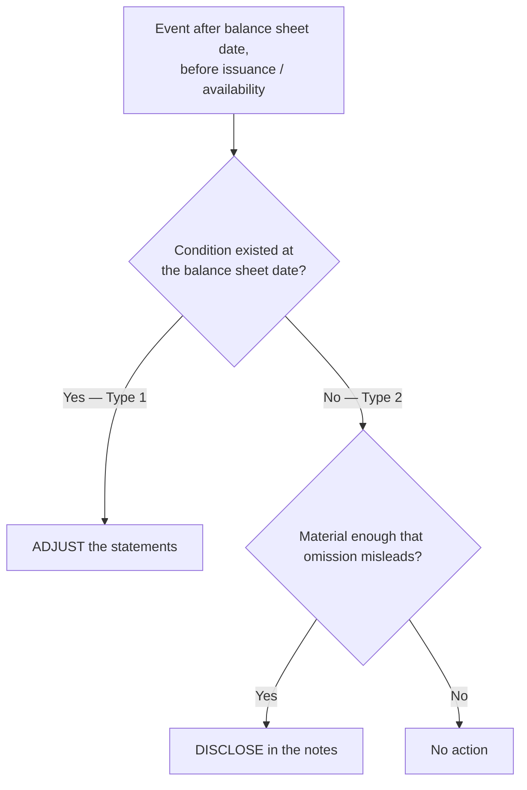

## 1. Subsequent Events

Events occurring **after the balance sheet date but before the financial statements are issued (public) or available to be issued (private)**.

| Type | Information relates to… | Treatment | Examples |
|---|---|---|---|
| **Recognized (Type 1)** | A condition that **existed at the balance sheet date** | **Adjust** the financial statements | Litigation settled that fixes a year-end contingency; customer bankruptcy proving a year-end receivable uncollectible |
| **Nonrecognized (Type 2)** | Conditions arising **after** the balance sheet date | **No adjustment**; **disclose** if omission would mislead | Merger/acquisition, natural-disaster loss, debt or equity issuance, casualty after year-end |

### Evaluation window

- **SEC filers (public):** evaluate through the date the statements are **issued** (widely distributed).
- **Private companies:** through the date they are **available to be issued** (finalized and authorized for release) — an earlier cutoff. Private companies also **disclose the evaluation date**; SEC filers don't.



### Reissued and revised statements

- **Reissued statements** (e.g., in a later filing): do **not** recognize new subsequent events between original issuance and reissuance — unless GAAP or a regulator requires it.
- **Revised statements** (error correction or retrospective application of new GAAP) are treated as reissued; **non-SEC filers** must disclose the dates through which subsequent events were evaluated in **both** the original and revised statements.

```recap
1. Window: balance sheet date → issued (public) / available to be issued (private).
2. Type 1 (condition existed at year-end) → adjust; Type 2 (arose after) → disclose if needed, never adjust.
3. Settled lawsuits and bankrupt customers evidence year-end conditions; disasters and business combinations after year-end do not.
4. Reissuance doesn't reopen recognition; private companies disclose evaluation dates for original and revised statements.
```
