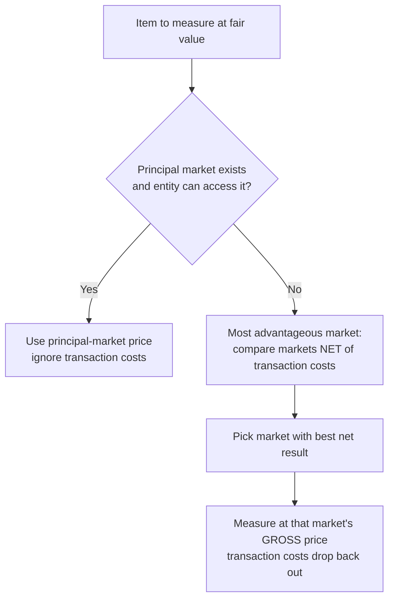

## 1. Fair Value — Definition and Markets

**Fair value** = the **exit price**: the amount received to **sell an asset** or paid to **transfer a liability** in an **orderly transaction between market participants** at the measurement date. GAAP's framework applies wherever fair value is required or permitted — **except** share-based compensation (option-pricing models) and leases, which have their own rules.

Key attributes:

- **Exit** price, never an entrance price.
- **Excludes transaction costs** — but **includes transportation costs** when location is an attribute of the asset.
- **Orderly** — adequate market exposure, no forced/fire sale (bankruptcy liquidations, foreclosures, seizures don't set fair value).
- **Market participants:** independent (unrelated — no parent/subsidiary or sister-company pricing), knowledgeable, **willing and able** to transact, acting in their own economic interest.
- **Liabilities:** include **nonperformance (default) risk** — higher risk → higher discount rate → lower fair value.
- **Own equity:** use the traded price, not book value.

### Principal vs. most advantageous market

- **Principal market** = greatest **volume/activity** for the item (that the entity **can access**). If one exists, use its price — period.
- No principal market → **most advantageous market**: best **net** result **after transaction costs** (maximize net proceeds for assets; minimize net payment for liabilities). But once chosen, fair value = the **gross price** in that market — transaction costs drop back out.

**Q — Foxy Co. stock trades in two markets and has no principal market: New York quotes 52 (transaction cost 6), London quotes 50 (transaction cost 2). Determine which market sets fair value and the amount to report — remembering you pick the market on a net basis but measure at the gross price.**

```schedule
{"caption": "Foxy Co. stock — most advantageous market (no principal market)",
 "columns": ["Market", "Quoted price", "Transaction cost", "Net proceeds", "Fair value used"],
 "rows": [
   ["New York", "52", "(6)", "46", "—"],
   ["London", "50", "(2)", "48 ← most advantageous", "50 (gross price, NOT 48)"]
 ]}
```

> [!TRAP]
> Transaction costs pick the market, then are **ignored** in the measurement. Choosing 48 instead of 50 is the built-in wrong answer.



### Nonfinancial assets — highest and best use

Fair value of a nonfinancial asset (land) reflects its **highest and best use** — in-use by the owner or in-exchange to a buyer, **whichever is higher**; the current owner is presumed at highest and best use unless facts say otherwise. Consider associated assets/liabilities (buildings, debt), demolition costs for redevelopment, and development uncertainties. **Highest and best use never applies to financial assets** — instant wrong answer.

## 2. Measurement Framework, Disclosures, and Exceptions

### Valuation techniques — MIC

| Technique | Basis | When |
|---|---|---|
| **M**arket approach | Prices from actual transactions for identical/comparable items | Whenever a market exists |
| **I**ncome approach | Discounted future cash flows (PV) | Asset produces income |
| **C**ost approach | Current **replacement cost** | Typically nonfinancial assets |

Pick what's appropriate; **maximize observable inputs, minimize unobservable ones**. A change in technique = **change in estimate → prospective**.

### Input hierarchy

| Level | Nature | Examples |
|---|---|---|
| **1** (most reliable) | Quoted prices, **active market, identical** asset | Exchange-traded stock price |
| **2** | Other **observable** inputs: similar assets in active markets, or identical assets in inactive markets; observable rates/quotes | Comparable bond of same size/rating/industry |
| **3** (last resort) | **Unobservable** — the entity's own assumptions | Management's cash-flow forecasts and discount rate for a private startup |

### Disclosures

Valuation technique used (M/I/C), input level, and for **Level 3**: quantitative detail on the significant unobservable inputs (forecasts, discount rates) and **sensitivity** of the measurement to changes in them.

**Marker example:** 3,000 shares bought at 24 (72,000), quoted 21.50 at year-end (64,500). Market approach, Level 1. Common stock with no significant influence = fair value **through net income**: unrealized loss 7,500 hits the income statement.

### Exceptions

U.S. GAAP does **not** remeasure to fair value: **PP&E and intangibles held for use** (cost less depreciation/amortization — IFRS optionally allows revaluation; GAAP never). Fair value is also excused when it is **not practicable** or cannot be measured with sufficient reliability — cost is more reliable even if less relevant.

```recap
1. Fair value = orderly exit price between independent, knowledgeable, willing-and-able participants; excludes transaction costs, includes transportation when relevant; liabilities include default risk.
2. Principal market (highest volume, accessible) governs; otherwise most advantageous market — chosen net of transaction costs, measured gross.
3. Nonfinancial assets: highest and best use (higher of in-use vs. in-exchange); never for financial assets.
4. Techniques: Market, Income (DCF), Cost (replacement); inputs Level 1 (active + identical) → 2 (observable) → 3 (entity assumptions, disclose sensitivity).
5. Level-1 equity marks flow through net income (no significant influence); GAAP never revalues in-use PP&E or intangibles upward.
```
