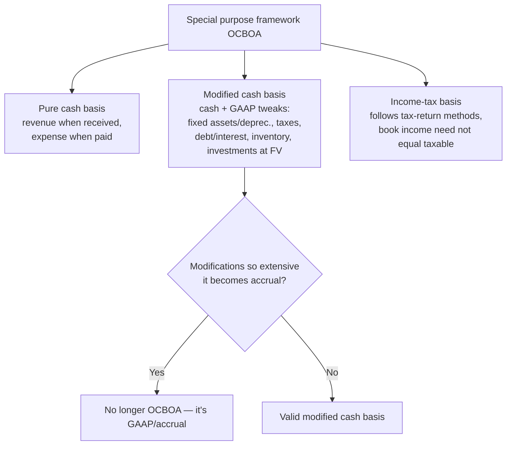

## 1. Overview of Special Purpose Frameworks (OCBOA)

**Special purpose frameworks / OCBOA** (Other Comprehensive Basis of Accounting) = non-GAAP bases with **widespread understanding and support**: cash basis, modified cash basis, income-tax basis, **price-level-adjusted (constant-dollar/inflation) basis**, and regulatory and contractual bases.

**Presentation rules common to all:**

- Statement titles must **differ from GAAP titles** and flag the basis (e.g., "statement of assets and liabilities arising from cash transactions," "statement of revenues and expenses — income tax basis").
- Present the equivalents of a balance sheet and income statement and explain changes in equity; **no statement of cash flows required**.
- **Disclosures parallel GAAP**: summary of significant accounting policies, GAAP-like informative disclosures, plus related-party transactions, subsequent events, and significant uncertainties.



### Cash basis (pure)

Revenue = cash **received**; expense = cash **paid**. Simple, easy to understand; unsuitable for complex operations. Users: estates and trusts, civic ventures, political campaigns/committees. Statements: **statement of cash and equity** (one asset — cash; equity = cash; no liabilities) and **statement of cash receipts and disbursements** (also carries debt proceeds/repayments, asset purchases/sales, dividends — because there are no accrual accounts to hold them).

### Modified cash basis

Hybrid used by most "cash basis" for-profits and nonprofits — cash basis with GAAP modifications that must **not be so extensive** as to become accrual. Typical modifications: capitalize and depreciate **fixed assets**, accrue **income taxes**, record **debt and interest expense**, capitalize **inventory**, carry **investments at fair value** with unrealized gains/losses.

### Income tax basis

Financial statements follow the entity's **tax-return methods**. Taxable income per the return need **not equal** book net income (nontaxable revenues and nondeductible expenses may differ). Show nontaxable items as **separate lines or additions/deductions** to existing captions; disclosing exact amounts is optional, but the **treatment policy must be disclosed**. Cash-flow and equity statements are **optional**.

## 2. Converting Cash Basis to Accrual Basis

Needed when a lender or public offering demands accrual statements. **Direction warning:** this is the *reverse* of the statement-of-cash-flows logic you're used to — you're going **cash → accrual**.

Core conversions (beginning and ending balance-sheet data must be given):

| Target | Start with | Adjustments |
|---|---|---|
| **Accrual revenue** | Cash collected | + ending AR − beginning AR − ending unearned revenue + beginning unearned revenue |
| **Accrual COGS** | Cash paid for purchases | + ending AP − beginning AP − ending inventory + beginning inventory |
| **Accrual operating expense** | Cash paid | + ending accrued liability − beginning accrued liability − ending prepaid + beginning prepaid |

Other adjustments: record depreciation/amortization; capitalize fixed-asset purchases (remove from expenses) and record disposals with gains/losses; classify debt proceeds/repayments as liabilities, not income/expense.

**Q — Under the cash basis, ABC collected 50,000 and paid 20,000 (cash net income 30,000). During the year AR increased 5,000, prepaid insurance increased 2,000, unearned revenue decreased 15,000, and salaries payable increased 4,000; also, 5,000 of equipment was bought (5-year straight-line, no salvage). Convert to accrual net income.**

```schedule
{"caption": "Cash → accrual net income",
 "columns": ["Component", "Computation", "Amount"],
 "rows": [
   ["Accrual revenue", "50,000 + 5,000 (AR up) + 15,000 (unearned down)", "70,000"],
   ["Accrual expenses", "20,000 − 2,000 (prepaid up) + 4,000 (salaries payable up) − 5,000 (equipment capitalized) + 1,000 (depreciation)", "(18,000)"]
 ],
 "totals": ["Accrual net income", "", "52,000"]}
```

> [!MNEMONIC]
> Going cash → accrual: **asset increases ADD to revenue / SUBTRACT from expense; liability increases do the opposite** (ending AR up = more revenue earned; ending payable up = more expense incurred). Mirror-image of the indirect cash-flow method.

```recap
1. OCBOA = cash, modified cash, income-tax (plus regulatory/contractual) bases; non-GAAP titles, GAAP-like disclosures, no cash-flow statement required.
2. Pure cash: one asset (cash); receipts/disbursements absorb debt, capex, and dividends. Modified cash sprinkles in fixed assets/depreciation, taxes, debt, inventory, investments at FV — without becoming full accrual.
3. Tax basis follows the return's methods; book income need not equal taxable income; disclose the treatment of nontaxable items.
4. Cash→accrual: adjust each stream by the change in its related receivable/payable/prepaid/unearned account; capitalize fixed assets and add depreciation. It's the cash-flow statement in reverse.
```
