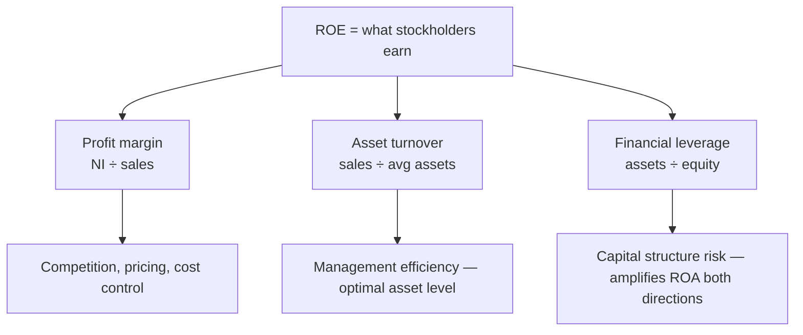

## 1. Ratio Analysis Overview and Profitability Ratios

Ratios distill the financials for assessing **risk** (operating, financial), **performance**, **growth potential**, and **value** — always judged against a **benchmark**: prior periods (**trend/horizontal analysis**), competitors/industry (**cross-sectional**). **Vertical (common-size) analysis** divides income-statement items by sales and balance-sheet items by total assets — the great equalizer for comparing companies of different sizes.

Mechanics: a ratio moves **with** its numerator and **against** its denominator. When a ratio mixes income-statement (period) and balance-sheet (point-in-time) figures, use the **average** balance-sheet amount. Limitations: reliability of the underlying data (opinion type), and comparability of accounting methods/estimates (LIFO vs. FIFO, straight-line vs. accelerated).

| Ratio | Formula | Target |
|---|---|---|
| Gross (profit) margin | (Sales − COGS) ÷ net sales | ≥ standard; driven by supplier bargaining power |
| Return on sales (operating margin) | **EBIT** ÷ net sales, EBIT = NI + taxes + net interest expense | ≥ standard; driven by competition |
| Return on assets (ROA) | Net income ÷ **average** total assets | ≥ standard and sustainable |
| DuPont ROA | **Profit margin (NI ÷ sales) × asset turnover (sales ÷ avg assets)** | Reveals margin vs. turnover business models |
| Return on equity (ROE) | Net income ÷ average total equity — also **ROA × DFL** | ≥ required rate of return |
| Operating cash flow ratio | Operating cash flow ÷ current liabilities | ≥ standard; unaffected by methods/estimates |

> [!EXAM]
> DuPont logic: high-turnover/low-margin (dollar store) vs. low-turnover/high-margin (yachts). Old, nearly-depreciated assets inflate ROA unsustainably. Profitability must be **sustainable** — check whether income came from operations or one-off gains.

## 2. Liquidity and Solvency Ratios

### Liquidity (short-term risk — coverage up, risk down)

| Ratio | Formula | Notes |
|---|---|---|
| Current ratio | Current assets ÷ current liabilities | Includes inventory + prepaids |
| Quick (acid-test) ratio | (Cash + short-term marketable securities + net receivables) ÷ current liabilities | Always ≤ current ratio |
| Cash ratio | (Cash + marketable securities) ÷ current liabilities | Most conservative |
| AR turnover | Net **sales** ÷ average net AR | Watch write-offs shrinking the denominator |
| Days sales in AR | Ending AR ÷ (sales ÷ 365) | ≤ standard |
| Inventory turnover | **COGS** ÷ average inventory | ≥ standard |
| Days in inventory | Ending inventory ÷ (COGS ÷ 365) | Too high: surplus/lost demand; too low: shortage or underpricing |
| AP turnover | COGS ÷ average AP | **Lower** is better (stretch the free credit) |
| Days payables outstanding | Ending AP ÷ (COGS ÷ 365) | Near the credit terms; above them = red flag |
| **Operating cycle** | Days in inventory **+** days in AR | how long to turn inventory into cash from customers |
| **Cash conversion cycle** | Operating cycle **− days payables** (= days inv + days AR − days AP) | ≤ standard; method/estimate-proof |

### Solvency (long-term capital structure)

| Ratio | Formula | Reading |
|---|---|---|
| Debt-to-equity | Total liabilities ÷ total equity | Higher = riskier, but fewer "partners" → higher ROE/EPS potential |
| Total debt ratio | Total liabilities ÷ total assets | |
| Equity multiplier (DFL) | Total assets ÷ total equity = 1 + D/E | **ROE = ROA × DFL** |
| Times interest earned | EBIT ÷ interest expense | Coverage up, risk down |

Leverage amplifies both ways: buy a $50 asset half with debt, sell at $100 → ROA 100%, ROE **200%**; if ROA were −25%, ROE = **−50%**. Pair low operating leverage with higher financial leverage — combining high fixed costs and heavy debt compounds risk.



## 3. Performance Metrics and Variance Analysis

### Metrics

- **EBITDA** — comparability metric neutralizing capital structure and asset age/method: top-down (sales − COGS − opex excluding D&A — also strips unusual gains/losses) or bottom-up (NI + taxes + interest + D&A).
- **EPS** = (net income − preferred dividends) ÷ weighted-average common shares. Higher EPS from more debt/less equity reflects **risk**, not skill.
- **P/E ratio** = price ÷ EPS — relative valuation: below industry → possibly undervalued; above → possibly overvalued (or justified by growth).
- **Dividend payout** = cash dividends ÷ net income (or DPS ÷ EPS); **retention = 1 − payout**. High payout ↔ mature/fewer growth options; retention adds value only while ROE > required return.
- **Asset turnover** = net sales ÷ average total assets — too few assets → lost sales; too many → depressed ROA.

### Variance analysis (actual vs. budget)

Variable costs: constant **per unit**, total varies with volume. Fixed costs: constant **in total**. Contribution margin = sales − variable costs = what's available to cover fixed costs. Higher fixed costs → higher operating leverage → higher break-even and operating risk.

**Break-even and leverage formulas** (common MCQs):

| Metric | Formula |
|---|---|
| CM per unit | Selling price/unit − variable cost/unit |
| CM ratio | CM ÷ sales |
| **Break-even units** | Fixed costs ÷ CM per unit |
| **Break-even sales $** | Fixed costs ÷ CM ratio |
| Target-profit units | (Fixed costs + target pre-tax profit) ÷ CM per unit |
| **Degree of operating leverage (DOL)** | Contribution margin ÷ operating income |

DOL tells you the **% change in operating income for a 1% change in sales** — a firm with high fixed costs has a high DOL (a small sales swing magnifies into a large operating-income swing).

**Q — Neostar budgeted 10,000 units at $15 with a 20% contribution margin and 25,000 fixed costs. Actual results were 8,000 units, revenue 112,000, variable costs 100,800, and fixed costs 24,000. Build a flexible budget at the actual 8,000-unit volume and compute the revenue, variable-cost, and contribution-margin variances — showing why the favorable-looking totals hide unfavorable per-unit results.**

Work: budget per unit — VC = 15 × (1 − 20%) = $12, CM = $3; actual per unit — price = 112,000 ÷ 8,000 = $14, VC = 100,800 ÷ 8,000 = $12.60.

```schedule
{"caption": "Flexible budget (master per-unit × actual 8,000 units) vs. actual",
 "columns": ["Line", "Master budget", "Flexible budget", "Actual", "Variance"],
 "rows": [
   ["Revenue", "150,000", "120,000", "112,000", "(8,000) U — price 14 < 15"],
   ["Variable costs", "(120,000)", "(96,000)", "(100,800)", "(4,800) U — 12.60 > 12.00"],
   ["Contribution margin", "30,000", "24,000", "11,200", "(12,800) U — 1.40 vs 3.00/unit"],
   ["Fixed costs", "(25,000)", "(25,000)", "(24,000)", "1,000 F"],
   ["Operating income", "5,000", "(1,000)", "(12,800)", "U"]
 ]}
```

> [!TRAP]
> Total variable cost "under budget" is a mirage when volume fell short — always compare **per-unit** figures or build a **flexible budget** at actual volume. Here every per-unit variance (price, VC, CM) was unfavorable despite the "favorable"-looking total.

```recap
1. Ratios need benchmarks (trend, industry); average balance-sheet inputs when mixed with income-statement figures; common-size statements equalize scale.
2. Profitability: gross margin, operating margin (EBIT ÷ sales), ROA = margin × turnover (DuPont), ROE = ROA × DFL ≥ required return.
3. Liquidity: current > quick > cash ratio; turnover/day metrics for AR (sell fast, collect fast), inventory (near standard), payables (stretch, don't breach); cash conversion cycle = AR days + inventory days − payable days.
4. Solvency: D/E, debt ratio, equity multiplier, times interest earned; leverage amplifies ROA into ROE both directions.
5. EBITDA neutralizes leverage and D&A for comparisons; payout vs. retention signals growth stage; P/E is relative valuation.
6. Variance analysis: build the flexible budget at actual volume; analyze price, per-unit variable cost, and volume separately; per-unit CM is the tell.
```
