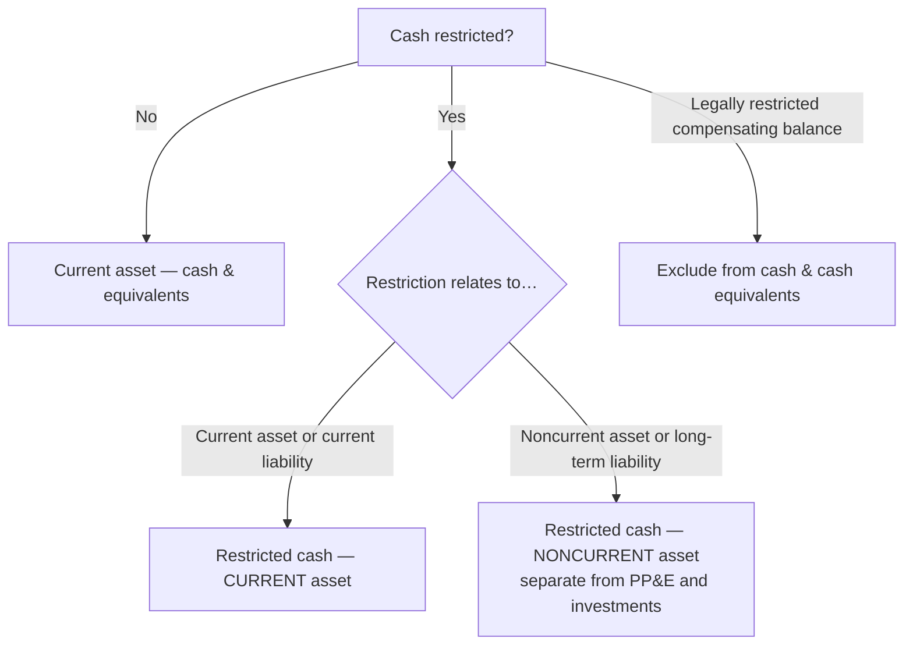

## 1. Overview of Cash and Cash Equivalents

**Cash** = currency **and demand deposits** with banks or other financial institutions.

**Cash equivalent** = short-term, highly liquid **debt** investment that is (a) readily convertible to cash and (b) has an **original maturity of 90 days or less from the date of purchase**. Equity securities never mature, so they can never be cash equivalents.

| Included in cash & cash equivalents | Excluded |
|---|---|
| Coin and currency on hand, **petty cash** | Time CDs with original maturity **over 90 days** |
| Checking and savings accounts, money market funds | **Legally restricted** compensating balances |
| Negotiable paper: bank checks, money orders, traveler's checks, bank drafts, cashier's checks | Restricted cash tied to a noncurrent asset or noncurrent liability (classified noncurrent) |
| Commercial paper, T-bills, CDs — original maturity ≤ 90 days | Postdated checks received (not yet cash) |
| Compensating balances that are **not** legally restricted | |

> [!RULE]
> The 90-day test runs from the **purchase date**, not from the balance sheet date. A 1-year T-bill bought 60 days before it matures **is** a cash equivalent; a 120-day CD held to its last week never is.

**Company checks written but not yet mailed** remain the company's cash — a check dated December 31 but mailed January 15 is added back to the cash balance.

### Restricted vs. unrestricted cash

- **Unrestricted** — available for any obligation; normal current-asset presentation.
- **Restricted** — set aside by management for a specific purpose, or contractually restricted under a financing arrangement (compensating balance). Shown as a **separate "restricted cash" line**, with the amount, nature, and timing of the restriction **disclosed in the footnotes**.



**Q — Smith Corp.'s unadjusted 12/31/Yr 7 ledger cash is $160,000. Determine cash reported at year-end after: a postdated check received (dated 1/2/Yr 8); a $3,500 customer NSF check not redeposited until 1/2/Yr 8; and a $25,000 company check dated and recorded 12/31 but not mailed until 1/15.**

```schedule
{"caption": "Adjusted cash balance, December 31, Year 7",
 "columns": ["Item", "Amount"],
 "rows": [
   ["Unadjusted ledger balance", "160,000"],
   ["Postdated check received (dated 1/2/Yr 8) — correctly excluded", "—"],
   ["NSF check returned, redeposited 1/2/Yr 8 — remove", "(3,500)"],
   ["Company check dated & recorded 12/31 but not mailed until 1/15 — add back", "25,000"]
 ],
 "totals": ["Cash reported at 12/31/Yr 7", "181,500"]}
```

## 2. Bank Reconciliations

Purpose: explain the difference between the **bank** balance and the **book** balance and arrive at the **true balance** reported on the balance sheet.

### Simple reconciliation — "DO the bank, put the books in BINS"

| Side | Adjustment | Direction |
|---|---|---|
| **Bank** — **D** | **D**eposits in transit (already in books) | **Add** to bank |
| **Bank** — **O** | **O**utstanding checks (already deducted on books) | **Deduct** from bank |
| **Books** — **B** | **B**ank collections (e.g., notes collected by bank) | **Add** to books |
| **Books** — **I** | **I**nterest income credited by bank | **Add** to books |
| **Books** — **N** | **N**SF (bounced) checks | **Deduct** from books |
| **Books** — **S** | **S**ervice charges | **Deduct** from books |

Errors (bank or book) are corrected on whichever side made them. Only **book** adjustments require journal entries — one per BINS item:

```journal
{"desc": "Bank collected a note (+ interest) on the company's behalf",
 "dr": [["Cash", 5100]],
 "cr": [["Notes receivable", 5000], ["Interest income", 100]]}
```

```journal
{"desc": "Customer's NSF check returned by the bank",
 "dr": [["Accounts receivable", 90]],
 "cr": [["Cash", 90]]}
```

```journal
{"desc": "Bank service charge",
 "dr": [["Bank service charge expense", 10]],
 "cr": [["Cash", 10]]}
```

(Interest income is credited, not debited; a bank collection debits Cash for the full proceeds. Deposits in transit and outstanding checks are **bank-side** — no entry.)

> [!MNEMONIC]
> **DO / BINS** — the bank gets its **D**eposits in transit and **O**utstanding checks; the books get **B**ank collections, **I**nterest income, **N**SF checks, **S**ervice charges. B and I add; N and S subtract.

**Q — Burbank Co. (November Yr 3): balance per books 12,650, with a 10 service charge and a 90 NSF check; balance per bank 10,050, with 3,000 deposits in transit and 500 outstanding checks. Reconcile both sides to the true cash balance.**

```schedule
{"caption": "Simple bank reconciliation to the true balance",
 "columns": ["Books", "Amount", "Bank", "Amount "],
 "rows": [
   ["Balance per books", "12,650", "Balance per bank", "10,050"],
   ["− Service charge (S)", "(10)", "+ Deposits in transit (D)", "3,000"],
   ["− NSF check (N)", "(90)", "− Outstanding checks (O)", "(500)"]
 ],
 "totals": ["True balance", "12,550", "True balance", "12,550"]}
```

### Reconciliation of cash receipts and disbursements ("proof of cash" / four-column)

Four columns: **beginning balance · receipts · disbursements · ending balance** — each reconciled from both the book and bank side, and each pair of adjusted totals must agree.

- Prior-month deposits in transit recorded by the bank this month are **removed from this month's bank receipts** (they belong to last month).
- Prior-month outstanding checks clearing this month are **removed from this month's bank disbursements**.
- The right-hand (ending balance) column is simply the simple bank reconciliation again — book balance in the BINS, bank balance with DO.

> [!EXAM]
> Four-column questions usually blank out one cell. All four adjusted totals must equal across book and bank rows, so the missing figure is always recoverable from its row and column.

**Worked grid (bank side reconciled to true cash).** Prior-month reconciling items *reverse out* of this month's activity; current-month items *add in*. The book side reconciles to the identical true column.

```schedule
{"caption": "Four-column proof of cash — December (bank side)",
 "columns": ["Line", "Nov 30 (beg)", "Dec receipts", "Dec disbursements", "Dec 31 (end)"],
 "rows": [
   ["Balance per bank statement", "10,050", "51,000", "48,500", "12,550"],
   ["+ Deposits in transit, Nov 30", "3,000", "(3,000)", "—", "—"],
   ["+ Deposits in transit, Dec 31", "—", "4,000", "—", "4,000"],
   ["− Outstanding checks, Nov 30", "(500)", "—", "(500)", "—"],
   ["+ Outstanding checks, Dec 31", "—", "—", "2,000", "(2,000)"]
 ],
 "totals": ["= True cash", "12,550", "52,000", "50,000", "14,550"]}
```

Read each column independently: beginning 10,050 + 3,000 − 500 = 12,550; receipts 51,000 − 3,000 + 4,000 = 52,000; disbursements 48,500 − 500 + 2,000 = 50,000; ending 12,550 + 4,000 − 2,000 = 14,550. A **prior-month** DIT is *subtracted* from this month's receipts (it cleared now); a **prior-month** outstanding check is *subtracted* from this month's disbursements.

```recap
1. Cash equivalents: highly liquid debt instruments with **original maturity ≤ 90 days from purchase**; equity securities never qualify.
2. Compensating balances: not legally restricted → cash equivalent; **legally restricted → excluded** and disclosed.
3. Restricted cash follows what it relates to: current item → current asset; noncurrent asset or long-term liability → **noncurrent** asset.
4. Checks written but unmailed at year-end are still the company's cash; postdated checks received are not yet cash; NSF checks come out.
5. Bank rec: bank + deposits in transit − outstanding checks; books + bank collections + interest − NSF − service charges (**DO / BINS**); only book adjustments get journal entries.
6. Proof of cash = four-column reconciliation; adjusted book and bank totals must match in every column.
```
