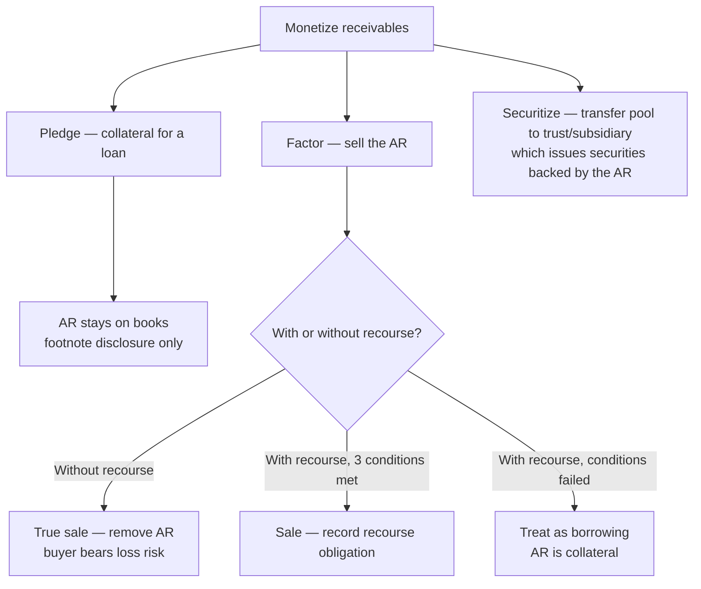

## 1. Accounts Receivable — Fundamentals

Four defining attributes of accounts receivable:

1. **Oral promise** to pay (a note receivable is a *written* promise).
2. Always a **current asset**.
3. Source: **trade** (customers, ordinary course of business) or **nontrade** (everything else).
4. Measured at **net realizable value** — gross amount less discounts, estimated uncollectibles, and returns/allowances.

### The BASE / T-account tool for roll-forward questions

`Beginning balance + Additions − Subtractions = Ending balance` — the ending balance becomes next period's beginning balance.

For AR: additions = **credit sales**; subtractions = **cash collections, write-offs, conversions to notes receivable**.

```schedule
{"caption": "AR roll-forward illustration",
 "columns": ["BASE", "Amount"],
 "rows": [
   ["Beginning balance", "90,000"],
   ["+ Credit sales", "800,000"],
   ["= Subtotal", "890,000"],
   ["− Cash collections", "(810,000)"],
   ["− Write-offs", "(23,000)"],
   ["− Converted to note receivable", "(7,000)"]
 ],
 "totals": ["Ending balance", "50,000"]}
```

> [!EXAM]
> Roll-forward questions blank out one element (sales, collections, or the ending balance). Set up BASE, insert the knowns, and solve for the gap.

## 2. Discounts — Sales (Cash) and Trade

### Sales / cash discounts — e.g. **2/10, net 30** (2% off if paid within 10 days; otherwise full amount due in 30)

Two GAAP-acceptable methods:

| | Gross method | Net method |
|---|---|---|
| Assumption at sale | Customer will **not** take the discount | Customer **will** take the discount |
| Record sale at | 100% (e.g., $100,000) | Net of discount (e.g., $98,000) |
| Customer pays within discount period | DR Cash 98,000; DR **Sales discounts taken** (contra-revenue) 2,000; CR AR 100,000 | DR Cash 98,000; CR AR 98,000 |
| Customer pays after discount period | DR Cash 100,000; CR AR 100,000 | DR Cash 100,000; CR AR 98,000; CR **Sales discounts not taken** (revenue) 2,000 |

Either route ends with identical total revenue and cash; companies pick the method matching the behavior they expect.

### Trade (volume/quantity) discounts

Applied **sequentially, one at a time** — never summed — and always recorded **net** (no gross method, because the discount is certain).

```schedule
{"caption": "Chained trade discount: 100 units × $1,000 list, terms 40% + 10%",
 "columns": ["Step", "Amount"],
 "rows": [
   ["List price (100 × 1,000)", "100,000"],
   ["− First discount 40%", "(40,000)"],
   ["= Net after first discount", "60,000"],
   ["− Second discount 10% × 60,000", "(6,000)"]
 ],
 "totals": ["Invoice price (effective 46% off, not 50%)", "54,000"]}
```

> [!TRAP]
> "40% and 10%" is **not** 50% off. Each successive discount applies to the *remaining* balance — effective rate here is 46%.

## 3. Sales Returns and Allowances

Both are seller concessions recorded in a **contra-revenue** account (sales returns and allowances). A **return** brings goods back (inventory restored, COGS reversed); an **allowance** is a price concession with no goods returned (no inventory/COGS effect).

**Jacobs example** — sold $500 cash (cost $350); customer returns 20%:

```journal
{"desc": "Original sale",
 "dr": [["Cash", 500], ["Cost of goods sold", 350]],
 "cr": [["Sales revenue", 500], ["Inventory", 350]]}
```

```journal
{"desc": "20% of goods returned",
 "dr": [["Sales returns and allowances", 100], ["Inventory", 70]],
 "cr": [["Cash", 100], ["Cost of goods sold", 70]]}
```

**Period-end estimate:** returns expected on pre-year-end sales are accrued as a **refund liability**. When goods actually come back next period, debit the refund liability (not contra-revenue again) — additional contra-revenue only if the liability was underestimated.

## 4. Estimating Credit Losses (CECL)

AR must be reported at **net realizable value**, reflecting customer **credit risk**.

| | Direct write-off | CECL allowance method |
|---|---|---|
| GAAP? | **Not GAAP** (income tax method only) | **Required under U.S. GAAP** |
| Expense recognized | Only when a specific account proves uncollectible | Estimated in the **period of the related sale** |
| Why / why not | Violates **matching**; AR overstated; no allowance | Follows accrual accounting; AR shown net of allowance |

**CECL — current expected credit losses:** estimate lifetime expected losses on receivables using **all relevant information — past experience, current conditions, and reasonable future forecasts**. No prescribed method; apply the chosen method consistently. Conditions at the balance sheet date may be assumed to persist unless information indicates otherwise. Cash **collected between the balance sheet date and issuance** of the statements may be considered — collected balances carry no remaining credit risk.

### Aging-schedule application — DEF Co.

Historical loss rates deemed a reasonable base, but they were built during an economic decline; DEF expects improvement, so each rate is reduced 20%:

```schedule
{"caption": "Aging of trade receivables, 12/31 Year 1 (rates = historical × 80%)",
 "columns": ["Category", "Balance", "Loss %", "Expected loss"],
 "rows": [
   ["Current", "850,000", "4.0%", "34,000"],
   ["1–30 days past due", "50,000", "8.0%", "4,000"],
   ["31–60 days past due", "20,000", "16.0%", "3,200"],
   ["61–90 days past due", "8,000", "24.0%", "1,920"],
   ["Over 90 days past due", "2,000", "40.0%", "800"]
 ],
 "totals": ["Required allowance", "930,000", "", "43,920"]}
```

The entry adjusts the allowance **to** the required balance:

```journal
{"desc": "Unadjusted allowance 40,000 → required 43,920",
 "dr": [["Credit loss expense", 3920]],
 "cr": [["Allowance for expected credit losses", 3920]]}
```

```journal
{"desc": "If unadjusted allowance were 50,000 → reduce to 43,920",
 "dr": [["Allowance for expected credit losses", 6080]],
 "cr": [["Credit loss expense", 6080]]}
```

Either way AR is reported at 930,000 − 43,920 = **886,080** NRV.

## 5. Credit Loss Expense — Write-offs and Recoveries

The allowance is a **general** estimate; a write-off merely **assigns** it to a now-identified customer — **no additional expense** at write-off:

```journal
{"desc": "Write off a specific uncollectible account",
 "dr": [["Allowance for expected credit losses", 16000]],
 "cr": [["Accounts receivable", 16000]]}
```

**Recovery of a previously written-off account** — reverse the write-off (restore AR and allowance), then collect normally; the two AR legs cancel, leaving DR Cash / CR Allowance:

```journal
{"desc": "Subsequent recovery, net effect",
 "dr": [["Cash", 5000]],
 "cr": [["Allowance for expected credit losses", 5000]]}
```

**Bost Co. sequencing example** — unadjusted allowance $10,000 credit; two bankrupt customers owing $16,000 written off; required year-end allowance $15,850:

```schedule
{"caption": "Allowance roll-forward — write-off first, then true-up",
 "columns": ["Step", "Allowance balance"],
 "rows": [
   ["Unadjusted balance (credit)", "10,000"],
   ["Write-off of bankrupt customers", "(16,000)"],
   ["= Balance after write-off (DEBIT 6,000)", "(6,000)"],
   ["Required ending balance (credit)", "15,850"]
 ],
 "totals": ["Adjustment required (6,000 + 15,850)", "21,850"]}
```

```journal
{"desc": "Year-end true-up of the allowance",
 "dr": [["Credit loss expense", 21850]],
 "cr": [["Allowance for expected credit losses", 21850]]}
```

> [!TRAP]
> Sequence matters: post write-offs against the allowance **before** computing the true-up. A large write-off can flip the allowance to a debit balance, so the adjustment = required ending balance **plus** the debit balance.

## 6. Pledging, Factoring, and Securitization



**Pledging** — AR used as loan collateral; company retains title and collects; **no journal entry, footnote disclosure only**.

**Factoring without recourse** — a true sale; the **factor assumes collection risk**. Typical entry: DR Cash, DR **Due from factor** (holdback protecting the factor for returns/disputes), DR **Loss on sale**, CR Accounts receivable.

**Factoring with recourse** — treated as a **sale** only if all three conditions hold; otherwise it is a **secured borrowing**:

1. Seller's recourse obligation can be **reasonably estimated**;
2. Seller **surrenders control** of the receivables;
3. Seller **cannot be required to repurchase** (a substitution-of-new-receivables clause is acceptable).

**Securitization** — receivables transferred to a trust or subsidiary that issues securities collateralized by them; investors are repaid from collections.

## 7. Reconciliation of Subledger to General Ledger

Subledgers hold transaction-level detail (per customer, inventory item, asset, vendor) that rolls up to a single **control account** in the general ledger. Used whenever transaction volume is high; the AR subledger shows each invoice (date, number), credit sales, discounts, returns/allowances, and payments per customer.

- Control account total **must equal** the sum of subledger balances — reconcile **at least monthly**.
- Unlike a bank rec, both records are internal: a difference is always an **error** (or an incomplete comparison), never a timing difference.
- Investigate downward from the GL (**vouching** — existence) and upward from the subledger (**tracing** — completeness).
- Common causes: GL-only journal entries never pushed to the subledger; entries posted to the wrong account; discounts recorded in a separate GL account — include **all** related GL accounts or the comparison isn't apples-to-apples.
- Fix whichever side is wrong (GL correcting entry, subledger update, or both), then the reconciliation is complete.

## 8. Notes Receivable

**Written promise** to pay; current **or** long-term; measured at **present value** (face less unearned interest and finance charges, earned over the note's life). A non-interest-bearing note requires **imputing** a market rate. Notes are subject to **CECL** just like trade receivables.

### Discounting a note (selling it, usually to a bank)

Same recourse question as factoring:

- **With recourse** — contingent liability remains: either show a contra account **note receivable discounted** on the face, or remove the note and disclose the contingency in the footnotes.
- **Without recourse** — outright sale; note comes off the books entirely.

**Four-step discounting computation** — $40,000, 12%, 90-day note (Sep 30–Dec 30), discounted at 15% after one month:

```schedule
{"caption": "Discounting a note receivable at the bank",
 "columns": ["Step", "Computation", "Amount"],
 "rows": [
   ["1. Maturity value", "40,000 + (40,000 × 12% × 3/12)", "41,200"],
   ["2. Bank discount", "41,200 × 15% × 2/12 (bank's holding period)", "(1,030)"],
   ["3. Bank payoff to holder", "41,200 − 1,030", "40,170"],
   ["4. Holder's interest income", "40,170 − 40,000 face", "170"]
 ]}
```

> [!RULE]
> The bank's discount is computed on the **maturity value** for the **bank's** holding period — not on face value, and not for the whole term.

### Dishonored discounted note (with recourse)

Remove the contingency, set up the estimated recoverable amount as **note receivable dishonored**, and recognize any shortfall as a loss — e.g., $100,000 note discounted with a $10,000 discount, now expected to recover only $50,000:

```journal
{"desc": "Note discounted with recourse is dishonored",
 "dr": [["Note receivable dishonored (recoverable amount)", 50000], ["Discount on note receivable", 10000], ["Loss on dishonored note", 40000]],
 "cr": [["Note receivable", 100000]]}
```

```recap
1. AR = oral promise, current, at **net realizable value**; BASE roll-forward solves the missing-number questions.
2. Sales discounts: gross method books 100% and records discounts **taken**; net method books 98% and records discounts **not taken** — total revenue ends identical. Trade discounts chain sequentially and are always net.
3. Returns: contra-revenue + restore inventory and reverse COGS; expected future returns accrue to a **refund liability** at period end.
4. Direct write-off is tax-only (violates matching). GAAP requires **CECL**: lifetime expected losses from past + current + forecast information, via a consistently applied method (commonly an adjusted aging).
5. Write-offs hit the **allowance**, never expense; recoveries reverse the write-off (net DR Cash / CR Allowance); true up the allowance to the required ending balance after write-offs.
6. Pledging = disclosure only. Factoring without recourse = sale with due-from-factor holdback and a loss. With recourse = sale only if estimable obligation + surrendered control + no forced repurchase; otherwise a borrowing.
7. Subledger totals must equal the GL control account; differences are errors — vouch down, trace up, fix the wrong side.
8. Note discounting: maturity value → bank discount (on maturity value, bank's period) → payoff → holder's interest income; dishonored recourse notes come back at recoverable amount with a loss.
```
