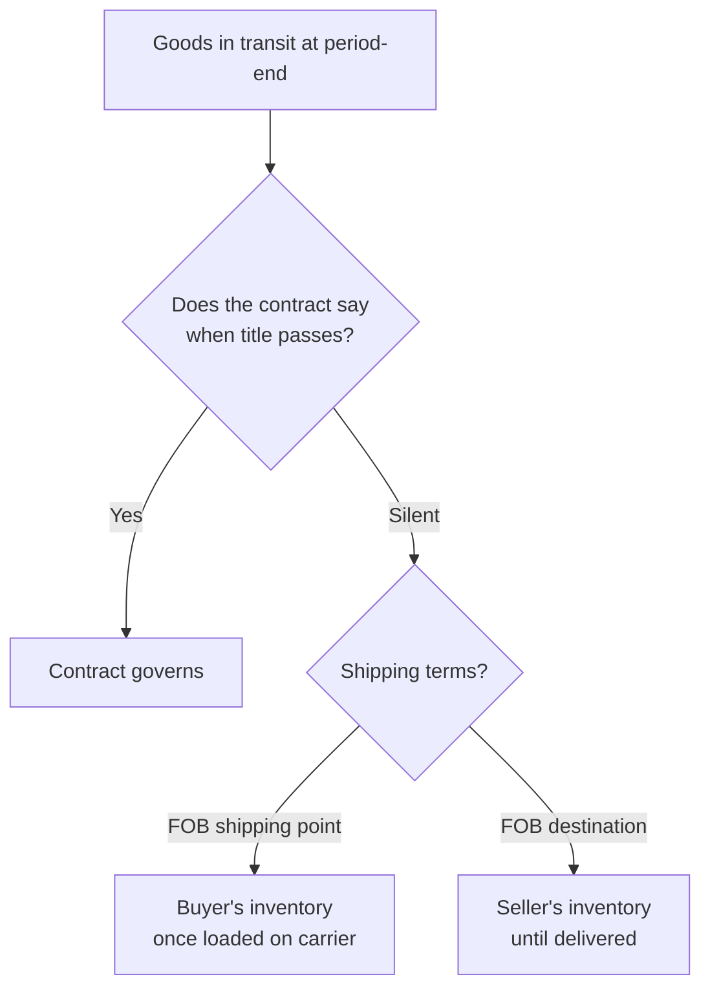
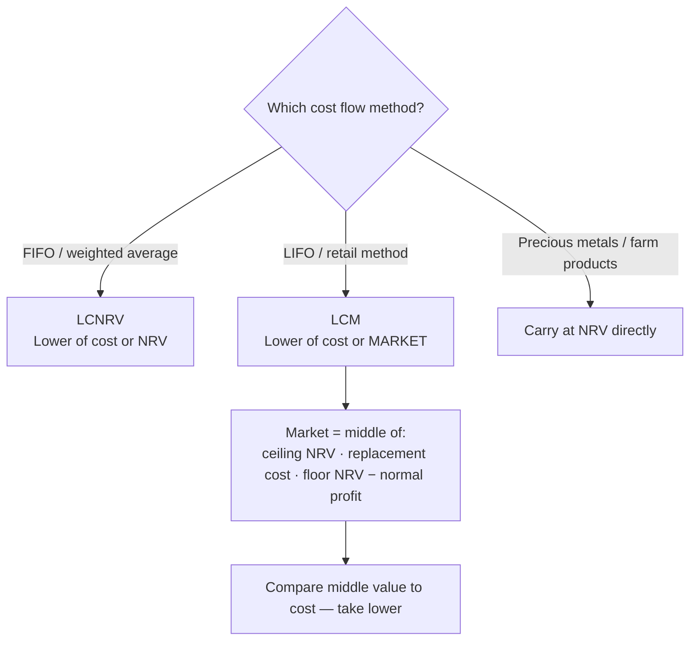
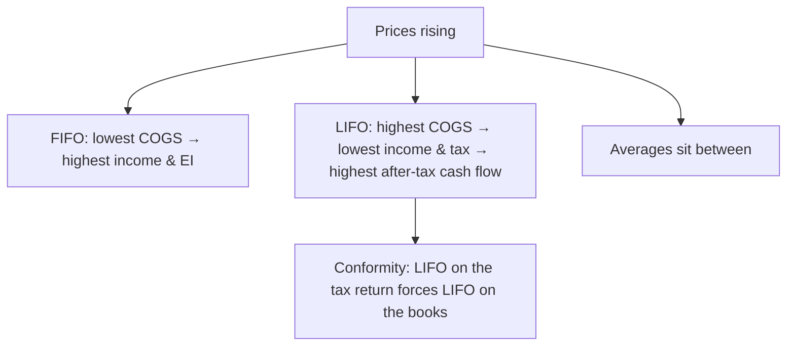

## 1. Types of Inventories

Inventory = items **held for resale in the ordinary course of business**. Current asset on the balance sheet; **not expensed until sold** (matching principle — selling price is matched with cost to produce gross profit).

| Business | Inventory stages |
|---|---|
| Retailer | **Finished goods** only — resold in substantially the same form as purchased |
| Manufacturer | **Raw materials** (includes freight-in, net of purchase discounts) → **Work-in-process** (started, not yet complete) → **Finished goods** (complete, ready for sale) |

### Whose inventory is it? (goods to be included)

**General rule:** inventory includes all goods to which the company holds **legal title** — even without physical possession. Title usually follows possession; exam questions concentrate on the exceptions where the two separate. First identify which party the question is about: **buyer or seller**.

**Goods in transit — two steps:**

1. **Contract governs.** If the contract states when title passes, that controls. Once the buyer has title, it's the buyer's inventory even before delivery.
2. **Contract silent → shipping terms:**

| Term | Title passes | In-transit goods belong to |
|---|---|---|
| **FOB shipping point** | When seller delivers goods to the common carrier | **Buyer** (title without possession) |
| **FOB destination** | When carrier tenders delivery to the buyer | **Seller** until delivery is complete |



**All the special situations:**

| Situation | Include in whose inventory | Reason |
|---|---|---|
| Nonconforming goods shipped (wrong goods) | **Seller** — title reverts on buyer's rejection | Seller breached the contract; buyer may choose to waive and accept |
| Consigned goods | **Consignor** | Consignee is only a sales agent with possession, never title; earns a commission |
| Goods in a public warehouse | **Owner** holding the warehouse receipt | Receipt evidences title despite no possession |
| Sale with **mandatory buyback** | **Seller** | Financing arrangement — seller includes goods even though buyer has possession *and* title |
| **Installment sale**, bad debts **can** be estimated | **Buyer** | Substance over form — seller's retained title is only loan security |
| **Installment sale**, bad debts **cannot** be estimated | **Seller** | Sale not effectively complete for accounting |

When a **consignee** sells the goods to a third party, the consignor then records:

```journal
{"desc": "Consignor — consignee sells goods to third party",
 "dr": [["Cash (or accounts receivable)", "XXX"], ["Cost of goods sold", "XXX"]],
 "cr": [["Sales revenue", "XXX"], ["Inventory", "XXX"]]}
```

> [!TRAP]
> Mandatory buyback reverses the normal logic: the *buyer* holds possession **and** legal title, yet the goods remain in the **seller's** inventory. Installment sales turn on a single test — whether uncollectible accounts can be reasonably estimated.

## 2. Valuation of Inventory

Rule of **conservatism**: anticipated gains are never booked before sale; anticipated **losses are booked immediately**.

**Base rule:** inventory is carried at **cost**, which **includes freight-in** (net of discounts). Freight-**out** is a selling expense, never inventoriable.

**Which subsequent-measurement rule applies — driven by cost flow method:**

| Cost method in use | Measure inventory at |
|---|---|
| **FIFO or weighted average** | **Lower of cost or NRV** (LCNRV) |
| **LIFO or retail method** | **Lower of cost or market** (LCM) |
| Precious metals / farm products | **NRV directly** (departure from cost basis) |

`NRV = selling price − costs to complete and sell (disposal costs)`

### LCNRV (FIFO / weighted average)

Steps: ① compute NRV → ② take the **lower** of cost vs. NRV, item by item.

```schedule
{"caption": "LCNRV example — per unit",
 "columns": ["Item", "Cost", "Selling price", "Cost to sell", "NRV", "Carry at"],
 "rows": [
   ["Item 1", "28.50", "30.00", "3.00", "27.00", "27.00 (NRV)"],
   ["Item 2", "21.00", "26.00", "4.00", "22.00", "21.00 (cost)"]
 ]}
```

### LCM (LIFO / retail) — "middle value" method

Market = the **middle** of three values:

1. **Ceiling** = NRV (selling price − cost to complete/sell)
2. **Replacement cost** = cost to purchase the item at the valuation date
3. **Floor** = NRV − normal profit margin

Then carry inventory at **lower of original cost vs. that middle (market) value**.



```schedule
{"caption": "LCM example — four items (market = middle value, bold logic per column)",
 "columns": ["Item", "Cost", "Replacement cost", "Ceiling (NRV)", "Floor (NRV − profit)", "Market (middle)", "Carry at"],
 "rows": [
   ["1", "20.50", "19.00", "25.00 − 1.00 = 24.00", "24.00 − 6.00 = 18.00", "19.00", "19.00 (market)"],
   ["2", "26.00", "20.00", "30.00 − 2.00 = 28.00", "28.00 − 7.00 = 21.00", "21.00", "21.00 (market)"],
   ["3", "10.00", "12.00", "15.00 − 1.00 = 14.00", "14.00 − 3.00 = 11.00", "12.00", "10.00 (cost)"],
   ["4", "40.00", "55.00", "60.00 − 6.00 = 54.00", "54.00 − 4.00 = 50.00", "54.00", "40.00 (cost)"]
 ]}
```

> [!EXAM]
> Normal profit may be stated as a **% of selling price** rather than dollars — convert before computing the floor. The named cost method determines the entire computation: LIFO/retail → LCM; FIFO/weighted average → LCNRV.

### Recording and disclosing the write-down

- **Immaterial** decline → charge to **cost of goods sold**.
- **Substantial and unusual** → separate loss line item, disclosed in the financial statements.

```journal
{"desc": "Material, unusual write-down to a separate account",
 "dr": [["Loss due to decline in inventory value", 4000]],
 "cr": [["Inventory", 4000]]}
```

> [!RULE]
> Write-down **reversals are prohibited under U.S. GAAP**. IFRS permits reversals — a classic GAAP/IFRS difference.

**Consistency:** the chosen method must be applied consistently (enables trend analysis) and **disclosed in the footnotes**. Change only if the new method better presents results.

## 3. Periodic vs. Perpetual Inventory Systems

**Periodic** → think two things: ① buying is debited to **Purchases** (not Inventory); ② a **physical count is mandatory** to back into COGS:

`Beginning inventory + Purchases (incl. freight-in, net of discounts) = Cost of goods available for sale − Ending inventory (per count) = COGS`

**Perpetual** → inventory record updated at **every** purchase and sale; COGS is known at each sale; a physical/test count is good internal control but optional (a "can-do," not a "must-do").

| | Periodic | Perpetual |
|---|---|---|
| Entry when buying | DR **Purchases** | DR **Inventory** |
| Entries when selling | **One** — record the sale only | **Two** — sale **and** DR COGS / CR Inventory |
| COGS | Squeezed at period end via count | Running, per transaction |
| Physical count | **Required** (at least annually) | Optional control (random/cyclical counts) |

**Worked entries** — bought 50,000 units @ $6; sold 20,000 units @ $7 selling price (cost $5):

```journal
{"desc": "Purchase — periodic system",
 "dr": [["Purchases", 300000]],
 "cr": [["Cash or accounts payable", 300000]]}
```

```journal
{"desc": "Purchase — perpetual system",
 "dr": [["Inventory", 300000]],
 "cr": [["Cash or accounts payable", 300000]]}
```

```journal
{"desc": "Sale — periodic system (one entry only)",
 "dr": [["Cash or accounts receivable", 140000]],
 "cr": [["Sales revenue", 140000]]}
```

```journal
{"desc": "Sale — perpetual system (two entries)",
 "dr": [["Cash or accounts receivable", 140000], ["Cost of goods sold", 100000]],
 "cr": [["Sales revenue", 140000], ["Inventory", 100000]]}
```

> [!TRAP]
> Count-error chain: **ending inventory overstated → COGS understated → net income, retained earnings, and equity overstated** (and assets overstated, so the balance sheet still balances). Reverse every arrow if EI is understated.

**Hybrid:** a **modified perpetual system** keeps perpetual records of **quantities only** (not dollars). Most perpetual companies still perform periodic test counts as an internal control against theft.

## 4. Cost Flow Assumptions — Part 1 (Specific ID, FIFO, Averages)

The cost flow assumption drives **ending inventory (balance sheet)** and **COGS (income statement)** — and U.S. GAAP does **not** require it to match the actual physical flow of goods (a grocery store physically moves FIFO but may cost on LIFO).

**Trigger words:**

| See | Think |
|---|---|
| Specific identification | Unique, high-value goods (car VIN, boat, diamond) — cost follows each item |
| FIFO | Sell the **old**; ending inventory = **newest** costs |
| Weighted average | **Periodic** system required |
| Moving average | **Perpetual** system ("moving perpetually") |
| LIFO | Sell the **new**; ending inventory = **oldest** costs |
| Dollar-value LIFO | Needs a **price index** |

**Shared example facts (Helix Corp., year 1 — no beginning inventory):** purchases 4,000 @ $4.25 = $17,000; 2,000 @ $4.50 = $9,000; 3,000 @ $4.75 = $14,250. Goods available = 9,000 units, **$40,250**. Units sold = 4,000 → ending inventory 5,000 units.

### FIFO

Sold 4,000 oldest units → COGS = 4,000 × $4.25 = **$17,000**; EI = $40,250 − 17,000 = **$23,250** (check: 3,000 × 4.75 + 2,000 × 4.50).

> [!RULE]
> FIFO produces the **same** ending inventory and COGS under periodic and perpetual systems — so a FIFO-perpetual fact pattern can always be solved with the faster periodic computation.

### Weighted average (periodic only)

Average cost = $40,250 ÷ 9,000 = **$4.4722**. COGS = 4,000 × 4.4722 = **$17,889**; EI = 5,000 × 4.4722 = **$22,361**. Best when units are homogeneous.

### Moving average (perpetual only)

Recompute the average after **each purchase**; charge sales at the latest average:

```schedule
{"caption": "Moving average — Helix Corp.",
 "columns": ["Event", "Units", "Unit cost", "Total cost", "Balance (units)", "Balance ($)", "Avg cost/unit"],
 "rows": [
   ["Purchase", "4,000", "4.25", "17,000", "4,000", "17,000", "4.2500"],
   ["Sale (COGS 12,750)", "(3,000)", "4.25", "(12,750)", "1,000", "4,250", "4.2500"],
   ["Purchase", "2,000", "4.50", "9,000", "3,000", "13,250", "4.4167"],
   ["Sale (COGS 4,417)", "(1,000)", "4.4167", "(4,417)", "2,000", "8,833", "4.4167"],
   ["Purchase", "3,000", "4.75", "14,250", "5,000", "23,083", "4.6167"]
 ]}
```

## 5. Cost Flow Assumptions — Part 2 (LIFO and Dollar-Value LIFO)

### LIFO

Sell the **new**; unsold = the **old**. ("New" is not the same as "expensive" — that equivalence holds only while prices are rising.)

- **LIFO conformity rule:** use LIFO for tax → **must** use LIFO for financial reporting. No mixing (unlike depreciation, where book straight-line + tax accelerated is fine).
- **Matching argument:** current selling price is matched with the most **current cost** — but only if purchases are current. If inventory was stockpiled in January, a November LIFO COGS reflects January costs. Analyst check: steadily **falling inventory balances** signal old-layer liquidation, so LIFO COGS may not be current.
- **Why profitable companies choose LIFO (rising prices):** highest COGS → lowest taxable income → lower tax → **higher after-tax cash flow**.
- LIFO **periodic ≠ perpetual** — both EI and COGS differ between systems.

**Helix under LIFO — periodic:** sold 4,000 newest = 3,000 × 4.75 + 1,000 × 4.50 → COGS **$18,750**; EI **$21,500** (= 4,000 × 4.25 + 1,000 × 4.50).

**Helix under LIFO — perpetual** (sales of 3,000 then 1,000 interleaved with purchases): first sale comes from the only batch, 3,000 × 4.25 = 12,750; second sale from most recent 4.50 batch, 1,000 × 4.50 = 4,500 → COGS **$17,250**; EI **$23,000**. Different from periodic — as expected.

### Effects in a rising-price environment (Pass Key)

| | FIFO | Average | LIFO |
|---|---|---|---|
| COGS | **Lowest** (sell old, cheap) | Middle | **Highest** (sell new, dear) |
| Ending inventory | **Highest** — approximates current/replacement cost | Middle | **Lowest** (old, cheap layers) |
| Net income / RE / equity | **Highest** | Middle | **Lowest** |
| Periodic vs. perpetual | Identical | Weighted avg (periodic) vs. moving avg (perpetual) | Different results |



> [!EXAM]
> Derive the directions instead of memorizing them: set up A = L + E, mark COGS up or down, then push the effect through profit → retained earnings → equity → assets. A **declining**-price fact pattern reverses every relationship in the table above.

### Dollar-value LIFO

Inventory measured in **base-year dollars**, adjusted by a **price index** (given, or computed):

`Price index = EI at current-year cost ÷ EI at base-year cost` (rising prices → index > 1)

Each year's **layer** is added at: layer at base-year cost × that year's index.

```schedule
{"caption": "Dollar-value LIFO — Brock Co. (base inventory 1/1 Yr 1 = 40,000)",
 "columns": ["Year", "EI @ current-yr cost", "EI @ base-yr cost", "Index", "Layer @ base", "Layer @ DV LIFO", "DV LIFO EI"],
 "rows": [
   ["Yr 1", "54,000", "45,000", "1.20", "5,000", "6,000", "46,000"],
   ["Yr 2", "80,000", "60,000", "1.33", "15,000", "20,000", "66,000"]
 ]}
```

> [!EXAM]
> Questions typically omit one cell to be derived from the others: base-year EI = prior base + current layer (40,000 + 5,000 = 45,000); current-year EI may be given in components (54,000 + 26,000 = 80,000). The index is always current-year cost ÷ base-year cost for the **same year-end**.

## 6. Gross Profit Method and Firm Purchase Commitments

### Gross profit method

Used to **estimate** ending inventory for **interim statements under a periodic system** (and casualty losses — fire/flood). Inventory is valued at retail-derived cost.

Steps: ① GP% of sales given → COGS % = 1 − GP%; ② BI + purchases = goods available; ③ COGS ≈ sales × COGS%; ④ EI = available − COGS.

```schedule
{"caption": "Dahl Co. — GP 20% of sales",
 "columns": ["Step", "Amount"],
 "rows": [
   ["Beginning inventory", "100,000"],
   ["+ Purchases", "100,000"],
   ["= Goods available for sale", "200,000"],
   ["− Estimated COGS (sales 200,000 × 80%)", "(160,000)"],
   ["= Estimated ending inventory", "40,000"]
 ]}
```

Flood destroys all ending inventory → casualty **loss = $40,000** (the estimated EI).

> [!TRAP]
> Gross profit **on sales** ≠ markup **on cost**. A 25% markup on cost = 20% GP on sales. Convert to a percentage of sales before computing COGS.

### Firm purchase commitments

A **forward contract**: legally enforceable agreement to buy inventory in the future at a price locked in today (an alternative to stockpiling and paying storage). If market price falls below the contract price and the loss is **probable and reasonably estimable** (no rebound expected by the purchase date), conservatism requires accruing the loss **now**.

**J&S Inc.:** Year 1 contract to buy timber for $5,000,000; year-end market value $4,000,000; loss expected to hold in Year 2:

```journal
{"desc": "Year 1 — accrue loss on firm purchase commitment",
 "dr": [["Estimated loss on purchase commitment", 1000000]],
 "cr": [["Estimated liability on purchase commitment", 1000000]]}
```

Equity down, liability up, assets unchanged. If significant price volatility (recovery) were expected by the purchase date, no loss would be accrued.

```recap
1. Inventory is whatever the company holds **legal title** to — FOB terms, consignment, buyback, warehouse, and installment rules all resolve to a title question.
2. Cost includes **freight-in**; freight-out is a selling expense.
3. Subsequent measurement: FIFO/weighted average → **LCNRV**; LIFO/retail → **LCM** (market = middle of replacement cost, NRV ceiling, NRV − profit floor); no write-down reversals under U.S. GAAP.
4. Periodic debits **Purchases** and squeezes COGS from a mandatory count; perpetual debits **Inventory** and records COGS at each sale.
5. Rising prices: FIFO → highest income and ending inventory; LIFO → highest COGS, lowest tax, highest after-tax cash flow; FIFO is identical under both systems, LIFO is not.
6. Dollar-value LIFO adds each year's layer at base-year cost × that year's price index (current ÷ base).
7. Gross profit method estimates EI as available − sales × (1 − GP%); a probable, estimable loss on a firm purchase commitment is accrued immediately.
```
