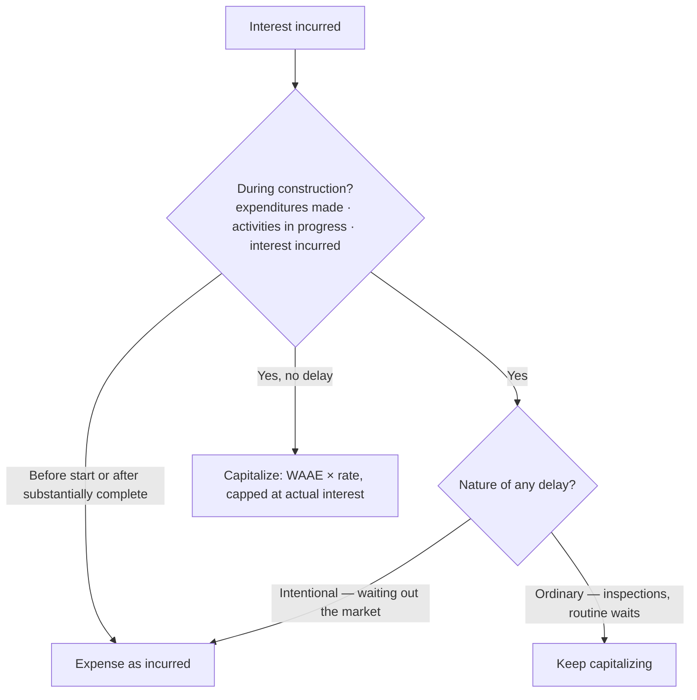

## 1. PP&E — Classification and Cost (Land and Buildings)

**Fixed assets** = long-term physical assets acquired **for use in the business, not resale**. Reported at **historical cost − accumulated depreciation** (no mark-to-market under U.S. GAAP); shown separately on the balance sheet or in the footnotes. Accumulated depreciation is a **contra-asset** (credit balance) — increased by credits, removed with a debit on disposal.

Payment can be cash, a note (noncash investing/financing), or the company's own stock — recorded at the **fair value of the stock issued** (never book value).

**Donated fixed assets:** record at fair value with a **gain** on the income statement:

```journal
{"desc": "Asset received by donation",
 "dr": [["Fixed asset (fair value)", "XXX"]],
 "cr": [["Gain on receipt of donated asset", "XXX"]]}
```

Cost = invoice price **plus everything needed to bring the asset to its intended location and condition for use** (freight-in, installation, testing).

### Cost of land (not depreciable) vs. building (depreciable)

The dividing line is **excavation** — digging the foundation starts the **building's** cost.

| Cost of **land** | Cost of **building** |
|---|---|
| Purchase price, broker commissions | Purchase price |
| Legal fees, title search, recording fees | **Deferred maintenance** neglected by the prior owner |
| Draining swamps, clearing brush/trees | Alterations, improvements, architect fees |
| **Site development**: grading, filling holes, leveling | **Excavation** (digging the foundation) |
| Assumed mortgages and back taxes | Construction-period interest |
| **Demolition of an old building** | |
| **Less:** proceeds from sale of existing buildings, scrap, standing timber | |

**Land improvements** (fences, water systems, sidewalks, paving, landscaping, lighting) **are depreciated** — including any construction-period interest capitalized into them.

> [!TRAP]
> Filling in a hole / grading / leveling = **land** (never depreciated). Digging the hole for the foundation = **building**. Demolition of an old structure to prepare a site = land; sale proceeds from anything stripped off the site **reduce** the land's cost.

### Basket (lump-sum) purchase

Allocate the single price between land and building using the **ratio of appraised values** (the building must be separately identified because only it is depreciated) — e.g., $1,800,000 paid; appraisals: land 400,000, building 1,400,000 → building = 1,400/1,800 × price.

## 2. Equipment, and Capitalize vs. Expense

Equipment cost = invoice price **− discounts**, + freight-in and insurance in transit, + installation, testing and floor rearrangement (condition necessary for intended use), + sales and federal excise taxes, + construction-period interest if self-constructed.

### AIR — capitalize; ordinary repairs — expense

| Expenditure | Treatment |
|---|---|
| **A**dditions (new wing — increases quantity) | Capitalize |
| **I**mprovements / betterments (increases quality, usefulness, or life) | Capitalize |
| **R**eplacements (new similar asset for old) | Capitalize |
| Ordinary repairs and maintenance (annual, recurring — painting, upkeep) | **Expense** |
| Deferred maintenance discovered at purchase | Capitalize (part of purchase cost) |

> [!MNEMONIC]
> **AIR is extraordinary** — Additions, Improvements, Replacements are capitalized; ordinary repairs are expensed.

**Replacement mechanics:**

- **Old asset's carrying value known** — remove old asset and recognize the loss, record the new (old: cost 10, accumulated depreciation 4 → NBV 6; new costs 15):

```journal
{"desc": "Record new asset",
 "dr": [["Equipment (new)", 15]],
 "cr": [["Cash", 15]]}
```

```journal
{"desc": "Write off replaced asset at known NBV",
 "dr": [["Loss on replacement", 6], ["Accumulated depreciation", 4]],
 "cr": [["Equipment (old, at cost)", 10]]}
```

- **Old asset's carrying value unknown** (life-extending expenditure) — capitalize by **debiting accumulated depreciation**:

```journal
{"desc": "Life-extending overhaul, old carrying value unknown",
 "dr": [["Accumulated depreciation", 15000]],
 "cr": [["Cash", 15000]]}
```

## 3. Fixed Assets Constructed by the Company

Capitalize **materials + labor + overhead + value-adding (extraordinary) repairs + construction-period interest**. Applies whether the asset is built for internal use **or for sale/lease**.

### Capitalized interest rules

1. Capitalize interest on **weighted-average accumulated expenditures (WAAE)** — money actually **spent**, never the amount borrowed. (Weight each expenditure by months outstanding ÷ 12, like weighted-average shares.)
2. Rate: use the **specific construction-loan rate** up to the loan amount; expenditures **in excess** use the **weighted-average rate on general debt**.
3. **Cap:** capitalized interest can never exceed **actual interest incurred** in the period.
4. U.S. GAAP does **not** offset capitalized interest with interest income earned on unspent loan proceeds (IFRS does — GAAP/IFRS difference).

**Capitalization period — all three conditions required:**

1. Expenditures for the asset **have been made**;
2. **Activities** necessary to get the asset ready are **in progress** (permits filed, plans drawn);
3. **Interest cost is being incurred**.



**Q — Conviser builds a $1,000,000 fixed-price asset funded by a $500,000 construction loan at 11% and general debt at a 9% weighted-average rate. Year 1 weighted-average accumulated expenditures (WAAE) are $600,000 and actual interest incurred is $150,000. Compute the interest to capitalize — construction-loan rate on the first layer, general-debt rate on the excess expenditures, capped at actual interest.**

```schedule
{"caption": "Capitalized interest, Year 1",
 "columns": ["Layer", "Base", "Rate", "Interest"],
 "rows": [
   ["Construction loan layer", "500,000", "11%", "55,000"],
   ["Excess expenditures — general debt", "100,000", "9%", "9,000"]
 ],
 "totals": ["Capitalized (≤ 150,000 actual — OK)", "600,000", "", "64,000"]}
```

If the weighted-average general-debt rate isn't given, compute it: (250,000/500,000 × 10%) + (250,000/500,000 × 8%) = 9%.

Capitalization **ends when the asset is substantially complete and ready for its intended use** — interest after that is expensed.

**WAAE derivation** (when not given): weight each expenditure by the fraction of the year it was outstanding — e.g., $400,000 spent Jan 1 (12/12 = 400,000) + $400,000 spent Jul 1 (6/12 = 200,000) = **$600,000** WAAE.

## 4. Nonmonetary Exchanges (ASC 845)

**General rule — measure at fair value** of the asset **given up** (or received, if more clearly determinable) and recognize the **full gain or loss** (FV given up − book value given up).

**Exception — use book value and defer the gain** when any of these hold: the exchange **lacks commercial substance**, fair value is **not determinable**, or it is an exchange to **facilitate a sale to customers**. *Commercial substance* = the entity's future cash flows are expected to **change significantly** as a result of the exchange.

**Boot (cash) rules** when the exchange **lacks commercial substance**:

| Situation | Gain treatment | Loss treatment |
|---|---|---|
| **Boot paid** | No gain; new asset = book value given up + boot paid | Recognize in full |
| **Boot received < 25%** of total consideration | Recognize gain **pro rata** = (boot ÷ total consideration received) × total gain | Recognize in full |
| **Boot received ≥ 25%** | Treat as a **monetary** exchange — **both** parties recognize the **full** gain | Recognize in full |

With **commercial substance**, always recognize the full gain/loss regardless of boot.

**Q — Equipment given up: cost 15,000, accumulated depreciation 5,000 (book value 10,000), fair value 12,000. In exchange the company receives similar equipment with fair value 10,000 plus 2,000 cash. The exchange lacks commercial substance. Record the entry.**

Total gain = 12,000 − 10,000 = 2,000. Boot 2,000 ÷ total consideration 12,000 = 16.7% (< 25%) → recognized gain = 2,000 × (2,000 ÷ 12,000) = **333**. New asset is the plug.

```journal
{"desc": "Nonmonetary exchange, boot received < 25%, lacks commercial substance",
 "dr": [["Cash (boot)", 2000], ["Equipment (new, plug)", 8333], ["Accumulated depreciation", 5000]],
 "cr": [["Equipment (old, at cost)", 15000], ["Gain on exchange", 333]]}
```

```recap
1. PP&E is carried at historical cost less accumulated depreciation; land is never depreciated, land improvements and buildings are. Donated assets: fair value with a gain.
2. Land cost runs **up to (not including) excavation**; digging the foundation begins the building. Sale proceeds from old structures/timber reduce land cost.
3. Basket purchases allocate by relative appraised values.
4. Capitalize **AIR** (additions, improvements, replacements) and purchase-date deferred maintenance; expense ordinary recurring repairs.
5. Replacement with known NBV → write off old and record loss; unknown NBV → debit accumulated depreciation.
6. Capitalized interest = weighted-average **expenditures** × (construction-loan rate, then general-debt weighted-average rate), capped at actual interest incurred; only **during** construction; ordinary delays keep capitalizing, intentional delays stop; no offset for interest income under U.S. GAAP.
```
