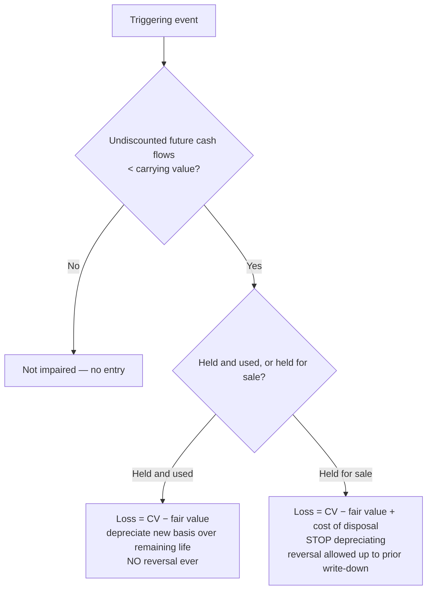

## 1. Depreciation and Disposal — Overview

Depreciation = **systematic and rational allocation** of an asset's cost over the periods benefited (matching principle). Terminology by asset type:

| Term | Applies to |
|---|---|
| **Depreciation** | Tangible fixed assets |
| **Amortization** | Intangible assets |
| **Depletion** | Natural resources |

Justifications: **physical** depreciation (wear and tear from use) and **functional** depreciation (obsolescence, inadequacy as demands change).

**Key inputs (estimates, disclosed in footnotes):** salvage/residual value and estimated useful life. `Depreciable base = cost − salvage value`; never depreciate below salvage value. Revisions of life or salvage are **changes in estimate → prospective** (no restatement).

**Partial years:** depreciate from the date **placed in service** (May 1 purchase → 8/12 of a year), and update depreciation **through the date of sale** before computing gain or loss. Watch for stated company conventions that override the dates: half-year convention, full-year in year of acquisition and none in year of sale, or the reverse.

> [!EXAM]
> Higher salvage value or longer life → smaller depreciation → higher income, retained earnings, and equity. Questions test the direction of these levers as often as the arithmetic.

### Component vs. composite depreciation

- **Component** — split one asset into parts with different lives and depreciate each separately (machine $20,000, 10-year life; motor within it $5,000, replaced every 3 years → depreciate $15,000 over 10 years and the motor over 3). **Optional under U.S. GAAP, required under IFRS.**
- **Composite (group)** — average similar assets into one pooled life:

```schedule
{"caption": "Lester Mfg — composite life computation",
 "columns": ["Machine", "Cost", "Salvage", "Depreciable base", "Life (yrs)", "Annual SL depreciation"],
 "rows": [
   ["A", "550,000", "50,000", "500,000", "20", "25,000"],
   ["B", "200,000", "20,000", "180,000", "15", "12,000"],
   ["C", "40,000", "—", "40,000", "5", "8,000"]
 ],
 "totals": ["Composite life = 720,000 ÷ 45,000 = 16 years", "790,000", "", "720,000", "", "45,000"]}
```

**Selling one asset out of a composite group: no gain or loss.** Debit cash for proceeds, credit the asset's original cost, and **plug accumulated depreciation** (sell A after 10 years for 260,000):

```journal
{"desc": "Disposal from a composite group — accumulated depreciation is the plug",
 "dr": [["Cash", 260000], ["Accumulated depreciation (plug)", 290000]],
 "cr": [["Machine A (cost)", 550000]]}
```

## 2. Basic Depreciation Methods

All methods reach the **same total** accumulated depreciation (cost − salvage); only the **timing** per year differs. Changing methods is a change in estimate (inseparable from a change in principle) → **prospective**.

Shared example: cost $11,000, salvage $1,000, base $10,000.

| Method | Use when (theory trigger) | Formula |
|---|---|---|
| **Straight-line** | Service potential declines **with time** | (Cost − salvage) ÷ useful life |
| **Sum-of-the-years'-digits** | Accelerated | (Cost − salvage) × remaining life ÷ SYD, where SYD = N(N+1)/2 |
| **Units of production** | Service potential declines **with use** | Rate = (cost − salvage) ÷ total estimated units; × units this period |
| **Declining balance (DDB/150%/125%)** | **Rapid obsolescence** | NBV at beginning of year × (factor ÷ life) — **salvage ignored in the calc** but NBV floor = salvage |

**Straight-line:** 10,000 ÷ 5 years = $2,000/yr (July 1 purchase → 2,000 × 6/12 = 1,000 in year 1).

**SYD (4-year life):** denominator = 4 × 5 ÷ 2 = 10.

```schedule
{"caption": "Sum-of-the-years'-digits — base 10,000, 4-year life",
 "columns": ["Year", "Fraction", "Depreciation", "vs. straight-line 2,500"],
 "rows": [
   ["1", "4/10", "4,000", "higher"],
   ["2", "3/10", "3,000", "higher"],
   ["3", "2/10", "2,000", "lower"],
   ["4", "1/10", "1,000", "lower"]
 ],
 "totals": ["Total", "", "10,000", "same total"]}
```

**Units of production** converts depreciation from a fixed cost to a **variable cost** — a parked delivery truck records zero depreciation.

**Double-declining balance** — cost $10,000, salvage $2,000, 10-year life → cap on accumulated depreciation = **$8,000**; rate = 2/10 = 20% of beginning NBV:

```schedule
{"caption": "DDB — the year-8 cap trap",
 "columns": ["Year", "Beginning NBV", "× 20%", "Allowed depreciation", "Accumulated"],
 "rows": [
   ["1", "10,000", "2,000", "2,000", "2,000"],
   ["2", "8,000", "1,600", "1,600", "3,600"],
   ["…", "…", "…", "…", "…"],
   ["8", "2,098", "419.60", "98 (capped)", "8,000"],
   ["9–10", "2,000 (= salvage)", "—", "0", "8,000"]
 ]}
```

> [!TRAP]
> DDB ignores salvage in the annual computation but **never depreciates below salvage value**. Compute the cap (cost − salvage) first: in year 8 above, $419.60 is the classic wrong answer — only $98 remains. Mid-year placement multiplies year 1 only (10,000 × 20% × 6/12 = 1,000); year 2 uses the resulting NBV × 20% in full.

## 3. Disposals, Disclosure, and Depletion

**Sale of an individually depreciated asset** — update depreciation to the sale date, then: gain/loss = proceeds − NBV:

```journal
{"desc": "Sale of equipment (loss case)",
 "dr": [["Cash (proceeds)", "XXX"], ["Accumulated depreciation", "XXX"], ["Loss on sale (plug, if debit)", "XXX"]],
 "cr": [["Equipment (historical cost)", "XXX"]]}
```

- **Write-off of a fully depreciated asset:** DR accumulated depreciation / CR cost — **no change in total assets**.
- **Total, permanent impairment write-off:** DR accumulated depreciation, DR loss due to impairment (nonoperating), CR cost.
- Accumulated depreciation roll-forward: beginning + depreciation expense − disposals/write-offs = ending.

**Disclosures:** depreciation expense for the period; balances of major classes of depreciable assets; accumulated depreciation (by class or total); **methods used** — on the face or in the notes.

### Depletion (natural resources — oil, gas, timber, minerals)

Depletion base = purchase price **+ development costs** (drilling, tunnels, shafts) **+ estimated restoration costs − residual value**. GAAP method = **cost depletion** (percentage depletion is tax-only):

1. Rate = depletion base ÷ **recoverable** units
2. Depletion = rate × units **extracted** this period
3. Split it: units **sold** → COGS (income statement); units extracted but unsold → **inventory** (balance sheet)

```schedule
{"caption": "HAPPY Mines — cost depletion",
 "columns": ["Step", "Computation", "Result"],
 "rows": [
   ["Depletion base", "3,400,000 + 800,000 development − 200,000 residual", "4,000,000"],
   ["Rate", "4,000,000 ÷ 4,000,000 recoverable tons", "$1 / ton"],
   ["Depletion for year", "400,000 tons extracted × $1", "400,000"],
   ["To income statement (COGS)", "375,000 tons sold × $1", "375,000"],
   ["To ending inventory", "25,000 tons unsold × $1", "25,000"]
 ]}
```

> [!TRAP]
> Depletion is usage-based, so acquisition **dates don't matter** — and only the depletion on units **sold** hits the income statement. The rest sits in inventory.

## 4. Impairment of PP&E (held and used)

Test only when a **triggering event** suggests the carrying amount may not be recoverable. Two steps:

1. **Recoverability test:** sum of **undiscounted** future cash flows < carrying value? → impaired.
2. **Measure the loss:** carrying value − **fair value** (if fair value not given, use the **present value of future cash flows** as a proxy).



Reporting: impairment loss is part of **income from continuing operations** (after operating income, before tax).

> [!TRAP]
> Undiscounted cash flows are only for the **test**; the **loss** uses fair value. Mixing the two is the standard distractor. Held-for-sale impairment adds **cost of disposal** to the loss (CV 13 − FV 10 + disposal 1 = loss 4).

## 5. Long-Lived Assets Held for Sale

Same **six criteria** as discontinued operations — all must be met:

1. Management **commits** to a plan of sale;
2. Asset is **available for immediate sale** in present condition;
3. **Active program** to locate a buyer has begun;
4. Sale is **probable** and expected to complete **within one year**;
5. **Actively marketed** at a price reasonable relative to fair value;
6. **Significant changes to the plan are unlikely**.

If any criterion fails at any time → reclassify to **held and used**. Presentation: **separately on the face of the balance sheet**.

Measurement while held for sale:

- Carry at the **lower of carrying value or fair value less costs to sell** (commissions, legal fees, title transfer, closing costs — costs incurred *only because* of the sale).
- **Stop depreciating/amortizing.**
- Remeasure each period; write-downs are losses; **subsequent recoveries are allowed only up to cumulative prior write-downs** (never above the carrying value at classification).

**Millinio example:** building CV $700,000; realtor's supported price $750,000; commission $10,000 + closing $50,000. If management threatens to block a $750,000 sale → criterion 6 fails → **not** held for sale. If management agrees → held for sale; carry at lower of 700,000 vs. (750,000 − 60,000) = 690,000 → **$10,000 loss**; later recovery capped at that $10,000.

```recap
1. Depreciable base = cost − salvage; life/salvage revisions are prospective; watch placed-in-service dates and stated conventions (half-year, full-year-in/none-out).
2. Component depreciation (optional GAAP, required IFRS) splits an asset; composite pools assets — composite disposals produce **no gain/loss**, accumulated depreciation is the plug.
3. Method triggers: time → straight-line; use → units of production; rapid obsolescence → DDB (rate × beginning NBV, salvage ignored in the calc but floors NBV); SYD = remaining life ÷ N(N+1)/2. Same lifetime total under every method.
4. Sale: update depreciation to sale date, gain/loss = proceeds − NBV. Full write-off changes total assets by zero.
5. Depletion: base includes development and restoration costs less residual; rate per **recoverable** unit; only the portion **sold** is expensed — unsold units go to inventory.
6. Impairment: test with **undiscounted** cash flows, measure with **fair value**; held-and-used losses never reverse; held-for-sale adds disposal costs, stops depreciation, and allows reversal only up to the prior write-down.
7. Held for sale = the six discontinued-operations criteria; carry at lower of CV or FV − costs to sell.
```
