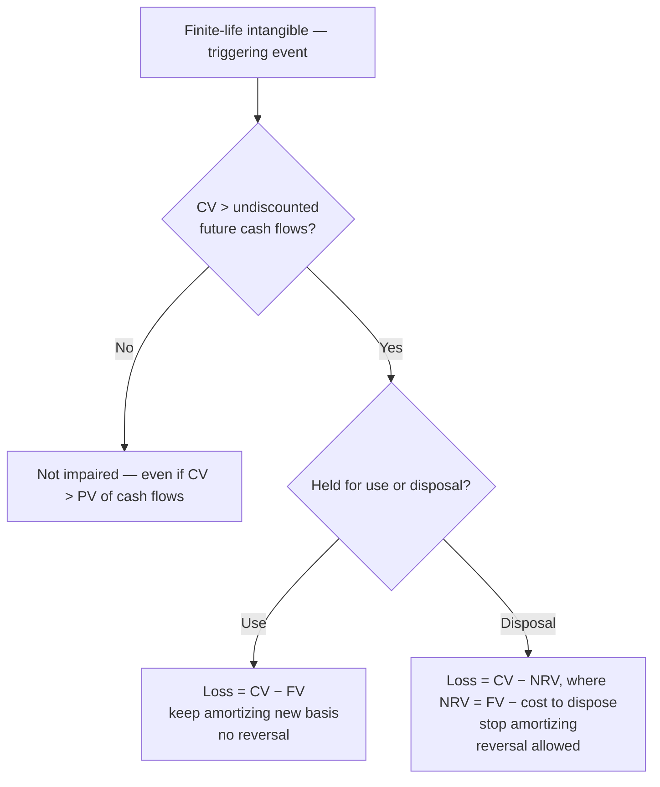

## 1. Intangible Assets

Long-lived legal or contractual rights conveying competitive advantage. Two families:

| | Identifiable, **finite life** | Not identifiable, **indefinite life** |
|---|---|---|
| Examples | Patent, copyright, trademark, franchise, license, purchased software | Goodwill, brand/trade name |
| Subsequent accounting | **Amortize** over shorter of economic vs. legal/contractual life | **No amortization — test for impairment** |
| Reported at | Cost − amortization − impairment | Cost − impairment (any answer with amortization is wrong) |

### Purchased vs. internally developed

- **Purchased from another entity** → **capitalize** (noncurrent asset; cash paid = investing outflow; sale proceeds = investing inflow).
- **Internally developed** → **expense** (U.S. GAAP generally prohibits capitalizing R&D). Expense: internally developing a trademark, goodwill from advertising, and costs of **developing, maintaining, or restoring goodwill**.
- **Exceptions — capitalize even when internally developed:** legal and registration fees, **successful** legal defense of the intangible, registration/consulting fees, design costs, other directly identifiable costs.

> [!TRAP]
> An **unsuccessful** defense is expensed — and the intangible's carrying value is usually written off, since the right is no longer protected. Goodwill is only ever recorded when **purchased in an acquisition** (price paid − fair value of identifiable net assets).

### Research & development cost classification (ASC 730)

R&D is **expensed as incurred**. The tested nuances are in *how* specific costs are treated:

| Cost | Treatment |
|---|---|
| Materials, equipment, facilities **with alternative future use** | **Capitalize**; the period **depreciation** is R&D expense |
| Materials, equipment, facilities **with no alternative future use** | **Expense in full now** |
| R&D performed **under contract for others** | **Not** R&D expense — it's **COGS**, matched against contract revenue |
| Salaries, contracted-out R&D, design/testing to find new knowledge | **Expense** as R&D |

> [!TRAP]
> **Not** R&D (do not expense as R&D): routine periodic design changes, **quality control / routine testing**, **marketing and market research**, legal costs to obtain or defend a patent (those are capitalized to the intangible), reformulating an existing product, and production troubleshooting.

### Measuring capitalized cost

Cost = **cash paid + present value of liabilities issued + fair value of stock issued** (never book value). If the stock's fair value isn't determinable, use the fair value of what was **received**. Face value − present value of a note = **discount on note payable** (contra-liability = future interest).

### Amortization mechanics

- Straight-line unless another pattern is more appropriate; **disclose the method**; watch mid-year acquisition dates (partial-year amortization).
- Amortize over the **shorter** of economic life or legal/contractual life (conservatism — shorter life → bigger expense → lower NBV).
- **Cost to extend the useful life:** capitalize; new amortization = (NBV + extension cost) ÷ **new remaining life**.
- **Change in estimated life only:** prospective — remaining NBV ÷ new remaining life; no restatement.
- **Sale:** update amortization to sale date; gain/loss = proceeds − NBV, reported **nonoperating** (after operating income, within continuing operations).

## 2. Impairment of Finite-Lived Intangibles

Same two-step test as PP&E (goodwill and indefinite-life assets use a different **one-step** test — see the subsection below; goodwill is tested at the reporting-unit level, not asset-by-asset):

1. **Recoverability:** carrying value > sum of **undiscounted** future cash flows → impaired.
2. **Loss:** write down to **fair value** (or PV of future cash flows if fair value not given; if both are given, fair value wins and the PV is a distractor).



**Q — A finite-lived intangible has carrying value 1,200,000, undiscounted future cash flows 1,000,000, fair value (= PV of cash flows) 700,000, and disposal cost 100,000. Compute the impairment loss and the after-effects (continued amortization, reversal eligibility) under both held-for-use and held-for-disposal.**

| | Held for use | Held for disposal |
|---|---|---|
| Step 1 | Impaired (1.2M > 1.0M) | Impaired (same) |
| Loss | 1,200,000 − 700,000 = **500,000** | 1,200,000 − (700,000 − 100,000) = **600,000** |
| Amortization afterward | Continues on new basis | **Stops** |
| Reversal | Not allowed | Allowed (up to prior write-down) |

A write-down accelerates future amortization into the present: lower carrying value → **lower future amortization**. Loss placement: continuing operations after operating income — unless the asset belongs to a **discontinued operation** (then net of tax, below the line).

- CV 900,000 vs. undiscounted CF 1,000,000 → **not impaired**, no entry (asset is conservatively stated).

### Goodwill and indefinite-life impairment (the "one-step" test — done right)

Goodwill has **no separable fair value**, so it is **not** tested "CV vs. FV" like a single asset. It is tested at the **reporting-unit** level, at least annually or on a triggering event:

- **Optional qualitative "step 0":** if it is *more likely than not* that reporting-unit fair value ≥ carrying amount, skip the quantitative test.
- **Quantitative test:** impairment = **reporting-unit carrying amount (including goodwill) − reporting-unit fair value**. The loss is **limited to the goodwill carrying amount** (goodwill can be written down to zero but not below).

**Q — A reporting unit has a carrying amount of 500,000 including goodwill of 90,000. Its fair value is 440,000. Compute the goodwill impairment. Then redo it if fair value were 380,000.**

- FV 440,000: indicated loss 500,000 − 440,000 = **60,000** (≤ 90,000 goodwill → recognize 60,000).
- FV 380,000: indicated loss 120,000, but **capped at the 90,000 goodwill balance** → recognize **90,000** (goodwill to zero).

**Indefinite-life intangibles other than goodwill** (e.g., a trademark) *do* use the direct one-step test: loss = **carrying value − fair value**, tested on that single asset. Neither goodwill nor indefinite-life intangibles are amortized, and goodwill impairments are **never reversed**.

## 3. Purchased Software and Cloud Computing Arrangements

**Purchased software** = identifiable finite-life intangible: capitalize cash + PV of notes + FV of stock; amortize over shorter of legal/contractual term vs. economic life ("provides cash flows over 7 years" = a 7-year economic life).

**Cloud computing arrangement (CCA):** fee paid to a vendor for the **right to use software over the internet**; vendor hosts the infrastructure. Three phases — **expense 1 and 3, capitalize the middle**:

| Phase | Trigger words | Treatment |
|---|---|---|
| 1. Preliminary project | "Determining system requirements" | **Expense** |
| 2. Application development | "Implementation," customizing/configuring infrastructure | **Capitalize** — except training, manual data conversion, maintenance, support → expense |
| 3. Post-implementation (begins when placed in service) | Maintenance, training, enhancements, upgrades | **Expense** |

Capitalized implementation costs amortize over the **term of the arrangement (hosting period)** — or the economic life if shorter — starting when ready for intended use (watch partial years). Impairment: standard two-step finite-life test.

**Beta Co. example:** $2M determining system requirements → expense; $8M implementation → capitalize, amortize over the 5-year hosting term ($1.6M/yr straight-line); $1M manual data conversion → expense; maintenance → expense.

### Software to be sold, leased, or marketed (ASC 985-20)

A **third** software regime — for software the company will **sell** to customers (not internal-use/CCA above). Timeline:

1. Costs **before technological feasibility** (planning, design, coding to prove the concept) → **R&D expense**.
2. **Technological feasibility** is established at a **detailed program design** *or* a **working model**. From that point until the product is **available for general release** → **capitalize** (coding and testing).
3. After general release → costs to **duplicate/package** = **inventory**; customer support and maintenance = **expense**.

**Annual amortization of the capitalized cost = the greater of:**

| Method | Formula |
|---|---|
| Straight-line | Capitalized cost ÷ remaining useful life |
| Revenue ratio | Capitalized cost × (current-year gross revenue ÷ total current + estimated future gross revenue) |

Report the capitalized software at the **lower of unamortized cost or net realizable value**.

> [!MNEMONIC]
> Three software buckets: **internal-use** software and **CCA** → ASC 350-40 (three-stage: expense–capitalize–expense); **software to be sold** → ASC 985-20 (expense until technological feasibility, then capitalize, then inventory; amortize by **greater of** SL or revenue ratio).

## 4. Franchisee Accounting

Accounting from the **franchisee's** perspective:

- **Initial franchise fee** → **capitalize** (finite-life identifiable intangible) at cash paid + PV of notes issued (+ FV of stock); amortize over the franchise's expected life.
- **Continuing franchise fees / royalties** (for ongoing training, promotion, legal assistance) → **expense as incurred** (accrual, not when paid). Mirror image: franchisor records revenue **when earned**.

**Q — Peter's Disco Records signs a franchise on July 1, Year 1 with a $75,000 initial fee: $25,000 cash plus five annual $10,000 payments (note face $50,000, present value $37,908); the franchise life is 10 years. Record the acquisition (capitalizing the note at present value) and compute Year-1 amortization — watch the half-year.**

```journal
{"desc": "Franchise acquisition, July 1 Year 1",
 "dr": [["Franchise (25,000 + 37,908)", 62908], ["Discount on notes payable (50,000 − 37,908)", 12092]],
 "cr": [["Notes payable (face)", 50000], ["Cash", 25000]]}
```

Amortization = 62,908 ÷ 10 = **6,290.80/yr** → Year 1 (July–Dec) = **3,145.40**. Balance-sheet effect at signing: assets net +37,908 (cash −25,000, franchise +62,908); liabilities +37,908 (note 50,000 − discount 12,092).

> [!TRAP]
> Capitalize the **present value** (62,908), not the $75,000 stated price and not face value of the note. The 12,092 discount is future interest, not asset cost — and the July 1 date halves Year-1 amortization.

## 5. Start-up Costs

**Expense immediately** for financial reporting (tax rules differ and are not tested here). Includes organizational costs (legal fees of formation) and **one-time "new"** activities: opening a new entity or facility, introducing a new product or service, entering a new territory, targeting a new class of customer, initiating a new process.

**Not start-up costs:** routine ongoing efforts to refine/enrich/improve existing products, processes, or facilities; business mergers and acquisitions; **ongoing** customer acquisition.

> [!MNEMONIC]
> Start-up = **one-time + NEW** → expense. "Routine," "ongoing," "improve existing" → not start-up (but still not capitalizable as start-up assets).

```recap
1. Purchased intangibles are capitalized at cash + PV of debt + FV of stock; internally developed ones are expensed **except** legal/registration fees and successful defense costs.
2. Finite-life identifiable intangibles amortize over the **shorter** of economic vs. legal/contractual life (straight-line default, watch dates); indefinite-life intangibles and goodwill are never amortized — impairment-tested instead.
3. Finite-life impairment: two steps — undiscounted cash flows to test, fair value to measure. Held for use: keep amortizing, no reversals. Held for disposal: NRV (FV − disposal costs), stop amortizing, reversals allowed. Goodwill: one step at the **reporting-unit** level (RU carrying − RU fair value), loss **capped at the goodwill balance**, never reversed.
4. Software/CCA: expense preliminary and post-implementation phases; capitalize implementation costs and amortize over the hosting term; training, data conversion, maintenance, support are always expensed.
5. Franchisee: capitalize the initial fee at present value; expense continuing royalties as incurred.
6. Start-up and organizational costs are expensed immediately.
```
