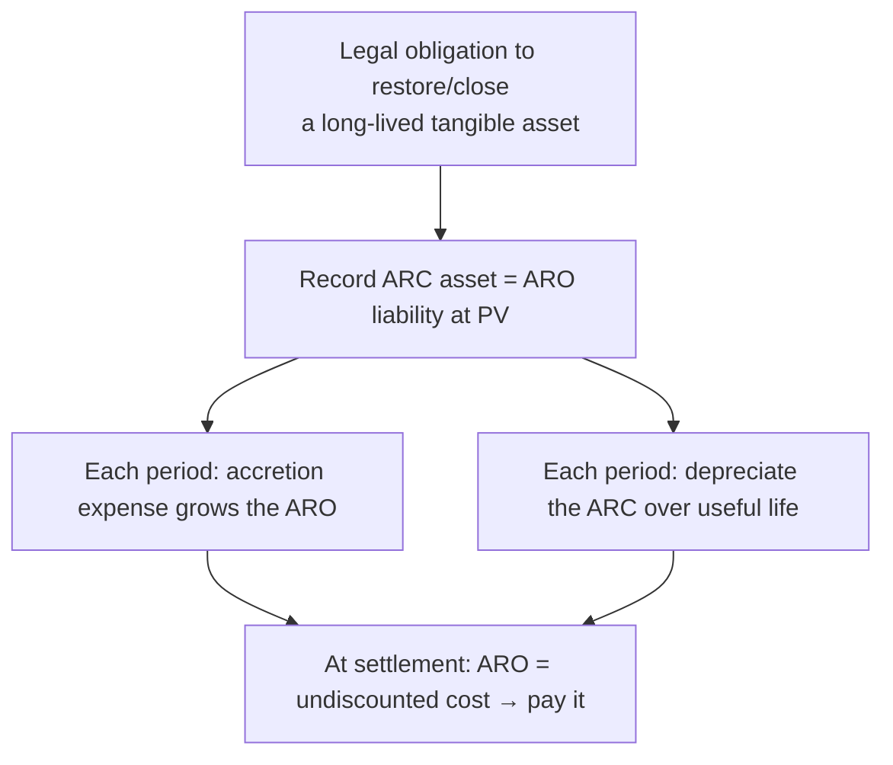

## 1. Payables and Accrued Liabilities — Part 1

Liability = probable future sacrifice of economic benefit. **Current** = due within one year **or the operating cycle, whichever is longer** (mostly operating liabilities); **noncurrent** = mostly interest-bearing **financing** liabilities (note, bond, mortgage, debenture — "debt" = interest-bearing = financing).

### Trade accounts payable — gross vs. net method (terms 2/10, net 45 on $5,000)

| | Gross method | Net method |
|---|---|---|
| Record purchase at | Full 5,000 | 4,900 (assume discount taken) |
| Pay within 10 days | DR AP 5,000; CR Cash 4,900; CR Purchase discounts 100 | DR AP 4,900; CR Cash 4,900 |
| Pay late | DR AP 5,000; CR Cash 5,000 | DR AP 4,900; DR **Purchase discount lost** 100; CR Cash 5,000 |

(Credit "purchase discounts" reduces Purchases under periodic; under perpetual it credits Inventory directly.)

### Notes payable and accrued interest

Interest is recorded **as incurred**, never when the coupon is paid. Work month by month.

**Q — On March 1, Year 1, $50,000 is borrowed on a 12-month, 5% note with interest paid quarterly. Record the December 31 interest accrual and the entry at maturity (Feb 28, Yr 2) for the final coupon plus principal.**

Work: monthly interest = 50,000 × 5% × 1/12 = $208.33; quarterly coupon = $625.

```journal
{"desc": "December 31 — accrue one month (December) of interest",
 "dr": [["Interest expense", 208]],
 "cr": [["Interest payable", 208]]}
```

```journal
{"desc": "Maturity (Feb 28, Yr 2) — final coupon and principal",
 "dr": [["Interest expense (Jan–Feb)", 417], ["Interest payable (Dec accrual)", 208], ["Notes payable", 50000]],
 "cr": [["Cash (625 interest + 50,000 principal)", 50625]]}
```

### Current portion of long-term debt — refinancing exception

Short-term obligations expected to be refinanced may be **excluded from current liabilities** if the company has both the **intent and the ability** to refinance, evidenced by either:

1. **Actual refinancing** completed before the financial statements are issued, or
2. A **noncancelable** financing agreement with a lender clearly able to fund it.

Reclassifying (DR short-term obligation / CR long-term debt) lowers current liabilities → **current ratio improves** → lower apparent short-term risk.

### Salaries/wages, and accrued liabilities generally

Accrue expense in the period **worked**.

**Q — An employee earns $1,250 for a 5-day week ($250/day) that straddles year-end, with 3 days falling in Year 1. Record the Year-1 accrual and the Year-2 payment of the full week.**

```journal
{"desc": "Year 1 — accrue 3 days worked",
 "dr": [["Salaries and wages expense", 750]],
 "cr": [["Salaries and wages payable", 750]]}
```

```journal
{"desc": "Year 2 — pay the full week",
 "dr": [["Salaries and wages payable", 750], ["Salaries and wages expense (2 days)", 500]],
 "cr": [["Cash", 1250]]}
```

Any accrued liability rolls forward: beginning + expense − cash paid = ending (T-account solves the missing piece).

### Taxes payable — expense or agency?

| Tax | Company expense? | Treatment |
|---|---|---|
| Property tax | **Yes** | Accrue in period incurred — **or** (acceptable alternative) expense when the tax invoice is received |
| Sales tax | **No** | Collected from customers as agent: DR Cash / CR Sales tax payable — never accrued, never expense |

**Q — Record a $10,000 sale on which 7% sales tax is collected from the customer (sales tax is an agency liability, never revenue or expense).**

```journal
{"desc": "Sale with sales tax collected",
 "dr": [["Cash", 10700]],
 "cr": [["Sales revenue", 10000], ["Sales taxes payable", 700]]}
```

## 2. Payables and Accrued Liabilities — Part 2

### Payroll: employer expense vs. employee withholding

- **Withheld from employees** (their share of FICA 7.65%, income tax withholding) = **not** an employer expense — like sales tax, held and remitted.
- **Employer's own payroll taxes** (employer's matching 7.65% FICA + unemployment tax) = **payroll tax expense** in a second entry.

**Q — Hodge Corp. has a weekly payroll of $25,000; employee FICA is 7.65%, income tax withheld is $3,000, and unemployment tax is 2%. Record (1) salaries with employee withholdings and net pay, and (2) the employer's own payroll tax expense (employer FICA match + unemployment).**

```journal
{"desc": "Entry 1 — salaries and withholdings",
 "dr": [["Salaries and wages expense", 25000]],
 "cr": [["FICA taxes payable — employee share (25,000 × 7.65%)", 1913], ["Income taxes withheld payable", 3000], ["Cash — net pay to employees", 20087]]}
```

```journal
{"desc": "Entry 2 — employer payroll tax expense",
 "dr": [["Payroll tax expense", 2413]],
 "cr": [["FICA taxes payable — employer share", 1913], ["Unemployment taxes payable (25,000 × 2%)", 500]]}
```

### Bonus formulas (simultaneous equations)

**Q — Bonus = 10% of net income after tax but before the bonus; tax = 40% of (income − bonus); income before bonus and tax = 100,000. Solve for the bonus using simultaneous equations.**

```schedule
{"caption": "Solve B and T simultaneously (PEMDAS)",
 "columns": ["Step", "Equation / computation"],
 "rows": [
   ["Define bonus", "B = 10% × (100,000 − T)"],
   ["Define tax", "T = 40% × (100,000 − B)"],
   ["Substitute", "B = 10% × [100,000 − 40,000 + 0.40B] = 6,000 + 0.04B"],
   ["Collect terms", "0.96B = 6,000"],
   ["Solve", "B = 6,250"]
 ]}
```

> [!EXAM]
> Write the two definitions first, substitute, then solve. Variants: bonus **after** bonus but before tax, or after both — the setup changes, the technique doesn't.

### Accrued vacation — the SOCR test

Accrue compensated absences only when **all four** conditions hold:

- **S**ervices already rendered;
- **O**bligation **vests or accumulates** (carryover — use it or keep it);
- **C**ompensation is **probable**;
- **R**easonably estimable.

Meet only the first three → **footnote disclosure only**, no accrual.

> [!TRAP]
> **Sick pay is the exception.** If sick pay **vests** (paid out even if unused), accrue it. If it is **non-vesting** (paid only when the employee is actually sick), accrual is **not required** even if it accumulates — payment is contingent on a future absence.

**Q — Taney's employees earn 8 weeks of vacation and take 4; carryover is paid at the salary rate in effect when taken. The Year-1 rate is $300/week; in Year 2 the rate rises to $400/week and the 4 carried-over weeks are taken. Record the Year-2 entry when the vacation is used.**

Work: Year-1 accrual = 4 × $300 = $1,200; Year-2 cash paid = 4 × $400 = $1,600; the $400 difference (4 weeks × $100 rate increase) hits Year-2 expense.

```journal
{"desc": "Year 2 — vacation taken at the higher current rate",
 "dr": [["Salaries and wages payable (Yr-1 accrual)", 1200], ["Salaries and wages expense (rate increase 100 × 4)", 400]],
 "cr": [["Cash (400 × 4 weeks)", 1600]]}
```

## 3. Exit or Disposal Activities

Costs of closing a location, downsizing, or relocating — recognize a **liability at fair value (present value of the future costs)** when there is an **obligating event**: notice/announcement made, amounts reasonably estimable, and **little or no discretion to avoid** the obligation.

Costs included: **involuntary termination benefits (severance)**, **contract termination costs other than leases**, and **costs to relocate employees or move PP&E**.

- Loss placement: **continuing operations, nonoperating** — unless the activity is part of a **discontinued operation** (major strategic shift), then it's reported in discontinued operations, net of tax.
- **Future operating losses are NOT accrued** — recognize them only as incurred (exception to the conservatism instinct).
- Changes in the estimated liability → **prospective**.
- Payments due **within one year need no discounting**.

**Q — At an exit announcement, 100 employees will each receive $5,000 severance payable in six months. Record the liability at the obligating event (due within a year → no discounting).**

```journal
{"desc": "Obligating event — termination notice given",
 "dr": [["Loss on exit or disposal activity", 500000]],
 "cr": [["Exit/disposal liability", 500000]]}
```

**Disclosures** (from the initiating period until completion): description of the activity; for each major cost type — total expected, amount this period, cumulative to date, and the income-statement line where presented; reconciliation of beginning to ending liability; and if no liability was accrued, **why** it couldn't be estimated.

## 4. Asset Retirement Obligations (AROs)

A **legal obligation** to spend money in the future to close/clean up a **tangible long-lived asset** the company acquired, built, developed, or operates — nuclear decommissioning, oil & gas well capping, mine reclamation. Recognize when there is a **duty (law or contract) + an obligating event**; doubt about enforcement only reduces the measured amount — it never defers recognition.

**Initial measurement** — capitalize both sides at the **present value** of the future cleanup costs:

```journal
{"desc": "Initial recognition at discounted cash flow",
 "dr": [["Asset retirement cost (capitalized into the asset)", "PV"]],
 "cr": [["Asset retirement obligation (liability)", "PV"]]}
```

Then each period, two noncash expenses:

| Expense | Computation | Entry |
|---|---|---|
| **Accretion expense** (interest-like growth of the liability) | Beginning ARO carrying value × accretion rate | DR Accretion expense / CR ARO |
| **Depreciation** of the asset retirement cost | ARC ÷ useful life | DR Depreciation expense / CR Accumulated depreciation |

Over the asset's life, **cumulative accretion + cumulative depreciation = the total undiscounted future payment**; the ARO accretes up to the amount actually paid at settlement.

**Q — A company must dismantle a structure in 10 years at an estimated cost of $100,000; the credit-adjusted risk-free rate is 8% (PV of $1, 10 yrs, 8% = 0.4632). Record the initial recognition and Year-1 accretion and depreciation.**

Initial ARO = 100,000 × 0.4632 = **46,320** (the asset retirement cost is capitalized at the same amount):

```journal
{"desc": "Recognize ARO and capitalize asset retirement cost at PV",
 "dr": [["Asset retirement cost (ARC)", 46320]],
 "cr": [["Asset retirement obligation", 46320]]}
```

```journal
{"desc": "Year-1 accretion = 46,320 × 8%",
 "dr": [["Accretion expense", 3706]],
 "cr": [["Asset retirement obligation", 3706]]}
```

```journal
{"desc": "Year-1 depreciation of the ARC = 46,320 ÷ 10",
 "dr": [["Depreciation expense", 4632]],
 "cr": [["Accumulated depreciation", 4632]]}
```

By the end of Year 10 the ARO will have accreted to the full **$100,000** paid at settlement.

**Revisions of estimate (prospective):** cost increase → discount the **additional** flows at the **current** rate; cost decrease → remove flows at the **original (historical)** rate.



```recap
1. Current liabilities: due within one year or the operating cycle if longer; interest accrues by month regardless of coupon dates.
2. AP discounts: gross records discounts when taken; net records **purchase discount lost** when missed.
3. Short-term debt is excluded from current liabilities only with **intent + ability** to refinance (actual refinancing pre-issuance, or a noncancelable agreement).
4. Sales taxes and employee withholdings are **never company expense** — agency liabilities. Property tax: accrue, or expense on receipt of the invoice. Employer expense = gross salaries + employer FICA + unemployment.
5. Bonus-and-tax problems: write both equations, substitute, solve.
6. Vacation accrues only under **SOCR** (services rendered, vests/accumulates, probable, estimable); pay-rate increases hit expense in the year taken.
7. Exit/disposal: accrue at PV on the obligating event (no discounting if due within a year); **never accrue future operating losses**.
8. ARO: capitalize ARC = ARO at PV; accretion expense on the liability, depreciation on the asset; upward revisions use the current rate, downward the historical rate.
```
