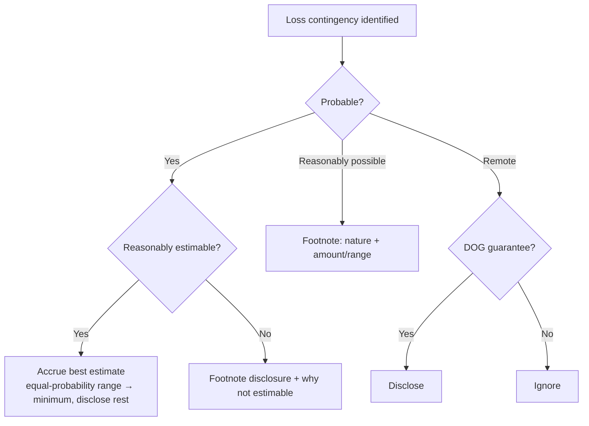

## 1. Contingencies

A contingency = an existing condition or circumstance involving **uncertainty**, resolved by a future event — possible gain (asset acquired, liability reduced) or loss (asset impaired, liability incurred).

### Gain contingencies

**Never accrued** (conservatism) — no journal entry. Disclose in the notes **unless remote** (then ignore), and word disclosure carefully to avoid misleading about realization. Examples: plaintiff expecting a favorable judgment, expected tax refund, **potential insurance recovery**.

### Loss contingencies — the likelihood grid

| Likelihood | Estimable? | Treatment |
|---|---|---|
| **Probable** (likely) | Yes | **Accrue** — DR loss / CR liability (the *only* accrual case) |
| **Probable** | No | Disclose in notes (and explain why not estimable) |
| **Reasonably possible** (more than remote, less than likely) | — | **Disclose**: nature + estimate or range (or why none) |
| **Remote** | — | **Ignore** — unless a **DOG guarantee** → disclose |

> [!MNEMONIC]
> **DOG** — remote losses that must still be disclosed because they are guarantee-type: **D**ebts of others guaranteed (officers, related parties), **O**bligations of commercial banks under standby letters of credit, **G**uarantees to repurchase receivables or other property sold/assigned.

**Range of loss:** accrue the **best estimate** (the amount with the highest probability). If **no amount is more likely than any other**, accrue the **minimum** of the range and disclose the potential additional exposure.



**Alton example** — wrongful-death suit claims $3M; counsel expects a **$2.2M** loss (probable); insurance covers $1.5M:

```journal
{"desc": "Accrue lawsuit at counsel's best estimate",
 "dr": [["Loss from lawsuit", 2200000]],
 "cr": [["Lawsuit liability", 2200000]]}
```

Disclose the possible additional $800,000 (range up to $3M). The insurance recovery is a **gain contingency** — do **not** net it against the loss; disclose only, and record it when the check arrives.

**Other rules:**

- **Unasserted claims:** if assertion is probable and loss probable/estimable → treat like any loss contingency (accrue).
- **General/unspecified business risks** (fire, flood, war): no accrual **and no disclosure required**.
- **Appropriation of retained earnings** may signal funds set aside (shown within equity, clearly labeled; restore when the purpose is satisfied), but it is **never a substitute for accruing a loss**, and losses are never charged against the appropriation.

## 2. Premiums and Warranties

Special loss contingencies accrued as **expense** under the matching principle — booked in the **period of sale**, not when coupons are redeemed or cars are repaired. Required when probable + reasonably estimable (if not estimable — explain in a footnote).

### Premiums (coupons)

AAA Co.: 1 coupon per can; 5 coupons + redemption = premium costing the company $2; 1,500,000 cans sold; 70% expected redemption; 600,000 coupons redeemed by year-end:

```schedule
{"caption": "Premium accrual at year-end",
 "columns": ["Step", "Computation", "Result"],
 "rows": [
   ["Coupons issued", "1,500,000 cans × 1", "1,500,000"],
   ["Expected redemptions", "× 70%", "1,050,000"],
   ["Less redeemed to date", "", "(600,000)"],
   ["Coupons still outstanding", "", "450,000"],
   ["Premiums outstanding", "÷ 5 coupons per premium", "90,000"],
   ["Liability to accrue", "× $2 cost per premium", "180,000"]
 ]}
```

```journal
{"desc": "Year-end premium accrual",
 "dr": [["Premium expense", 180000]],
 "cr": [["Premium liability", 180000]]}
```

> [!TRAP]
> Divide outstanding **coupons** by the coupons-per-premium ratio before applying the unit cost. A higher assumed redemption % is the more **conservative** estimate.

### Warranties

Accrue the **full expected warranty cost as a % of each year's sales** in the year of sale. Actual repair costs reduce the liability (credit cash — or credit **inventory** when defective units are replaced instead of repaired).

ABC Co. — 3-year warranty; expected cost 2% + 4% + 6% = **12% of sales**; defective machines are replaced from inventory:

```schedule
{"caption": "Warranty liability roll-forward (replacement warranty)",
 "columns": ["Year", "Sales", "Expense accrued (12%)", "Actual cost (credit inventory)", "Ending liability"],
 "rows": [
   ["1", "250,000", "30,000", "(10,000)", "20,000"],
   ["2", "500,000", "60,000", "(20,000)", "60,000"],
   ["3", "750,000", "90,000", "(30,000)", "120,000"]
 ],
 "totals": ["Cumulative", "1,500,000", "180,000", "(60,000)", "120,000"]}
```

```journal
{"desc": "Year of sale — accrue full expected cost",
 "dr": [["Warranty expense (sales × 12%)", 30000]],
 "cr": [["Warranty liability", 30000]]}
```

```journal
{"desc": "Honoring the warranty by replacement",
 "dr": [["Warranty liability", 10000]],
 "cr": [["Inventory", 10000]]}
```

Changing the estimated percentage is a **change in estimate → prospective**; never restate prior years.

> [!EXAM]
> The expense each year is the **full 12% of that year's sales** — not the portion expected to be claimed that year, and not the amount actually repaired. The T-account (beginning + accrual − actual = ending) answers every roll-forward variant.

```recap
1. Gain contingencies: never accrued; disclosed unless remote. Insurance recoveries are gain contingencies — never net them against the accrued loss.
2. Loss contingencies: accrue only when **probable + estimable**; reasonably possible → disclose; remote → ignore unless a **DOG** guarantee (debt of others, bank letters of credit, repurchase guarantees).
3. Equal-probability range → accrue the **minimum**, disclose the rest; best estimate wins when one exists.
4. General business risks: no accrual, no disclosure. Appropriated retained earnings never substitute for a loss accrual.
5. Premiums: coupons issued × redemption % − redeemed, ÷ coupons-per-premium, × unit cost = liability.
6. Warranties: expense the full expected percentage of sales in the year of sale; actual costs debit the liability (credit cash or inventory); estimate changes are prospective.
```
