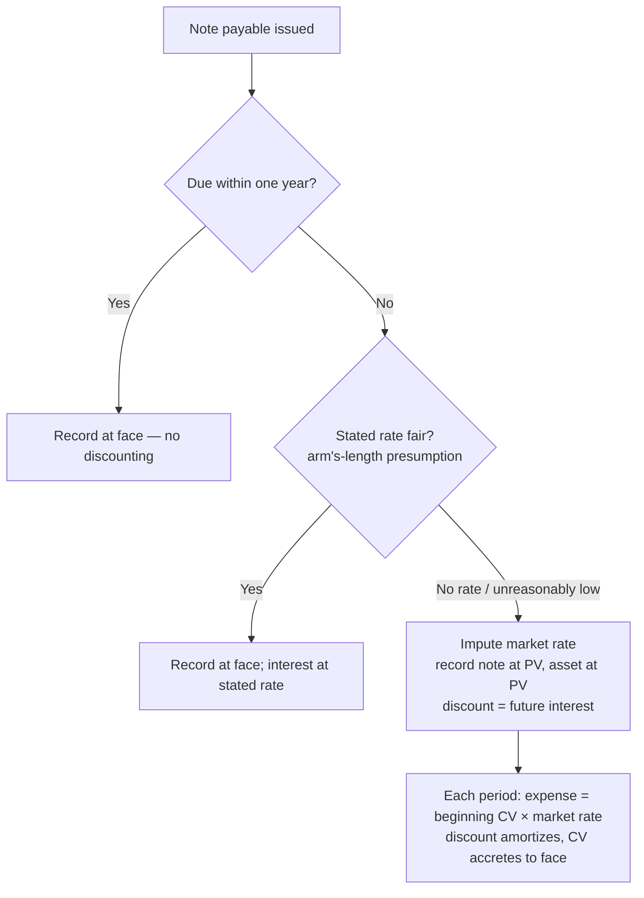

## 1. Time Value of Money — Concepts

Most exam questions discount a **liability** back to present value: leases (PV of lease payments), pensions (PV of the projected benefit obligation), and above all **bonds** — PV of the principal (single sum) **plus** PV of the coupons (ordinary annuity). Future-value problems are savings/investment fact patterns.

Six building blocks:

| Concept | Use case |
|---|---|
| PV of $1 | Bond principal; guaranteed salvage value; any single future amount |
| FV of $1 | One deposit today — value later |
| PV of ordinary annuity | Bond coupons; end-of-period lease/loan payments |
| FV of ordinary annuity | End-of-period savings deposits |
| PV of annuity due | **Beginning**-of-period payments (typical leases) |
| FV of annuity due | Beginning-of-period savings deposits |

**Annuity** = multiple **equal** payments — paying them creates a liability, receiving them an asset. **Ordinary annuity**: payments at the **end** of each period. **Annuity due**: first payment **today** ("beginning now," "immediately," "starting today").

> [!RULE]
> Rate and periods must match the payment frequency: quarterly payments → annual rate ÷ 4 and years × 4; monthly → ÷ 12 and × 12; semiannual → ÷ 2 and × 2.

## 2. Present and Future Value of $1 (single sums)

- `FV = PV × (1 + r)ⁿ` — future value factor = (1 + r)ⁿ
- `PV = FV ÷ (1 + r)ⁿ` — present value factor = 1 ÷ (1 + r)ⁿ

**PV example:** $500,000 offered at end of Year 4, 10% → PV factor = 1/1.10⁴ = 0.683 → PV = **341,500** — accept it over $300,000 today. Quarterly compounding version: $500,000 in 10 years at 12% compounded quarterly → 3% × 40 periods → 500,000 × 0.306557 = **153,278**.

**FV example:** invest 200,000 for 5 years at 10% → 200,000 × 1.61051 = **322,100** (enough to fund a $300,000 buyout).

> [!EXAM]
> PV and FV factors are **reciprocals**. Given only the "wrong" factor, invert it: 1 ÷ 0.620921 = 1.61051. Sanity-check direction — PV factor < 1, FV factor > 1.

## 3. Annuities

Multiply the payment by the **correct factor** — questions supply several factors (PV of 1, ordinary annuity, annuity due) as distractors; cross out what the timing rules out.

- **PV of ordinary annuity:** 10 year-end payments of 100,000 at 10% → 100,000 × 6.1445 = **614,450**.
- **PV of annuity due:** 10 beginning-of-year payments of 100,000 at 10% → 100,000 × 6.759 = **675,900**.
- **FV of ordinary annuity:** save 5,000 at each year-end for 5 years at 10% → 5,000 × 6.1051 = **30,525**.

> [!RULE]
> Factor conversion when only ordinary-annuity factors are given: **PV factor of annuity due for n periods = PV factor of ordinary annuity for (n − 1) periods + 1.** E.g., annuity due, 3 periods, 6%: ordinary annuity 2 periods = 1.8334 → + 1 = **2.8334**. Check: ordinary 9 periods 10% = 5.759 → due 10 periods = 6.759.

## 4. Long-Term Liabilities

Probable future sacrifices **not payable within one year or the operating cycle (whichever is longer)** — mostly interest-bearing financing liabilities: long-term notes, bonds, lease obligations, purchase commitments, deferred compensation, pension obligations, short-term debt expected to be refinanced (intent + ability). **Deferred taxes are an operating liability** even when noncurrent (non-interest-bearing).

**Debt vs. equity:** debt has a **maturity date** and an obligation to repay; equity has neither. Classify as a **liability** when an instrument carries an unconditional obligation:

- **Mandatorily redeemable preferred stock** (obligation to redeem by transferring assets at a set date/event);
- Obligations to **repurchase equity shares** by transferring assets;
- Obligations to be settled by **issuing a variable number of shares**.

## 5. Notes Payable — Part 1 (principles)

Long-term notes are recorded at **present value at issuance**. If the note has **no stated rate or an unreasonably low rate**, **impute** the market rate and record substance over form (asset received is debited at the note's PV). In an **arm's-length** transaction, the stated rate is presumed fair.

- **Discount = face − present value** — a **contra-liability** representing unrecorded (unamortized) future interest. As it amortizes, carrying value rises toward face.
- Interest expense accrues over the life even with **no cash coupons** (zero-coupon logic): accrual basis, matching.
- **No imputation needed for:** notes due **within one year** (the big one); ordinary trade terms; amounts paid in property/services; security deposits; government-agency rates; parent–subsidiary/related-party arrangements per the list.
- Effective-interest mechanics: **interest expense = beginning carrying value × effective rate**; for installment notes, payment − interest = principal reduction.


- Presentation: face − unamortized discount = carrying value; describe terms, effective rate, and face in the statements/notes.

## 6. Notes Payable — Part 2 (worked schedules)

### Installment note, rate imputed

**Q — A note for machinery requires three year-end payments of $1,000, has no stated interest rate, and the market rate is 10%. Record the note at present value and build the effective-interest amortization schedule.**

Work: PV = 1,000 × 2.486 (PV of ordinary annuity, 3 yr, 10%) = 2,486; face = 3,000; discount = 514.

```journal
{"desc": "Issue note for machinery at present value",
 "dr": [["Machinery (PV)", 2486], ["Discount on notes payable", 514]],
 "cr": [["Notes payable (gross)", 3000]]}
```

```schedule
{"caption": "Effective-interest amortization — installment note, 10%",
 "columns": ["Year", "Beginning carrying value", "Payment", "Interest (10% × BCV)", "Principal reduction", "Ending carrying value"],
 "rows": [
   ["1", "2,486", "1,000", "249", "751", "1,735"],
   ["2", "1,735", "1,000", "174", "826", "909"],
   ["3", "909", "1,000", "91", "909", "0"]
 ],
 "totals": ["", "", "3,000", "514", "2,486", ""]}
```

```journal
{"desc": "First payment",
 "dr": [["Interest expense", 249], ["Notes payable", 751]],
 "cr": [["Cash", 1000]]}
```

### Non-interest-bearing note, single payment

**Q — A $10,000 machine is bought with a 5-year, single-payment zero-interest note; the market rate is 10%. Record the purchase at present value and the Year-1 interest (discount amortization with no cash paid).**

Work: PV = 10,000 × 0.621 (PV of $1, 5 yr, 10%) = 6,210; discount = 10,000 − 6,210 = 3,790.

```journal
{"desc": "Purchase — record asset at PV, never at face",
 "dr": [["Machinery", 6210], ["Discount on notes payable", 3790]],
 "cr": [["Notes payable", 10000]]}
```

```journal
{"desc": "Year 1 interest — no cash paid, amortize the discount",
 "dr": [["Interest expense (6,210 × 10%)", 621]],
 "cr": [["Discount on notes payable", 621]]}
```

Carrying value climbs 6,210 → 6,831 → … → 10,000 at maturity, then the principal is paid.

> [!TRAP]
> Debiting the machine for $10,000 is the classic wrong answer — assets bought with long-term low/no-interest notes are recorded at the note's **present value**. The discount amortization records interest expense with **no cash outflow**.

## 7. Debt Covenants

Promises protecting the lender (who has no voting rights) by preserving the debtor's credit rating and thus the fair value of the loan.

| Type | Examples |
|---|---|
| **Affirmative** (must do) | Pay taxes, safeguard assets, maintain collateral, maintain working capital / current ratio, keep debt-to-equity ≤ threshold, keep **interest coverage (EBIT ÷ interest) ≥ threshold** |
| **Negative** (must not do) | Issue additional debt, pay excessive dividends, dispose of key assets |

**Violation → technical default:** the creditor *may* demand immediate repayment (risking real default and bankruptcy) but usually negotiates concessions instead — waivers (temporary or permanent), a higher interest rate, or revised payment terms (e.g., periodic paydowns instead of a balloon).

**Q — Bike Ride Inc. borrows $1,000,000 at 6.25% but must keep $100,000 on deposit (a compensating balance); a covenant requires interest coverage ≥ 5. Net income is 350,000, taxes 140,000, and interest 62,500. Record the loan proceeds and test covenant compliance.**

Work: usable cash = 1,000,000 − 100,000 restricted = 900,000; EBIT = 350,000 + 62,500 interest + 140,000 taxes = 552,500; interest coverage = 552,500 ÷ 62,500 = 8.84 ≥ 5 ✓ compliant.

```journal
{"desc": "Loan proceeds with compensating balance",
 "dr": [["Cash", 900000], ["Restricted cash", 100000]],
 "cr": [["Notes payable", 1000000]]}
```

```recap
1. Match rate and periods to payment frequency; annuity due = payments start **now**; PV and FV factors are reciprocals; annuity-due PV factor = ordinary factor for (n − 1) + 1.
2. Bonds decompose into PV of principal (single sum) + PV of coupons (ordinary annuity).
3. Long-term = beyond one year/operating cycle; mandatorily redeemable preferred and share-repurchase obligations are **liabilities**; deferred taxes are operating even when noncurrent.
4. Long-term notes record at PV; impute the market rate when the stated rate is absent or unreasonably low (skip for notes due within a year).
5. Effective interest: expense = beginning carrying value × rate; discount is a contra-liability of unrecorded interest; carrying value accretes to face; assets received are debited at PV, never at face.
6. Covenants: affirmative vs. negative; violation = technical default, usually resolved by concessions; interest coverage = EBIT ÷ interest expense.
```
