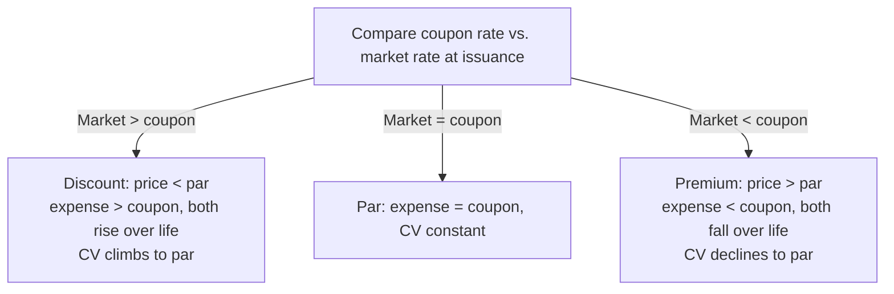

## 1. Introduction to Bonds Payable

A bond = long-term **financing liability** under an **indenture** (contract between the issuer/borrower and bondholders/lenders). Zero-sum: issuer's proceeds = holders' cost; issuer's interest expense = holders' interest income.

Core cash-flow classification (U.S. GAAP): issue proceeds = **financing inflow**; principal repayment = **financing outflow**; **coupon payments = operating outflow**.

- **Coupon paid** = face (par) value × stated (nominal/coupon) rate [÷ 2 if semiannual].
- **Interest expense** = beginning **carrying value × market rate at issuance** (yield to maturity). Coupon = expense **only when issued at par**.
- Zero-coupon bonds still accrue interest expense/income every period — accrual basis.

**Bond types (recognition level):**

| Type | Key fact |
|---|---|
| Debenture | **Unsecured** → higher risk, higher yield |
| Mortgage / collateral trust bonds | **Secured** (real estate / securities) → lower yield |
| Convertible | Holder may swap bond for stock → complex capital structure (diluted EPS) |
| Nondetachable warrants | Must surrender the bond to get stock |
| **Detachable** warrants | Keep the bond, buy stock at the strike price |
| Participating | Fixed coupon + share of income above thresholds |
| **Term** | Single fixed maturity (the default) |
| Serial | Prenumbered; redeemable by number (issuer refinances when rates fall) |
| Income | Interest only if income targets met (riskier for holder) |
| Zero-coupon (deep discount) | No coupons; all principal + interest at maturity |
| Commodity-backed (asset-linked) | Redeemable in cash or commodity, **whichever is greater** |

Bonds vs. notes: bonds are standardized and publicly traded; notes are customized, privately negotiated (payments can mix principal + interest, like mortgages).

## 2. Overview of Bond Terms — the price/rate seesaw

Think **coupon ÷ price = market rate**:

| Relationship | Sells at | The difference is | Amortization effect |
|---|---|---|---|
| Market rate = coupon rate | **Par** | — | Interest expense = coupon |
| Market rate > coupon rate | **Discount** (below par) | Deferred **loss** (unamortized discount, contra-liability) | Interest expense **>** coupon |
| Market rate < coupon rate | **Premium** (above par) | Deferred **gain** (unamortized premium, adjunct liability) | Interest expense **<** coupon |

- Bonds are $1,000 denominations, quoted as a **% of par**: "at 97" → 970 (discount 30, CV 970); "at 102" → 1,020 (premium 20, CV 1,020).
- Carrying value = face − unamortized discount, or face + unamortized premium. At maturity the carrying value **always equals face**, and face is what is repaid.
- Selling price = **PV of principal (PV of $1) + PV of coupons (PV of ordinary annuity)** — both discounted at the **market rate** (periods = years × 2, rate ÷ 2 for semiannual). The coupon rate's only job is sizing the coupon payment.

## 3. Bonds Issued at Par

Coupon rate = market rate → proceeds = face; no factors needed.

**Q — Price a $1,000,000 bond with a 10% coupon and a 10% market rate, 5-year semiannual (10 periods at 5%), by discounting principal and coupons — and confirm the issue price equals par.**

```schedule
{"caption": "Pricing proof — issued at par",
 "columns": ["Component", "Cash flow", "PV factor (5%, 10)", "Present value"],
 "rows": [
   ["Principal (PV of $1)", "1,000,000", "0.613913", "613,913"],
   ["Coupons (PV of ordinary annuity)", "50,000 / period", "7.721735", "386,087"]
 ],
 "totals": ["Issue price", "", "", "1,000,000"]}
```

Issuer: assets +1,000,000, liabilities +1,000,000 → debt/equity rises (more solvency risk). Bondholder: total assets unchanged (cash → investment), but **current ratio falls** — less liquid.

## 4. Bonds Issued at a Discount

**Q — Price the same $1,000,000, 10% coupon bond when the market rate is 12% (5-year semiannual → 6%, 10 periods) and record the issuance. Confirm it sells at a discount.**

```schedule
{"caption": "Pricing — 10% coupon vs. 12% market",
 "columns": ["Component", "Cash flow", "PV factor (6%, 10)", "Present value"],
 "rows": [
   ["Principal", "1,000,000", "0.558395", "558,395"],
   ["Coupons", "50,000", "7.360087", "368,004"]
 ],
 "totals": ["Issue price (< face ✓)", "", "", "926,399"]}
```

```journal
{"desc": "Issuer — bonds issued at a discount",
 "dr": [["Cash", 926399], ["Discount on bonds payable (contra-liability)", 73601]],
 "cr": [["Bonds payable (face)", 1000000]]}
```

Initial carrying value (926,399) **must equal cash proceeds**. As the discount amortizes, carrying value is **pulled up toward par**; interest expense **exceeds** the 50,000 coupon and **rises** each period (growing CV × constant market rate).

## 5. Bonds Issued at a Premium

**Q — Price the same $1,000,000, 10% coupon bond when the market rate is 8% (4%, 10 periods) and record the issuance. Confirm it sells at a premium.**

```schedule
{"caption": "Pricing — 10% coupon vs. 8% market",
 "columns": ["Component", "Cash flow", "PV factor (4%, 10)", "Present value"],
 "rows": [
   ["Principal", "1,000,000", "0.675564", "675,564"],
   ["Coupons", "50,000", "8.110896", "405,545"]
 ],
 "totals": ["Issue price (> face ✓)", "", "", "1,081,109"]}
```

```journal
{"desc": "Issuer — bonds issued at a premium (premium is NOT a contra account)",
 "dr": [["Cash", 1081109]],
 "cr": [["Bonds payable (face)", 1000000], ["Premium on bonds payable", 81109]]}
```

Carrying value is **pulled down toward par**; interest expense is **less than** the coupon and **falls** each period.

## 6. Bond Interest Rates — pulling it together

| Rate | Also called | Determines |
|---|---|---|
| Stated rate | Nominal / coupon rate | Cash coupon (operating outflow) |
| Market rate at issuance | Effective rate / yield to maturity | PV factors → issue price; **interest expense = beginning CV × this rate** (÷ 2 if semiannual) — fixed for the life of the bond |

The market rate reflects the bondholders' required return for the issuer's **credit rating** at issuance. Amortization each period = |interest expense − coupon paid|.



> [!TRAP]
> Interest expense always uses the market rate **at issuance**, never the current market rate — and never the coupon rate. Coupon payment never changes; interest expense changes every period unless issued at par.

## 7. Bond Issuance Costs

Legal, accounting, underwriting, and printing costs are **not expensed when paid** — they **reduce the carrying value** (recorded like additional discount) and are amortized into interest expense over the bond's life via the effective interest method.

**Q — Continuing the discount bond (priced at 926,399 on $1,000,000 face at a 12% market rate), $20,000 of issuance costs are incurred. Record the issuance net of issue costs, and identify the all-in effective rate used for interest expense.**

Work: net proceeds = 926,399 − 20,000 = 906,399; total discount = 73,601 + 20,000 = 93,601; all-in effective rate ≈ 12.58% → first-period interest expense = 906,399 × 12.58%/2 ≈ 57,012.

```journal
{"desc": "Issue bonds net of issuance costs",
 "dr": [["Cash", 906399], ["Discount on bonds payable (73,601 + 20,000)", 93601]],
 "cr": [["Bonds payable", 1000000]]}
```

Two rates now coexist:

- **12%** market rate — still prices the bond (PV factors unchanged);
- **12.58%** all-in effective rate — used for interest expense: 906,399 × 12.58%/2 ≈ **57,012** first period.

Issue costs create a discount on a par bond, deepen a discount, or shrink a premium.

**Prepaid issue costs:** if paid before issuance (Nov 1), DR **prepaid bond issuance costs** / CR Cash; on issuance (Dec 31), credit the **prepaid** account (not cash) — net proceeds and carrying value end up identical (906,399).

> [!EXAM]
> "How are bond proceeds recorded?" → **net of bond issuance costs**. The pricing rate and the expense rate differ once issue costs exist — read which one the question needs.

```recap
1. Coupon = face × stated rate; interest expense = beginning carrying value × market rate at issuance; equal only at par.
2. Market > coupon → discount (deferred loss, contra-liability); market < coupon → premium (deferred gain, adjunct liability). Quotes are % of par.
3. Price = PV of principal (PV of $1) + PV of coupons (ordinary annuity), both at the market rate, semiannual conventions (n × 2, r ÷ 2).
4. Initial carrying value always equals cash proceeds; CV migrates to face by maturity — discount CVs and expense rise; premium CVs and expense fall.
5. Coupons paid are operating outflows; issue proceeds and principal repayment are financing flows.
6. Issue costs reduce proceeds and carrying value, behave like extra discount, and raise the effective rate used for interest expense; prepaid costs are cleared against the issuance entry.
7. Debenture = unsecured; detachable warrants keep the bond alive; convertibles trigger diluted EPS.
```
