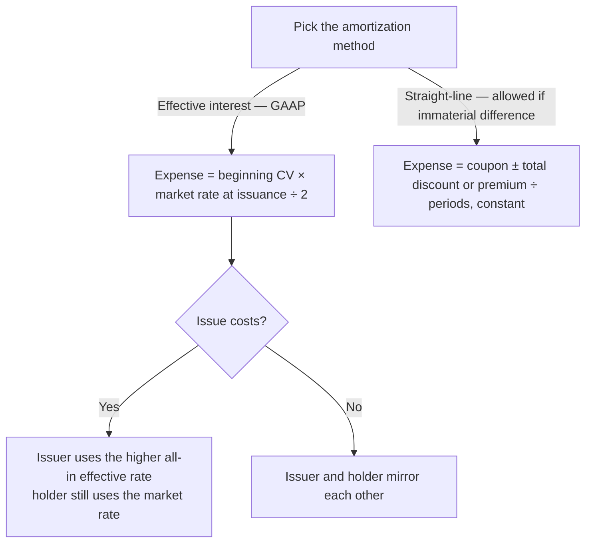

## 1. Straight-Line Discount Amortization

Amortization = recording the deferred loss (discount, issue costs) or gain (premium) over the **period the bonds are outstanding** — from the **date of sale** to maturity (a bond dated Jan 1 but sold Nov 1 amortizes over 50 months, not 60).

Two methods:

| | Straight-line | Effective interest |
|---|---|---|
| Character | **Constant dollar** — coupon *and* interest expense are constant | **Constant rate** — market rate at issuance × changing carrying value |
| GAAP? | Not GAAP, but **allowed if not materially different** | **Required by GAAP** |
| Interest expense | Coupon paid ± (discount or premium ÷ periods) | Beginning CV × market rate |

**Q — Kristi Corp.'s $1,000,000, 10% coupon bond (12% market) sold for 926,399 — a discount of 73,601 over 10 semiannual periods. Using straight-line amortization, record the semiannual interest entry.**

Work: SL discount amortization = 73,601 ÷ 10 = 7,360 per period; interest expense = 50,000 coupon + 7,360 = 57,360 each period.

```journal
{"desc": "Every six months for 5 years — straight-line discount",
 "dr": [["Bond interest expense", 57360]],
 "cr": [["Cash (coupon)", 50000], ["Discount on bonds payable", 7360]]}
```

Carrying value climbs 7,360 each period from 926,399 to 1,000,000 at maturity. Bondholder mirror image: receives 50,000 cash but records interest **revenue** 57,360 and debits the investment 7,360 — the investment is pulled up to face.

## 2. Straight-Line Premium Amortization

**Q — The same bond issued at an 8% market rate sold for 1,081,109 — a premium of 81,109 over 10 periods. Using straight-line amortization, record the semiannual interest entry.**

Work: SL premium amortization = 81,109 ÷ 10 = 8,111 per period; interest expense = 50,000 coupon − 8,111 = 41,889 each period.

```journal
{"desc": "Every six months — straight-line premium",
 "dr": [["Bond interest expense", 41889], ["Premium on bonds payable", 8111]],
 "cr": [["Cash (coupon)", 50000]]}
```

Carrying value declines 8,111 per period toward par. Bondholder: DR Cash 50,000; CR Interest revenue 41,889; CR Investment in bonds 8,111.

## 3. Effective Interest — Premium

Interest expense = **beginning carrying value × market rate at issuance ÷ 2**; amortization = coupon − expense; expense **falls** as the carrying value is pulled down.

**Q — The premium bond opens at a carrying value of 1,081,109 (8% market, 4% per period). Build the effective-interest premium amortization schedule and record the first interest payment.**

```schedule
{"caption": "Premium amortization, effective interest (8% market, 4% per period)",
 "columns": ["Period", "Beginning CV", "Interest expense (4%)", "Coupon", "Premium amortized", "Ending CV"],
 "rows": [
   ["1 (6/30 Yr 1)", "1,081,109", "43,244", "50,000", "6,756", "1,074,353"],
   ["2 (12/31 Yr 1)", "1,074,353", "42,974", "50,000", "7,026", "1,067,327"],
   ["…", "…", "falling", "50,000", "growing", "→ 1,000,000 at maturity"]
 ]}
```

Year-1 check: total expense 86,218 vs. coupons 100,000 → premium amortized **13,782**; ending unamortized premium = 81,109 − 13,782 = 67,327.

```journal
{"desc": "First interest payment — issuer",
 "dr": [["Bond interest expense", 43244], ["Premium on bonds payable", 6756]],
 "cr": [["Cash", 50000]]}
```

## 4. Effective Interest — Discount

Same mechanics; expense **exceeds** the coupon and **rises** as carrying value climbs.

**Q — The discount bond opens at a carrying value of 926,399 (12% market, 6% per period). Build the effective-interest discount amortization schedule.**

```schedule
{"caption": "Discount amortization, effective interest (12% market, 6% per period)",
 "columns": ["Period", "Beginning CV", "Interest expense (6%)", "Coupon", "Discount amortized", "Ending CV"],
 "rows": [
   ["1 (6/30 Yr 1)", "926,399", "55,584", "50,000", "5,584", "931,983"],
   ["2 (12/31 Yr 1)", "931,983", "55,919", "50,000", "5,919", "937,902"],
   ["…", "…", "rising", "50,000", "growing", "→ 1,000,000 at maturity"]
 ]}
```

Year-1 check: expense 111,503 vs. coupons 100,000 → discount amortized **11,503**; unamortized discount = 73,601 − 11,503 = 62,098; CV 937,902 for **both** issuer (liability) and holder (investment) — a zero-sum mirror when both use the effective method.

> [!EXAM]
> Direction sanity checks: discount → expense > coupon and rising; premium → expense < coupon and falling. Amortization always = |expense − coupon|; carrying value always converges to face. The difference between total expense and total coupons for a year equals the year's amortization — use it to back into missing cells.

## 5. Effective Interest With Bond Issuance Costs

**Q — The discount bond (priced 926,399) is issued with $20,000 of issue costs. Build the effective-interest schedule using the all-in effective rate, and note why the bondholder's records no longer mirror the issuer's.**

Work: net proceeds and initial CV = 926,399 − 20,000 = 906,399; total discount = 93,601; all-in effective rate = 12.58% (6.29% per period), while the 12% market rate still prices the bond.

```schedule
{"caption": "Discount + issue costs, effective interest at 6.29%",
 "columns": ["Period", "Beginning CV", "Interest expense (6.29%)", "Coupon", "Amortization", "Ending CV"],
 "rows": [
   ["1", "906,399", "57,012", "50,000", "7,012", "913,411"],
   ["2", "913,411", "57,454", "50,000", "7,454", "920,865"]
 ]}
```

> [!TRAP]
> With issue costs the **zero-sum symmetry breaks**: the bondholder's records ignore the issuer's issue costs. Holder records the investment at **926,399** and interest revenue at the **12%** market rate (55,584; then 55,919) — no longer equal to the issuer's 57,012 expense.

## 6. Bonds Issued Between Interest Dates

When bonds sell **after their dated date**, the buyer pays the price **plus accrued interest** since the last interest date; the issuer then pays the **full** coupon at the next date — netting the holder exactly the interest earned for the months held.

`Accrued interest = face × coupon rate × months elapsed ÷ 12`

**Q — Perlin Corp.'s 10% bonds are dated Jan 1 but issued April 1 at 926,399 (effective rate 12.08%), with coupons on 6/30 and 12/31. Record the April 1 issuance (price plus 3 months accrued interest) and the June 30 coupon (expense only for the months actually outstanding).**

```journal
{"desc": "April 1 — issuance: price + 3 months accrued interest (25,000)",
 "dr": [["Cash (926,399 + 25,000)", 951399], ["Discount on bonds payable", 73601]],
 "cr": [["Bonds payable", 1000000], ["Bond interest payable", 25000]]}
```

```journal
{"desc": "June 30 — full coupon; expense only for Apr–Jun (926,399 × 12.08% × 3/12)",
 "dr": [["Bond interest payable", 25000], ["Bond interest expense", 27977]],
 "cr": [["Cash (full 6-month coupon)", 50000], ["Discount on bonds payable", 2977]]}
```

The cash covers six months; the payable relieves the first three; the expense covers the three months actually outstanding; the plug amortizes the discount.

## 7. Year-End Interest Accrual and Disclosures

Interest expense belongs to the period **incurred**, regardless of coupon dates.

**Q — Kristi's discount bond has a carrying value of 931,983 after the July coupon, with coupons falling July 1 / January 1. Record the December 31 adjusting entry and the January 1 payment.**

```journal
{"desc": "12/31 adjusting entry — coupon not due until Jan 1",
 "dr": [["Bond interest expense (931,983 × 6%)", 55919]],
 "cr": [["Bond interest payable", 50000], ["Discount on bonds payable", 5919]]}
```

```journal
{"desc": "January 1 — pay the coupon",
 "dr": [["Bond interest payable", 50000]],
 "cr": [["Cash", 50000]]}
```

**Disclosures:** one balance-sheet total is fine, but the notes detail each issue — maturity, interest rate, call/conversion features, pledged assets/security, and restrictive covenants.



```recap
1. Amortize from the **sale date** to maturity; straight-line = constant dollar (allowed if not materially different); effective interest = constant **rate** (GAAP).
2. Effective interest: expense = beginning CV × market rate at issuance; amortization = |expense − coupon|; CV always converges to face — discount expense rises, premium expense falls.
3. Bondholder accounting mirrors the issuer — until issue costs exist: then the issuer's CV and rate (all-in effective) differ from the holder's (price paid, market rate).
4. Issue costs deepen the discount, cut net proceeds, and raise the issuer's effective rate.
5. Sold between interest dates: buyer pays price + accrued coupon; issuer pays a full coupon next date; expense accrues only for the months outstanding at the all-in rate.
6. Year-end accrual books expense, interest payable (coupon portion), and amortization even when the coupon is paid next period.
7. Note disclosures per issue: maturity, rate, call/convertible features, security, covenants.
```
