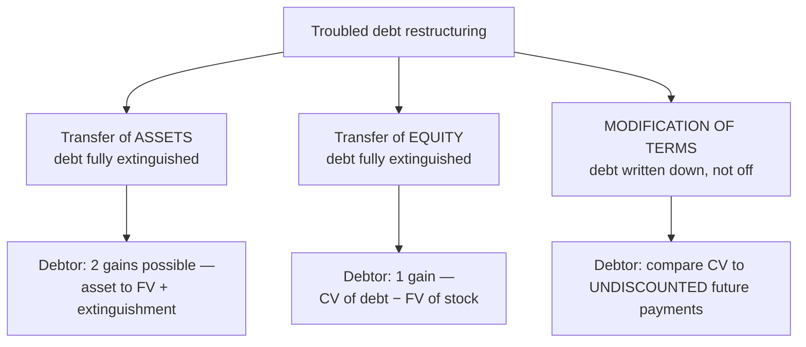

## 1. Troubled Debt Restructuring — Concepts

In a TDR the **creditor grants concessions** to a debtor in financial difficulty because collecting something beats forcing bankruptcy. Concessions: lower interest rate, extended maturity, reduced face, or forgiven accrued interest. Three forms:



### Transfer of assets (debtor)

Two-step gain: ① mark the asset from book to **fair value** (gain or loss on disposal); ② gain on extinguishment = carrying value of debt − FV of asset. Shortcut: **total gain = CV of debt − book value of asset**.

Mini-example: debt CV 100; asset cost 95, accumulated depreciation 30 (NBV 65), FV 88 → gain on asset 23 + gain on extinguishment 12 = **total 35**.

### Transfer of equity (debtor)

One gain: CV of debt − FV of the stock issued; stock recorded at par + APIC as usual.

### Modification of terms (debtor)

Debt is **not extinguished**; account **prospectively**. Compare CV (principal + accrued interest) with the **total UNDISCOUNTED future payments** under the new terms:

- Future payments **< CV** → write the liability down to that total, recognize a **gain**, and **record no interest expense ever again** — every future payment just reduces the liability.
- Future payments **≥ CV** → **no adjustment, no loss** (keep accruing interest at a recomputed effective rate).

> [!RULE]
> Debtor uses **undiscounted** totals; the **creditor** must **discount**. That asymmetry is the most-tested point in TDR.

### Creditor's side

Impairment is estimated **when incurred** (CECL): DR credit loss (bad debt) expense / CR allowance. On settlement by assets or equity: DR asset/investment at **fair value**, DR allowance, CR receivable (+ interest receivable) in full. On modification of terms: impairment = CV of receivable − **present value of the new future cash flows discounted at the effective rate**.

## 2. TDR — Worked Examples (Hull owes Apex 500,000 + 60,000 accrued = CV 560,000)

### (a) Settled with land (FV 450,000; carrying value 360,000)

```journal
{"desc": "Debtor — transfer land in full settlement",
 "dr": [["Notes payable", 500000], ["Interest payable", 60000]],
 "cr": [["Land (carrying value)", 360000], ["Gain on disposal of land (450 − 360)", 90000], ["Gain on restructuring (560 − 450)", 110000]]}
```

```journal
{"desc": "Creditor — receive land, write off receivables",
 "dr": [["Land (fair value)", 450000], ["Allowance for credit losses", 110000]],
 "cr": [["Note receivable", 500000], ["Interest receivable", 60000]]}
```

### (b) Settled with stock (100,000 shares, FV $4.50, par $2)

```journal
{"desc": "Debtor — transfer equity in full settlement",
 "dr": [["Notes payable", 500000], ["Interest payable", 60000]],
 "cr": [["Common stock (100,000 × $2)", 200000], ["Additional paid-in capital", 250000], ["Gain on restructuring", 110000]]}
```

### (c) Modification of terms — interest forgiven; rate cut 12% → 3%; maturity extended 2 years

Debtor (undiscounted): new payments = 500,000 principal + 15,000 + 15,000 interest = **530,000** < 560,000 CV → gain 30,000:

```journal
{"desc": "Debtor — modification of terms",
 "dr": [["Notes payable (old)", 500000], ["Interest payable", 60000]],
 "cr": [["Notes payable (new, at undiscounted total)", 530000], ["Gain on restructuring", 30000]]}
```

All future payments now debit the liability directly — **no further interest expense**.

Creditor (discounted at 3.5% effective):

```schedule
{"caption": "Creditor's impairment — PV of modified cash flows",
 "columns": ["Component", "Cash flow", "PV factor (3.5%)", "Present value"],
 "rows": [
   ["Principal in 2 years", "500,000", "0.9335", "466,755"],
   ["Two coupons (500,000 × 3%)", "15,000", "1.8997 (ordinary annuity, 2)", "28,500"]
 ],
 "totals": ["PV of new terms", "", "", "495,255"]}
```

```journal
{"desc": "Creditor — impairment (560,000 − 495,255)",
 "dr": [["Credit loss expense", 64745]],
 "cr": [["Allowance for credit losses", 64745]]}
```

All restructuring gains are aggregated in net income — **nonoperating**, within continuing operations.

## 3. Extinguishment of Debt

A liability is **derecognized only when extinguished**: paid off (at or before maturity) or the debtor is **legally released** (TDR asset/equity transfer). **In-substance defeasance** — placing securities in trust to cover the debt — does **NOT** extinguish it; the liability stays on the books.

Vocabulary: **callable** = issuer may redeem early at the call price (to refinance when rates fall); **refundable** = issuer may issue new cheaper debt to pay off old debt.

**Retirement at maturity:** no gain/loss — premium/discount fully amortized, CV = face; DR Bonds payable / CR Cash.

**Early retirement:** gain or loss = **net carrying value − reacquisition price** (quoted as % of par):

`Net carrying value = face + unamortized premium − unamortized discount − unamortized issuance costs`

**Loss case** — discount bond (face 1,000,000; unamortized discount + issue costs 62,792 → CV 937,208) redeemed at **101**:

```schedule
{"caption": "Loss on early extinguishment, components",
 "columns": ["Component", "Amount"],
 "rows": [
   ["Reacquisition price (1,000,000 × 1.01)", "1,010,000"],
   ["Net carrying value (1,000,000 − 62,792)", "(937,208)"],
   ["— repurchase premium (101 vs. 100)", "10,000"],
   ["— unamortized discount and issue costs", "62,792"]
 ],
 "totals": ["Total loss", "72,792"]}
```

```journal
{"desc": "Retire discount bonds early at 101",
 "dr": [["Bonds payable", 1000000], ["Loss on extinguishment of debt", 72792]],
 "cr": [["Discount on bonds payable and issue costs", 62792], ["Cash", 1010000]]}
```

**Gain case** — premium bond (unamortized premium 52,421 → CV 1,052,421) redeemed at **96** (cash 960,000): gain = 1,052,421 − 960,000 = **92,421** (components: 40,000 repurchase discount + 52,421 unamortized premium):

```journal
{"desc": "Retire premium bonds early at 96",
 "dr": [["Bonds payable", 1000000], ["Premium on bonds payable", 52421]],
 "cr": [["Cash", 960000], ["Gain on extinguishment of debt", 92421]]}
```

Gains/losses on extinguishment are **nonoperating, in continuing operations** (no longer "extraordinary").

> [!TRAP]
> Compute the carrying value **first**: only unamortized **premium adds**; discounts and issuance costs subtract. Quotes: "at 101" = 1.01 × face; "at 96" = 0.96 × face.

```recap
1. TDR helps a distressed debtor; the debtor's restructuring gain must exist or nothing was conceded.
2. Asset transfer: mark asset to FV first (gain/loss), then extinguishment gain = debt CV − asset FV; shortcut total = debt CV − asset book value. Equity transfer: gain = debt CV − stock FV.
3. Modification of terms: debtor compares **undiscounted** new payments to CV — write-down and gain if lower, then no future interest expense; if higher, no entry.
4. Creditor discounts the new cash flows at the effective rate; impairment goes through credit loss expense and the allowance; settlement assets are recorded at FV.
5. Debt leaves the books only when paid or legally released — in-substance defeasance does not qualify.
6. Early extinguishment gain/loss = net CV (face + premium − discount − issue costs) − reacquisition price; nonoperating, continuing operations.
```
