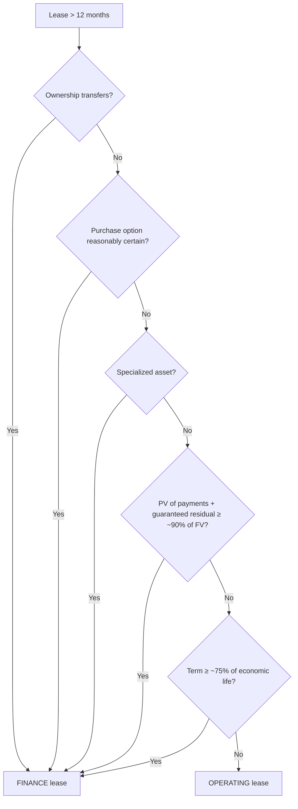

## 1. Lease Overview and Contracts — Part 1

A lease conveys the **right to use an identified asset** without transferring ownership, from **lessor** to **lessee**. FAR questions almost always put you in the **lessee's** shoes.

A contract is (or contains) a lease only if:

1. There is an **identified asset** (specific unit — serial number, model), with **no substantive substitution right** benefiting the lessor (routine maintenance loaners are fine — a protective right, not substitution);
2. The contract **conveys control** — the lessee directs the use and receives the benefits (and risks) for the term.

**Commencement:** record nothing at contract signing — the journal entry (DR right-of-use asset / CR lease liability) is made when the lessee **gains access** to the asset; before then, footnote the commitment only.

Contracts are assessed **at inception** and reassessed only if **amended**. **Combine multiple contracts** when all of: at least one contains a lease; entered at or near the same time; same (or related) parties; **plus one of** — price/performance interdependence, a single commercial objective, or rights that don't qualify as separate lease components.

## 2. Lease Contracts — Part 2 (lease vs. non-lease components)

A right of use is a **separate lease component** if (both): the lessee can benefit from it **alone or with readily available resources**, and it is **neither dependent on nor interrelated with** other assets. (Skip the split when the accounting effect would be insignificant.)

Whatever isn't a lease (e.g., maintenance) is a **non-lease component**. Policy election, by asset class:

- **Separate** — allocate total consideration by **relative standalone prices** (observable if available, else estimated); non-lease components are simply **expensed** each period.
- **Combine** — fold non-lease amounts into the lease and capitalize everything (fewer units of account, but expense timing shifts into the lease pattern).

**Fast Science illustration:** total consideration 784,800 (48 × 7,750 + 48 × 8,600). Separate: allocate over standalone prices 400/450/30/35 (44%/49%/3%/4%) — two leases + two expensed service contracts. Combined: allocate 430 vs. 485 (47%/53%) — two leases, everything capitalized.

## 3. Classification: Operating vs. Finance (OWNES)

Both classifications **capitalize** an ROU asset and lease liability — no more off-balance-sheet operating leases. Meeting **any one** OWNES criterion (leases > 12 months) → **finance lease**; none → operating:

| | Criterion | Rule of thumb |
|---|---|---|
| **O** | **Ownership** transfers at end of lease | — |
| **W** | **W**ritten purchase option, reasonably certain to be exercised | — |
| **N** | PV of lease payments + guaranteed residual ≈ or exceeds substantially all the **fair value** | ≥ **90%** |
| **E** | Lease term is a major part of the **economic life** | ≥ **75%** (or lease starting in the last 25% of life fails) |
| **S** | Asset is **specialized** — no alternative use to the lessor | — |



Example: FV 3,500; four $1,000 year-end payments at 10% → PV 3,170 = 90.6% ≥ 90% → finance under **N** alone. Landen: 7-year lease on 9-year-life furniture → 78% → finance under **E** — stop at the first criterion met.

## 4. Calculating the Lease

**Lease term** = noncancelable period **plus** lessee renewal options reasonably certain to be exercised, **plus** periods after lessee termination options reasonably certain **not** to be exercised, **plus** periods controlled by **lessor-held** options (presumed included). A lease terminable by *either* party with minor penalties isn't enforceable.

**Short-term exception (≤ 12 months, no purchase option/extension reasonably certain):** policy election by asset class — skip capitalization entirely and expense payments straight-line.

**Lease payments — include (REPORT-style checklist):**

- **R**equired fixed contractual payments;
- **E**xercise price of a renewal option reasonably certain to be used (plus those added payments);
- **P**urchase option price, if reasonably certain;
- **O**nly index/rate-based variable payments (e.g., CPI-linked) — measured at the **current** rate, no assumed changes;
- **R**esidual value **guarantee** amounts likely to be owed;
- **T**ermination penalties, if exercise is reasonably certain.

**Exclude:** usage-based variable payments (per-copy charges — period expense as incurred), lessee guarantees of the **lessor's debt**, and non-lease components accounted for separately. Anything "unlikely to be exercised" is struck out entirely.

**Discount rate:** the **rate implicit in the lease if known** to the lessee; otherwise the lessee's **incremental borrowing rate**.

**Initial direct costs** (commissions, legal/consulting fees to *execute* the lease) are added to the **ROU asset** — not the liability. Costs incurred whether or not the lease was signed (negotiation travel, drafting, credit checks) are **expensed**.

## 5. Lessee Accounting — Part 1: Operating Lease

Capitalize PV of payments; both asset and liability unwind over the term; the income statement shows **one straight-line lease expense**.

**Q — A 3-year operating lease has $18,000 year-end payments (ordinary annuity) at 5.75%, so the PV is 48,338. Record commencement and build the schedule showing the single straight-line lease expense (interest embedded, liability reduction as the plug).**

```journal
{"desc": "Commencement",
 "dr": [["Right-of-use asset", 48338]],
 "cr": [["Lease liability", 48338]]}
```

```schedule
{"caption": "Operating lease — single expense, interest embedded",
 "columns": ["Year", "Lease expense", "Cash", "Interest portion (5.75% × liability)", "Liability reduction", "Ending liability"],
 "rows": [
   ["1", "18,000", "18,000", "2,779", "15,221", "33,117"],
   ["2", "18,000", "18,000", "1,904", "16,096", "17,021"],
   ["3", "18,000", "18,000", "979", "17,021", "0"]
 ]}
```

```journal
{"desc": "Each year (amounts from the schedule — Year 1 shown)",
 "dr": [["Lease expense", 18000], ["Lease liability", 15221]],
 "cr": [["Cash", 18000], ["Accumulated amortization — ROU asset", 15221]]}
```

## 6. Lessee Accounting — Part 2: Finance Lease

Same liability (PV of payments), but the ROU asset can differ from it. Build it up as:

> **ROU asset = lease liability + initial direct costs + prepaid lease payments − lease incentives received.**

The asset and liability are then resolved **independently**, producing **two** income-statement lines:

- **Interest expense** = beginning liability × rate (declines over time);
- **Amortization expense** = ROU asset ÷ amortization period (straight-line).

**Q — Take the same lease ($18,000 × 3 years at 5.75%, PV 48,338) but classify it as a finance lease. Build the schedule showing the two separate expenses (interest + straight-line amortization), and confirm the lifetime total equals the operating total.**

```schedule
{"caption": "Finance lease — two expenses, front-loaded total",
 "columns": ["Year", "Interest (5.75%)", "Amortization (48,338 ÷ 3)", "Total expense", "vs. operating 18,000"],
 "rows": [
   ["1", "2,779", "16,113", "18,892", "higher"],
   ["2", "1,904", "16,113", "18,017", "≈ same"],
   ["3", "979", "16,113", "17,092", "lower"]
 ],
 "totals": ["Life of lease", "5,662", "48,338", "54,000", "identical total"]}
```

> [!RULE]
> Finance leases **front-load** expense; operating leases are level. Lifetime total expense is identical either way.

## 7. Lessee Accounting — Part 3: Variations

**Q — An 8-year lease begins 1/1/Yr 5 with $35,000 annual payments, the first due at commencement (annuity due), plus $12,000 of initial direct costs; the implicit rate of 4.5% is known (use it over the 5% incremental rate) and a 4-year extension is unlikely (ignored). Record commencement, distinguishing the ROU asset from the lease liability.**

```journal
{"desc": "Commencement — ROU asset ≠ liability",
 "dr": [["Right-of-use asset (35,000 + 12,000 + PV of 7 remaining payments)", 253245]],
 "cr": [["Lease liability (PV of 7 payments @ 4.5%)", 206245], ["Cash (first payment + direct costs)", 47000]]}
```

Paying the first installment up front converts the 8-payment annuity due into a **7-payment ordinary annuity** for the liability. Year-6 amounts: interest = 4.5% × the then-outstanding liability = 8,124; amortization = 253,245 ÷ 8 = **31,656** each year; total 39,780.

> [!TRAP]
> "Unlikely to exercise" kills an option for every purpose. The ROU asset includes the day-one payment and direct costs; the liability never does.

## 8. Presentation and Disclosures

**Balance sheet:** ROU assets and lease liabilities shown separately or within "other" captions (with disclosure of where); split liability current/noncurrent; **never net** finance and operating amounts together, and never net assets against liabilities.

**Amortization period for the ROU asset:** met **O or W** → asset's **useful life** (lessee keeps it); met **N, E, or S** → **shorter** of lease term or useful life.

**Income statement:** operating → one lease expense (continuing operations); finance → amortization expense + interest expense.

**Statement of cash flows:**

| Payment | Classification |
|---|---|
| Operating-lease payments, variable payments, short-term lease payments | **Operating** |
| Finance lease — **interest** portion | **Operating** |
| Finance lease — **principal** portion | **Financing** |
| Payments to ready a leased asset for use | **Investing** |

**Footnotes** — qualitative: nature of leases, restrictions/covenants, how variable payments are determined, options, residual guarantees, leases signed but not commenced, judgments, sale-leasebacks, short-term/combination policy elections. Quantitative: finance lease cost split (amortization vs. interest), operating/short-term/variable lease costs, cash flow allocation, noncash ROU-for-liability disclosures, **weighted-average remaining term and discount rate**, and a **five-year maturity analysis**.

## 9. Lessor Accounting

The lessor classifies each lease as **sales-type**, **direct-financing**, or **operating** — tested **independently** of the lessee's classification.

**Sales-type** — **any OWNES criterion is met**. The lessor **derecognizes** the asset and records a **Net investment in the lease = PV of lease payments + PV of the unguaranteed residual value** (discounted at the rate implicit in the lease).
- Recognize **selling profit/loss immediately** at commencement (≈ FV of asset − its carrying amount).
- Then recognize **interest income** = beginning net investment × implicit rate over the term.

**Direct-financing** — OWNES criteria **fail**, but (a) PV of payments **plus residual value guaranteed by the lessee or a third party** ≥ substantially all of FV, and (b) collection is probable. Record **Net investment in the lease**, but **defer** any selling profit into interest income over the term (**no** day-one profit).

**Operating** (lessor) — neither of the above. The lessor **keeps and depreciates** the asset and recognizes **lease income straight-line** over the term.

| Lessor type | Leased asset | Day-1 profit | Income over term |
|---|---|---|---|
| Sales-type | Derecognized → net investment | **Recognized now** | Interest income |
| Direct-financing | Derecognized → net investment | **Deferred** | Interest income |
| Operating | Kept & depreciated | none | Straight-line lease income |

> [!TRAP]
> The **same lease** can be a **finance** lease to the lessee and an **operating** lease to the lessor — never assume symmetry. Lessor **collectibility must be probable** to use sales-type or direct-financing.

## 10. Sale-Leaseback

A seller-lessee sells an asset and immediately leases it back. First test under **ASC 606 — is it a sale?** Control must pass to the buyer, there is **no substantive repurchase option**, and the leaseback is **not** a finance lease.

- **Qualifies as a sale:** the seller **derecognizes** the asset, recognizes gain/loss (**adjusted for any off-market terms** in the price or rent), and records an **ROU asset + lease liability** for the leaseback.
- **Fails the sale test** (transfer isn't a sale, or the leaseback is a finance lease → seller keeps control): treat as a **financing** — the asset **stays on the seller's books** and the proceeds are a **financial liability** (no gain recognized).

```recap
1. A lease needs an identified asset (no substantive substitution) plus transferred control; record at **commencement**, not signing.
2. Non-lease components: separate (allocate by relative standalone prices; expense them) or combine into the lease — policy election.
3. OWNES — any one met → finance; none → operating; benchmarks 90% (N) and 75% (E); ≤ 12-month leases can bypass capitalization.
4. Capitalize PV of fixed payments + reasonably certain options + index-based variables (current rate) + probable residual-guarantee shortfalls; exclude usage-based variables; discount at the implicit rate if known, else incremental borrowing rate; initial direct costs go to the asset only.
5. Operating = one level lease expense (interest embedded, plug amortization). Finance = declining interest + straight-line amortization → front-loaded, same lifetime total.
6. Amortize the ROU over useful life if O/W; otherwise the shorter of term or life.
7. Cash flows: everything operating except finance-lease principal (financing) and asset-readiness payments (investing).
8. Lessor: sales-type (any OWNES → net investment, profit now) vs. direct-financing (defer profit) vs. operating (keep/depreciate, straight-line income) — classified independently of the lessee.
9. Sale-leaseback: ASC 606 sale test → if a sale, derecognize + gain (off-market-adjusted) + ROU; if not, it's a financing (asset stays, proceeds = liability).
```
