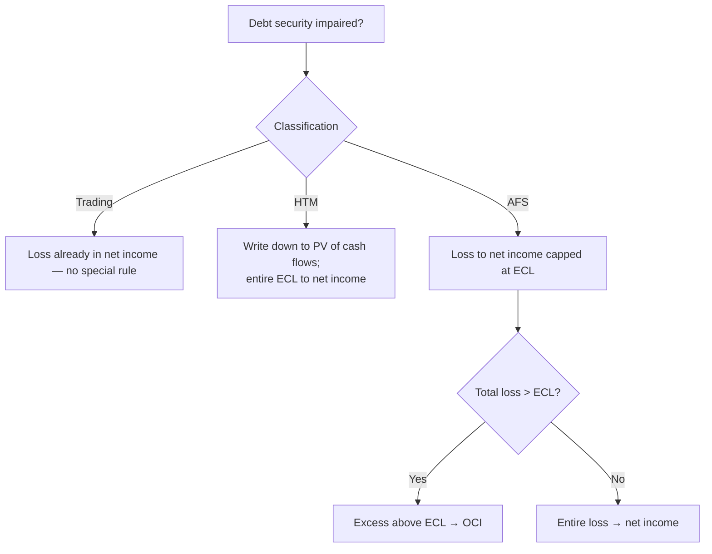

## 1. Financial Instruments Overview and Classification

A **financial asset** (you receive payments — investor/lender/bondholder) can be cash, an ownership interest, a contractual right to cash (note/bond), or a favorable derivative position. A **financial liability** (you make payments — issuer/borrower) is a contractual obligation to pay or an unfavorable derivative.

**How an investment in another company is accounted for depends on what it is and how much you hold:**

| Investment | Test | Accounting |
|---|---|---|
| **Debt — trading** | Intend to sell near-term | **FV through P&L** (net income) |
| **Debt — available-for-sale (AFS)** | Not near-term, not to maturity | **FV through OCI** |
| **Debt — held-to-maturity (HTM)** | Intent **and** ability to hold to maturity | **Amortized cost** (no marking to market) |
| **Equity < 20%** | No significant influence | **FV through net income** (trading rules) |
| **Equity 20–50%** | Significant influence | **Equity method** (F5/M2) |
| **Equity > 50%** | Control | **Consolidate** (F5/M3) |

Only **debt** (or **mandatorily redeemable preferred**) can be HTM — common equity has no maturity.

**Fair value option:** an entity may irrevocably elect to carry certain items at fair value (trading rules — unrealized gains/losses to income). Eligible: **AFS debt securities** and **equity-method** investments only. **Not** eligible: consolidated subsidiaries, pensions, leases.

> [!RULE]
> For a **financial liability** (note/bond) designated at fair value, the portion of the fair-value change due to **instrument-specific credit risk** (the entity's own credit rating) goes to **OCI**. For a **derivative** liability, that change goes through **net income**.

## 2. Debt Securities — The Three Classifications

You are the investor (asset side), so debt gives **no voting rights → never significant influence**. **Redeemable (mandatorily) preferred stock** is treated as **debt** (it has a maturity); ordinary preferred uses trading rules. Debt securities exclude derivatives, leases, and A/R.

| | Trading | Available-for-sale | Held-to-maturity |
|---|---|---|---|
| Carried at | **Fair value** | **Fair value** | **Amortized cost** |
| Unrealized G/L | **Net income** | **OCI** | none (not marked) |
| Typical B/S class | Current | Non-current | Non-current |
| Buy/sell cash flow | **Operating** (if current) | **Investing** (if non-current) | Investing |
| Requires | — | — | **Intent + ability** to hold to maturity |

Cash-flow classification follows the balance-sheet class: **current asset → operating**, **non-current → investing**. HTM stays at amortized cost — a discount pulls carrying value **up** toward par over time, a premium pulls it **down**; quoted fair value is distractor information.

## 3. Fair Value, Reclassification, and Interest Income

**Change in fair value** = end-of-period FV − beginning-of-period FV (an **unrealized/holding** gain or loss). It is recorded through a **valuation account** netted against the security (debit to raise carrying value, credit to lower it). **Realized** gains/losses (on **sale**, or an AFS/HTM **impairment**) always hit **net income**.

**Transfers between categories** are always made **at fair value**, then you apply the **destination** category's rules:

| From → To | Effect |
|---|---|
| Trading → any | Already at FV — no adjustment |
| Any → Trading | FV difference to **net income** |
| HTM → AFS | FV difference to **OCI** |
| AFS → HTM | FV difference to OCI, then **amortized** over remaining life |

**Interest income:** for FV securities (trading/AFS), accrue **par × coupon** (DR Cash or Interest receivable / CR Interest income). For HTM, income = **beginning carrying value × yield-to-maturity** (market rate at purchase); the difference from the coupon is amortization.

## 4. Impairment — The CECL (Expected Credit Loss) Model

If debt is impaired, book the loss **now** (conservatism). This matters for **AFS** (loss would otherwise sit in OCI) and **HTM** (not marked to market) — trading securities already run losses through income.

> [!MNEMONIC]
> **Expected credit loss = PV of expected future cash flows − amortized cost.** PV the principal with the **PV-of-$1** factor and the expected coupons with the **PV-of-ordinary-annuity** factor. The expected credit loss **always** goes to net income.

**Q — TGPO holds a $500,000, 4-year bond bought at par at 4.25% (amortized cost $500,000). It now expects to collect only $11,500/year for the remaining 3 years; PV factors are PV-$1 = 0.88262 and PV-ordinary-annuity = 2.76198. Compute the expected credit loss and record the HTM impairment.**

```schedule
{"caption": "Expected credit loss — held-to-maturity",
 "columns": ["Component", "Computation", "Amount"],
 "rows": [
   ["PV of expected interest", "11,500 × 2.76198", "31,763"],
   ["PV of principal", "500,000 × 0.88262", "441,310"],
   ["= PV of future cash flows (new carrying value)", "", "473,073"],
   ["− Amortized cost", "", "(500,000)"],
   ["= Expected credit loss (to income)", "", "26,927"]
 ]}
```

```journal
{"desc": "HTM impairment — record expected credit loss",
 "dr": [["Credit loss (income statement)", 26927]],
 "cr": [["Allowance for credit losses", 26927]]}
```

**AFS impairment:** the loss to **net income is capped at the expected credit loss**; any excess (from the market overreacting) goes to **OCI**.

**Q — The same bond (amortized cost $500,000, expected credit loss $26,927) is held as AFS. For fair values of 510,000, 480,000, and 450,000, split each unrealized change between net income (capped at the ECL) and OCI, and record the entry for the FV 450,000 case.**

```schedule
{"caption": "AFS impairment — three fair-value scenarios",
 "columns": ["Scenario", "Unrealized change", "To net income", "To OCI"],
 "rows": [
   ["FV 510,000 (not impaired)", "+10,000 gain", "—", "10,000 gain"],
   ["FV 480,000 (loss < ECL)", "(20,000)", "(20,000)", "—"],
   ["FV 450,000 (loss > ECL)", "(50,000)", "(26,927)", "(23,073)"]
 ]}
```

```journal
{"desc": "AFS impairment — big loss (26,927 credit loss to income, 23,073 excess to OCI)",
 "dr": [["Credit loss (income statement)", 26927], ["Unrealized loss — OCI", 23073]],
 "cr": [["Allowance for credit losses", 26927], ["Valuation account", 23073]]}
```



## 5. Realized Gains and Losses on Debt Securities

On **sale**, the realized gain/loss hits **net income** — but the computation and entry differ by classification (HTM isn't shown; you shouldn't sell it).

**Q — A debt security originally cost 83; $2 of gains have been recorded over time (carrying value 85); it is now sold for 90. Record the sale under both the trading and AFS classifications (trading gain vs. carrying value; AFS gain vs. original cost, reversing the $2 in OCI).**

```journal
{"desc": "Sell TRADING security — gain = SP − carrying value (90 − 85)",
 "dr": [["Cash", 90]],
 "cr": [["Trading security (carrying value)", 85], ["Realized gain", 5]]}
```

```journal
{"desc": "Sell AFS security — gain = SP − original cost (90 − 83); reverse $2 OCI",
 "dr": [["Cash", 90], ["Unrealized gain — OCI (reverse)", 2]],
 "cr": [["AFS security (carrying value)", 85], ["Realized gain", 7]]}
```

For **trading**, gain = selling price − **carrying value**; for **AFS**, gain = selling price − **original cost**, then **reverse** the cumulative OCI amounts to avoid double-counting.

## 6. Equity Securities — Valuation, Dividends, and Impairment

Equity with **no significant influence** (< 20%) and ordinary (non-redeemable) preferred are carried at **fair value through net income** — realized/unrealized gains, losses, and dividend income all hit the income statement. Excluded from "equity securities": redeemable preferred and convertible bonds (debt), and treasury stock (contra-equity).

**Practicability exception:** a **non-public** equity investment with no readily determinable fair value is carried at **cost less impairment** (there is no market to mark to).

**Dividends are income — except:** (a) a **liquidating dividend** (distribution exceeds the investor's share of the investee's retained earnings) is a **return of capital**, (b) a **stock dividend** (basis per share drops, share count rises), and (c) **equity-method** dividends — all reduce the investment, not income.

```journal
{"desc": "ABC owns 10% of XYZ; $10M dividend → $1M received, but 10% × $8M RE share = $800K",
 "dr": [["Cash", 1000000]],
 "cr": [["Dividend income", 800000], ["Investment in XYZ", 200000]]}
```

**Impairment** matters only for cost-basis (non-public) equity — a **permanent** decline (going-concern doubt, covenant breaches, negative operating cash flow, industry/tech decline, plummeting credit rating, an offer below carrying value) is written down to fair value through **net income**. A **sale** of an FV-through-NI equity: gain = selling price − carrying value (adjusted cost).

## 7. Required Disclosures

**Debt** disclosures focus on **AFS** and **HTM** (trading already runs through income): aggregate fair value, gross unrealized holding gains/losses, amortized cost by major security, and **maturities** (cash to service your own debt). **Equity** (no significant influence): split total gains/losses into the **realized** (sold) portion so the **unrealized** portion is derivable.

All entities disclose financial assets/liabilities by **major category** (FV through NI / FV through OCI / amortized cost). Public entities disclose the **fair-value hierarchy** input level — **Level 1/2** observable (most reliable), **Level 3** unobservable. Practicability-exception investments disclose their **carrying value** (cost less impairment).

Disclose all significant **concentrations of credit risk** — over-exposure to a single entity or an industry with similar economic characteristics (e.g., debt only in airlines) compounds the risk of not collecting. **Market-risk** (sensitivity to GDP/inflation/interest rates) disclosure is **encouraged but optional**.

```recap
1. Investment accounting keys off type and stake: debt is trading (FV→NI), AFS (FV→OCI), or HTM (amortized cost, intent+ability); equity <20% is FV→NI, 20–50% equity method, >50% consolidate; only debt/redeemable preferred can be HTM.
2. Fair value option (irrevocable) is limited to AFS debt and equity-method investments; a FV liability's own-credit-risk change goes to OCI (derivatives: to income).
3. Cash-flow class follows the balance sheet: current→operating, non-current→investing; transfers between categories are always at fair value using the destination's rules.
4. CECL: expected credit loss = PV of expected cash flows − amortized cost, always to net income; HTM writes fully down; AFS caps the income hit at ECL and sends any excess to OCI.
5. Realized gains: trading = SP − carrying value; AFS = SP − original cost with the OCI reversed.
6. Equity <20% is FV→NI; non-public equity is cost less impairment; dividends are income unless liquidating, stock, or equity-method (return of capital).
7. Disclose AFS/HTM fair value, unrealized G/L, amortized cost and maturities; the fair-value hierarchy level; concentrations of credit risk (market risk is optional).
```
