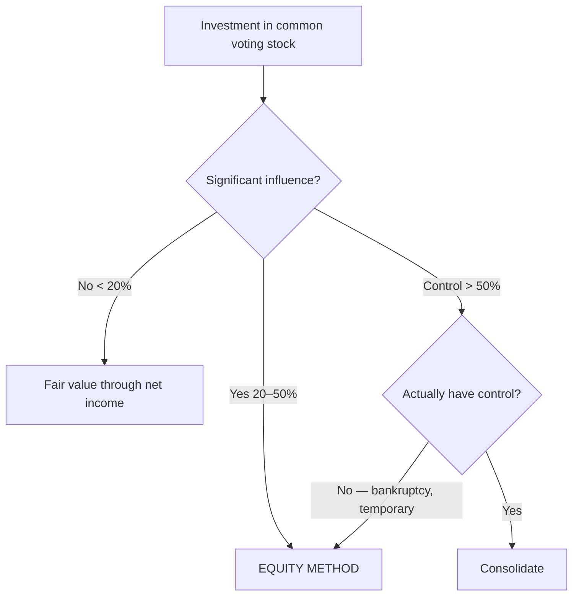

## 1. When to Use the Equity Method

The equity method applies to **common equity with significant influence** — presumed at **20%–50%** of voting stock, but ownership is only **evidence**; the real test is **significant influence**.



Note the exceptions: you may own **> 50% but lack control** (investee in bankruptcy under a trustee, or a temporary holding) → equity method, not consolidation. The equity method is **also** used on the **parent's standalone** statements before consolidation.

**Equity method is *not* appropriate** (no significant influence, even at 20–50%): bankruptcy, a temporary investment, a **standstill agreement** (investor surrenders shareholder rights), a small group running the company without you, **no access to the investee's financial information**, or being **kept off the board**.

> [!EXAM]
> Two signals to catch: significant influence with **< 20%** (board seat) → equity method; and **≥ 20% without** significant influence (kept off board) → fair value through net income. The percentage is a presumption, not a rule.

## 2. Equity Method Mechanics — the BASE Rollforward

**Initial carrying value** = cash paid + debt issued + fair value of stock issued + **legal/acquisition fees**. Thereafter you **do not mark to market** — you adjust the investment account:

> [!MNEMONIC]
> **BASE:** **B**eginning carrying value **+** your % of **net income** **−** your % of **excess depreciation** **−** your % of **dividends** (and % of losses) **= E**nding carrying value.

- **% of investee income** → DR Investment / CR **Equity earnings** (raises income).
- **Dividends are *not* income** — a return of capital: DR Cash / CR **Investment**.
- **% of losses** reduces the investment, but the carrying value **cannot go below zero**.
- **Stock dividends** from the investee → memo entry only.

If you hold **both** common and preferred in the same investee, account for them **separately** — preferred uses trading rules (dividends **are** income); and your share of "income" is your % of **income available to common** (net income − preferred dividends).

## 3. Excess Purchase Price, Excess Depreciation, and Goodwill

The price paid usually exceeds your share of the investee's **book value**. Analyze the excess: the **identifiable** part (fair value > book value of specific assets × your %) and the **unidentifiable** part = **goodwill**.

**Q — Big buys 40% of Small for $300,000; Small's book equity is $550,000 and fair value $600,000 (the $50,000 difference is equipment with a 10-year remaining life). During the year Small earns net income of $90,000 and pays $40,000 in dividends. Analyze the excess purchase price (identifiable vs. goodwill), then roll the investment forward with BASE and find equity earnings.**

```schedule
{"caption": "Excess purchase price analysis",
 "columns": ["Step", "Amount"],
 "rows": [
   ["Price paid (40%)", "300,000"],
   ["− Book value of equity × 40% (550,000 × 40%)", "(220,000)"],
   ["= Excess over book value", "80,000"],
   ["Identifiable: FV − BV of equipment × 40% (50,000 × 40%)", "20,000"],
   ["Unidentifiable: goodwill", "60,000"]
 ]}
```

**Excess depreciation** = (fair value − book value) ÷ remaining life = 50,000 ÷ 10 = **$5,000/yr total**; your share (40%) = **$2,000**, which **reduces equity earnings** (DR Equity earnings / CR Investment). **Land is not depreciated** — no excess depreciation on a land difference.

```schedule
{"caption": "BASE rollforward — Big's investment in Small",
 "columns": ["Line", "Amount"],
 "rows": [
   ["Beginning (cost incl. legal fees)", "300,000"],
   ["+ Share of net income (90,000 × 40%)", "36,000"],
   ["− Share of excess depreciation (5,000 × 40%)", "(2,000)"],
   ["− Share of dividends (40,000 × 40%)", "(16,000)"],
   ["= Ending carrying value", "318,000"]
 ]}
```

Equity earnings on the income statement = 36,000 − 2,000 = **$34,000**.

**Goodwill under the equity method is *not* a separate asset** — the method is "one-line accounting" (only *investment in affiliate* on the balance sheet, only *equity earnings* on the income statement). Goodwill is **embedded**, **not amortized**, and **not separately impairment-tested**; impairment is judged on the **whole** investment.

**Impairment** requires **both** fair value **below** carrying value **and** an **other-than-temporary** (permanent) decline → write down through net income; **no reversal** under U.S. GAAP.

**Q — Precious Metals owns 25% of Gems, carried at 5,000,000 at the start of Yr 2. During Yr 2 Gems reports an 80,000 loss, and the investment's fair value permanently declines to 4,000,000. Compute the impairment loss — updating the carrying value for the share of loss before comparing to fair value.**

```schedule
{"caption": "Equity-method impairment — Precious Metals' 25% of Gems",
 "columns": ["Line", "Amount"],
 "rows": [
   ["Beginning carrying value (start of Yr 2)", "5,000,000"],
   ["+ Share of loss (−80,000 × 25%)", "(20,000)"],
   ["= Adjusted carrying value", "4,980,000"],
   ["Fair value (permanent decline)", "4,000,000"],
   ["Impairment loss (to income)", "(980,000)"]
 ]}
```

Adjust the carrying value **first**, then compare to fair value — you can't measure impairment off the beginning balance.

## 4. Fair Value vs. Equity Method — Comparison and Transition

| | No significant influence (< 20%) | Equity method (20–50%) |
|---|---|---|
| Balance sheet | **Fair value** (marked to market) | Cost adjusted by **BASE** (not marked) |
| Buy cash flow | Operating (current asset) | Investing (non-current) |
| Dividends | **Income** (unless liquidating) | **Return of capital** (reduce investment) |
| Income statement | Realized + unrealized gains/losses | **Equity earnings** = % income − % excess depreciation |

**Transition (< 20% → ≥ 20%)** is **prospective and easy** — **no restatement**. Add the **incremental cost** of the new shares to the existing carrying value and apply the equity method from that date forward (dividends stop being income; stop marking to market).

```journal
{"desc": "Buy an added 30% (was 15%) for $60,000 — switch to equity method prospectively",
 "dr": [["Investment in affiliate", 60000]],
 "cr": [["Cash", 60000]]}
```

If the prior 15% stake carried at $15,000 (no market change), the new carrying value is simply **$75,000**.

```recap
1. Equity method = common equity with significant influence (presumed 20–50%, but influence governs); also used for >50% without control and on the parent's standalone statements; blocked by bankruptcy, standstill, no board access, or no financial information.
2. BASE: beginning + % net income − % excess depreciation − % dividends = ending; dividends are a return of capital; carrying value can't go below zero; account for preferred separately.
3. Excess over book splits into identifiable (FV−BV × %) and unidentifiable goodwill; excess depreciation reduces equity earnings (land excluded); goodwill is embedded — not amortized or separately tested; impairment needs a permanent decline and can't reverse.
4. Fair value marks to market with dividends as income; equity method adjusts via BASE with dividends as return of capital; transition up to the equity method is prospective — add incremental cost, no restatement.
```
