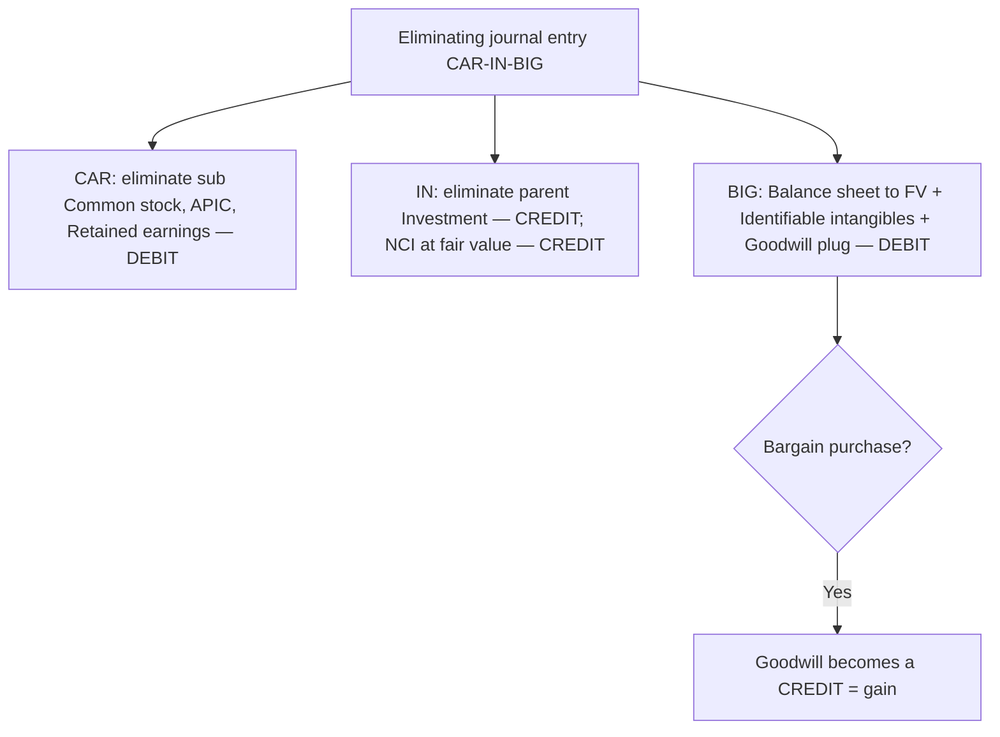

## 1. Control and Consolidation Concepts

Consolidation is driven by **control**. The **voting interest model**: owning **> 50% (majority + one share)** of voting common stock is control → consolidate.

| Ownership | Method |
|---|---|
| 0–20% | Fair value |
| 20–50% | Equity method (significant influence) |
| 50–100% | **Consolidate** (control) |

**Control can be absent even above 50%** — a **legal reorganization** or **bankruptcy** (courts control the entity) or **severe foreign restrictions** override ownership. When the parent owns less than 100%, the rest is the **noncontrolling interest (NCI)** — reported **at fair value** as a **separate part of consolidated equity**.

## 2. Pushdown Accounting

An **elective** choice by the **acquiree** to restate its **standalone** statements to the acquirer's stepped-up fair values. It is **entity-level** (all-or-nothing), made only at a **change of control**, must be elected in the **first reporting period** including that change, and is **irrevocable**.

The subsidiary marks its assets/liabilities to fair value, records **goodwill on its own books** (uniquely — goodwill normally exists only in consolidation), and plugs the imbalance to a new equity account, **pushdown capital**. A **bargain purchase** gain goes to **APIC** (not the subsidiary's income). All the post-acquisition "baggage" follows — new depreciation/amortization, impairment, and deferred taxes.

**Q — Lunova acquires all of Voltari for $120M; Voltari's assets have a fair value of $110M and its liabilities $20M. Under pushdown accounting, record the entry on Voltari's own books — marking assets/liabilities to fair value, recording goodwill, and plugging pushdown capital.**

```journal
{"desc": "Pushdown accounting — Voltari restates to fair value",
 "dr": [["Assets (to fair value)", 110000000], ["Goodwill", 30000000]],
 "cr": [["Liabilities (to fair value)", 20000000], ["Pushdown capital (equity)", 120000000]]}
```

If pushdown is **not** elected, the subsidiary keeps historical cost and the parent discloses a summary of its purchase-price allocation so users can reconcile.

## 3. The Acquisition Method — CAR-IN-BIG

At acquisition, record **100% of the net assets at fair value** regardless of the % bought. The parent's basis = acquisition price = fair value of what was bought. The consolidating **eliminating journal entry (EJE)** follows the mnemonic:

> [!MNEMONIC]
> **CAR-IN-BIG.** **CAR** = eliminate the subsidiary's **C**ommon stock, **A**PIC, **R**etained earnings (debits). **IN** = eliminate the parent's **I**nvestment (credit) and record **N**oncontrolling interest at fair value (credit). **BIG** = adjust the **B**alance sheet to fair value, record **I**dentifiable intangibles, and plug **G**oodwill (debits) — or a bargain-purchase **gain** (credit).

**N** (noncontrolling interest) and **G** (goodwill) appear **only in consolidation** — never on the parent's or subsidiary's own books. Pre-acquisition subsidiary equity is never carried forward; only **post-acquisition** subsidiary income enters consolidation.



## 4. Intercompany Transactions — Overview and Inventory

A parent and subsidiary are treated as **one entity**, so **all** intercompany transactions are eliminated **100%** (regardless of ownership %) because they are **not arm's length** — "the left hand paying the right hand." Eliminate intercompany payables/receivables, interest, dividends, and gains.

**Intercompany inventory** is the trickiest: eliminate the sale and cost of sales, then remove the seller's **profit** — split by where the goods landed (unsold → **inventory**; resold → the buyer's **COGS**).

**Q — Gearty sells inventory to Olinto for $1.1M (cost $1.0M, so $100K profit); at year-end $660K (60%) is still on hand and $200K of intercompany A/R–A/P is outstanding. Give the consolidating entries to eliminate the intercompany sale and profit (splitting the profit 60% into inventory, 40% into COGS) and to eliminate the intercompany payable/receivable.**

```journal
{"desc": "Eliminate intercompany inventory sale and profit (60% in inventory, 40% in COGS)",
 "dr": [["Intercompany sales", 1100000]],
 "cr": [["Cost of goods sold", 1040000], ["Inventory", 60000]]}
```

```journal
{"desc": "Eliminate intercompany payable/receivable",
 "dr": [["Accounts payable", 200000]],
 "cr": [["Accounts receivable", 200000]]}
```

Profit in **ending** inventory carries into the next year's **beginning** inventory (adjusted against **retained earnings**).

## 5. Intercompany Bonds and Land

**Bonds:** when one affiliate buys the other's outstanding bonds, GAAP treats it as a **constructive retirement** — the gain/loss (price paid vs. carrying value) appears **only in consolidation** (neither company's own books), then rolls into **retained earnings** in later years. Eliminate the bond payable, premium/discount, the investment, and all intercompany interest.

**Q — Gearty has bonds outstanding with a carrying value of $300K ($250K face + $50K premium); Olinto (an affiliate) buys them on the open market for $275K. Give the consolidating entry for the constructive retirement and the resulting gain.**

```journal
{"desc": "Constructive retirement of intercompany bonds",
 "dr": [["Bonds payable", 250000], ["Premium on bonds payable", 50000]],
 "cr": [["Investment in bonds", 275000], ["Gain on extinguishment", 25000]]}
```

**Land:** eliminate the intercompany gain/loss and restore land to original cost (no depreciation, so it's simple; NCI is not affected since it wasn't party to the sale). Gearty sells land (cost $175K) to Olinto for $200K:

```journal
{"desc": "Eliminate intercompany gain on land, restore to cost",
 "dr": [["Gain on sale of land", 25000]],
 "cr": [["Land", 25000]]}
```

## 6. Intercompany Sale of Depreciable Fixed Assets

Like land, eliminate the gain — **plus** reverse the **excess depreciation** the buyer now records on the inflated basis.

**Q — Olinto sells equipment to Gearty for $100K; its net book value was $70K (cost $90K, accumulated depreciation $20K) with a 10-year remaining life. Give the consolidating entries to undo the intercompany gain (restoring gross cost and accumulated depreciation) and to reverse the current year's excess depreciation.**

Work: gain = 100K − 70K NBV = 30K; buyer depreciates 100K/10 = 10K/yr vs. 70K/10 = 7K/yr correct → 3K/yr excess.

```journal
{"desc": "Undo intercompany gain and restore asset/accumulated depreciation",
 "dr": [["Gain on sale of equipment", 30000]],
 "cr": [["Machinery", 10000], ["Accumulated depreciation", 20000]]}
```

```journal
{"desc": "Reverse excess depreciation ($10K recorded vs. $7K correct)",
 "dr": [["Accumulated depreciation", 3000]],
 "cr": [["Depreciation expense", 3000]]}
```

Each subsequent year, the $30K gain sits in **retained earnings** and the $3K excess depreciation is reversed again — the accumulated-depreciation adjustment shrinks until, after 10 years, the gain and the excess depreciation exactly offset.

## 7. Consolidated Financial Statements — Comprehensive Example

**Q — Gearty acquires 100% of Olinto on 1/1/Yr 1 by issuing 100,000 shares ($10 par, $25 market → $2.5M price). Olinto's fair values equal book except land is +$200K, plus identifiable IPR&D of $100K (8-year life); Olinto's year-end equity is CS $1.0M, APIC $400K, RE $500K, with net income $350K and dividends $150K. Give the acquisition-date eliminating entry (CAR-IN-BIG) — solving beginning RE with BASE and plugging goodwill.**

Work: use **BASE** to find **beginning** RE — ending 500K = beginning + NI 350K − dividends 150K → **beginning RE $300K**. Then CAR = 1,000K + 400K + 300K = **$1.7M**.

```journal
{"desc": "Acquisition-date CAR-IN-BIG (goodwill = 2,500 − 1,700 − 200 − 100 = 500)",
 "dr": [["Common stock — Olinto", 1000000], ["APIC — Olinto", 400000], ["Retained earnings — Olinto", 300000], ["Land (to FV)", 200000], ["IPR&D (identifiable intangible)", 100000], ["Goodwill", 500000]],
 "cr": [["Investment in Olinto", 2500000]]}
```

The parent internally carries the investment on the **equity method** — it grows to $2.7M by year-end (2.5M + 350K income − 150K dividends), and the year-end EJE uses beginning RE plus that adjusted investment. A full consolidation then layers in the intercompany eliminations from Sections 4–6 (inventory profit, **$12,500** IPR&D amortization = 100K/8, the $3K depreciation fix, land gain, equipment gain, bond retirement, and the A/R–A/P).

## 8. Consolidated Financial Statements — Presentation

A consolidated set includes all five statements. Consolidation includes **100%** of parent and subsidiary assets/liabilities (net of eliminations) and **post-acquisition** subsidiary revenues/expenses. Tell-tale signs of consolidation: the title ("Consolidated…"), **goodwill**, and **noncontrolling interest**.

- **Balance sheet / equity:** subsidiary equity is eliminated; **NCI** shows as a separate component of equity.
- **Income & comprehensive income:** show **consolidated net income** (100%), then **attribute** it between the parent and the NCI.
- **Statement of changes in equity:** reconciles total equity with a separate **NCI column**.
- **Cash flows:** in the **acquisition year**, the acquisition outflow is **net of cash acquired** (pay $2.5M, sub had $800K cash → **$1.7M** investing outflow); add the sub's acquisition-date assets/liabilities to the parent's beginning balances so the comparison is apples-to-apples. Buying **additional** shares later is an **investing** flow; dividends paid to the **NCI** are a **financing outflow**; intercompany flows are ignored.

```recap
1. Control (>50% voting) drives consolidation; 20–50% equity method, <20% fair value; control can be lost (bankruptcy, reorg, foreign restrictions); NCI is a separate part of equity at fair value.
2. Pushdown accounting is an elective, irrevocable, change-of-control choice that steps the subsidiary's own books to fair value, records goodwill there, and plugs pushdown capital.
3. CAR-IN-BIG eliminating entry: eliminate sub equity (CAR) and parent investment / record NCI (IN); adjust to fair value, add identifiable intangibles, plug goodwill (BIG) — N and G exist only in consolidation.
4. Eliminate all intercompany transactions 100%; inventory profit splits between the buyer's ending inventory (unsold) and COGS (resold), carrying into next year's beginning inventory via RE.
5. Intercompany bonds are a constructive retirement (gain only in consolidation → RE); land eliminates the gain and restores cost; depreciable assets also reverse the annual excess depreciation.
6. Consolidated statements show 100% with post-acquisition sub income, attribute net/comprehensive income between parent and NCI, and net the acquisition outflow against cash acquired.
```
