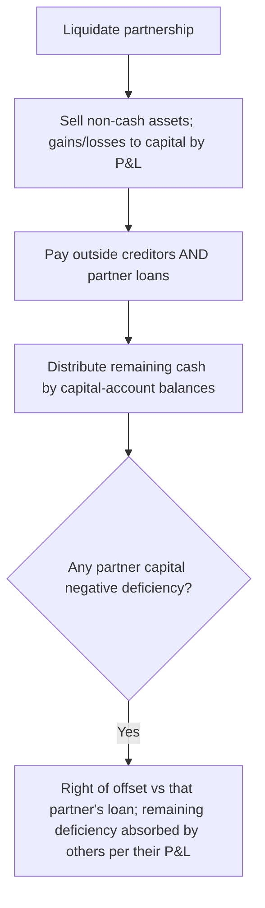

## 1. Partnership Formation and Admitting a New Partner

**Formation:** under GAAP, contributed **assets are recorded at fair value** and assumed **liabilities at present value** (the capital account is the difference). The **IRS** instead uses **net book value (basis)** for tax capital.

**Buying an existing partner's interest** is a private deal between the outgoing and incoming partner — the partnership's assets, liabilities, and **total capital are unaffected** (only the name changes).

**Admitting a new partner** who contributes capital uses one of **three methods**:

| Method | Basis | When |
|---|---|---|
| **Exact** | Contribution = **book value** of the interest bought | No bonus, no goodwill |
| **Bonus** | Uses the **balance** (total capital after contribution) | Bonus flows to old or new partners |
| **Goodwill** | Uses the **contribution** (implied total value) | Only when there's an **overpayment** |

**Exact method** — A, B, C have $20K/$30K/$50K; D wants a **¼** interest. New total equity = existing $100K ÷ (1 − ¼) = **$133,333**; D contributes ¼ × 133,333 = **$33,333**.

> [!MNEMONIC]
> **B — bonus — balance.** The **bonus** method works off the **balance** of total capital; the **goodwill** method works off the new partner's **contribution** (implied value). Both credit the old partners by their **P&L ratio** on an overpayment.

**Bonus to old partners** — A/B capital $30K/$10K (P&L 60/40); **C pays $35K for ⅓**. New balance $75K; C's interest = ⅓ × 75 = $25K → C **overpaid $10K** (bonus to A $6K, B $4K):

```journal
{"desc": "Admit C — bonus to existing partners",
 "dr": [["Cash", 35000]],
 "cr": [["C, capital", 25000], ["A, capital", 6000], ["B, capital", 4000]]}
```

**Bonus to new partner** — same, but **C pays only $14K for ⅓**. New balance $54K; C's interest = $18K → C **underpaid $4K** (funded by A/B per P&L):

```journal
{"desc": "Admit C — bonus to new partner",
 "dr": [["Cash", 14000], ["A, capital", 2400], ["B, capital", 1600]],
 "cr": [["C, capital", 18000]]}
```

**Goodwill method** — C pays $35K for ⅓, so C implies the whole is worth **$105K** (35 ÷ ⅓); actual net assets = $75K → **$30K goodwill** to the old partners:

```journal
{"desc": "Admit C — goodwill method (implied value $105K)",
 "dr": [["Cash", 35000], ["Goodwill", 30000]],
 "cr": [["C, capital", 35000], ["A, capital", 18000], ["B, capital", 12000]]}
```

## 2. Partnership Operations and Partner Withdrawal

**Profit/loss allocation** follows the **agreement**; with no agreement, it splits **equally** — regardless of capital-account balances (which can differ based on each partner's withdrawals). Special allocations (**interest** on capital, **salaries**, **bonuses**) are distributed **first**, in a **waterfall**; whatever remains splits by the residual ratio.

**Waterfall example** — A/B/C capital $30K/$60K/$90K; profit **$200,000**; each gets **8%** interest on capital; A gets a **$10K salary**; C gets a **15% bonus**; residual split 20/30/50.

```schedule
{"caption": "Profit distribution waterfall ($200,000)",
 "columns": ["Layer", "A", "B", "C"],
 "rows": [
   ["C's 15% bonus (200,000 × 15%)", "—", "—", "30,000"],
   ["8% interest on capital", "2,400", "4,800", "7,200"],
   ["A's salary", "10,000", "—", "—"],
   ["Residual 145,600 (20/30/50)", "29,120", "43,680", "72,800"],
   ["Total", "41,520", "48,480", "110,000"]
 ]}
```

**Withdrawal** uses **bonus** or **goodwill** (not exact — the payout price can't be calibrated). Assets may be revalued to fair value either way (credited to all partners by P&L):

- **Bonus method:** pay the withdrawing partner more/less than their capital → the difference is a bonus to/from the remaining partners; **implied goodwill is *not* recorded**.
- **Goodwill method:** the payout implies the whole partnership's value → record goodwill to all partners by P&L, so the payout exactly equals the withdrawing partner's (revalued) capital.

## 3. Partnership Liquidation

At liquidation: **(1)** sell non-cash assets for cash (gains/losses shared by P&L, or equally if no agreement), **(2)** pay **creditors** — including partners who **loaned** money (a partner loan is a creditor claim), then **(3)** distribute remaining cash to partners by their **capital-account balances** (not the P&L ratio).



A **capital deficiency** is a **debit** balance in a partner's (normally credit-balance) capital account — the other partners have a claim on it. If the deficient partner has a **loan** account, the partnership exercises a **right of offset** (cancel the loan against the deficiency). Any residual deficiency the partner can't pay is **absorbed by the remaining partners** by their P&L ratios (cascading if that pushes another partner negative).

**A/B/C** (P&L 50/30/20); cash $20K, PP&E $75K; creditors $25K; partner loans A $15K, C $5K; capital A $10K, B $20K, C $20K.

```schedule
{"caption": "Liquidation — non-cash assets sold for $125,000 (gain $50,000)",
 "columns": ["Step", "Cash", "A cap.", "B cap.", "C cap."],
 "rows": [
   ["Beginning", "20,000", "10,000", "20,000", "20,000"],
   ["Sell assets; gain 50,000 (50/30/20)", "145,000", "35,000", "35,000", "30,000"],
   ["Pay creditors (25,000)", "120,000", "35,000", "35,000", "30,000"],
   ["Pay partner loans (A 15, C 5)", "100,000", "35,000", "35,000", "30,000"],
   ["Distribute to partners by capital", "0", "0", "0", "0"]
 ]}
```

If instead assets fetch only **$15K** (a $60K loss), A's capital goes to **−$20K**. Offset A's $15K loan → still −$5K; that $5K is absorbed by B and C (60/40 of their remaining ratio), which drives B negative, absorbed in turn by C — so C, originally owed $25K, walks away with just **$10K**. A deficient partner may always **pay in cash** to cure it instead.

```recap
1. Formation records assets at fair value / liabilities at present value (GAAP) vs. basis (tax); buying an existing interest doesn't change partnership totals.
2. Admission: exact (contribution = book value), bonus (works off the balance — overpay credits old partners, underpay credits the new one, by P&L), goodwill (works off the contribution's implied value, recorded to old partners).
3. Profits allocate per agreement (else equally); interest, salary, and bonus come first in a waterfall, then the residual by ratio; capital balances need not match the P&L ratio.
4. Withdrawal uses bonus (no goodwill recorded) or goodwill (implied value recorded); assets may be revalued either way.
5. Liquidation: sell assets, pay creditors (including partner loans), then distribute by capital balances; a deficiency is offset against that partner's loan and otherwise absorbed by the remaining partners by P&L.
```
