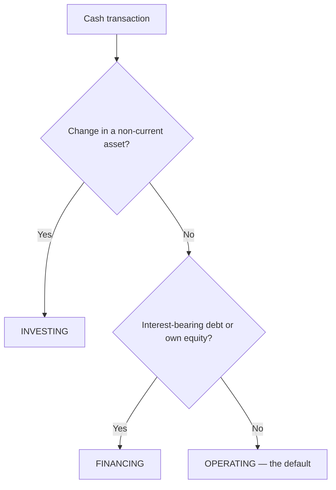

## 1. Purpose and the Three Sections

The statement of cash flows explains **why cash and cash equivalents changed** — assessing performance (cash from the core business), growth potential (investing outflows = expansion), and feeding **free cash flow** valuation. It is required in a full set of statements and covers a **period**.

| Section | Focuses on | Reading |
|---|---|---|
| **Operating** | Change in **operating assets** (current assets **except cash**) and **operating liabilities** (current liabilities **except interest-bearing**) | Cash from the core business — sustainable? |
| **Investing** | Change in **non-current assets** | Buying (outflow) = growing; selling (inflow) = downsizing |
| **Financing** | Change in **interest-bearing debt** and **own equity** | Capital-structure changes |

A **cash equivalent** is a highly liquid short-term investment with an **original maturity ≤ 3 months** (so interest-rate changes barely move its value). **Cash flow per share is not disclosed.** Material **non-cash** investing/financing (buying a building with stock, converting bonds to equity, a finance lease) is a **supplemental disclosure**.

> [!MNEMONIC]
> **Indirect operating method:** start with **net income**, then **+ depreciation, most amortization, bad-debt expense, and losses**; **− gains and bond-premium amortization**; **− increases in operating assets / + increases in operating liabilities.**

The CPA exam tests the **indirect** method's math; investing and financing are the same regardless of method.

## 2. Operating Cash Flow — the Indirect Method

Two adjustments convert accrual **net income** to operating cash: strip out **non-operating** items (gains/losses on fixed assets belong in investing) and reverse **accrual timing** (add back non-cash expenses; adjust for changes in operating working capital).

> [!EXAM]
> **The sign rule ("magnets — opposites attract").** An **increase in an operating asset uses cash → minus**; from there the other three flip: decrease in asset **+**, increase in liability **+**, decrease in liability **−**.

**Cox Retail** — net income $1,260; bad-debt (provision for losses) $200; gain on PP&E sale $80; AR (gross) **+415**, prepaids **+25**, inventory **−205**; operating liabilities **+45**; depreciation $445.

```schedule
{"caption": "Operating cash flow (indirect method)",
 "columns": ["Line", "Amount"],
 "rows": [
   ["Net income", "1,260"],
   ["+ Depreciation", "445"],
   ["+ Provision for losses (bad debt)", "200"],
   ["− Gain on sale of PP&E (→ investing)", "(80)"],
   ["− Increase in accounts receivable (asset up)", "(415)"],
   ["− Increase in prepaids (asset up)", "(25)"],
   ["+ Decrease in inventory (asset down)", "205"],
   ["+ Increase in operating liabilities", "45"],
   ["= Net cash from operating activities", "1,635"]
 ]}
```

Two disclosures required somewhere in the financials: **cash paid for interest** and **cash paid for income taxes**.

## 3. Investing and Financing Activities

**Investing** = buying/selling **non-current assets**: capital expenditures and purchases of securities/loans made are **outflows**; proceeds from selling PP&E or investments are **inflows**. **Proceeds = net book value sold + gain** (or − loss). Back into **capex** from the PP&E roll-forward.

```schedule
{"caption": "Investing cash flow — Cox Retail",
 "columns": ["Line", "Amount"],
 "rows": [
   ["Proceeds from sale of facility (NBV 520 + gain 80)", "600"],
   ["Capital expenditures (backed out of PP&E)", "(1,000)"],
   ["Note receivable made (loan)", "(150)"],
   ["Purchase of long-term marketable securities", "(750)"],
   ["= Net cash used in investing", "(1,300)"]
 ]}
```

**Financing** = **interest-bearing debt** and **equity**: issuing debt/stock is an **inflow**; repaying **principal**, repurchasing stock, and paying **cash dividends** are **outflows**.

> [!TRAP]
> On a debt payment, split it: **principal repayment is financing**, but the **interest portion is operating** (U.S. GAAP). Interest paid or received, and dividends **received**, are always **operating**; dividends **paid** are **financing**.

```schedule
{"caption": "Financing cash flow — Cox Retail",
 "columns": ["Line", "Amount"],
 "rows": [
   ["Borrowing on line of credit", "300"],
   ["Issue long-term bonds", "400"],
   ["Issue common stock (par + APIC)", "500"],
   ["Cash dividend paid", "(200)"],
   ["= Net cash from financing", "1,000"]
 ]}
```

Tie-out: 1,635 − 1,300 + 1,000 = **+1,335** change; beginning cash 2,705 + 1,335 = **ending 4,040** (agreeing to the comparative balance sheet — the built-in check figure).

## 4. Classification Review



| Item (U.S. GAAP) | Bucket |
|---|---|
| Collections from customers, payments to vendors/employees, **taxes paid** | Operating |
| **Interest paid or received**, **dividends received** | Operating |
| Trading security (current) bought/sold | Operating |
| Buying/selling PP&E or non-current investments; loans made | Investing |
| Equity-method **share of investee income** | **Not on the SCF** (only dividends received appear) |
| Issuing/repaying **debt principal**, issuing/repurchasing stock, **dividends paid** | Financing |

**Restricted cash** is **included** in the cash/cash-equivalents reconciliation (its nature is disclosed separately). When unsure, the default bucket is **operating** — insurance proceeds collected (inflow) and litigation settlements paid (outflow) are operating.

```recap
1. The SCF explains the change in cash and cash equivalents (original maturity ≤ 3 months): operating (current items except cash and interest-bearing debt), investing (non-current assets), financing (interest-bearing debt + equity).
2. Indirect operating: net income + depreciation/amortization/bad debt/losses − gains/bond-premium amortization ∓ working-capital changes (increase in asset = minus; the other three flip).
3. Investing: capex and purchases are outflows, sale proceeds (NBV + gain) are inflows; back into capex from the PP&E roll-forward.
4. Financing: issue debt/stock = inflow, repay principal / buy back stock / pay dividends = outflow; interest is operating, not financing.
5. Defaults and specials: taxes and interest are operating, dividends received operating but paid financing, equity-method income is not a cash flow, restricted cash is in the reconciliation, and material non-cash deals are supplemental disclosures.
```
