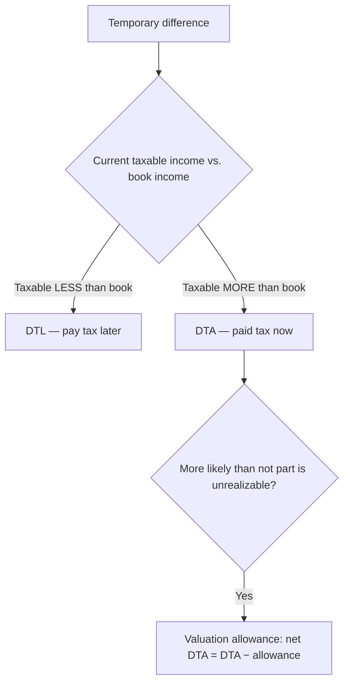

## 1. Book vs. Tax and Tax Allocation

**Book (financial) income** follows **GAAP**; **taxable income** follows the **Internal Revenue Code**. Differences between them are **permanent** or **temporary**.

- **Intraperiod** tax allocation ("intra" = *within* one period): spread the period's tax across the parts of the statements it relates to.

> [!MNEMONIC]
> **IDA-PUFI** — intraperiod allocation items: **I**ncome from continuing operations, **D**iscontinued operations, **A**ccounting-principle changes (retrospective); and the **PUFI** OCI items (Pension, Unrealized AFS/hedge gains, Foreign translation, Instrument-specific credit risk).

> **Mechanics (incremental "with-and-without" method):** compute total tax on **all** income; allocate to **continuing operations as if it were the only component**; the **remainder** is assigned to the other items (discontinued operations, principle change, each OCI/PUFI item), each presented **net of its own tax**.

- **Interperiod** tax allocation ("inter" = *between* periods) — the heavily tested topic — covers permanent and **temporary** differences under the **asset-and-liability method**, recording **income tax payable** plus **deferred tax liabilities (DTL)** or **assets (DTA)**.

> [!EXAM]
> **Total GAAP income tax expense = current tax (payable) ± deferred tax (DTL/DTA).** The distractor answer multiplies **book income × the tax rate** — always wrong, because permanent differences change taxable income and deferred items may use a **future enacted rate**.

## 2. Permanent Differences

A permanent difference affects **either** book **or** tax income, **never both**, and **never reverses** — so there is **no deferral** and no DTL/DTA (easy points).

| Permanent difference | Treatment |
|---|---|
| **Tax-exempt municipal/state bond interest** | Book income, **non-taxable** |
| **Key-person life insurance proceeds** (corp. is beneficiary) | Book income, **non-taxable** |
| Premiums on that key-person policy | Book expense, **non-deductible** |
| **Fines, penalties, bribes, kickbacks** | Book expense, **non-deductible** |
| Non-deductible portion of meals/entertainment | Book expense, **non-deductible** |
| **Dividends-received deduction (DRD)**; excess percentage depletion | Special tax items (non-taxable / non-deductible) |

Use **three columns** — tax return · differences · book income.

**Q — ABC Co. has book income of $200,000, including $10,000 of non-deductible life-insurance premiums and $50,000 of tax-exempt municipal interest. Compute taxable income and the income tax at 21%, and record the entry — noting that permanent differences create no deferral.**

```schedule
{"caption": "Permanent differences — book to taxable income",
 "columns": ["Line", "Amount"],
 "rows": [
   ["Pre-tax book income", "200,000"],
   ["+ Non-deductible life-insurance premiums", "10,000"],
   ["− Tax-exempt municipal interest", "(50,000)"],
   ["= Taxable income", "160,000"],
   ["× 21% = income tax (all current, no deferral)", "33,600"]
 ]}
```

```journal
{"desc": "Record tax — permanent differences only",
 "dr": [["Income tax expense", 33600]],
 "cr": [["Income tax payable", 33600]]}
```

## 3. Temporary Differences and Deferred Tax Liabilities

A temporary difference is a **timing** difference that **reverses** in a future period → creates a **DTL** or **DTA**. Four categories:

| # | Timing | Result | Examples |
|---|---|---|---|
| **1** | Book income first, **tax later** | **DTL** (pay tax later) | Installment sales, %-of-completion, equity-method undistributed earnings |
| **2** | **Taxable income first**, book later | **DTA** (pay tax now) | Prepaid/unearned rent, interest, royalties |
| **3** | Book **expense** first, tax later | **DTA** | Bad-debt allowance, warranty accrual, startup costs |
| **4** | **Tax deduction** first, book later | **DTL** | Accelerated (MACRS) depreciation, franchise amortization |

> [!MNEMONIC]
> **DTL — "L, I like it"** — pay tax **Later**; current taxable income < book income now, but will be **greater** than book income when it reverses.

**Q — Stone Co. has book income of $225,000; tax depreciation exceeds book by $25,000 (a category-4 temporary difference that reverses in Year 2); rate 21%. Compute current tax payable, the deferred tax liability, and total income tax expense, and record Years 1 and 2.**

```schedule
{"caption": "DTL — excess tax depreciation",
 "columns": ["Line", "Amount"],
 "rows": [
   ["Book income 225,000 − temporary difference 25,000 = taxable income", "200,000"],
   ["Current tax payable (200,000 × 21%)", "42,000"],
   ["DTL (25,000 × 21%)", "5,250"],
   ["Total income tax expense", "47,250"]
 ]}
```

```journal
{"desc": "Year 1 — current tax plus DTL",
 "dr": [["Income tax expense — current", 42000], ["Income tax expense — deferred", 5250]],
 "cr": [["Income tax payable", 42000], ["Deferred tax liability", 5250]]}
```

```journal
{"desc": "Year 2 — DTL reverses",
 "dr": [["Deferred tax liability", 5250]],
 "cr": [["Income tax expense — deferred", 5250]]}
```

## 4. Deferred Tax Assets and the Valuation Allowance

A **DTA** (categories 2 and 3) means you **pay tax now** but get the benefit **later** — current taxable income **exceeds** book income.

**Q — Black Co. has book income $500,000 and taxable income $800,000 (a $300,000 warranty temporary difference, category 3); rate 21%. Compute current tax payable, the deferred tax asset, and net income tax expense, and record the entry.**

```schedule
{"caption": "DTA — warranty accrual",
 "columns": ["Line", "Amount"],
 "rows": [
   ["Current tax payable (800,000 × 21%)", "168,000"],
   ["DTA (300,000 × 21%)", "63,000"],
   ["Income tax expense (168,000 − 63,000)", "105,000"]
 ]}
```

```journal
{"desc": "Year 1 — DTA (net expense $105,000)",
 "dr": [["Deferred tax asset", 63000], ["Income tax expense — current", 168000]],
 "cr": [["Income tax payable", 168000], ["Deferred income tax benefit", 63000]]}
```

**Year 2 — as the warranty is settled, the DTA reverses** (the deduction now hits the tax return). If $100,000 of warranty is paid, $21,000 (100,000 × 21%) of the DTA unwinds:

```journal
{"desc": "Year 2 — reverse DTA as the temporary difference turns around",
 "dr": [["Income tax expense — deferred", 21000]],
 "cr": [["Deferred tax asset", 21000]]}
```

> [!RULE]
> **Valuation allowance** — if it is **more likely than not (> 50%)** that part of a DTA won't be realized (insufficient future taxable income), record a contra-account. **Net DTA = total DTA − valuation allowance.**

**Q — Continuing Black Co., suppose only $21,000 of the $63,000 DTA is more likely than not to be realized (Year 2 only), so the other $42,000 needs a valuation allowance. Record the Year-1 entry.**

```journal
{"desc": "Year 1 — DTA with valuation allowance (only $21,000 usable)",
 "dr": [["Deferred tax asset", 63000], ["Income tax expense — current", 168000]],
 "cr": [["Income tax payable", 168000], ["Deferred income tax benefit", 21000], ["DTA valuation allowance", 42000]]}
```

**Q — Foxy Inc. has income of $140,000 before differences; it earns $12,000 of muni interest and pays a $7,000 penalty (both permanent, book only), and takes depreciation of $30,000 for books vs. $40,000 for tax (a $10,000 temporary difference); rate 21%. Compute book income, taxable income, current tax, and the deferred tax, and record the entry.**

**Combined permanent + temporary (Foxy Inc.):** book-before-differences $140,000; +$12,000 muni interest (permanent, book only); −$7,000 penalty (permanent, book only); depreciation book $30,000 vs. tax $40,000 (temporary $10,000). Book income = **$115,000**; taxable income = 140,000 − 40,000 = **$100,000** (permanents don't touch tax). Since **taxable < book → DTL**:



```journal
{"desc": "Foxy — current tax $21,000 (100,000 × 21%) + DTL $2,100 (10,000 × 21%)",
 "dr": [["Income tax expense — current", 21000], ["Income tax expense — deferred", 2100]],
 "cr": [["Income tax payable", 21000], ["Deferred tax liability", 2100]]}
```

```recap
1. Book (GAAP) vs. taxable (IRC) income differ permanently or temporarily; intraperiod allocation spreads one period's tax (IDA-PUFI), interperiod handles deferred taxes via the asset-liability method; total expense = current ± deferred.
2. Permanent differences hit book or tax only and never reverse (muni interest, key-person insurance, fines, DRD) — no deferral; adjust book income in three columns to reach taxable income.
3. Temporary differences reverse and create deferrals: DTL (book income first / tax deduction first — pay tax later), DTA (taxable income first / book expense first — pay tax now).
4. A DTA needs a valuation allowance when it's more likely than not (>50%) part won't be realized; net DTA = total DTA − allowance; when taxable < book it's a DTL, when taxable > book a DTA.
```
