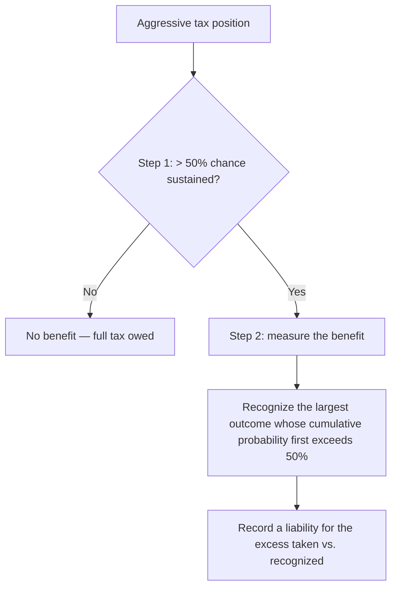

## 1. Uncertain Tax Positions

An **uncertain tax position** is an aggressive tax-return stance (a large deduction, unreported income, not filing). It must be **disclosed** and evaluated under the **more-likely-than-not (> 50%)** standard in a **two-step** approach:

1. **Recognition** — is there a **> 50%** chance the position would be sustained (assuming the taxing authority has full knowledge)? Evaluate each position **separately** on its technical merits. **Fail → no benefit recognized**, stop (don't defer anything).
2. **Measurement** — if it passes, recognize the **largest benefit** whose **cumulative probability of settlement first exceeds 50%**.



**Foxy Inc.** took a $2,000 deduction ($420 tax savings). Outcomes and cumulative probability: $420 at 26% → **$300 at 51%** (cumulative first exceeds 50%). Recognize a **$300** benefit and record an **income tax liability of $120** ($420 taken − $300 sustained).

> [!TRAP]
> Deferred taxes use the **enacted** (a.k.a. applicable) tax rate for the future reversal period. **Anticipated, proposed, or unsigned** rates are meaningless distractors. If Year 1's rate is 30% but the **enacted** future rate is 21%, current tax uses 30% and the **DTL uses 21%** (e.g., Stone Co.: taxable 200,000 × 30% = 60,000 current; DTL = 25,000 × 21% = 5,250; total expense 65,250).

## 2. Changes in Tax Rates and Entity Status

A change in the **enacted** tax rate is treated as a **change in estimate → prospective** (no restatement). Under the **liability method**, remeasure all DTL/DTA balances at the new rate; the effect hits **continuing operations** in the period of change, and it shifts the **annual effective tax rate**.

**Julie Co.** — beginning DTL $2,000 (a $10,000 temporary difference × the old 20%); a new $20,000 depreciation temporary difference this year; the enacted rate rises to **21%**. Required ending DTL = total temporary difference $30,000 × 21% = **$6,300** → adjustment $6,300 − $2,000 = **$4,300**. Current tax = 100,000 × 21% = 21,000.

```journal
{"desc": "Rate change — adjust DTL to the new enacted rate",
 "dr": [["Income tax expense — current", 21000], ["Income tax expense — deferred", 4300]],
 "cr": [["Income tax payable", 21000], ["Deferred tax liability", 4300]]}
```

- **Valuation-allowance reversal:** if a previously-unrealizable DTA becomes usable, reverse the allowance through **continuing operations** (adjustment = required ending balance − current balance).
- **Entity-type change:** taxable → **pass-through** (C-corp → partnership/S-corp) **writes off** existing DTL/DTA; pass-through → **taxable** may **create** new DTL/DTA. The effect is in **continuing operations** in the period of change.
- **Balance-sheet presentation:** **net** DTAs and DTLs into a **single non-current** amount (reversal timing is irrelevant to classification); separate only across different tax-paying components or jurisdictions.

## 3. Net Operating Losses

An **NOL creates a DTA** (a "gift certificate" — future tax savings without cash out). The entry **debits DTA** (future benefit, balance sheet) and **credits income tax benefit**, which **reduces the current book loss** (not a contra-expense).

| NOL arose | Carryforward | Offset limit |
|---|---|---|
| **Pre-2018** | 20 years | 100% of future income |
| **2018+** | **Indefinite** | 100% (2018–2020), then **80%** from 2021 on |

**Company X** — 2021 NOL $200,000; 2022 income $100,000. Offset is capped at **80% × 100,000 = $80,000**, leaving **$20,000** taxable in 2022 and **$120,000** of NOL to carry forward.

A **valuation allowance** is required when it's **more likely than not (> 50%)** the NOL won't be used. **ABC Co.** — $60,000 NOL (DTA = 60,000 × 21% = **$12,600**); the only future income is **$10,000** in 2026, so usable = 80% × 10,000 = $8,000 → usable DTA = 8,000 × 21% = **$1,680**; the rest, 52,000 × 21% = **$10,920**, needs an allowance:

```journal
{"desc": "NOL DTA with valuation allowance",
 "dr": [["Deferred tax asset", 12600]],
 "cr": [["DTA valuation allowance", 10920], ["Income tax benefit", 1680]]}
```

## 4. Investee Undistributed Earnings and the DRD

For **unconsolidated** investees, the **dividends-received deduction (DRD)** prevents **triple taxation** and is a **permanent difference** (never reverses):

| Ownership | DRD exclusion |
|---|---|
| 0–19% | **50%** |
| 20–80% | **65%** |
| Over 80% | **100%** (tax consolidation threshold) |

**25%-owned investee:** book income = 25% × $2,400,000 net income = **$600,000**; taxable = 25% × $2,000,000 dividends = $500,000, of which **65% is excluded** → taxable dividend = 500,000 × 35% = **$175,000**. Current tax = 175,000 × 21% = 36,750. The $100,000 book-vs-tax **temporary difference** is only **35% taxable** ($35,000) → DTL = 35,000 × 21% = **$7,350** (taxable < book → DTL):

```journal
{"desc": "Investee earnings — current tax plus DTL (DRD is permanent)",
 "dr": [["Income tax expense — current", 36750], ["Income tax expense — deferred", 7350]],
 "cr": [["Income tax payable", 36750], ["Deferred tax liability", 7350]]}
```

## 5. Income Tax Disclosures and the GAAP-vs-IRC Summary

Disclose the components of **net DTA/DTL** and the **valuation allowance** (and its change); on the income statement, the tax expense/benefit from **continuing operations** and its significant components (current, deferred, investment credits, NOL benefits); tax allocated to **AOCI**; and rate-change/valuation adjustments. An **NOL benefit** stays in the **same location** it arose (continuing ops, discontinued, or OCI). New rules **disaggregate** tax by domestic/foreign and by **federal/state/foreign** jurisdiction (a jurisdiction ≥ **5%** of total tax is reported separately), plus a **rate reconciliation** (reported expense vs. income × applicable rate).

```schedule
{"caption": "GAAP vs. IRC — common differences",
 "columns": ["Item", "Difference", "Type"],
 "rows": [
   ["Installment sales (income later for tax)", "DTL (group 1)", "Temporary"],
   ["Prepaid rent/royalties (taxed when received)", "DTA (group 2)", "Temporary"],
   ["Bad debt, warranties, pension, startup costs", "DTA (group 3)", "Temporary"],
   ["Accelerated (MACRS) depreciation, franchise amortization", "DTL (group 4)", "Temporary"],
   ["Muni interest, key-person insurance, fines, entertainment, DRD, officer comp > $1M", "No deferral", "Permanent"],
   ["Net operating loss / net capital loss", "Carryforward", "Temporary"]
 ]}
```

```recap
1. Uncertain tax positions use a two-step more-likely-than-not (>50%) test: recognize only if sustainable, then measure the largest outcome whose cumulative probability first exceeds 50%, recording a liability for the excess.
2. Deferred taxes use the enacted future rate (not anticipated/proposed); rate changes are prospective changes in estimate that remeasure DTL/DTA through continuing operations; net into one non-current balance-sheet amount.
3. NOLs create a DTA; 2018+ losses carry forward indefinitely but offset only 80% of income from 2021 on; a valuation allowance is needed when it's more likely than not the DTA won't be realized.
4. The DRD (50%/65%/100% by ownership) is a permanent difference preventing triple taxation; only the non-excluded portion of an investee difference is taxable.
5. Disclose net DTA/DTL components, valuation allowances, continuing-operations tax, jurisdiction disaggregation (≥5% rule), and a rate reconciliation; NOL benefits stay in their original statement location.
```
