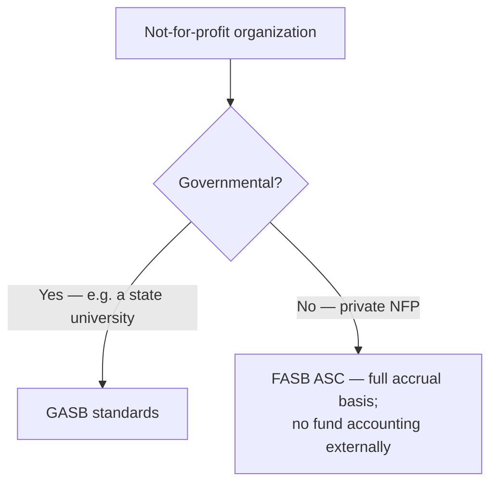
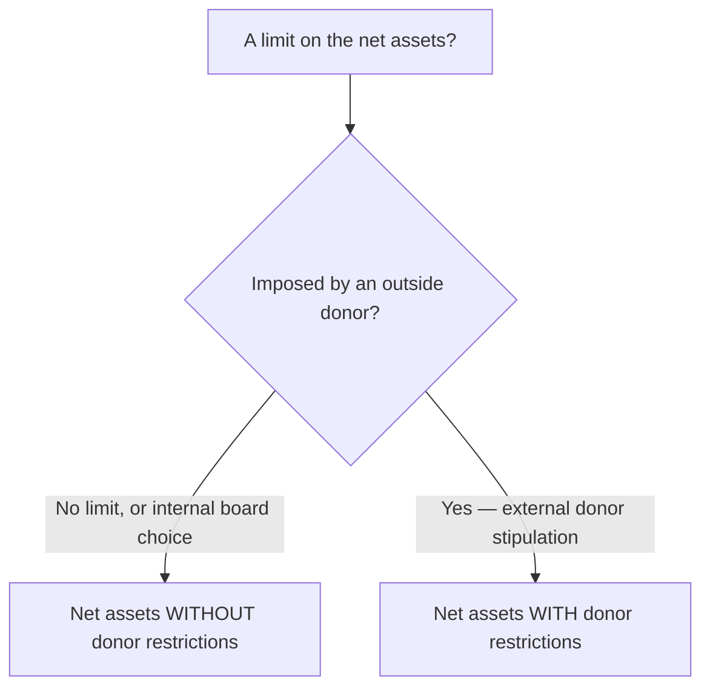
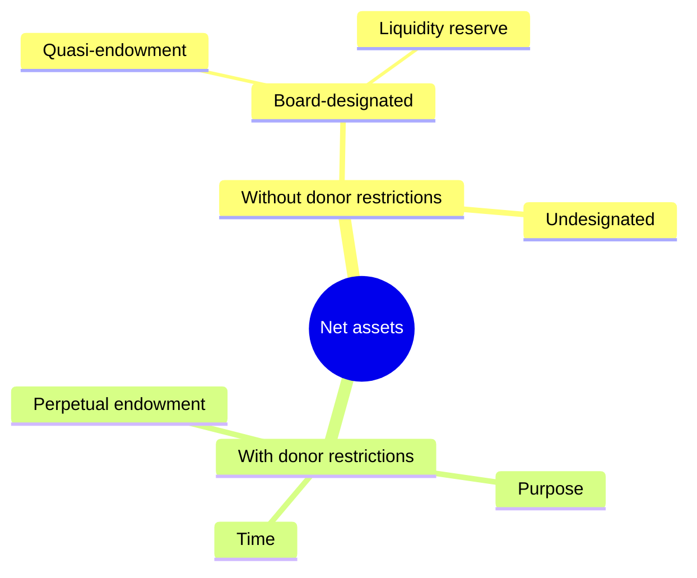
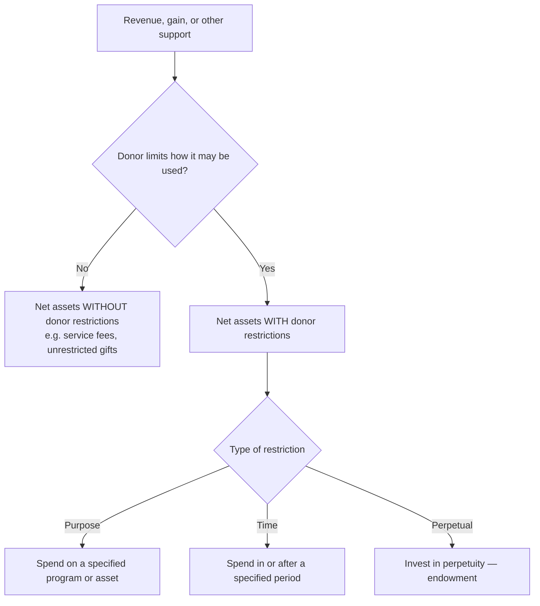
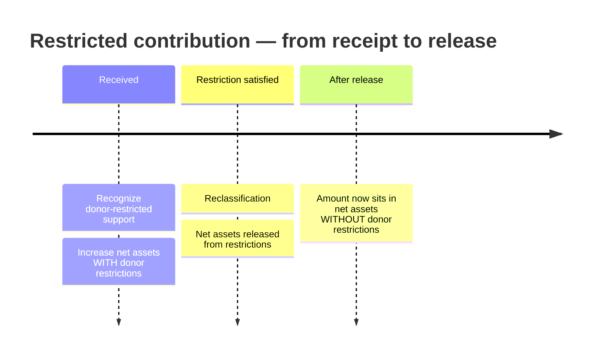

## 1. What Makes Not-for-Profit Accounting Different

A **not-for-profit (NFP)** organization exists for a purpose **other than profit** (though nothing prevents it from generating one). The FASB defines an NFP by three traits that separate it from a business enterprise:

| Trait | Business enterprise | Not-for-profit |
|---|---|---|
| **Revenue source** | Sales/exchange transactions | Significant **contributions** (nonreciprocal) |
| **Operating purpose** | Profit | Mission/service — profit not the purpose |
| **Ownership interest** | Stockholders with residual claim | **No** defined ownership/residual interest |

NFPs still **follow GAAP on the full accrual basis**. What changes is terminology, the statement set, and how donor restrictions are tracked.

**Four industry categories use NFP accounting:**

| Category | Examples |
|---|---|
| **Health care** | Hospitals, nursing homes, hospices |
| **Educational** | Colleges, universities, other schools |
| **Voluntary health & welfare** | United Way, American Red Cross, March of Dimes |
| **Other private NFP** | Cemetery, fraternal, professional, labor unions, performing arts, museums, libraries |

**Who reads the statements, and what they need to assess:** donors, members, creditors, and other resource providers use NFP statements to judge the **services provided**, the organization's **ability to keep providing them**, and how management **discharges its stewardship**. Each information need maps to a specific statement:

| Information the user needs | Provided by |
|---|---|
| Amount & nature of assets, liabilities, net assets | **Statement of financial position** |
| Effects of events that change net assets | Statement of activities |
| Inflows & outflows of resources in a period | Statement of activities |
| Relationship between inflows and outflows | Statement of activities |
| How the organization obtains and spends cash | **Statement of cash flows** |
| Service efforts of the organization | Statement of activities **or** notes |

**Which standard-setter applies** turns on whether the NFP is governmental:



> [!RULE]
> External NFP statements report the **organization as a whole** on the **full accrual basis** — they do **not** present funds. Separate funds may be kept for **internal** purposes, but fund accounting never appears in the external statements. (Governments are the opposite — see M5–M6.) Consistent FASB reporting lets users compare one NFP against another.

## 2. The Required Financial Statements

A complete set of general-purpose external NFP statements has **three** members, each with a commercial cousin:

| NFP statement | Commercial equivalent | Reports |
|---|---|---|
| **Statement of financial position** | Balance sheet | Assets, liabilities, **net assets** |
| **Statement of activities** | Income statement + statement of changes in retained earnings | Revenues, expenses, gains/losses, **reclassifications** → change in net assets |
| **Statement of cash flows** | Statement of cash flows (direct **or** indirect) | Cash receipts and payments (see M2) |

There is **no separate statement of retained earnings** and **no fund financial statements**. Equity is replaced by **net assets**.

Every NFP must also report the relationship between the **functional** and **natural** classifications of its expenses **in one location** — covered in §5.

## 3. Statement of Financial Position

The statement of financial position has **three components: assets, liabilities, and net assets** (equity). Presentation follows ordering rules:

| Principle | Rule |
|---|---|
| **Classification** | Current vs. non-current |
| **Assets** | Sequenced by **nearness to cash** |
| **Liabilities** | Sequenced by **nearness to maturity** |
| **Restricted/designated for non-current use** | Shown as **non-current** (e.g., cash set aside for debt retirement or to buy long-lived assets) |

### Net asset classes

Net assets carry **one or both** classifications, defined purely by **who** imposed the limit:





| | Without donor restrictions | With donor restrictions |
|---|---|---|
| **Who limits it** | No one, or the **governing board** (internal) | An **outside donor** (external) |
| **Spendable at board discretion?** | **Yes** | Only per the donor's stipulation |
| **Examples** | Undesignated funds; **board-designated** endowments and reserves | Purpose, time, or **perpetual (endowment)** restrictions |

> [!TRAP]
> **Board-designated funds are "without donor restrictions."** A board can carve out a "board-designated endowment" or reserve, but because the limit is **self-imposed** it stays in **net assets without donor restrictions**. The examiners bait candidates with answers that push board-designated amounts into the *with* class — only an **external donor** creates a *with-donor-restrictions* balance.

### Required disclosures

Beyond the face of the statement, NFPs disclose how liquid their resources are:

| Disclosure | Covers |
|---|---|
| **Qualitative** | The **type** of asset whose use is limited, the **nature and amount** of the limit, contractual limits, **how and when** resources can be used, and how the org **manages liquidity** to meet cash needs within one year |
| **Quantitative** | The **availability** of liquid resources, as reduced by **external** (donor) limits and **internal** (board) limits |

## 4. Statement of Activities

The statement of activities reports **revenues and expenses gross**, **gains and losses often net**, and **reclassifications** between net asset classes. It presents **three required elements**:

1. Change in net assets **without donor restrictions**
2. Change in net assets **with donor restrictions**
3. Change in **total** net assets

Preparers have **format latitude** (revenues→expenses→gains→losses→reclassifications, or expenses-first, etc.), subject to a few rules:

- Any **intermediate total** (e.g., "operating income") must be explained in the **notes**.
- **Prior-period adjustments** and **changes in accounting principle** adjust **beginning** net assets.
- Items that would be **other comprehensive income** in commercial accounting appear in the statement of activities **after operating income**.

### Classifying revenue and support

Revenue is **without donor restrictions unless a donor limits its use** — then it is donor-restricted support:



All restricted revenue lands in the **same** *with-donor-restrictions* class regardless of whether the restriction is temporary or perpetual; the NFP may still **itemize** the character of the restrictions on the face or in the notes.

### Reclassification — "net assets released from restrictions"

When a donor restriction is **later satisfied**, a **reclassification** simultaneously **increases** net assets *without* restrictions and **decreases** net assets *with* restrictions — this line is titled **"net assets released from restrictions."**



The release shows up as a **positive** in the *without* column and a **negative** in the *with* column, netting to zero on the total:

```schedule
{"caption": "How a satisfied restriction moves between columns (statement-of-activities excerpt)",
 "columns": ["Item", "Without donor restrictions", "With donor restrictions", "Total"],
 "rows": [
   ["Purpose-restricted gift received (prior year)", "—", "8,990", "8,990"],
   ["This year — program restriction satisfied", "8,990", "(8,990)", "—"],
   ["Line shown: net assets released from restrictions", "+8,990", "(8,990)", "0"]
 ]}
```

> [!EXAM]
> **Two reclassification fine points.** (1) **Simultaneous release option:** if a restriction is met in the **same period** the gift is received, the NFP *may* record it directly in net assets **without** restrictions — but only if it **discloses and consistently applies** that policy (illustration: a clinic that routinely spends its state indigent-care subsidy in the year received). (2) **Perpetual restrictions are never reclassified** — an endowment's restriction never expires, so it stays in the *with* class. Likewise, unrestricted support does **not** later become restricted.

### Classifying expenses

**Almost all expenses decrease net assets *without* donor restrictions.** The sole exception is **investment expense**, which is **netted against investment return** and follows that return's classification.

> [!RULE]
> Report **all** expenses in net assets **without** donor restrictions — **except investment expenses**, which are netted against investment income and classified with it. Expenses are shown by **function**, with the functional-to-natural relationship on the face or in the notes.

## 5. Reporting Expenses by Nature and Function

Every NFP must show the link between **functional** and **natural** expense classifications **in one location**, presented one of **three ways**: on the **face** of the statement of activities, as a **schedule in the notes**, or as a **separate statement** (the FASB gives it no required title).

| Classification | Groups costs by… | Examples |
|---|---|---|
| **Functional** | **Why** the money was spent (activity) | Program services; supporting services |
| **Natural** | **What** was bought (object) | Salaries, rent, utilities, supplies, depreciation, interest |

**Functional splits into two families:**

| Program services | Supporting services |
|---|---|
| The activities the org is **chartered** to perform | Everything **not** a program service |
| University → education & research | **Fundraising** |
| Hospital → patient care & education | **Membership development** |
| Union → labor negotiations & training | **Management & general** (administration) |

> [!MNEMONIC]
> **Program = Purpose.** If a cost directly advances the mission, it is a **program** service; if it merely keeps the lights on or brings money/members in (management & general, fundraising, membership development), it is a **supporting** service.

The two views meet in a **nature-by-function matrix** — each natural line item spread across the functional columns. Costs serving more than one function (depreciation, interest, occupancy → by **square footage**; salaries → by **estimated time and effort**) are **allocated on a reasonable, consistent basis**:

```schedule
{"caption": "Expenses by nature (rows) and function (columns), in thousands",
 "columns": ["Natural line item", "Program services", "Management & general", "Fundraising", "Total"],
 "rows": [
   ["Salaries and benefits", "13,025", "1,130", "960", "15,115"],
   ["Grants to other organizations", "4,750", "—", "—", "4,750"],
   ["Supplies and travel", "2,402", "213", "540", "3,155"],
   ["Services and professional fees", "2,250", "200", "390", "2,840"],
   ["Office and occupancy", "2,210", "218", "100", "2,528"],
   ["Depreciation", "2,810", "250", "140", "3,200"],
   ["Interest", "335", "27", "20", "382"]
 ],
 "totals": ["Total expenses", "27,782", "2,038", "2,150", "31,970"]}
```

```recap
1. An NFP serves a mission rather than profit, is funded by nonreciprocal contributions, and has no ownership interest; it reports on the full accrual basis under FASB ASC — unless it is governmental, in which case GASB governs.
2. External statements show the organization as a whole with no fund accounting; the required set is the statement of financial position, statement of activities, and statement of cash flows.
3. Net assets are classed only by who imposed the limit: without donor restrictions (including internal board-designated amounts) vs. with donor restrictions (external donor stipulations — purpose, time, or perpetual).
4. Board-designated funds are always "without donor restrictions"; only an outside donor creates a "with donor restrictions" balance.
5. The statement of activities presents change in net assets without, with, and in total; revenue is unrestricted unless a donor limits its use.
6. When a restriction is satisfied, a reclassification ("net assets released from restrictions") adds to the without class and subtracts from the with class; perpetual restrictions are never released, and a same-period release may be shown directly in the without class if consistently disclosed.
7. All expenses reduce net assets without donor restrictions except investment expense (netted against investment return); NFPs must report expenses by both nature and function in one location, allocating shared costs on a reasonable, consistent basis.
```
