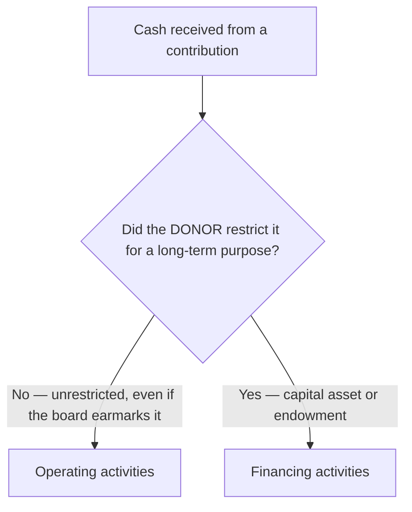

## 1. Purpose and Methods

The **statement of cash flows is required for all NFPs**. FASB **ASC 230** applies except where it conflicts with industry guidance. Its purpose is the same as in commercial accounting — explain the period's **cash receipts and payments** — and it keeps the same **three classifications**: **operating, investing, financing**.

An NFP may use the **direct or indirect** method, with one relief:

| | For-profit | Not-for-profit |
|---|---|---|
| **Direct method** | Allowed, **but** must still attach the indirect reconciliation | Allowed — **no reconciliation required** |
| **Indirect method** | Reconciles net income → operating cash | Reconciles **change in net assets** → operating cash |

> [!RULE]
> An NFP using the **direct method does not have to present the reconciliation** of change in net assets to cash from operations — a genuine simplification versus for-profit entities, which must attach it either way.

## 2. Classifying the Cash Flows — the NFP Twist

The three buckets look commercial, but one rule reshapes them: **cash from contributions the donor restricted for long-term purposes is a FINANCING inflow**, not operating. Everything hinges on **who restricted the cash and for how long**:



| Activity | What lands here (NFP specifics) |
|---|---|
| **Operating** (residual bucket) | Gross receipts by class — **contributions, program income, interest & dividend income** (unrestricted); lawsuit settlements; insurance proceeds not tied to investing/financing; supplier/customer **refunds**; charitable contributions **the NFP makes**; **unrestricted** resources the **board** designates for long-lived assets; sale of unrestricted financial assets; interest **paid**; **agency** transactions |
| **Investing** | Buy/sell **PP&E**; buy/sell **works of art**; proceeds from selling assets whose sale was donor-restricted to equipment |
| **Financing** | Issue/repay **debt** (bonds, notes, mortgages); **contributions restricted for PP&E / long-lived assets**; **contributions restricted for a donor-restricted endowment**; **interest & dividends restricted for reinvestment** |

> [!TRAP]
> **The board-vs-donor mirror.** *Unrestricted* resources the **board** earmarks for buildings or equipment stay in **operating** — a self-imposed designation does not change cash-flow class. But a **donor** restriction for long-lived assets or an endowment pushes the cash to **financing**. Same destination (a building), opposite classification — decided entirely by **who** imposed the limit.

> [!MNEMONIC]
> **Donor-restricted for the long haul → Financing.** Capital-asset and endowment gifts a donor locked up are financing inflows; the statement may segregate them as **"Proceeds from donor-restricted contributions"** vs. **"Other financing activities."**

## 3. Cash, Restricted Cash, and Noncash Disclosures

The statement explains the change in **total cash, cash equivalents, and restricted cash** — consistent with commercial reporting.

> [!EXAM]
> **Restricted cash is inside the total, and internal transfers are invisible.** Amounts described as **restricted cash** are included in the beginning/ending cash total that the statement reconciles. **Transfers among cash, cash equivalents, and restricted cash are NOT reported as cash-flow activities** — they never appear as operating/investing/financing lines. A note reconciles the cash captions on the statement of financial position to the single cash total on the statement of cash flows.

**Noncash transactions to disclose** (they moved value but no cash):

- **Contributed securities**
- **Construction in progress** and other fixed-asset purchases sitting in **accounts payable**
- **Contributions of beneficial interests** — unconditional promises to receive specified cash flows from a **charitable trust** or pool of assets (see M4)
- **Noncash debt refinancing** (changed interest rate or terms)

## 4. Indirect-Method Operating Section

Under the indirect method the operating section starts at the **change in net assets**, then **removes** anything that is noncash or belongs in another section — including the donor-restricted contributions and restricted investment income that were classified as **financing**, and investment gains (noncash/investing):

**Q — For an NFP with a change in net assets of 15,450, show how the indirect-method operating section strips out non-operating items. Depreciation is 3,200; the gain on an equipment sale is 200; contributions restricted for long-term investment are 2,740; interest and dividends restricted for reinvestment are 300; realized and unrealized investment gains are 15,800; all remaining working-capital and noncash adjustments net to +160. Compute net cash used by operating activities.**

```schedule
{"caption": "Indirect-method operating section — reconciling change in net assets to operating cash (in thousands)",
 "columns": ["Reconciling item", "Reason", "Add / (Deduct)"],
 "rows": [
   ["Change in net assets", "Starting point", "15,450"],
   ["Depreciation", "Noncash expense — add back", "3,200"],
   ["Gain on sale of equipment", "Investing item — remove", "(200)"],
   ["Contributions restricted for long-term investment", "Reported in financing — remove", "(2,740)"],
   ["Interest & dividends restricted for reinvestment", "Reported in financing — remove", "(300)"],
   ["Realized & unrealized gains on investments", "Noncash / investing — remove", "(15,800)"],
   ["Other working-capital & noncash changes, net", "Receivables, payables, losses, etc.", "160"]
 ],
 "totals": ["Net cash used by operating activities", "", "(230)"]}
```

The three "remove" lines are the NFP signature: any cash a **donor** locked into a long-term purpose was already counted in **financing**, so it must be **subtracted** here to avoid double-counting. Investing and financing sections then report those same restricted inflows and the capital-asset/debt flows in the usual way.

```recap
1. The statement of cash flows is required for all NFPs under ASC 230, keeps the commercial operating/investing/financing structure, and allows the direct or indirect method — but the direct method needs no reconciliation.
2. Operating is the residual bucket: unrestricted contributions, program income, interest/dividend income, refunds, settlements, and even unrestricted amounts the board earmarks for long-lived assets.
3. Financing is where NFPs differ most: it holds debt flows plus contributions a donor restricted for capital assets or endowments, and investment income restricted for reinvestment.
4. Board-designated (internal) amounts for long-lived assets stay operating; donor-restricted (external) amounts for the same assets go to financing — who imposed the limit decides the class.
5. The statement reconciles total cash, cash equivalents, and restricted cash; transfers among those are not cash-flow activities; disclose noncash items such as contributed securities and beneficial interests.
6. Under the indirect method, start at change in net assets and subtract the donor-restricted contributions, restricted investment income, and investment gains that belong in financing or investing.
```
