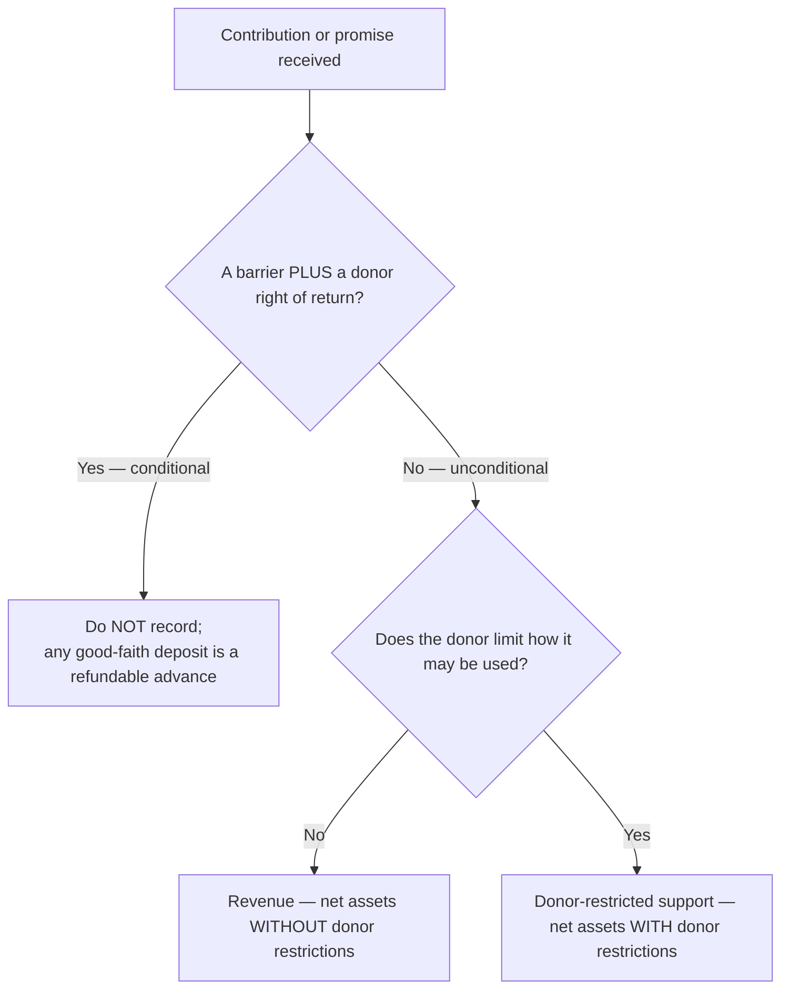
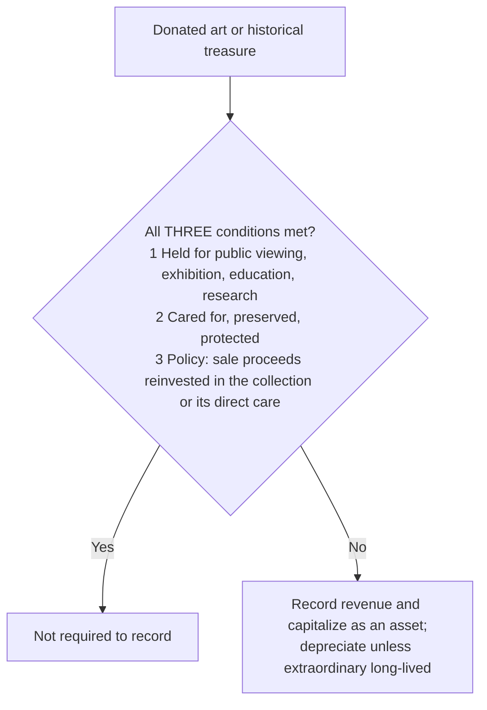

## 1. What Is a Contribution? Conditional vs. Unconditional

A **contribution** is an **unconditional**, **voluntary**, **nonreciprocal** transfer of cash or other assets where **title passes** and **collection is certain**. It may take the form of **cash, services, or other assets**. Two independent questions decide the accounting:



**Unconditional** contributions are recognized **when received** — as **revenue** if they are part of core/ongoing operations, or a **gain** if incidental — and land in net assets **with or without** donor restrictions. **Conditional** contributions are **not recognized** at all until the condition is met.

> [!TRAP]
> **Two different axes — never merge them.** *Conditional vs. unconditional* is a **recognition** question (do we record it yet?); *with vs. without donor restrictions* is a **classification** question (which net-asset column?). A gift can be unconditional-restricted, unconditional-unrestricted, or conditional (not recorded either way):
>
> | | Without donor restrictions | With donor restrictions |
> |---|---|---|
> | **Unconditional** | Record now, unrestricted | Record now, restricted |
> | **Conditional** | **Not recorded** until condition met | **Not recorded** until condition met |

A **condition** exists when there is a **barrier** the NFP must overcome **and** the donor keeps a **right of return**. A **restriction** merely dictates **how** the resources may be spent. Barriers that signal a condition include **specified service levels**, **specific outputs/outcomes**, a **matching** requirement, or an **outside event** — plus the donor's **right of return**.

When a conditional promise arrives with a **good-faith deposit**, the cash is a **liability** (refundable advance) until the condition is met:

```journal
{"desc": "Good-faith deposit on a conditional promise — not yet revenue",
 "dr": [["Cash", 100000]],
 "cr": [["Refundable advance (liability)", 100000]]}
```

## 2. Promises to Give (Pledges)

A **pledge** is a promise to give. An **unconditional** pledge is recorded at **fair value when the promise is made** (written or verbal — verbal should be documented internally). A **conditional** pledge is **not recorded** until the conditions are substantially met (or the chance of failing them is **remote**).

| Feature | Rule |
|---|---|
| **Multiyear pledge** | Recorded at **net present value** at the pledge date; future collections are **time-restricted** (with donor restrictions) |
| **PV accretion** | The difference between recorded PV and the amount later collected is **contribution revenue — not interest income** |
| **Uncollectible pledges** | Presented at **net realizable value** like commercial A/R, **but no bad-debt / credit-loss expense is ever recorded** — the pledge and revenue are shown **net of the allowance** |

**Q — The League receives legally enforceable pledges of $200,000 without donor restrictions and $150,000 restricted for capital additions; experience shows 10% of pledges prove uncollectible. What are net pledges receivable?**

```schedule
{"caption": "Net pledges receivable — the League",
 "columns": ["Component", "Amount"],
 "rows": [
   ["Pledges without donor restrictions", "200,000"],
   ["Pledges donor-restricted for capital additions", "150,000"],
   ["= Gross pledges receivable", "350,000"],
   ["− Allowance for uncollectible (10% × 350,000)", "(35,000)"],
   ["= Net pledges receivable", "315,000"]
 ]}
```

### Placed-in-service approach (donated long-lived assets)

Used to report the **expiration of restrictions** on a contributed long-lived asset when the donor gives **no specific restriction**:

| Scenario | Accounting |
|---|---|
| Donor places **no restriction** on a building (used immediately in the mission) | Recognize the **entire** value as a contribution **without** donor restrictions (placed in service) |
| Donor **restricts** use (e.g., reverts if not used for a program) | Record the building as an asset and **donor-restricted support**; each year record **depreciation** and **reclassify** an equal amount from *with* to *without* restrictions |

## 3. Donated Services

Donated services are **generally not recorded** (hard to value, no control). They are recognized — as an expense/asset and offsetting contribution — **only** when they meet the criteria:

> [!MNEMONIC]
> Record donated services only **SOME** of the time — **S**pecialized skills required and possessed by the donor, **O**therwise the org would have purchased them, **M**easurable, **E**asily (at fair value). Or the service **creates/enhances a nonfinancial asset** (land, building, inventory).

The entry is a wash — expense (or asset) up, contribution up, **net zero** change in net assets:

```journal
{"desc": "Professional roofer repairs a building at no charge (FV of work $10,000)",
 "dr": [["Repair expense", 10000]],
 "cr": [["Contributions — without donor restrictions", 10000]]}
```

Examples: an **attorney's** general counsel or a **doctor's** below-market services are recognized (specialized skills); a volunteer filling a **budgeted** office position is recognized; an **unbudgeted** general-office volunteer is **not**. **Volunteer-recruitment costs are fundraising expenses** whether or not the services themselves qualify.

## 4. Donated Collection Items, Materials, and Gifts-in-Kind

### Collection items (art, historical treasures)



The policy **cannot be selectively applied**. An **extraordinary long-lived** work need **not be depreciated** if it has cultural/aesthetic/historical value worth preserving perpetually **and** there is verifiable ability and intent to preserve it essentially undiminished.

### Donated materials and gifts-in-kind

| Situation | Treatment |
|---|---|
| **Used in operations**, significant, FV objectively determinable | Record as an **asset**: DR Asset / CR Contribution — support |
| **Passes through** to a beneficiary (e.g., used clothing) | **Not recorded** unless substantial; if substantial → revenue with **offsetting expense**: DR Expense / CR Contribution — supplies |
| **Sold above fair value** (e.g., thrift resale) | Excess over FV is an **additional contribution** |

**Gifts-in-kind** are nonfinancial contributions (land, buildings, materials, intangibles, services, use of facilities), recognized at **fair value** at donation. When donated for a **fundraising appeal**, they are valued at FV when received and **revalued when sold**; the difference is an **additional contribution**. Contributed **nonfinancial assets** appear as a **separate line item** on the statement of activities, disclosed **by category** (whether they will be sold, any donor restrictions, and how valued).

## 5. Recording Pledges — Restricted and Time-Restricted

An **unconditional promise to give in the future** is reported as **donor-restricted support** (an **implied time restriction**) at the **present value** of estimated future cash flows; if collectible in **under one year**, **net realizable value** is an acceptable proxy for fair value.

```journal
{"desc": "Unconditional multiyear pledge — implied time restriction, at present value",
 "dr": [["Pledge receivable — with donor restrictions", 90000]],
 "cr": [["Allowance for uncollectible pledges", 5000], ["Contributions — with donor restrictions", 85000]]}
```

When the pledge is **collected** (time restriction satisfied) or the restricted funds are **spent** on their purpose, a **reclassification** moves the amount from *with* to *without* restrictions — the same "net assets released from restrictions" mechanic from M1 (simultaneously increases the *without* class and decreases the *with* class).

## 6. Fundraising and Exchange Transactions

**Fundraising with premiums:** when a donor receives a token premium (calendar, mug, tote), only the **excess of the gift over the premium's fair value** is **contribution revenue**; the **cost of the premium** is a **fundraising expense**.

> [!EXAM]
> **Fundraising formula:** Contribution revenue = **total received − fair value of premiums given**. If a supporter pays $100 for a mug worth $15, contribution revenue is **$85**.

**Exchange transactions** are reciprocal — the NFP earns resources by performing a service. They are recognized **when realized/realizable and earned** and are always **without donor restrictions**. Examples: **student tuition and fees**, **patient service revenue**, and **membership fees**.

## 7. Industry-Specific Revenue: Education and Health Care

### Educational institutions

Revenues are **increases in net assets without donor restrictions** — tuition and fees, government grants/contracts, endowment income, sales/services of departments, and **auxiliary enterprises** (food service, residence halls, campus store, athletics) — **plus** donor-restricted resources expended in the period.

> [!EXAM]
> **Tuition is reported gross.** Gross revenue from tuition and fees = **assessed tuition and fees − canceled classes**. **Scholarships, tuition waivers, and similar reductions** are treated as **expenditures** or as a **separately displayed allowance** reducing revenue — never as a simple netting.

### Health care organizations

**Patient service revenue** is recorded on the **accrual basis at standard (usual and customary) rates**, gross, even if full collection is not expected — then reduced to **net patient service revenue**:

```schedule
{"caption": "Gross to net patient service revenue",
 "columns": ["Line", "Amount"],
 "rows": [
   ["Gross patient service revenue (standard rates)", "100,000"],
   ["− Charity care (never expected to be collected)", "(10,000)"],
   ["= Patient service revenue", "90,000"]
 ]}
```

**Charity care** — care never expected to produce cash — is **not** a receivable or revenue (disclose the policy). Deductions from gross to reach **net patient service revenue** include **contractual adjustments** (third-party payors), **policy discounts**, and **administrative adjustments**.

> [!TRAP]
> **Credit losses get one of two treatments.** (1) An **operating expense** when the loss is on revenue the hospital **expected** to earn (a self-pay patient was screened, billed, and did not pay). (2) A **deduction from revenue** when large volumes were **never assessed** for ability to pay. Charity care is **neither** — it is simply never recognized.

**Capitation (premium) revenue** is a fixed per-member amount paid periodically to provide care for that period. Health-care revenue sorts into **three reporting categories**:

| Category | Includes |
|---|---|
| **Patient service revenue** | Standard-rate patient charges, net of deductions |
| **Other operating revenue** | Educational programs, cafeteria, parking — **and donated supplies** |
| **Nonoperating revenue** | Interest/dividends, gifts and bequests, grants, endowment income, board-designated fund income — **and donated services** |

```recap
1. A contribution is an unconditional, voluntary, nonreciprocal transfer; unconditional gifts are recognized when received (revenue if core, gain if incidental), while conditional gifts — a barrier plus a donor right of return — are not recorded, with any deposit held as a refundable advance.
2. Conditional-vs-unconditional is about recognition; with-vs-without donor restrictions is about classification — keep the two axes separate.
3. Unconditional pledges are recorded at fair value (multiyear at present value, time-restricted); PV accretion is contribution revenue, not interest; pledges are shown net of an allowance with no bad-debt expense.
4. Donated services are recorded only when they require specialized skills the donor possesses and the org would otherwise buy, or they enhance a nonfinancial asset — a net-zero expense-and-contribution entry.
5. Donated collection items need not be recorded if all three collection conditions are met; donated materials are an asset if used in operations, expense/revenue if passed through, with any sale above fair value an added contribution; gifts-in-kind are recognized at fair value and shown as a separate line.
6. Fundraising contribution revenue is the gift less the fair value of any premium; exchange transactions (tuition, patient service, membership) are earned revenue without donor restrictions.
7. Educational revenue is largely unrestricted with tuition reported gross (less canceled classes; scholarships as expense/allowance); health-care patient service revenue is gross at standard rates less charity care and other deductions, sorted into patient service, other operating (donated supplies), and nonoperating (donated services).
```
