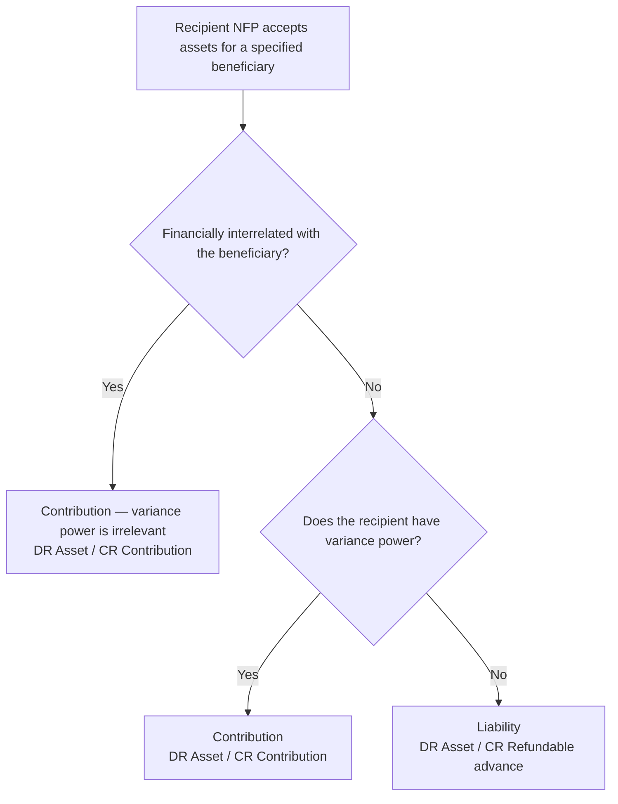
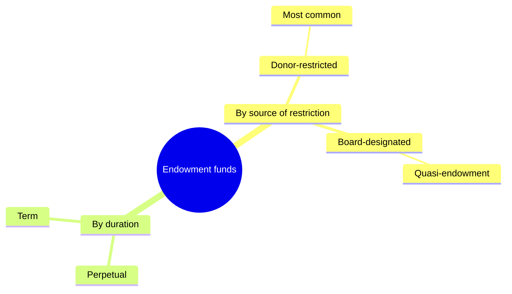

## 1. Transfers Through an Intermediary — the Three Roles

Sometimes a donor gives assets to one NFP (a foundation) to hold or pass along to another (the operating charity). Three roles appear:

| Role | Who |
|---|---|
| **Resource provider** | The party supplying the assets — a donor, government, agency, or business |
| **Recipient entity** | The NFP that **accepts** the assets to use for, or transfer to, a specified beneficiary |
| **Beneficiary entity** | The NFP the assets are ultimately **for** |

Two features drive the accounting:

- **Financially interrelated** — the two organizations are interrelated when **one can influence the other's operating and financial decisions** *and* has an **ongoing economic interest in the other's net assets** (both required).
- **Variance power** — the recipient's ability to **redirect** the resources to a **different** beneficiary, overriding the donor **without** anyone's approval. Without it, the recipient is bound to the provider's instructions.

## 2. Recipient Accounting

The recipient records a **contribution** in every case **except** one — when it is **not** financially interrelated **and** has **no** variance power, the assets are a mere pass-through and become a **liability**:

| | No variance power | With variance power |
|---|---|---|
| **Financially interrelated** | **Contribution** | **Contribution** |
| **Not interrelated** | **Liability** (refundable advance) | **Contribution** |



**When the transfer is a liability** (DR Asset at fair value / CR Refundable advance), the assets are **not** a contribution:

```journal
{"desc": "Recipient — not interrelated, no variance power: hold assets for a beneficiary",
 "dr": [["Asset (at fair value)", 500000]],
 "cr": [["Refundable advance (liability)", 500000]]}
```

Treat the transfer as a **liability** when the provider **can change the beneficiary**, the transfer is **conditional/revocable/repayable**, the provider **controls** the recipient and names an **unaffiliated** beneficiary, or the provider names **itself or an affiliate** as beneficiary without qualifying for equity accounting. Otherwise (variance power, or interrelated) it is a **contribution** — recognized when received and **expensed when distributed** to the beneficiary.

## 3. Beneficiary Accounting

A specified beneficiary recognizes its **rights** to assets the recipient holds — **unless** the recipient was granted **variance power** (then the beneficiary recognizes nothing):

| Situation | Beneficiary recognizes | Entry |
|---|---|---|
| Not interrelated; recipient has **no** variance power | **Receivable and contribution** (like any unconditional promise) | DR Receivable / CR Contribution |
| Not interrelated; unconditional right to **specified cash flows from a pool** (nonfinancial donations held) | **Beneficial interest** | DR Beneficial interest / CR Contribution |
| **Financially interrelated** | **Change in its interest** in the recipient's net assets | DR Interest in recipient net assets / CR Change in interest |
| Recipient has **variance power** | Nothing | — |

**Q — Farleigh State University (private NFP) created the financially interrelated Farleigh State Foundation to manage its investments. An alumnus donates investments worth $25,000,000 to the Foundation, stipulating the earnings fund university scholarships. Record both sides.**

```journal
{"desc": "Foundation (recipient, interrelated, no variance power) — records a contribution",
 "dr": [["Investments", 25000000]],
 "cr": [["Contribution", 25000000]]}
```

```journal
{"desc": "University (beneficiary, interrelated) — records its interest in the Foundation's net assets",
 "dr": [["Interest in FSF net assets", 25000000]],
 "cr": [["Change in interest in FSF net assets", 25000000]]}
```

## 4. Endowment Funds

An **endowment** holds assets invested to generate **income** for the NFP's maintenance. Two attributes classify it — **who** restricted it and for **how long**:



| | Donor-restricted endowment | Board-designated endowment |
|---|---|---|
| **Created by** | A **donor** stipulation to invest in perpetuity or for a term | The **governing board** setting aside unrestricted net assets |
| **Net-asset class** | **With** donor restrictions | **Without** donor restrictions |
| **Also called** | (most common form) | Quasi-endowment / funds functioning as endowment |

*Example:* Ben Benefactor gives $10,000,000 to be held in perpetuity with earnings funding a professorship → **net assets with donor restrictions** (donor-restricted, perpetual). The board setting aside $8,000,000 for 20 years → **net assets without donor restrictions** (board-designated, term).

**Changes in value of a donor-restricted endowment:** the original gift and its returns start **with** donor restrictions; investment income is deemed **available for spending** (moves to *without* restrictions) **unless** a purpose or other restriction applies. Returns subject to a donor restriction stay **with** restrictions **until appropriated for expenditure** — that is, until the board **approves** spending that meets the donor's time or purpose restriction.

### Underwater endowments

A donor-restricted endowment is **underwater** when its fair value falls **below the original gift** (or the level the donor/law requires). **Accumulated losses stay with the endowment in net assets *with* donor restrictions** (not moved out).

> [!MNEMONIC]
> An underwater endowment discloses how hard it will be for beneficiaries to be **FED**: **F**air value of the underwater endowment, **E**ndowment gift's original amount, **D**eficiency.

**Q — Ben Benefactor's $10,000,000 perpetual endowment has a year-end fair value of $9,750,000. What does Private University disclose?**

```schedule
{"caption": "Underwater endowment disclosure (FED)",
 "columns": ["Item", "Amount"],
 "rows": [
   ["Fair value of the endowment", "9,750,000"],
   ["Original endowment gift", "10,000,000"],
   ["Deficiency", "(250,000)"]
 ]}
```

**All endowments** also disclose the board's interpretation of the classification rules, appropriation and investment policies, the **composition by net-asset class**, and a **reconciliation** of beginning and ending balances by class.

## 5. Investments and Basis of Assets

**Financial instruments:** all **debt** securities and **equity** securities with **readily determinable fair values** are carried at **fair value** on the statement of financial position.

> [!RULE]
> Realized and unrealized investment gains and losses, and investment income, are increases/decreases in net assets **without** donor restrictions **unless** the donor (or law) restricts the investment's use — then they are **with** restrictions (or *without*, if the restriction is met in the same period). Investment returns are reported **net of related investment expense**. **Derivatives** are remeasured to fair value each period with the change in income, and NFPs may **not** use special **hedge accounting**.

**Basis of assets:**

| Asset | Carried at |
|---|---|
| **Purchased** fixed assets | **Cost** (GAAP) |
| **Donated** fixed assets | **Fair value** at the gift date |
| Depreciation | Per GAAP for nongovernmental NFPs |
| **Works of art / historical treasures** | **Not depreciated** |

```recap
1. In an intermediary transfer, identify the resource provider, the recipient, and the beneficiary; financially interrelated means one can influence the other's decisions and holds an ongoing economic interest in its net assets.
2. The recipient records a contribution in every case except when it is not interrelated and lacks variance power — then the assets are a liability (refundable advance); variance power is irrelevant once the parties are interrelated.
3. The beneficiary recognizes a receivable/contribution (no interrelationship, no variance power), a beneficial interest (right to cash flows from a pool), or a change in its interest in the recipient's net assets (interrelated) — but nothing if the recipient holds variance power.
4. Endowments are classified by source (donor-restricted → with restrictions; board-designated/quasi-endowment → without) and duration (perpetual or term); donor-restricted returns stay with restrictions until appropriated for expenditure.
5. An underwater endowment keeps its accumulated losses within net assets with donor restrictions and discloses FED — fair value, original endowment gift, and deficiency.
6. Debt and readily-valued equity investments are at fair value with gains/losses and income unrestricted unless donor/law restricts them (net of investment expense; no hedge accounting); purchased assets are at cost, donated assets at fair value, and works of art are not depreciated.
```
