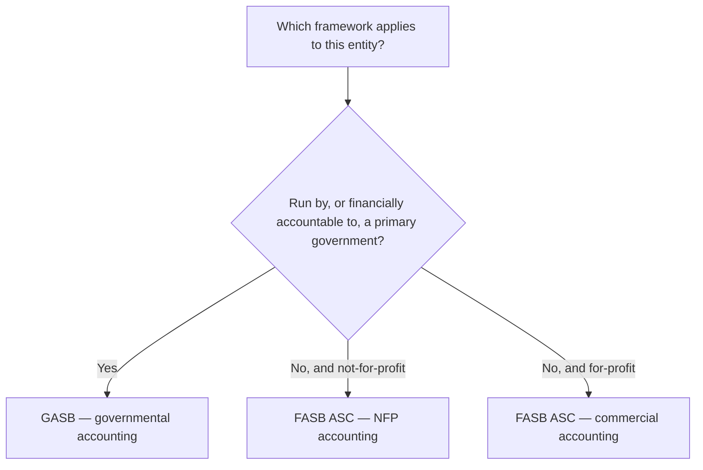
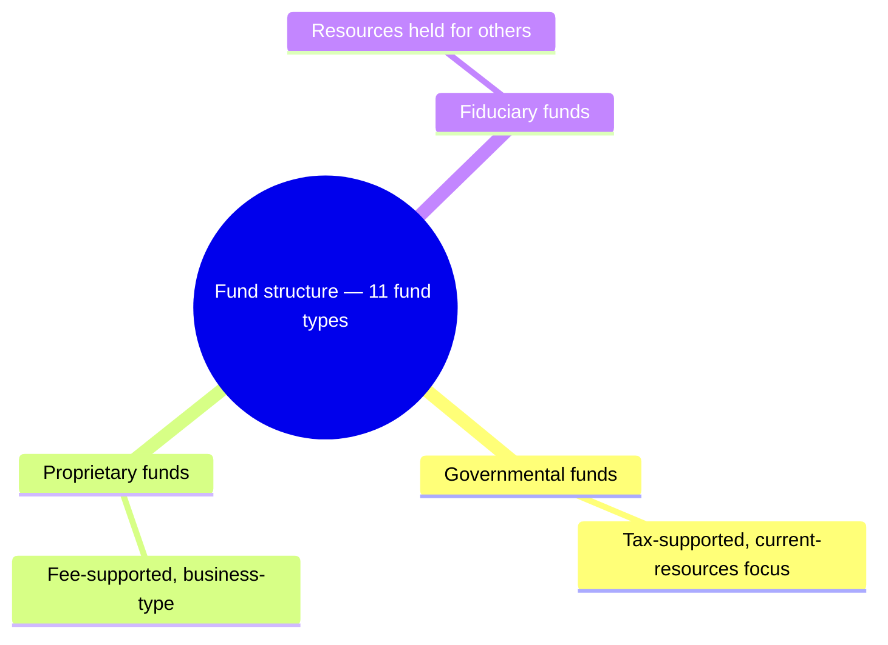
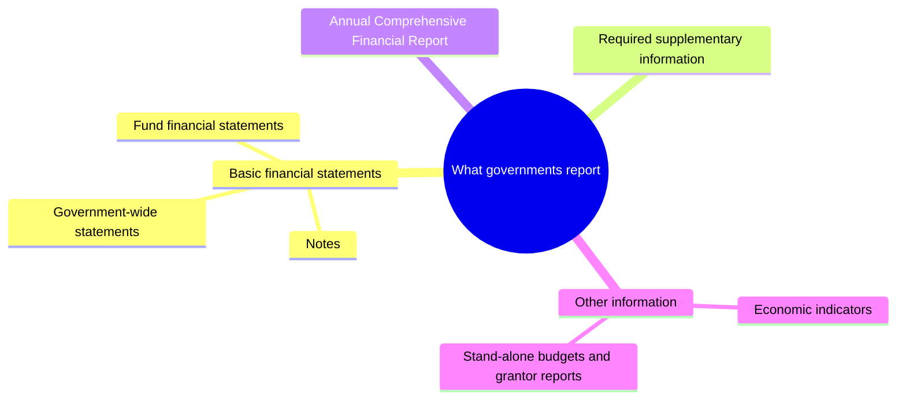

## 1. Why Governmental Accounting Is Different — Accountability

Governmental accounting exists to demonstrate **accountability** for the **stewardship** of public resources — efficient, effective service delivery **in compliance with the law** — rather than to measure profit. That single shift in purpose explains almost every rule that follows.

| | For-profit entity | Government |
|---|---|---|
| **Primary goal** | Profit / return to owners | **Accountability** for public resources |
| **Success measured by** | Net income, EPS | Services delivered within legal/budgetary limits |
| **Key question** | Did we earn a return? | Did we spend as authorized, and is it fair across generations? |

> [!EXAM]
> **Accountability is the cornerstone**, and **interperiod equity** is a core piece of it. Balanced budgets promote interperiod equity by forcing a government to **live within its means**. Financial reporting should show whether **current-year revenues were sufficient to pay for current-year services** — or whether **future taxpayers** were left to shoulder the cost of services already provided.

## 2. Who Uses Governmental Accounting — Basis of Organization

The framework depends on **how an entity is organized and funded — not on its industry**. A **hospital** (or a university) can be governmental, not-for-profit, or commercial, and follows a different rulebook in each case:



**Governmental units** (federal, state, county, municipal, local) use governmental accounting. **Colleges/universities** and **health-care organizations** use it only when **financially accountable to a primary government** (then possibly as a **component unit**); otherwise they follow FASB.

> [!TRAP]
> **A not-for-profit is not a government.** NFPs **not run by a government** — private hospitals, universities, voluntary health & welfare organizations — do **not** use governmental accounting even though they resemble ones that do. Look at **who controls and funds** the entity, never the industry label.

## 3. The Three Themes — Funds, Fund Accounting, External Reporting

Governmental accounting revolves around three ideas that set it apart:

| Theme | What it means |
|---|---|
| **Fund structure** | The government is split into many **funds**, grouped into three categories (M6) |
| **Fund accounting** | Each fund category uses its own **basis of accounting** and **measurement focus** |
| **External reporting** | Both **fund-based** and **government-wide** statements are presented, with a reconciliation between them |

> [!RULE]
> A **fund** is a sum of resources **segregated** to carry on a specific activity under specific restrictions — an **independent fiscal and accounting entity** that is a **self-balancing set of accounts**. Accounting for a **fund** is fundamentally different from accounting for the **government as a whole**. A government keeps the **minimum** number of funds consistent with legal requirements and sound administration — there is no required count.

Fund financial statements are presented separately for the three categories, previewed here and detailed in M6:



Governments run **governmental-type activities** (supported by **taxes**) and **business-type activities** (supported by **user fees**) — each needing standards suited to its characteristics.

## 4. GASB, the GAAP Hierarchy, and the Conceptual Framework

The **Governmental Accounting Standards Board (GASB)** sets accounting and reporting standards for governments. **GASB 76** defines a **two-category** GAAP hierarchy:

| Category | Sources | Use |
|---|---|---|
| **A — most authoritative** | **GASB Statements** | Apply first |
| **B** | GASB **Technical Bulletins**, **Implementation Guides**, and AICPA literature cleared by the GASB | Consult when **Category A does not address** the transaction |

The **GASB Conceptual Framework** (Concept Statements **Nos. 1–6**) does **not** establish standards — it sets the **objectives and concepts** underlying governmental reporting, whose purpose is public accountability. Governmental financial reporting spans several layers:



GASB 34 reporting requirements pertain to **general-purpose external financial reporting** (basic statements + RSI) and the **Annual Comprehensive Financial Report (ACFR)** — they may **not** fully address budgets or other special-purpose reports.

## 5. Qualitative Characteristics and Reporting Objectives

**Primary users** of government reports are **citizens/taxpayers**, **legislative and oversight bodies**, and **investors/creditors** (bond raters, insurers). They compare **actual results to budget**, assess financial condition, judge legal compliance, and evaluate efficiency.

> [!MNEMONIC]
> Government financial information should make **U R MICE**: **U**nderstandability, **R**eliability, **M**ake a difference (relevance), **I**n timeliness, **C**onsistency year over year, and **E**ntity-to-entity comparability.

**Limitations** temper all of this: reports use **approximate**, judgment-based measures; they are only **one** source among many; they cannot meet **every** user's needs; and **cost-benefit** always applies.

The reporting **objectives**, all flowing from accountability, are to help users:

| Objective area | The report should show |
|---|---|
| **Interperiod equity & compliance** | Whether current-year revenues covered current-year services; budgetary and legal/contractual compliance; service efforts, costs, and accomplishments |
| **Operating results** | Sources and uses of financial resources; how activities were financed and cash needs met; whether financial position improved or deteriorated |
| **Services & obligations** | Financial position and condition; noncurrent physical assets and their future service potential; legal/contractual restrictions and risks of loss |

```recap
1. Governmental accounting is built around accountability for public resources rather than profit; interperiod equity asks whether current-year revenues paid for current-year services or pushed the cost onto future taxpayers.
2. The framework follows an entity's basis of organization and funding, not its industry: governmental (GASB) if run by or financially accountable to a primary government, otherwise FASB — and a non-governmental NFP never uses governmental accounting.
3. Three themes distinguish governmental accounting — fund structure, fund accounting (each category's own basis and measurement focus), and dual fund-based plus government-wide external reporting with a reconciliation between them.
4. A fund is a self-balancing, independent fiscal entity segregated for a purpose; governments keep the minimum number of funds needed, and fund accounting differs fundamentally from accounting for the government as a whole.
5. GASB sets government standards under a two-tier GAAP hierarchy (Category A GASB Statements, then Category B), and its Concept Statements 1–6 set objectives, not standards.
6. Government financial information should make U R MICE (understandability, reliability, relevance, timeliness, consistency, comparability), subject to cost-benefit and other limitations, with all reporting objectives flowing from accountability.
```
