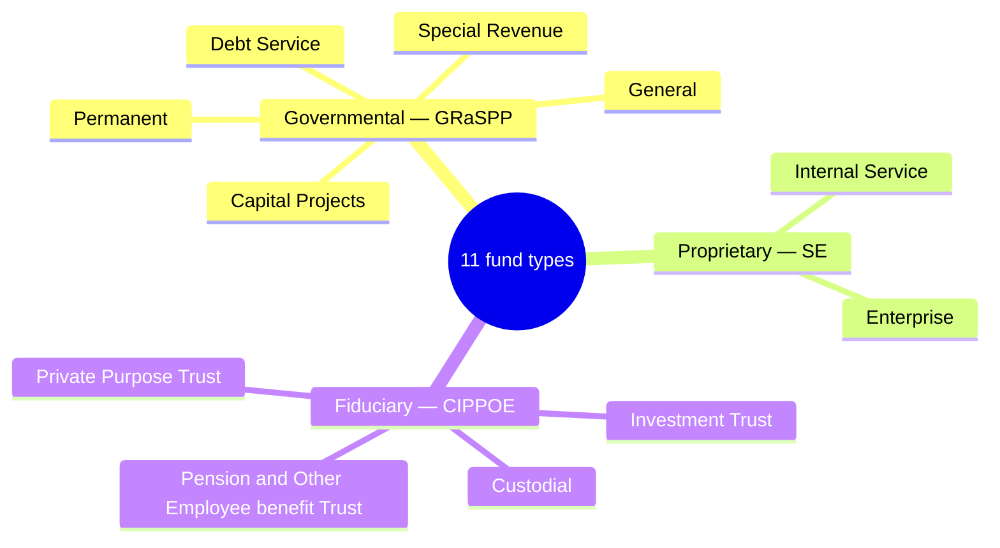
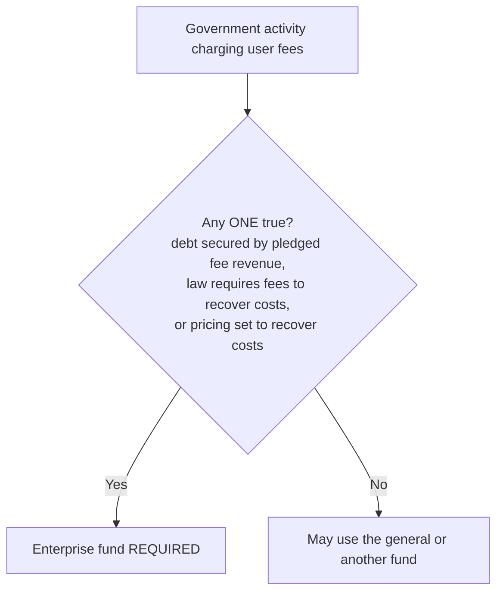

## 1. The Fund Structure at a Glance

A government is a single entity built from **eleven fund types** in **three categories**. Master this map and two mnemonics, and the rest of governmental accounting falls into place:



Each category pairs a **measurement focus** (what goes on the balance sheet) with a **basis of accounting** (when things are recognized):

> [!MNEMONIC]
> **Governmental funds are MAC-GRaSPP** — **M**odified **A**ccrual, **C**urrent financial resources focus, the **GRaSPP** funds. **Proprietary and fiduciary funds are SCARE** — **S**E-**C**IPPOE, **A**ccrual, **R**ecord non-current assets and liabilities, **E**conomic resources focus.

## 2. Governmental Funds (GRaSPP)

Governmental funds use the **modified accrual** basis and the **current financial resources** focus. Their balance sheet holds **no fixed assets and no long-term debt** — only current items — and the focus is **budgetary**: showing that resources were used in compliance with the law.

| Fund (GRaSPP) | Purpose |
|---|---|
| **General** | Ordinary operations financed by taxes/general revenue; **catch-all** for anything not in another fund |
| **Special Revenue** | Revenues from **specific taxes or earmarked sources**, restricted/committed to particular activities |
| **Debt Service** | Accumulate resources and pay **interest & principal on general obligation debt** (not enterprise/special-assessment debt) |
| **Capital Projects** | Resources restricted/committed/assigned to **acquire or construct major capital assets** (non-enterprise) |
| **Permanent** | Legally restricted so only **income — not principal —** supports the government's programs (public benefit); like an endowment |

The two governmental-fund statements use fund-flow language — **fund balance**, **expenditures**, and **other financing sources/uses**:

| Statement | Structure |
|---|---|
| **Balance sheet** | Current assets + deferred outflows = current liabilities + deferred inflows + **fund balance** |
| **Statement of revenues, expenditures, and changes in fund balance** | Revenues − **expenditures** ± other financing sources/uses = net change in fund balance |

## 3. Proprietary (SE) and Fiduciary (CIPPOE) Funds

Both categories use the **full accrual** basis and the **economic resources** focus — essentially commercial accounting, reporting **all** assets and liabilities and using **net position** instead of fund balance.

**Proprietary funds** run **business-type** activities:

| Fund (SE) | Customers | Example |
|---|---|---|
| **Internal Service** | **Internal** — other departments, on a cost-reimbursement basis | Central motor pool, building maintenance |
| **Enterprise** | **External** — the public, >50% self-supported by user charges | Water/sewer utilities, airports, transit |



**Fiduciary funds** hold assets **in trust for others** (a beneficiary relationship):

| Fund (CIPPOE) | Holds |
|---|---|
| **Custodial** | Resources held **temporarily** for others (e.g., taxes collected for another government); catch-all fiduciary |
| **Investment Trust** | **External** investment pools |
| **Private Purpose Trust** | Trust benefits for recipients per terms, legally protected from the government's creditors (not pension/investment) |
| **Pension (& Other Employee Benefit) Trust** | Defined benefit/contribution, OPEB, and other long-term employee benefit plans |

Fiduciary statements report **additions** and **deductions** (not revenues/expenses): the statement of fiduciary net position and the statement of changes in fiduciary net position.

## 4. Measurement Focus and Basis of Accounting

This one contrast drives the entire governmental model:

| | Governmental funds — **MAC-GRaSPP** | Proprietary & fiduciary funds + government-wide — **SCARE** |
|---|---|---|
| **Measurement focus** | Current financial resources | Economic resources |
| **Basis of accounting** | **Modified accrual** | **Full accrual** |
| **Balance sheet includes** | Current assets & liabilities **only** | **All** assets & liabilities (incl. capital assets, long-term debt) |
| **Fixed assets / long-term debt** | **Not** reported | **Reported** |
| **Equity section** | **Fund balance** (spendable/appropriable) | **Net position** — 3 components |
| **Operating statement** | Revenues, **expenditures**, changes in fund balance | Revenues, **expenses**, changes in net position (fiduciary: additions/deductions) |

Under **modified accrual**, the only twist versus full accrual is the word **available**:

> [!RULE]
> **Modified accrual revenue** is recognized when **measurable and available** — *measurable* means quantifiable in dollars; *available* means collectible within the period or soon enough after (generally **within 60 days** of year-end) to pay current-period liabilities. **Expenditures** are recorded when the fund liability is **incurred**, **except debt service** (both **principal and interest**), which is recognized only when **due or paid** — incurred-but-unpaid debt service is **not accrued**.

Under the economic-resources focus, **net position** is reported in **three components**: **net investment in capital assets**, **restricted**, and **unrestricted**.

## 5. The Capital-Outlay Contrast and Fund-to-Government-Wide Reconciliation

Because governmental funds report no fixed assets, the **same purchase is recorded two different ways** — the single most important governmental-accounting idea:

**Q — A city buys a $50,000 truck for cash. Record it (a) in a governmental fund and (b) at the government-wide / proprietary (full accrual) level.**

```journal
{"desc": "Governmental fund (modified accrual) — capital purchase is an expenditure; no asset recorded",
 "dr": [["Expenditure — capital outlay", 50000]],
 "cr": [["Cash", 50000]]}
```

```journal
{"desc": "Government-wide / proprietary (full accrual) — capital asset is capitalized",
 "dr": [["Equipment", 50000]],
 "cr": [["Cash", 50000]]}
```

That gap is exactly what the required **reconciliation** from fund statements to government-wide statements bridges:

> [!EXAM]
> **The big reconciling items (fund → government-wide):** **add** the capital assets excluded from governmental funds; **subtract** the non-current liabilities excluded from them; **add** accrual-basis revenues in excess of modified-accrual revenues; and **subtract** accrued interest expense that governmental funds never recognized. These are the most frequently tested adjustments in the reconciliation.

```recap
1. A government has eleven fund types in three categories: governmental (GRaSPP — General, Special Revenue, Debt Service, Capital Projects, Permanent), proprietary (SE — Internal Service, Enterprise), and fiduciary (CIPPOE — Custodial, Investment Trust, Private Purpose Trust, Pension/Other Employee benefit).
2. Governmental funds are MAC-GRaSPP: modified accrual basis, current financial resources focus, current assets and liabilities only, reporting fund balance and expenditures.
3. Proprietary and fiduciary funds (and the government-wide statements) are SCARE: full accrual, economic resources focus, all assets and liabilities including capital assets and long-term debt, reporting net position in three components.
4. An enterprise fund is required if debt is secured by pledged fee revenue, a law requires cost-recovery fees, or pricing is set to recover costs; internal service funds serve other departments, enterprise funds serve the public.
5. Modified accrual recognizes revenue when measurable and available (generally within 60 days) and expenditures when the fund liability is incurred, except debt service principal and interest, which are recognized only when due or paid.
6. Because governmental funds expense capital outlays rather than capitalize them, the reconciliation to government-wide statements adds back capital assets, subtracts non-current liabilities, adds accrual revenues beyond modified-accrual, and subtracts accrued interest.
```
