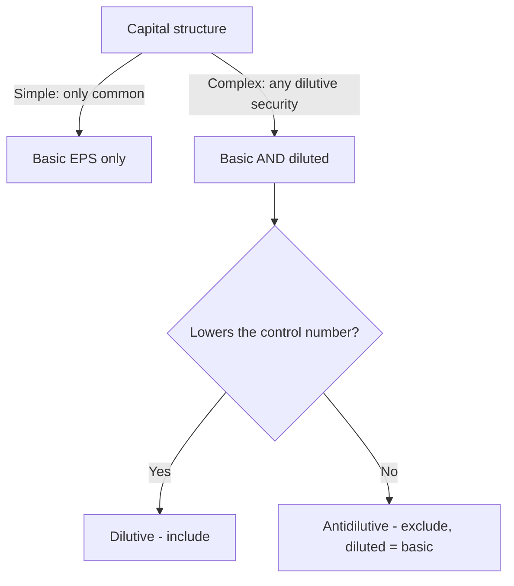

*Comprehensive F1 cheat sheet — every formula, classification, and journal entry, dense. Entry amounts are symbolic (sh = shares, par, plug = balancing figure). Print this page for the multi-column layout.*

## Financial statements & comprehensive income

**Full set (5 + notes):** ① Balance sheet (position, *as of a date*) · ② Income statement (earnings, *period*) · ③ Comprehensive income · ④ Cash flows · ⑤ Changes in equity. **A = L + E**; equity = residual; balance sheet = historical cost, **not** fair value.

> [!MNEMONIC]
> **PUFER** = OCI items: **P**ension adjustments · **U**nrealized gains/losses on AFS **debt** & cash-flow hedges · **F**oreign-currency **translation** · **I**nstrument-specific credit **R**isk. **Comprehensive income = NI + OCI** (a subtotal; ≠ OCI ≠ AOCI). Reclassification moves a realized PUFER item into NI **once**.

| Presentation | Starts at | OCI shown |
|---|---|---|
| Single-statement | revenue | net of tax |
| Two-statement | net income | net of tax |

Not required for **NFPs**, never **per share**, required for **interim**.

## Income statement & discontinued operations

```formula
Net sales − COGS = **Gross profit**
− operating expenses = **Operating income**
± non-operating items = **Pre-tax income**
− income tax = **Income from continuing operations**
± discontinued ops (net of tax) = **Net income**
```

- Operating items shown **gross**; non-operating shown **net**.
- Freight-**in** = inventory cost; freight-**out** = selling expense.

**Discontinued operations** = a strategic shift with a major effect; reported **below continuing operations, net of tax**. Three amounts flow in:

- **operating results** of the component for the **entire year** (even the months before the decision), and until it is sold
- **impairment loss** — writedown to **net realizable value** (fair value − cost to sell) when NRV falls below carrying value
- **gain or loss on the actual sale/disposal** (selling price − carrying value)

> [!RULE]
> **Held-for-sale = all 6:** committed plan · available as-is · active search · **probable < 1 yr** · marketed at reasonable price · plan unlikely to change. → **Stop depreciating**; carry at **lower of NRV or book**; impairment reversal capped at prior loss. Any stated **tax rate** → discontinued components × (1 − rate). Continuing-ops income is usually **derived** (back the division out of the total trial balance, then tax-effect).

## Foreign currency transactions

- **Direct rate** = domestic price of 1 foreign unit ($/€). **Indirect** = foreign per $1 (€/$).
- Remeasure at balance-sheet date (**unrealized**) and settlement (**realized**).

| | Foreign currency ↑ | Foreign currency ↓ |
|---|---|---|
| **Receivable** (asset) | gain | loss |
| **Payable** (liability) | loss | gain |

## Earnings per share

```formula
**Basic EPS** = (Net income − preferred dividends) ÷ WACSO
```

| Preferred | Subtract from NI |
|---|---|
| **Cumulative** | annual dividend (sh × par × rate) **whether declared or not** |
| **Non-cumulative** | only if **declared** |

**WACSO** — weighted-average common shares outstanding:

- Weight shares by **months outstanding**.
- **Stock splits/dividends retroactive to period start** (even if after year-end, before issuance).
- Business-combination shares weighted **from the combination date**.
- Net loss → subtracting preferred dividends **worsens** the loss per share.

**Diluted EPS** (complex structure only) — include a security **only if it lowers** the control number (**income from continuing operations**); else antidilutive → diluted = basic.

| Dilutive security | Numerator adjustment | Denominator adjustment |
|---|---|---|
| **Options / warrants** (treasury stock method) | none | add **net new shares** = shares issued on exercise − shares the cash proceeds buy back at the average price |
| **Convertible bonds** (if-converted) | **add back the interest saved, net of tax** = interest × (1 − rate) | add the common shares the bonds convert into |
| **Convertible preferred** (if-converted) | **add back the preferred dividends** (no tax effect — dividends aren't deductible) | add the common shares the preferred converts into |

```formula
**TSM net new shares** = sh − (sh × strike ÷ avg market price)
```

- Options/warrants dilutive **only if avg market price > strike**.
- Sequence **most- to least-dilutive** (options first).
- **Cash flow per share is never reported.**



## SEC filings

Public companies file electronically on **EDGAR**. **MD&A (Item 7)** is management's own discussion of results, liquidity, and known trends/risks; **Item 7A** covers market risk; **Item 8** holds the audited financials. Deadlines tighten as the filer gets larger.

| Form | What | Deadline | Coverage |
|---|---|---|---|
| **10-K** | annual, **audited** | 60 / 75 / 90 days | 3 yrs IS/CF/equity, **2 yrs balance sheet**; MD&A (7), market risk (7A), financials (8), CEO/CFO cert |
| **10-Q** | quarterly Q1–Q3, **reviewed** | 40 / 45 days | timeliness > reliability |
| **8-K** | material event (bankruptcy, **auditor change**, officer change) | **4 business days** | — |

Filer status (deadline): large accelerated = float ≥ $700M (60) · accelerated = $75–700M **and** rev ≥ $100M (75) · other (90).

## Stockholders' equity

```formula
**Equity** = contributed (stock at par + APIC) + earned (RE + AOCI) − treasury stock  ·  + NCI = total equity
**Legal capital** = shares issued × par
**Book value / common share** = common equity ÷ shares outstanding
where common equity = total equity − preferred (**greater of call or par**) − cumulative **arrears**
```

- **Legal capital** protects creditors — **can't fund dividends**.
- Share stages: authorized → issued → **outstanding** (issued − treasury).
- EPS, voting, and dividends all use **outstanding** shares.

| Preferred feature | What it means |
|---|---|
| **Cumulative** | unpaid preferred dividends **accumulate as dividends in arrears** and must be paid before any common dividend (arrears are disclosed, **not booked as a liability**) |
| **Non-cumulative** | dividends not declared in a year are simply **lost** — they never accumulate |
| **Participating** | after both classes receive their base rate, preferred **shares in the excess** with common; **fully** = shares without limit, **partially** = shares only up to a stated % ceiling, then the remainder goes **100% to common** |
| **Non-participating** | preferred is **limited to the dividend set by its preference rate** (the default if silent) |
| **Convertible** | holder may **exchange preferred for common** at a specified ratio — raises the holder's value |
| **Callable / redeemable** | the **issuing corporation** may repurchase the shares at a set call price — lowers value to the holder |
| **Mandatorily redeemable** | must be redeemed at a fixed date/event → classified as a **liability**, not equity |

Liquidation preference must be shown **on the face** of the balance sheet if greater than par.

## Stock issuance & subscriptions — entries

Always credit the stock account at **par (legal capital)**; the excess over par plugs to **APIC**. Below par, the discount is debited to APIC (the shareholder's liability to the corporation). Issuing stock is a **financing inflow**.

```journal
{"desc": "Issue above par", "dr": [["Cash", "sh × price"]], "cr": [["Common stock", "sh × par"], ["APIC — C/S", "plug"]]}
```
```journal
{"desc": "Issue at par", "dr": [["Cash", "sh × par"]], "cr": [["Common stock", "sh × par"]]}
```
```journal
{"desc": "Issue below par", "dr": [["Cash", "sh × price"], ["APIC — C/S", "plug (discount)"]], "cr": [["Common stock", "sh × par"]]}
```
```journal
{"desc": "Stock issued for services (at FV of stock)", "dr": [["Professional services expense", "FV of stock"]], "cr": [["Common stock", "par"], ["APIC — C/S", "plug"]]}
```
```journal
{"desc": "Subscribe (receivable is contra-equity)", "dr": [["Subscriptions receivable", "sh × price"]], "cr": [["Common stock subscribed", "par"], ["APIC — C/S", "plug"]]}
```
```journal
{"desc": "Collect subscription", "dr": [["Cash", "amount"]], "cr": [["Subscriptions receivable", "amount"]]}
```
```journal
{"desc": "Issue certificates (paid in full)", "dr": [["Common stock subscribed", "par"]], "cr": [["Common stock", "par"]]}
```

**Subscription default → 3 options:** issue pro-rata to cash paid · refund · retain as damages (credit APIC–forfeited). Subscriptions receivable is contra-equity **except** collected after year-end before issuance (then asset).

## Treasury stock — entries

- Treasury stock = **contra-equity** (debit balance, not an asset); **no vote, no dividends**.
- **Cost method** (~95%): carried at **reacquisition cost**, G/L at **reissuance**. **Par method** (~5%): carried at **par**, G/L at **repurchase**.

```formula
Reissue gain / loss = reissue price − repurchase cost   (balance-sheet event, never income)
```

> [!RULE]
> TS gains/losses **never** hit the income statement (either method); **method never changes total equity**. **Gain → APIC–TS ↑.  Loss → APIC–TS ↓ first, then Retained earnings ↓.**

**Cost method (~95%)** — carried at cost; gain/loss recognized at reissuance:

```journal
{"desc": "Buy back", "dr": [["Treasury stock", "sh × cost"]], "cr": [["Cash", "sh × cost"]]}
```
```journal
{"desc": "Reissue above cost — gain", "dr": [["Cash", "resale price"]], "cr": [["Treasury stock", "at cost"], ["APIC — treasury stock", "gain"]]}
```
```journal
{"desc": "Reissue below cost — loss", "dr": [["Cash", "resale price"], ["APIC — treasury stock", "to zero"], ["Retained earnings", "remainder"]], "cr": [["Treasury stock", "at cost"]]}
```
```journal
{"desc": "Retire", "dr": [["Common stock", "par"], ["APIC", "original"], ["Retained earnings", "plug"]], "cr": [["Treasury stock", "at cost"]]}
```

**Par method (~5%)** — TS at par; gain/loss at **repurchase** (reverse the original issue, plug):

```journal
{"desc": "Buy back — loss", "dr": [["Treasury stock", "par"], ["APIC — C/S", "reverse"], ["Retained earnings", "plug"]], "cr": [["Cash", "repurchase"]]}
```
```journal
{"desc": "Buy back — gain", "dr": [["Treasury stock", "par"], ["APIC — C/S", "reverse"]], "cr": [["Cash", "repurchase"], ["APIC — treasury stock", "gain"]]}
```
```journal
{"desc": "Reissue", "dr": [["Cash", "resale price"]], "cr": [["Treasury stock", "par"], ["APIC — C/S", "plug"]]}
```

**Donated shares:** DR Donated TS (FV) / CR APIC–donated (total equity unchanged).

## Distributions — entries

- Dividends are **not an expense**, are paid from **retained earnings**, and require **board declaration**.
- Paid only on **outstanding** shares (never treasury).
- Three dates: **declaration** (entry) → **record** (no entry) → **payment** (entry).

```journal
{"desc": "Declaration", "dr": [["Retained earnings", "FV or par"]], "cr": [["Dividends payable", "same"]]}
```
```journal
{"desc": "Payment (financing outflow)", "dr": [["Dividends payable", "amount"]], "cr": [["Cash", "amount"]]}
```

**Dividend types** — retained earnings reduced by:

| Type | R/E reduced by | Note |
|---|---|---|
| **Cash** | cash amount | financing outflow |
| **Property** | **fair value** | restate asset to FV → gain/loss |
| **Scrip** | (a note payable) | used in a cash shortage; may bear interest |
| **Liquidating** | RE, then APIC, then capital | return of capital |

```journal
{"desc": "Property dividend — asset NBV 30 (cost 70, A/D 40), fair value 50",
 "dr": [["Retained earnings", 50], ["Accumulated depreciation", 40]],
 "cr": [["PP&E", 70], ["Gain on property distributed", 20]]}
```
```journal
{"desc": "Liquidating dividend (return of capital)", "dr": [["Retained earnings", "to zero"], ["APIC", "next"], ["Common stock", "remainder"]], "cr": [["Cash", "total paid"]]}
```

**Stock dividends / splits** — no cash outflow and no dividend income to the holder (per-share basis drops, share count rises); **total equity is unchanged** (earned capital → contributed). Never apply to treasury shares.

| Event | Retained earnings reduced by |
|---|---|
| **Small** stock dividend (< 20–25%) | **fair value** of the shares — small dividends don't move the market price, so FV is the fair measure |
| **Large** stock dividend (> 20–25%) | **par value** (or optionally account for it as a stock split) |
| **Stock split** | **memo entry only** — shares rise and par per share falls proportionately, so stated capital is unchanged |

```journal
{"desc": "Small stock dividend (< 20–25%) — at fair value", "dr": [["Retained earnings", "FV of shares"]], "cr": [["Common stock", "par"], ["APIC — C/S", "plug"]]}
```
```journal
{"desc": "Large stock dividend (> 20–25%) — at par", "dr": [["Retained earnings", "par"]], "cr": [["Common stock", "par"]]}
```

```recap
1. Comprehensive income = NI + OCI (PUFER); discontinued ops net of tax (held-for-sale = 6 criteria, stop depreciation, lower of NRV/book).
2. Basic EPS = (NI − pref div) ÷ WACSO; cumulative subtract whether declared; splits/dividends retroactive; diluted via TSM (avg > strike) & if-converted, tested on the control number.
3. FX: foreign currency ↑ helps receivables, hurts payables. SEC: 10-K "3 years except 2-yr balance sheet"; 8-K in 4 business days.
4. Equity = contributed + earned − treasury; legal capital = issued × par; book value/share subtracts preferred at greater of call/par + arrears.
5. Issue stock at par (APIC plug); below par debits APIC; stock-for-services at FV; subscriptions receivable is contra-equity.
6. Treasury stock never touches income / total equity (cost = gain/loss at reissue; par = at repurchase); loss → APIC-TS then RE.
7. Property dividend at FV (with gain); liquidating returns capital; small stock dividend at FV, large at par, split is memo-only.
```
