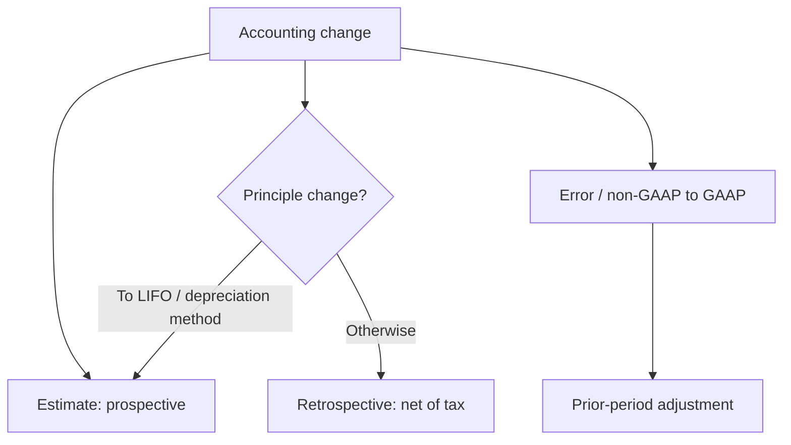

*Comprehensive F2 cheat sheet — revenue recognition, accounting changes, fair value, and the ratio/CVP formulas. Memorize the formula boxes; they are near-guaranteed MCQ points.*

## Revenue recognition — the 5-step model

> [!MNEMONIC]
> **ISTAR** ("I am a STAR"): **I**dentify contract → **S**eparate performance obligations → **T**ransaction price → **A**llocate → **R**ecognize.

- **Contract** — 5 criteria: approved/committed · rights identified · payment terms · commercial substance · **collection probable**. Fail all → consideration is a **liability**.
- **Distinct PO** = capable of being distinct **and** separately identifiable (integrated construction = one PO; independent modules = many).
- **Transaction price** — variable consideration (expected value or most-likely, constrained); significant financing only if **> 1 yr**; noncash at FV; consideration paid to customer **reduces** revenue.
- **Allocate** by **relative standalone selling prices**.

**Step 5 — recognize over time if ANY one:**

- customer controls the asset as it's built
- customer simultaneously receives & consumes the benefit
- **no alternative use + enforceable right to payment**

Else **point in time** (control transfers). Measure progress by **output** or **input** (cost-to-cost) methods.

| Balance-sheet term | Meaning |
|---|---|
| **Receivable** | **unconditional** right (only time must pass) |
| **Contract asset** | performed but right is **conditional** |
| **Contract liability** | paid/due **before** performing |

> [!RULE]
> **Sales/usage-based royalty:** recognize at the **later of** the sale/usage or the PO being satisfied — never estimate up front. **Functional** IP license = point in time; **symbolic** = over time.

### Revenue — other applications

- **Principal vs. agent:** a **principal** (controls the good/service, bears inventory risk, sets the price) records **gross revenue**; an **agent** records only the **net fee/commission**.
- **Repurchase agreements:** a **forward/call** to buy back **below** the original price = **lease**; at/above original = **financing**. A **put** hinges on the customer's economic incentive (strong incentive → lease; none → sale with right of return).
- **Bill-and-hold** (revenue before delivery) needs **all 4**: substantive reason · product separately identified as the customer's · ready for immediate transfer · entity can't use or redirect it.
- **Consignment:** the consignor keeps the inventory and recognizes **no revenue until the dealer sells** to an end customer.
- **Warranties:** an **assurance** warranty (product works as promised) → accrue warranty cost; a **service / extended** (separately priced) warranty → a **separate PO**, deferred as unearned revenue over the coverage period.
- **Right of return:** recognize revenue only for the amount **expected to be kept**; book a **refund liability** (and a return asset) for the rest.
- **Contract costs:** **capitalize** incremental costs to **obtain** the contract (sales commissions) and direct costs to **fulfill** it; **expense** costs incurred win-or-lose (proposal travel, existing salaries).

## Long-term construction contracts

Over time, cost-to-cost. Four steps each period:

```formula
① Total GP = contract price − estimated total cost
② % complete = cost to date ÷ estimated total cost
③ GP to date = ① × ②
④ Current-period GP = ③ − prior-years' GP
```

```journal
{"desc": "Incur cost", "dr": [["Construction in progress (CIP)", "cost"]], "cr": [["Cash / payables", "cost"]]}
```
```journal
{"desc": "Bill the customer", "dr": [["Accounts receivable", "billed"]], "cr": [["Progress billings", "billed"]]}
```
```journal
{"desc": "Recognize over-time profit", "dr": [["Construction expense", "cost incurred"], ["CIP", "gross profit"]], "cr": [["Revenue — LT contract", "% × price"]]}
```
```journal
{"desc": "Loss contract — book the FULL expected loss now", "dr": [["Loss on contract", "full loss"]], "cr": [["CIP (or provision for loss)", "full loss"]]}
```

> [!TRAP]
> **Recognize the entire expected loss immediately** (both methods). Over-time's loss year also **reverses all prior profit**. CIP holds **cost + recognized profit**; nets against progress billings → CIP > billings = current **asset**, billings > CIP = current **liability**.

- **Point-in-time / completed-contract** (used when the over-time criteria aren't met): the cost, billing, and collection entries are **identical** — only the **profit is deferred to completion**. CIP holds **cost only** until the contract finishes, then all gross profit is recognized at once.

## Adjusting journal entries

> [!RULE]
> A year-end adjusting entry hits **one income-statement + one balance-sheet account — never cash.**

```journal
{"desc": "Unearned (deferred) revenue — earned portion", "dr": [["Unearned revenue", "earned"]], "cr": [["Revenue", "earned"]]}
```
```journal
{"desc": "Prepaid expense — used portion", "dr": [["Expense", "used"]], "cr": [["Prepaid asset", "used"]]}
```
```journal
{"desc": "Accrued revenue (cash later)", "dr": [["Accounts receivable", "earned"]], "cr": [["Revenue", "earned"]]}
```
```journal
{"desc": "Accrued expense (cash later)", "dr": [["Expense", "incurred"]], "cr": [["Accrued liability", "incurred"]]}
```

## Accounting changes & error corrections

| Type | Method | Retained earnings |
|---|---|---|
| **Estimate** (life, salvage, allowance, warranty %) | **Prospective** | never touched |
| **Principle** (GAAP→GAAP, justified) | **Retrospective** | restate earliest beginning RE, **net of tax** |
| **Entity** (consolidation group changes) | **Retrospective** | restate all periods shown |
| **Error** (math, GAAP misapplied, **non-GAAP→GAAP**) | **Prior-period adjustment** | beginning RE of earliest year shown, net of tax |

> [!RULE]
> Two "principle" changes are actually **prospective**: change **TO LIFO** and change in **depreciation method**. Every RE adjustment is **net of tax**. Prospective recompute after a life change: **remaining NBV ÷ remaining life**.



## Fair value measurement

**Fair value = orderly EXIT price** (excludes transaction costs, includes transport). Liabilities include own **nonperformance risk**.

> [!TRAP]
> **Principal market** governs (highest volume, accessible). No principal market → **most advantageous** — *chosen net of transaction costs but measured at the GROSS price* (the built-in wrong answer). **Highest-and-best-use** = nonfinancial assets only.

| Input level | Nature |
|---|---|
| **L1** (most reliable) | quoted price, **active market, identical** asset |
| **L2** | other **observable** inputs (similar assets, observable rates) |
| **L3** (last resort) | **unobservable** — entity's own assumptions (disclose sensitivity) |

**Techniques (MIC):** **M**arket · **I**ncome (DCF) · **C**ost (replacement). A technique change = change in **estimate** (prospective).

## Subsequent events & special frameworks

**Subsequent events** (after balance-sheet date, before issued/available-to-be-issued):

| Type | Condition | Action |
|---|---|---|
| **Recognized (Type 1)** | existed **at** balance-sheet date (lawsuit settled, customer bankruptcy) | **adjust** |
| **Nonrecognized (Type 2)** | arose **after** (disaster, business combination, stock issuance) | **disclose** only |

**Significant accounting policies note** (footnote 1) = the measurement bases and methods chosen (depreciation, inventory costing, revenue recognition, use of estimates) — the *how*, not the amounts (those live in other notes). **Concentrations of risk** are disclosed when **all three**: the concentration exists at the balance-sheet date · it makes the entity **vulnerable to a severe near-term impact** · that impact is at least **reasonably possible** (a single customer, supplier, product, or geographic market).

**OCBOA** (cash, modified cash, income-tax basis): non-GAAP titles, GAAP-like disclosures, **no cash-flow statement required**.

> [!MNEMONIC]
> **Cash → accrual:** **asset ↑ adds to revenue / subtracts from expense; liability ↑ does the opposite** — the mirror image of the indirect method.

```formula
Accrual revenue = cash collected + ↑AR − ↑unearned revenue
Accrual COGS    = cash paid + ↑AP − ↑inventory
Accrual op-exp  = cash paid + ↑accrued liab − ↑prepaid
```

## Ratio & CVP formulas — memorize

Use **average** balance-sheet figures when mixed with the income statement.

```formula
Gross margin      = (Sales − COGS) ÷ net sales
Operating margin  = EBIT ÷ net sales
ROA (DuPont)      = profit margin × asset turnover = (NI÷sales) × (sales÷avg assets)
ROE               = NI ÷ avg equity = ROA × equity multiplier (DFL)
```

```formula
Current ratio     = current assets ÷ current liabilities
Quick (acid-test) = (cash + ST securities + net AR) ÷ current liabilities
AR turnover       = net sales ÷ avg net AR
Inventory turnover= COGS ÷ avg inventory
Days in X         = 365 ÷ X turnover   (days sales in AR, days inventory, days payables)
Operating cycle   = days inventory + days AR
Cash conversion   = days inventory + days AR − days payables
```

```formula
Debt-to-equity        = total liabilities ÷ total equity
Equity multiplier(DFL)= total assets ÷ total equity = 1 + D/E
Times interest earned = EBIT ÷ interest expense
```

```formula
CM per unit           = selling price − variable cost per unit
Break-even units      = fixed costs ÷ CM per unit
Break-even sales $    = fixed costs ÷ CM ratio
Target-profit units   = (fixed costs + target pre-tax profit) ÷ CM per unit
Degree of op leverage = contribution margin ÷ operating income
```

```formula
EBITDA            = NI + interest + taxes + depreciation + amortization
Price-to-earnings = price per share ÷ basic EPS
Dividend payout   = cash dividends ÷ net income     (retention = 1 − payout)
```

- **Common-size analysis:** *vertical* divides income-statement items by sales and balance-sheet items by total assets; *horizontal (trend)* compares across periods.
- **Variance analysis:** build a **flexible budget at the actual volume**, then isolate **price/rate** vs. **quantity/volume** variances (each favorable or unfavorable).

> [!TRAP]
> **ROE = ROA × DFL** — leverage amplifies returns **both** directions. A total variable cost "under budget" is a mirage when volume fell short — build a **flexible budget at actual volume**.

```recap
1. ISTAR: contract (5 criteria, else liability) → distinct POs → transaction price (variable/financing>1yr) → allocate by standalone price → recognize over time (3 tests) or at a point.
2. Contract asset = conditional right; receivable = unconditional; contract liability = paid before performing; royalties as customer sells/uses.
3. Construction %-complete = cost÷cost; losses in full immediately (both methods); CIP nets against billings.
4. Estimate = prospective; principle = retrospective net of tax (except TO-LIFO & depreciation-method); error = prior-period adjustment.
5. Fair value = exit price; principal market, measure at gross; L1→L3 hierarchy; MIC techniques.
6. Type 1 subsequent events adjust, Type 2 disclose; cash→accrual mirrors the indirect method.
7. Know the formula boxes cold: DuPont ROA, ROE = ROA × DFL, cash conversion cycle, break-even = FC÷CM, DOL = CM÷operating income.
```
