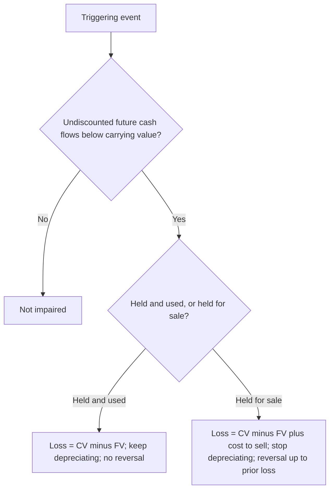

*Comprehensive F3 cheat sheet — the largest section. Cash, receivables, inventory, PP&E, depreciation, impairment, and intangibles, with every rule, formula, and entry. Entry amounts are symbolic.*

## Cash & cash equivalents

- **Cash** = currency and demand deposits. A **cash equivalent** is a short-term, highly liquid **debt** investment with an **original maturity of 90 days or less from the date of purchase** (a 1-year T-bill bought 60 days before maturity qualifies; equity securities never do — they have no maturity).
- **Compensating balances:** if **legally restricted**, exclude from cash and disclose; if not, they stay in cash.
- **Restricted cash** is classified by what it relates to: current item → current asset; noncurrent asset or long-term debt → **noncurrent**.
- Company checks **written but not yet mailed** at year-end are still the company's cash (add back); **postdated** checks received and **NSF** checks are not cash.

> [!MNEMONIC]
> **Bank reconciliation — DO / BINS.** Adjust the **Bank** side for **D**eposits in transit (+) and **O**utstanding checks (−). Adjust the **Books** side for **B**ank collections (+), **I**nterest earned (+), **N**SF checks (−), and **S**ervice charges (−). **Only the book-side items get journal entries**; both sides must reconcile to the same true cash balance.

```journal
{"desc": "Book side — bank collected a note plus interest", "dr": [["Cash", "proceeds"]], "cr": [["Notes receivable", "principal"], ["Interest income", "interest"]]}
```
```journal
{"desc": "Book side — customer NSF check returned", "dr": [["Accounts receivable", "NSF amount"]], "cr": [["Cash", "NSF amount"]]}
```

## Trade receivables

- **Accounts receivable** = an **oral** promise to pay, always a **current asset**, measured at **net realizable value** (gross less discounts, estimated uncollectibles, and returns).
- **BASE roll-forward:** Beginning + credit sales − (collections + write-offs + conversions to notes) = Ending. Solve for the blanked-out figure.

**Sales (cash) discounts — e.g. 2/10, n/30** (2% off if paid in 10 days, else full amount in 30):

| Method | At sale | If paid within discount period | If paid late |
|---|---|---|---|
| **Gross** (assumes discount *not* taken) | record at full price | DR Cash, DR **Sales discounts taken** (contra-revenue), CR AR | DR Cash, CR AR (full) |
| **Net** (assumes discount *will* be taken) | record net of discount | DR Cash, CR AR (net) | DR Cash, CR AR (net), CR **Sales discounts not taken** (revenue) |

**Trade (volume) discounts** are applied **sequentially, one at a time** (40% then 10% = 46% off, *not* 50%) and always recorded **net**.

**Estimating credit losses — CECL:** the direct write-off method is **not GAAP** (tax only); GAAP requires the **allowance method**. Estimate **lifetime expected credit losses** using past experience, current conditions, and **reasonable future forecasts**. Adjust the allowance **to** the required balance.

```journal
{"desc": "Record / true-up the allowance to the required balance", "dr": [["Credit loss expense", "plug"]], "cr": [["Allowance for credit losses", "plug"]]}
```
```journal
{"desc": "Write off a specific account (no expense — allowance already holds it)", "dr": [["Allowance for credit losses", "amount"]], "cr": [["Accounts receivable", "amount"]]}
```
```journal
{"desc": "Recovery of a written-off account (net effect)", "dr": [["Cash", "recovered"]], "cr": [["Allowance for credit losses", "recovered"]]}
```

> [!TRAP]
> Write-offs hit the **allowance, never expense**; recoveries reverse into the allowance. **Post write-offs first, then true up** — a large write-off can push the allowance to a debit balance, so the adjustment = required ending balance **plus** that debit balance.

**Monetizing receivables** (from **least** to **most** transfer of risk):

- **Pledging** = AR used as loan collateral; company keeps title and collects — **footnote only, no entry**.
- **Assignment** = specific receivables collateralize a loan; the borrower records a **note payable**, still collects and remits, and discloses **equity in assigned accounts** (assigned AR − loan).
- **Factoring without recourse** = a true sale; the factor bears collection risk (record a **due-from-factor** holdback and a **loss** for the fee).
- **Factoring with recourse** = a sale only if the obligation is estimable, control is surrendered, and no forced repurchase — otherwise a **secured borrowing**.
- **Securitization** = transfer a pool of receivables to a trust/subsidiary that issues securities backed by them; investors are repaid from collections.

> [!EXAM]
> **Four-column reconciliation (proof of cash):** reconciles **beginning balance · receipts · disbursements · ending balance** from both the book and the bank side; every column's adjusted totals must agree. Prior-month deposits-in-transit and outstanding checks *reverse out* of the current month's activity.

**Notes receivable** are recorded at **present value** (impute the market rate if the stated rate is absent or below market). **Discounting a note at a bank:** maturity value → **bank discount = maturity value × bank rate × bank's holding period** → proceeds → holder's interest income = proceeds − carrying value.

## Inventory

- Inventory includes everything the company holds **legal title** to. **FOB shipping point** → buyer's once shipped; **FOB destination** → seller's until delivered. **Consigned goods** stay with the **consignor**. Cost includes **freight-in**; freight-out is a selling expense.

| Cost flow | Effect in rising prices |
|---|---|
| **FIFO** | oldest costs → COGS, newest → inventory: **highest ending inventory and net income**; identical under periodic or perpetual |
| **LIFO** | newest costs → COGS: **highest COGS, lowest taxable income, highest after-tax cash flow**; periodic ≠ perpetual |
| **Weighted average** | blends — results fall between FIFO and LIFO |

> [!RULE]
> **Subsequent measurement.** FIFO / weighted-average → **lower of cost or NRV** (NRV = selling price − cost to complete/sell). LIFO / retail → **lower of cost or market**, where market = **replacement cost bounded by an NRV ceiling and an (NRV − normal profit) floor**. **No write-down reversals** under U.S. GAAP.

- **Dollar-value LIFO:** add each year's layer at base-year cost × that year's price index (current ÷ base).
- **Gross profit method** (interim estimate): ending inventory = goods available − (sales × [1 − gross-profit %]).
- **Retail method:** ending inventory at retail × **cost-to-retail ratio**. **Conventional (lower-of-cost-or-market) retail** includes **markups but excludes markdowns** from the ratio (which lowers the ratio → more conservative EI).
- **Periodic** debits **Purchases** and squeezes COGS from a physical count; **perpetual** debits **Inventory** and books COGS at each sale.
- A **probable, estimable loss on a firm purchase commitment** is accrued immediately.

## PP&E — cost, capitalized interest, exchanges

- Fixed assets are carried at **historical cost − accumulated depreciation** (no upward revaluation under GAAP). Assets paid for with stock are recorded at the **fair value of the stock**; **donated** assets at **fair value with a gain**.

> [!TRAP]
> **Land vs. building — the line is excavation.** Land cost includes grading, filling, clearing, and **demolition** of old structures (all non-depreciable), and is **reduced by proceeds** from selling salvaged materials. **Digging the foundation begins the building's cost.** **Land improvements** (paving, fences, lighting) **are** depreciated. A **basket purchase** is allocated by **relative appraised values**.

> [!MNEMONIC]
> **Capitalize AIR** — **A**dditions (new capacity), **I**mprovements/betterments (better quality or longer life), **R**eplacements — plus deferred maintenance discovered at purchase. **Ordinary recurring repairs are expensed.**

**Capitalized interest** (self-constructed assets):

```formula
Capitalized interest = weighted-average accumulated EXPENDITURES × interest rate
  (construction-loan rate first, then general-debt weighted-average rate on the excess)
  capped at actual interest incurred that period
```

Capitalize **only during construction** (expenditures made, activities in progress, interest incurred); ordinary delays keep capitalizing, intentional delays stop; **no offset** for interest earned on unspent funds (GAAP).

**Nonmonetary exchanges (ASC 845):** default = measure at **fair value of the asset given up** and recognize the **full gain/loss**. Use **book value and defer the gain** when the exchange **lacks commercial substance**, FV isn't determinable, or it facilitates a sale to customers. Boot rules (no commercial substance):

| Situation | Gain recognized |
|---|---|
| **Boot paid** | none — new asset = book value given up + boot |
| **Boot received < 25%** | **pro-rata** = (boot ÷ total consideration received) × total gain |
| **Boot received ≥ 25%** | treat as a **monetary** exchange — recognize the **full** gain |

## Depreciation, disposal & depletion

- Depreciable base = **cost − salvage value** (never depreciate below salvage). Revisions of life/salvage and **method changes** are **changes in estimate → prospective**. All methods reach the **same lifetime total**.

```formula
Straight-line        = (cost − salvage) ÷ useful life
Sum-of-years'-digits = (cost − salvage) × remaining life ÷ [N(N+1)/2]
Units of production  = (cost − salvage) ÷ total units × units used this period
Double-declining     = beginning NBV × (2 ÷ life)   — salvage ignored in the calc, NBV floored at salvage
```

> [!TRAP]
> **DDB** ignores salvage in the annual computation but **never depreciates below salvage** — compute the cap (cost − salvage) first; the uncapped final-year figure is the classic distractor. Selling one asset out of a **composite/group** produces **no gain or loss** — plug accumulated depreciation.

- **Component vs. composite depreciation:** **component** splits one asset into parts with different lives and depreciates each separately (**optional under GAAP, mandatory under IFRS**); **composite/group** pools similar assets under one averaged life.

```journal
{"desc": "Sell an individually-depreciated asset (update depreciation first; loss case)", "dr": [["Cash", "proceeds"], ["Accumulated depreciation", "to date"], ["Loss on sale", "plug"]], "cr": [["Equipment", "cost"]]}
```

**Depletion** (natural resources): base = purchase + development + restoration costs − residual value; **rate per recoverable unit**; only the portion of units **sold** hits COGS — units extracted but unsold sit in **inventory**.

## Impairment (held-and-used vs. held-for-sale)

> [!RULE]
> **Two-step test for long-lived assets.** ① **Recoverability:** if the sum of **undiscounted** future cash flows is **less than** carrying value → impaired. ② **Measure the loss** as carrying value − **fair value** (use PV of cash flows only if FV isn't given). Testing with undiscounted flows but measuring with fair value is the standard trap.

- **Held and used:** loss = CV − FV; depreciate the new basis; **impairment is never reversed**.
- **Held for sale** (the same **6 criteria** as discontinued ops): loss = CV − (FV − cost to sell); **stop depreciating**; carry at **lower of CV or FV − costs to sell**; **reversal allowed up to the prior write-down**.
- The impairment loss sits in **continuing operations**.



## Intangibles, goodwill & software

- **Finite-life** intangibles (patent, copyright, franchise, purchased software) are **amortized over the shorter of economic or legal/contractual life**. **Indefinite-life** intangibles and **goodwill** are **not amortized — tested for impairment**.
- **Purchased** intangibles are **capitalized**; **internally developed** ones are **expensed**, *except* legal/registration fees and the cost of a **successful** legal defense (an unsuccessful defense is expensed and the asset written off).
- **R&D is expensed as incurred** — but materials/equipment with **alternative future use** are capitalized (their depreciation is R&D expense), and R&D performed **under contract for others** is **COGS**. Not R&D: routine quality control, marketing/market research, and legal costs to obtain/defend a patent (those capitalize to the intangible).

> [!RULE]
> **Goodwill impairment is a one-step test at the reporting-unit level:** loss = reporting-unit **carrying amount (including goodwill) − reporting-unit fair value**, **limited to the goodwill balance** (goodwill can go to zero, never below), and **never reversed**. Indefinite-life intangibles other than goodwill use a direct **carrying value − fair value** test.

**Three software regimes:**

| Software | Treatment |
|---|---|
| **Internal-use & cloud (CCA)** — ASC 350-40 | three stages: **expense** the preliminary phase → **capitalize** application development/implementation → **expense** post-implementation; amortize over the hosting term |
| **To be sold/leased** — ASC 985-20 | **expense as R&D until technological feasibility**, then **capitalize** to general release, then treat duplication as **inventory**; annual amortization = **greater of** straight-line or the revenue-ratio method; carry at lower of unamortized cost or NRV |

- **Franchisee:** capitalize the **initial fee at present value**; expense continuing royalties as incurred. **Start-up and organizational costs** are **expensed immediately**.

```recap
1. Cash equivalents = liquid debt maturing ≤ 90 days from purchase; reconcile with DO/BINS (only book side gets entries); restricted cash follows what it funds.
2. AR at NRV via BASE; gross vs net discount methods; CECL allowance required, write-offs hit the allowance (post before the true-up); notes at PV; discounting uses maturity value × bank rate × bank period.
3. Inventory by legal title; FIFO highest income, LIFO lowest tax; FIFO/WA → LCNRV, LIFO/retail → LCM; no reversals; DV-LIFO and gross-profit method.
4. Land cost stops at excavation and is reduced by salvage proceeds; capitalize AIR; capitalized interest = WA expenditures × rate capped at actual; nonmonetary exchanges at FV/full gain unless no commercial substance.
5. Depreciation methods reach the same total; DDB floors at salvage; composite disposals have no gain/loss; depletion expenses only units sold.
6. Impairment: undiscounted test, fair-value measure; held-and-used never reverses; held-for-sale (6 criteria) stops depreciation and carries at lower of CV or FV − costs to sell.
7. Finite intangibles amortize over the shorter life; goodwill/indefinite are tested not amortized; goodwill one-step at the RU level capped at goodwill; three software regimes; franchise fee at PV; start-up costs expensed.
```
