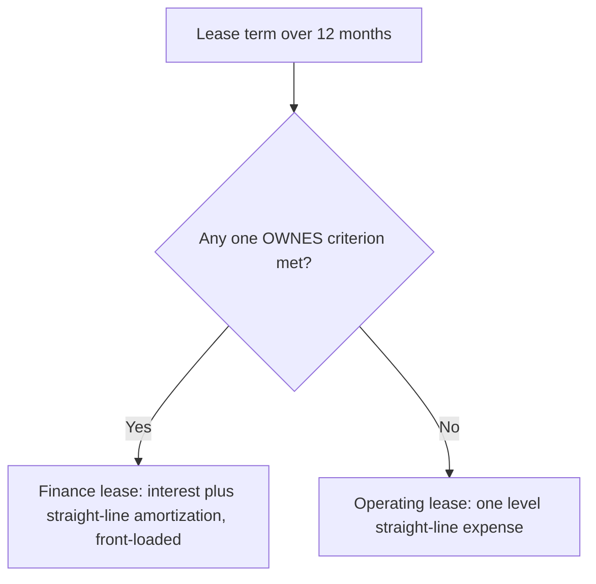

*Comprehensive F4 cheat sheet — current liabilities, contingencies, bonds, leases, and troubled debt. Bonds and leases carry the heaviest testing. Entry amounts are symbolic.*

## Current liabilities & accruals

- A **current liability** is due within **one year or the operating cycle, whichever is longer**. **Interest accrues by the month**, regardless of when the coupon is paid.
- **Accounts payable — gross vs. net:** the **gross** method records purchases at full price and books a **purchase discount** if taken; the **net** method records net and books **purchase discount lost** if the discount is missed.
- **Short-term debt expected to be refinanced** may be excluded from current liabilities only if the company has **both the intent and the ability** to refinance (actual refinancing before issuance, or a noncancelable agreement). Reclassifying it improves the current ratio.

> [!RULE]
> **Agency liabilities are never company expense.** Sales taxes collected and employee payroll withholdings (the employee's FICA, income-tax withholding) are held and remitted — not expense. The **employer's own** payroll taxes (matching FICA + unemployment) **are** expense.

- **Bonus/tax problems:** write the two definitions (bonus and tax), substitute, and solve the simultaneous equations.

> [!MNEMONIC]
> **Accrue compensated absences under SOCR** — **S**ervices already rendered · **O**bligation vests or accumulates · **C**ompensation probable · **R**easonably estimable. Meeting only the first three → footnote, no accrual. **Sick-pay exception:** accrue if it **vests** (paid even if unused); if **non-vesting**, no accrual even if it accumulates.

## Contingencies, premiums & warranties

- A **gain contingency** is **never accrued** (conservatism) — disclose unless remote; an **insurance recovery** is a gain contingency, so **never net it** against the related loss.

| Loss contingency | Estimable? | Treatment |
|---|---|---|
| **Probable** | Yes | **Accrue** the best estimate (the only accrual case) |
| **Probable** | No | disclose in the notes, and explain why it isn't estimable |
| **Reasonably possible** | — | disclose nature + amount or range |
| **Remote** | — | ignore — **unless it is a DOG guarantee** |

> [!MNEMONIC]
> **DOG** — remote losses still disclosed because they are guarantee-type: **D**ebts of others guaranteed · **O**bligations under standby letters of credit · **G**uarantees to repurchase receivables. For a **range** with no best estimate, accrue the **minimum** and disclose the rest.

- **Premiums (coupons)** and **assurance-type warranties** are accrued as expense in the **period of sale**, matching cost to revenue — not when redeemed/repaired. A **service-type / extended warranty** is a separate performance obligation → **deferred revenue recognized over the coverage period** (ASC 606). Changing the estimate is prospective.

```journal
{"desc": "Year-of-sale warranty accrual (full expected % of sales)", "dr": [["Warranty expense", "% × sales"]], "cr": [["Warranty liability", "% × sales"]]}
```
```journal
{"desc": "Honor a warranty (credit cash, or inventory if units are replaced)", "dr": [["Warranty liability", "cost"]], "cr": [["Cash / inventory", "cost"]]}
```

## Exit costs & asset retirement obligations

- **Exit/disposal costs** (severance, contract-termination, relocation) are accrued at **fair value (present value)** when there is an **obligating event**; **future operating losses are never accrued**. No discounting if due within a year.
- An **ARO** is a **legal obligation** to retire a long-lived tangible asset. Capitalize the **asset retirement cost (ARC) = ARO liability at present value**, then record two noncash charges each period:

```formula
Accretion expense = beginning ARO × credit-adjusted risk-free rate   (grows the ARO)
Depreciation      = ARC ÷ useful life
```

```journal
{"desc": "Initial ARO recognition (both sides at PV of the future cleanup cost)", "dr": [["Asset retirement cost (asset)", "PV"]], "cr": [["Asset retirement obligation", "PV"]]}
```

> [!TRAP]
> The ARO accretes up to the **undiscounted** settlement amount by the end of the asset's life. **Upward** cost revisions are discounted at the **current** rate; **downward** revisions at the **original** rate.

## Time value of money & notes payable

- Match rate and periods to payment frequency (semiannual → rate ÷ 2, periods × 2). **Ordinary annuity** = payments at period-**end**; **annuity due** = first payment **now** ("immediately," "beginning"). PV and FV factors are **reciprocals**; annuity-due PV factor = ordinary factor for (n − 1) **+ 1**.

> [!RULE]
> **Long-term notes are recorded at present value.** **Impute** the market rate when the stated rate is **absent or unreasonably low** — but skip imputation for notes due **within one year**. The asset received is debited at the note's **PV, never its face** (the classic wrong answer). Effective interest: **expense = beginning carrying value × market rate**; the discount (a contra-liability of unrecorded interest) amortizes as carrying value accretes to face.

## Bonds payable

- A bond is a long-term **financing liability** under an indenture. **Coupon paid = face × stated rate** (an operating outflow). **Interest expense = beginning carrying value × market rate at issuance** — fixed for the bond's life, and equal to the coupon **only when issued at par**.
- **Bond types:** **debenture** = unsecured (higher risk/yield) · **term** = single fixed maturity (the default) · **serial** = prenumbered, callable/redeemable in installments · **income** = pays interest only if income targets are met · **zero-coupon** = no coupons, all interest accretes to maturity.
- **Amortization method:** GAAP requires **effective interest**; **straight-line** is allowed only if **not materially different**.

```formula
Issue price = PV of principal (PV of $1) + PV of coupons (PV of ordinary annuity)   — both at the market rate
```

| Market vs. coupon | Sells at | Interest expense | Over the life |
|---|---|---|---|
| Market **>** coupon | **Discount** (a contra-liability, a deferred loss) | **greater than the coupon** | expense and carrying value **rise** toward par |
| Market **=** coupon | par | equals the coupon | carrying value constant |
| Market **<** coupon | **Premium** (an adjunct liability, a deferred gain) | **less than the coupon** | expense and carrying value **fall** toward par |

```journal
{"desc": "Issue at a discount (initial carrying value = cash proceeds)", "dr": [["Cash", "proceeds"], ["Discount on bonds payable", "discount"]], "cr": [["Bonds payable", "face"]]}
```
```journal
{"desc": "Interest — effective-interest, discount bond", "dr": [["Interest expense", "beg. CV × market"]], "cr": [["Cash", "coupon"], ["Discount on bonds payable", "amortization"]]}
```

> [!TRAP]
> Interest expense always uses the market rate **at issuance** — never the current market rate or the coupon rate. **Bond issue costs** reduce proceeds and carrying value (they behave like extra discount) and **raise the issuer's effective rate**, so the bondholder's records no longer mirror the issuer's.

- **Detachable warrants:** split the proceeds — allocate to the **warrants at fair value** (to APIC), and the **residual** to the bonds. **Convertible bonds** are recorded entirely as debt; on conversion use the **book-value method → no gain or loss** (the bond's carrying value becomes the stock's, APIC plugs).
- **Bonds sold between interest dates:** the buyer pays the **price + accrued interest** since the last coupon (= face × coupon rate × months elapsed ÷ 12); the issuer then pays the **full** coupon at the next date, netting the holder only the interest actually earned.
- **Debt covenants:** **affirmative** (must do — maintain working capital / coverage ratios, insurance) vs. **negative** (must not do — issue extra debt, pay excessive dividends). Violation = **technical default**, which lets the creditor demand repayment (usually renegotiated into a waiver or new terms).

**Debt is derecognized only when extinguished** — paid off, or the debtor is **legally released**. **In-substance defeasance** (placing assets in a trust to service the debt) does **NOT** extinguish it — the liability stays on the books.

```formula
Early-extinguishment gain / loss = net carrying value − reacquisition price
  net carrying value = face + unamortized premium − unamortized discount − unamortized issue costs
```

Extinguishment gains/losses are **nonoperating, within continuing operations**. ("At 101" = 1.01 × face.)

## Troubled debt restructuring

> [!RULE]
> **The debtor uses UNDISCOUNTED future payments; the creditor DISCOUNTS them** — the most-tested TDR asymmetry.

- **Transfer of assets (debtor):** first mark the asset to **fair value** (gain/loss on disposal), then gain on extinguishment = **debt carrying value − asset FV**. Shortcut total gain = debt CV − asset **book value**.
- **Transfer of equity (debtor):** gain = debt CV − **fair value of the stock** issued.
- **Modification of terms (debtor):** compare CV to the **total undiscounted new payments**. If new payments are **lower**, write the debt down, recognize a **gain**, and record **no further interest expense** (every payment reduces the liability). If **≥ CV**, no entry.
- **Creditor:** impairment = receivable CV − **present value of the new cash flows at the original effective rate**, booked through credit-loss expense and the allowance.

## Leases (OWNES)

- A lease conveys the **right to use an identified asset**. **Both** classifications **capitalize** an ROU asset and a lease liability at commencement. Meeting **any one** OWNES criterion (term > 12 months) → **finance**; none → **operating**.

> [!MNEMONIC]
> **OWNES:** **O**wnership transfers at end · **W**ritten purchase option reasonably certain · **N**PV of payments + guaranteed residual ≥ ~**90%** of fair value · **E**conomic life — term ≥ ~**75%** · **S**pecialized asset with no alternative use to the lessor.



- **Lessee liability** = PV of fixed payments + reasonably-certain options + index-based variable payments (at the current rate) + probable residual-guarantee shortfall. **Exclude** usage-based variable payments. Discount at the **rate implicit if known, else the incremental borrowing rate**.

```formula
ROU asset = lease liability + initial direct costs + prepaid payments − lease incentives received
```

```journal
{"desc": "Finance lease — commencement", "dr": [["Right-of-use asset", "ROU"]], "cr": [["Lease liability", "PV"], ["Cash / incentives", "day-1 items"]]}
```

- **Operating lease** → a single **straight-line lease expense** (interest embedded, liability reduction the plug). **Finance lease** → **two** lines: interest expense (declining) + straight-line amortization → **front-loaded, but the same lifetime total**. Amortize the ROU over **useful life if O or W**, else the **shorter of term or life**.
- **Cash flows:** everything is **operating** except finance-lease **principal** (financing) and payments to ready the asset (investing).

**Lessor** (classified **independently** of the lessee; collectibility must be **probable**):

| Lessor type | Trigger | Day-1 selling profit | Income over term |
|---|---|---|---|
| **Sales-type** | any OWNES criterion met | **recognized now** | interest income on the net investment |
| **Direct-financing** | OWNES fail, but PV + guaranteed residual ≥ ~FV and collection probable | **deferred** into interest income | interest income |
| **Operating** | neither | none | keep & depreciate the asset; straight-line lease income |

> [!TRAP]
> The **same lease** can be a **finance** lease to the lessee and an **operating** lease to the lessor — never assume symmetry. **Sale-leaseback:** apply the ASC 606 **sale test** — if a sale, derecognize the asset, recognize gain (adjusted for off-market terms), and record an ROU + liability; if it **fails** (or the leaseback is a finance lease), treat it as a **financing** (asset stays on the books, proceeds are a liability, no gain).

```recap
1. Current = within one year/operating cycle; interest accrues monthly; sales tax and withholdings are agency liabilities; vacation accrues via SOCR (non-vesting sick pay excepted).
2. Loss contingency: accrue only if probable + estimable; range with no best estimate → minimum; remote DOG guarantees disclosed; gain contingencies never accrued or netted.
3. Premiums/warranties accrued in the year of sale; extended warranties = deferred revenue. Exit costs at PV (no future operating losses); ARO capitalizes ARC = ARO at PV, then accretion + depreciation.
4. Notes/bonds recorded at PV; interest expense = beginning CV × market rate at issuance; discount → expense above coupon & rising, premium → below & falling; issue costs raise the issuer's effective rate.
5. Early extinguishment = net CV − reacquisition price; convertibles use book-value method (no gain); detachable warrants split at FV.
6. TDR: debtor undiscounted, creditor discounts; a modification with lower payments → gain, then no further interest.
7. Leases: OWNES → finance (two front-loaded expenses) vs. operating (one level expense); lessor sales-type / direct-financing / operating classified independently; sale-leaseback hinges on the ASC 606 sale test.
```
