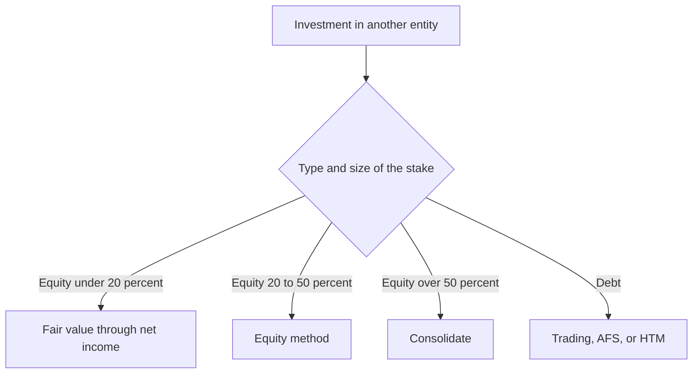

*Comprehensive F5 cheat sheet — investments, the equity method, consolidations, partnerships, cash flows, and deferred taxes. The highest-gap, highest-yield section. Entry amounts are symbolic.*

## Financial instruments — classification

How an investment is accounted for depends on **what it is** and **how much you hold**:

| Investment | Test | Accounting |
|---|---|---|
| **Debt — trading** | intend to sell near-term | **fair value through net income** |
| **Debt — available-for-sale (AFS)** | neither trading nor to maturity | **fair value through OCI** |
| **Debt — held-to-maturity (HTM)** | **intent and ability** to hold to maturity | **amortized cost** (not marked to market) |
| **Equity < 20%** | no significant influence | **fair value through net income** |
| **Equity 20–50%** | significant influence | **equity method** |
| **Equity > 50%** | control | **consolidate** |

- Only **debt** (or mandatorily redeemable preferred) can be HTM. Cash-flow classification follows the balance sheet: current → operating, non-current → investing. **Transfers between categories** are made **at fair value**, then you apply the destination category's rules. A **fair-value liability's** own-credit-risk change goes to **OCI**.



> [!MNEMONIC]
> **CECL — expected credit loss = present value of expected cash flows − amortized cost**, always recognized in **net income**. **HTM** writes fully down to that PV. **AFS** caps the hit to net income at the ECL and sends any **excess** loss to **OCI** — *unless* the entity **intends or is likely required to sell**, in which case it writes the security **directly to fair value through net income**. Credit-loss allowances are **reversible**; equity-security impairment is **not**.

**Realized gain on sale:** **trading** = selling price − **carrying value**; **AFS** = selling price − **original cost**, reversing the cumulative OCI. **Non-public equity** with no readily determinable FV uses **cost − impairment ± observable price changes**. **Dividends are income** except liquidating (return of capital), stock dividends, and equity-method dividends.

## Equity method (significant influence, 20–50%)

- The investment is recorded at cost (including legal/acquisition fees) and **not marked to market**; it is adjusted for the investor's share of the investee.

> [!MNEMONIC]
> **BASE:** **B**eginning carrying value **+** your % of net income **−** your % of excess depreciation **−** your % of dividends (and % of losses) **= E**nding carrying value. **Dividends are a return of capital, not income**; the carrying value cannot fall below zero.

```journal
{"desc": "Record share of investee net income", "dr": [["Investment in affiliate", "% × NI"]], "cr": [["Equity in earnings", "% × NI"]]}
```
```journal
{"desc": "Receive dividend — a return of capital, not income", "dr": [["Cash", "% × dividend"]], "cr": [["Investment in affiliate", "% × dividend"]]}
```

- The **excess purchase price** over book splits into **identifiable** (FV − BV of specific assets × %) and **goodwill**. **Excess depreciation** = (FV − BV) ÷ remaining life × your % — it **reduces equity earnings** (land is not depreciated). **Goodwill is embedded** in the one-line investment — **not amortized, not separately tested**; impairment is judged on the whole investment and requires an **other-than-temporary** decline (no reversal).
- **Intercompany profit** on inventory/assets still held is **deferred** by the investor's % and reverses when finally sold to outsiders.

## Consolidation (control, > 50%)

- **Control** drives consolidation, but can be **absent above 50%** (bankruptcy, legal reorganization, severe foreign restrictions). The **VIE model** consolidates when the **primary beneficiary** has both the **power to direct** the significant activities **and** the obligation to absorb losses / right to benefits — even with 0% voting ownership. **Noncontrolling interest (NCI)** is reported at **fair value** as a separate component of consolidated equity.
- **Pushdown accounting** (elective, entity-level, irrevocable, made at the change of control): the **acquiree restates its own books** to the acquirer's stepped-up fair values, uniquely **records goodwill on its own books**, and plugs the difference to a new equity account, **pushdown capital**. If not elected, the sub keeps historical cost.

> [!MNEMONIC]
> **CAR-IN-BIG** eliminating entry: **C**ommon stock, **A**PIC, **R**etained earnings of the sub are **eliminated** (debit) · the parent's **I**nvestment is eliminated and **N**CI recorded at FV (credit) · the **B**alance sheet is stepped to FV, **I**dentifiable intangibles recorded, and **G**oodwill plugged (debit). **N and G exist only in consolidation.**

```formula
Full goodwill = consideration transferred + NCI at fair value + FV of any prior-held interest
                − fair value of identifiable net assets acquired          (negative → bargain-purchase gain)
```

```journal
{"desc": "CAR-IN-BIG — acquisition-date eliminating entry", "dr": [["Common stock — sub", "book"], ["APIC — sub", "book"], ["Retained earnings — sub", "book"], ["Net assets — step up to FV", "FV − BV"], ["Identifiable intangibles", "FV"], ["Goodwill", "plug"]], "cr": [["Investment in sub", "cost"], ["Noncontrolling interest", "at FV"]]}
```

- **Step acquisition:** when a prior stake becomes control, **remeasure it to fair value** (gain/loss to earnings), then apply the goodwill formula.

> [!TRAP]
> **Acquisition-related costs are not part of the price.** **Direct costs** (legal, advisory, due-diligence) are **expensed**; **stock-issuance costs reduce APIC**. (Contrast the equity method, which *capitalizes* legal fees.) **Contingent consideration** is recorded at FV on the acquisition date; if a **liability**, it is **remeasured through earnings**. Acquired **in-process R&D** is an **indefinite-lived** intangible — not amortized until completed or abandoned.

- **Intercompany transactions** are eliminated **100%** regardless of ownership %. **Downstream** (parent → sub) deferred profit is charged **100% to the parent**; **upstream** (sub → parent) is **split between parent and NCI** by ownership %.
  - **Inventory:** defer the seller's profit; split between the buyer's **ending inventory** (unsold) and **COGS** (resold); it carries into next year's beginning inventory via RE.
  - **Land:** eliminate the intercompany gain and **restore land to original cost** (no depreciation, so it simply sits in RE thereafter).
  - **Depreciable fixed assets:** eliminate the gain **and reverse the buyer's excess depreciation each year** — the deferred gain unwinds over the asset's remaining life until it fully offsets.
  - **Bonds** bought back = a **constructive retirement**: the gain/loss (price vs. carrying value) appears **only in consolidation**, then rolls into RE.

```formula
NCI in net income = NCI% × (sub net income − FV step-up amortization − upstream unrealized profit)
```

## Partnerships

- **Formation:** contributed assets at **fair value**, liabilities at **present value** (GAAP) vs. **basis** (tax). Buying an existing partner's interest is a private deal — partnership assets, liabilities, and **total capital are unchanged**.

> [!MNEMONIC]
> **Admission — "bonus works off the balance, goodwill off the contribution."** **Exact:** contribution = book value of the interest. **Bonus:** the new partner over/underpays vs. the balance of total capital — an overpayment credits the **old** partners, an underpayment credits the **new** partner, by the P&L ratio. **Goodwill:** the contribution implies a total firm value; record the goodwill (usually to the old partners).

```formula
Exact:    new total capital = existing capital ÷ (1 − new partner %)
Bonus:    new partner's capital = new % × (existing capital + contribution)
          overpay → bonus to old partners; underpay → bonus to new partner
Goodwill: implied firm value = contribution ÷ new %;  goodwill = implied value − actual net assets
```

> [!TRAP]
> **Guaranteed salaries/interest are allocated in full even in a loss year** — allocate them, then split the resulting **negative residual** by the P&L ratio (do not pro-rate the salaries down). Read whether a bonus is computed pre-bonus or after-bonus.

- **Admission edge case:** goodwill normally goes to the **old** partners, but if the incoming partner **overpays** relative to the grossed-up capital (bringing implied goodwill), record the goodwill to the **new** partner instead.

- **Withdrawal / retirement / death of a partner** — uses **bonus** or **goodwill**, **never exact** (the payout can't be calibrated). Identifiable assets may first be **revalued to fair value** (credited to all partners by P&L). Then:
  - **Bonus method:** the difference between the withdrawing partner's capital and the cash paid is a **bonus to/from the remaining partners** by their P&L ratio — pay **more** than capital → bonus **from** them; pay **less** → bonus **to** them. Implied goodwill is **not** recorded.
  - **Goodwill method:** the excess payment implies firm-wide goodwill; record it so the withdrawing partner's capital **equals the payoff**.

- **Liquidation order:** ① sell assets (gains/losses to capital by P&L) → ② pay creditors, **including partner loans** → ③ distribute remaining cash by **capital-account balances**. A **deficiency** is offset against that partner's loan (right of offset), else absorbed by the others by P&L. **Safe payments:** before each interim distribution, assume the **worst case** (all remaining assets a total loss and any then-deficient partner cannot pay). **Marshaling:** partnership creditors have first claim on partnership assets, personal creditors first on personal assets.

## Statement of cash flows

- The statement explains the change in **cash + cash equivalents (original maturity ≤ 3 months)**. **Operating** = current items except cash and interest-bearing debt; **Investing** = non-current assets; **Financing** = interest-bearing debt and own equity. **Cash flow per share is not reported.**

> [!MNEMONIC]
> **Indirect operating method:** start with **net income**; **add** depreciation, amortization, bad-debt expense, **losses**, and **bond-discount** amortization; **subtract** gains and **bond-premium** amortization; then adjust working capital — an **increase in an operating asset is a subtraction**, and the other three flip.

> [!TRAP]
> **Interest paid or received, and dividends received, are OPERATING; dividends PAID are financing.** On a debt payment, the **principal** is financing but the **interest** is operating. An equity-method **share of income is not a cash flow** (only dividends received appear).

```formula
Capital expenditures = ending gross PP&E − beginning gross PP&E + cost of assets sold
Dividends paid       = beginning RE + net income − ending RE − increase in dividends payable
```

- In the acquisition year, the acquisition outflow is shown **net of cash acquired**.
- **Direct vs. indirect:** the **direct** method reports actual operating cash receipts/payments, but GAAP still requires the **indirect reconciliation** either way — and **only the indirect method is CPA-tested**.

## Income taxes

- **Book income** follows GAAP; **taxable income** follows the IRC. **Total income tax expense = current tax (payable) ± deferred tax (DTL/DTA)** — the distractor answer just multiplies book income × the rate.

> [!MNEMONIC]
> **Intraperiod allocation — IDA-PUFI:** allocate the period's tax across **I**ncome from continuing operations, **D**iscontinued operations, **A**ccounting-principle changes, and the **PUFI** OCI items. Use the with-and-without method: put the tax on continuing ops "as if it were the only component," and assign the remainder to the others, each net of tax.

- **Permanent differences** hit book **or** tax only and **never reverse** → no deferral: municipal-bond interest, key-person life insurance, fines/penalties, the DRD, officer compensation over $1M.

| Temporary difference | Direction | Result |
|---|---|---|
| book income first / tax deduction first (installment sales, MACRS) | taxable income **< book** now | **DTL** — pay tax **later** |
| taxable income first / book expense first (unearned rent, warranties, bad debt) | taxable income **> book** now | **DTA** — paid tax now, benefit later |

```journal
{"desc": "Deferred tax liability — taxable income below book now", "dr": [["Income tax expense — current", "taxable × rate"], ["Income tax expense — deferred", "Δ × rate"]], "cr": [["Income tax payable", "taxable × rate"], ["Deferred tax liability", "Δ × rate"]]}
```
```journal
{"desc": "Deferred tax asset — taxable income above book now", "dr": [["Income tax expense — current", "taxable × rate"], ["Deferred tax asset", "Δ × rate"]], "cr": [["Income tax payable", "taxable × rate"], ["Deferred tax benefit", "Δ × rate"]]}
```

> [!RULE]
> Deferred taxes use the **enacted future rate** (anticipated/proposed rates are distractors). A **valuation allowance** is recorded when it is **more likely than not (> 50%)** that part of a DTA won't be realized — **net DTA = DTA − allowance**. Rate changes are **prospective** (remeasure DTL/DTA through continuing operations). **Net** all deferreds into a single **non-current** balance-sheet amount.

- **Change in tax status:** taxable → **pass-through** (C-corp → S-corp/partnership) **writes off** existing DTLs/DTAs; pass-through → taxable **creates** them. The effect hits **continuing operations** in the period of change.

- **Uncertain tax position** — two-step, **more-likely-than-not (> 50%)**: ① recognition (is the position sustainable on its merits? fail → no benefit); ② measurement (recognize the **largest benefit whose cumulative probability first exceeds 50%**), booking a liability for the excess taken.
- **Net operating losses** create a **DTA**. Post-2017 losses **carry forward indefinitely** but offset only **80%** of income (from 2021); **no carryback**.
- **Dividends-received deduction** (a permanent difference): **50%** at 0–19% ownership, **65%** at 20–80%, **100%** over 80%.

> [!TRAP]
> **APB 23:** a **subsidiary's** undistributed earnings need **no DTL** if the parent asserts they are **indefinitely reinvested** — the opposite of the unconsolidated-investee/DRD case, where a DTL **is** recorded.

```recap
1. Investments: debt trading (FV→NI) / AFS (FV→OCI) / HTM (amortized cost); equity <20% FV→NI, 20–50% equity method, >50% consolidate; CECL = PV of cash flows − amortized cost, AFS caps the income hit at the ECL.
2. Equity method BASE (dividends = return of capital); goodwill embedded, not tested; intercompany profit deferred by %.
3. CAR-IN-BIG eliminating entry; full goodwill = consideration + NCI FV + prior-interest FV − net-asset FV; acquisition costs expensed; intercompany eliminated 100% (downstream to parent, upstream split with NCI).
4. Partnerships: bonus off the balance, goodwill off the contribution; guaranteed allocations paid in full; liquidation pays creditors (incl. partner loans) then distributes by capital balances; safe payments assume the worst case.
5. Cash flows: indirect adjustments (increase in operating asset = subtract); interest/dividends received operating, dividends paid financing; back into capex and dividends paid.
6. Taxes: total = current ± deferred; permanent (no deferral) vs. temporary (DTL pay later / DTA paid now); enacted rate, valuation allowance if >50% unrealizable, netted non-current.
7. UTP two-step (>50%, cumulative-probability measurement); NOLs carry forward indefinitely at an 80% cap with no carryback; DRD 50/65/100; APB 23 defers no DTL on reinvested subsidiary earnings.
```
