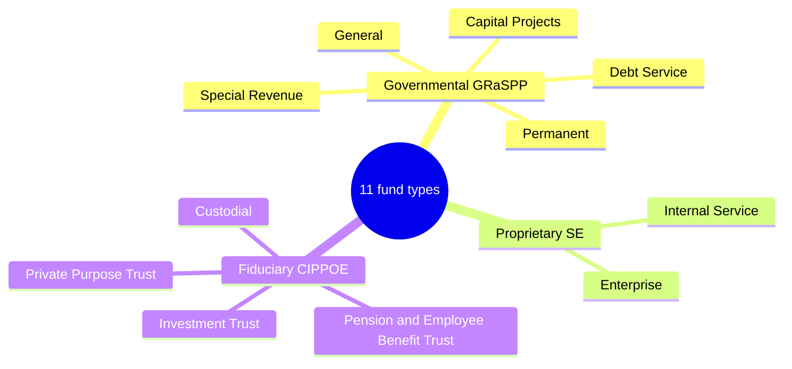

*Comprehensive F6 cheat sheet — not-for-profit and governmental accounting. The mnemonics carry this section: memorize the net-asset classes, GRaSPP / SE-CIPPOE, and MAC vs. SCARE.*

## NFP — net assets & statements

- A **not-for-profit** serves a mission rather than profit, is funded by **nonreciprocal contributions**, and has **no ownership interest**. Private NFPs report the **organization as a whole** on the **full accrual basis** under FASB — with **no fund accounting** in the external statements. (A **governmental** NFP follows GASB instead.)
- Three statements: **statement of financial position** (assets, liabilities, **net assets**), **statement of activities** (revenues, expenses, reclassifications → change in net assets), and **statement of cash flows**.

**Net assets are classified only by WHO imposed the limit:**

| Class | Who imposed it | Spendable at the board's discretion? |
|---|---|---|
| **Without donor restrictions** | no one, or the **governing board** (internal) | **yes** — includes board-designated / quasi-endowment amounts |
| **With donor restrictions** | an **outside donor** (external) | only per the donor's stipulation — purpose, time, or **perpetual** |

> [!TRAP]
> **Board-designated funds are "without donor restrictions."** Because the limit is self-imposed, a board-designated endowment or reserve stays in the *without* class — only an **external donor** creates a *with-donor-restrictions* balance. All expenses reduce net assets *without* restrictions **except investment expense**, which is netted against investment return. NFPs report expenses by **both nature and function** in one location.

- **Functional expense split:** **program services** (the mission activities the org is chartered to perform) vs. **supporting services** = **management & general** + **fundraising** + **membership development**. *Program = purpose.*

- When a donor restriction is satisfied, a **reclassification titled "net assets released from restrictions"** simultaneously **increases** the *without* class and **decreases** the *with* class (netting to zero). **Perpetual restrictions are never released.**

## NFP — contributions

> [!RULE]
> **Two independent axes — never merge them.** *Conditional vs. unconditional* is a **recognition** question (do we record it yet?); *with vs. without donor restrictions* is a **classification** question (which net-asset column?). A **condition** exists when there is a **barrier the NFP must overcome AND the donor keeps a right of return** → **not recorded** (any deposit is held as a **refundable advance**). A **restriction** merely dictates how the resources may be spent.

- **Unconditional pledges** are recorded at **fair value when promised**; multiyear pledges at **present value** (with an implied **time restriction**). The PV accretion is **contribution revenue, not interest income**. Pledges are shown **net of an allowance with no bad-debt expense**.

> [!MNEMONIC]
> Record **donated services** only **SOME** of the time — **S**pecialized skills that the donor possesses, that the organization would **O**therwise buy, that are **M**easurable, and valued **E**asily at fair value — **or** the service **creates/enhances a nonfinancial asset**. The entry is a wash (expense and contribution). **Fundraising contribution revenue = amount received − the fair value of any premium** given to the donor.

- **Donated collection items** (art, historical treasures) need **not** be recorded if all three conditions are met (held for public viewing/education, preserved, and proceeds reinvested in the collection).
- **Patient service revenue** is recorded gross at standard rates, less **charity care** (which is **never** recognized) and contractual adjustments. **Tuition** is reported **gross** (less canceled classes; scholarships are an expense or allowance, not a netting). Exchange transactions (tuition, patient service, membership) are earned revenue, always **without donor restrictions**.

## NFP — cash flows & endowments

> [!TRAP]
> **The NFP cash-flow twist:** cash from **donor-restricted** contributions for **long-term purposes** (capital assets or endowment) is a **financing** inflow — but **board-designated** (internal) amounts for the same assets stay in **operating**. Who imposed the limit decides the section. Under the direct method an NFP needs **no reconciliation** (unlike a for-profit).

- **Intermediary transfers:** the recipient records a **contribution** in every case **except** when it is **not financially interrelated and lacks variance power** — then the assets are a **liability** (refundable advance). The beneficiary recognizes its interest **unless** the recipient holds **variance power** (then it recognizes nothing).

> [!MNEMONIC]
> **Endowments** are classed by source: donor-restricted → *with* restrictions; board-designated (quasi-endowment) → *without*. An **underwater** endowment (fair value below the original gift) keeps its accumulated losses **within** the *with-donor-restrictions* class and discloses **FED** — **F**air value, original **E**ndowment gift, and **D**eficiency. Debt and readily-valued equity investments are carried at **fair value**; NFPs may **not** use hedge accounting.

## Governmental — accountability & fund structure

- Governmental accounting demonstrates **accountability** for public resources rather than profit. **Interperiod equity** asks whether **current-year revenues covered current-year services** or pushed the cost onto future taxpayers. The framework follows an entity's **basis of organization and funding, not its industry** — GASB if run by or financially accountable to a primary government, otherwise FASB.



> [!MNEMONIC]
> **Governmental funds = MAC-GRaSPP** — **M**odified **A**ccrual basis, **C**urrent financial resources focus, the **GRaSPP** funds. **Proprietary + fiduciary = SCARE** — the **S**E and **C**IPPOE funds, full **A**ccrual, **R**ecording non-current assets/liabilities, **E**conomic resources focus. The **government-wide** statements are also full accrual.

| | Governmental (MAC-GRaSPP) | Proprietary/fiduciary + government-wide (SCARE) |
|---|---|---|
| **Basis of accounting** | modified accrual | full accrual |
| **Measurement focus** | current financial resources | economic resources |
| **Balance sheet holds** | current items only (**no** fixed assets or long-term debt) | **all** assets and liabilities |
| **Equity section** | **fund balance** | **net position** (3 components) |
| **Operating statement** | revenues, **expenditures**, changes in fund balance | revenues, **expenses** (fiduciary: additions/deductions) |

| Fund (GRaSPP — governmental) | Purpose |
|---|---|
| **General** | catch-all for ordinary operations financed by taxes/general revenue |
| **Special Revenue** | revenues from specific/earmarked sources, restricted to particular activities |
| **Debt Service** | accumulate resources to pay **interest & principal on general (GO) debt** |
| **Capital Projects** | resources to **acquire or construct major capital assets** (non-enterprise) |
| **Permanent** | legally restricted so **only income — not principal —** supports programs |

**Proprietary (SE):** Internal Service (serves other departments) · Enterprise (serves the external public via user fees). **Fiduciary (CIPPOE):** Custodial · Investment Trust · Private Purpose Trust · Pension & other employee-benefit trust.

- **Fund balance** (governmental funds) is classified by how binding the constraint is, most → least: **Nonspendable · Restricted · Committed · Assigned · Unassigned**.
- **Net position** (full-accrual funds) has **3 components: net investment in capital assets · restricted · unrestricted**.
- Governments issue an **Annual Comprehensive Financial Report (ACFR)**: **MD&A** + basic statements (government-wide + fund + notes) + **required supplementary information (RSI)**.
- **Budgetary compliance:** governmental funds have a **budgetary focus**; a **budget-to-actual comparison** (original budget + final budget vs. actual) is presented as **RSI** for the General fund and each major special-revenue fund.

## Governmental — recognition & reconciliation

> [!RULE]
> **Modified-accrual revenue** is recognized when **measurable AND available** (collectible within the period or **within ~60 days** after year-end). **Expenditures** are recorded when the fund liability is incurred — **except debt service** (principal **and** interest), which is recognized only when **due or paid** (never accrued).

- The **capital-outlay contrast** is the single most-tested governmental idea: the same purchase is an **expenditure** in a governmental fund but a **capitalized asset** at the government-wide / proprietary level.

```journal
{"desc": "Governmental fund (modified accrual) — capital outlay is an expenditure, no asset", "dr": [["Expenditure — capital outlay", "cost"]], "cr": [["Cash", "cost"]]}
```
```journal
{"desc": "Government-wide / proprietary (full accrual) — capitalize the asset", "dr": [["Equipment", "cost"]], "cr": [["Cash", "cost"]]}
```

> [!MNEMONIC]
> **Fund → government-wide reconciliation:** **add** the capital assets excluded from the governmental funds; **subtract** the non-current liabilities excluded from them; **add** accrual revenues beyond modified-accrual revenues; **subtract** the accrued interest the funds never recognized. Government information should make **U R MICE** — **U**nderstandability, **R**eliability, **M**ake-a-difference (relevance), **I**n-timeliness, **C**onsistency, and **E**ntity-to-entity comparability. An **enterprise fund is required** if debt is secured by pledged fee revenue, a law requires cost-recovery fees, or pricing is set to recover costs.

```recap
1. Private NFPs report the whole organization on full accrual with three statements and no external fund accounting; equity = net assets.
2. Net assets are classed by who imposed the limit: without donor restrictions (including board-designated) vs. with donor restrictions; all expenses hit "without" except investment expense.
3. Conditional vs. unconditional = recognition (barrier + right of return → not recorded); with vs. without = classification; released-from-restrictions reclassifies, perpetual is never released.
4. Donated services recorded only under SOME; fundraising revenue = amount received − premium FV; patient service gross less charity care; tuition gross.
5. NFP cash flows: donor-restricted long-term contributions = financing, board-designated = operating; endowments donor (with) vs. board (without); underwater discloses FED.
6. Funds: GRaSPP (governmental, modified accrual) and SE + CIPPOE (proprietary/fiduciary, full accrual); modified accrual = measurable + available (~60 days), debt service when due.
7. Capital outlay = an expenditure in governmental funds but capitalized government-wide; the reconciliation adds capital assets and accrual revenues, subtracts long-term liabilities and accrued interest.
```
