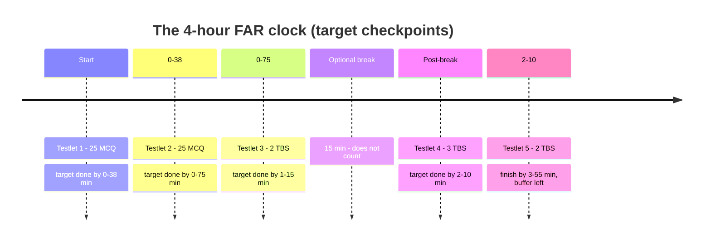

*Exam-day mechanics, not content — the timing plan, the built-in Excel spreadsheet, and testlet strategy. Distilled from CPA-community consensus (r/CPA, another71 forums) and the AICPA's official spreadsheet guidance. Read it the night before; it's worth a testlet's worth of points.*

## 1. FAR structure & the 4-hour clock

**FAR = 4 hours · 5 testlets · 50 MCQ + 7 TBS · weighted 50% MCQ / 50% TBS.** MCQ testlets are **adaptive**: do well on the first 25-MCQ testlet and the second gets harder — **a harder second testlet is a good sign, not a reason to panic.** One optional **15-minute break** (after testlet 3) does not count against your time.



> [!EXAM]
> **Budget: ~1.25–1.5 min per MCQ (~75 min for all 50), ~18–20 min per TBS.** Write your **checkpoint clock times on the scratch board at the start** ("MCQ done by 1:15 remaining; TBS done by…"). The exam shows a countdown timer — glance, don't stare.

## 2. Time-management rules (the community's most-repeated advice)

> [!RULE]
> **Flag and move — never camp on one item.** If an MCQ isn't cracked in ~90 seconds, pick your best guess, **flag it, and move on**; come back with leftover time. Every MCQ is worth the same — a hard one is not worth three easy ones.

- **You cannot return to a testlet once submitted** — so use, but don't hoard, your flag-and-review pass *within* each testlet before submitting.
- **Never leave anything blank** — no penalty for wrong answers; a flagged guess beats an empty box.
- **TBS are where time vanishes.** Do the MCQ testlets briskly precisely to bank time for simulations. If a TBS has many cells, fill the ones you know, approximate the rest, and move on.
- **Don't let one brutal testlet wreck your morale** — scoring is scaled and you don't know which items are pretest/unscored. Reset each testlet.

## 3. The built-in Excel spreadsheet

Every TBS has a **spreadsheet icon** in the toolbar — a stripped-down Excel. It **auto-saves while you're in a testlet, but wipes clean when you leave the testlet**, so finish a sim's calculations before you submit it.

| Works | Doesn't |
|---|---|
| `=A1+A2`, `=B3*C3`, `=SUM(A1:A10)`, `=AVERAGE(...)`, `+ − * /` | **Keyboard shortcuts do NOT trigger formulas** — type the `=` formula manually |
| Copy / cut / paste (incl. shortcut keys) | No macros, no advanced functions |
| Filter and sort (multi-variable) | Data is **cleared when you leave the testlet** |

> [!MNEMONIC]
> Use the spreadsheet for anything **multi-step**: **bond amortization schedules, depreciation (DDB/SYD), lease liability roll-forwards, consolidation eliminations, cash-flow reconciliations, deferred-tax computations.** Seeing the numbers laid out beats the pop-up calculator and cuts careless errors. **Practice with it before exam day** so you're not learning the tool during the clock.

## 4. TBS & authoritative-literature tactics

- **Read the requirement first**, then the exhibits — pull only the numbers the ask needs; exhibits are padded with distractors.
- **Exhibits scroll and split** — resize panes so the data and the answer grid are visible together.
- **Research/authoritative-literature TBS:** use the search box with a **specific keyword** (e.g., "held for sale," "asset retirement"), not a whole sentence; you're graded on landing the exact citation.
- **Cut and paste from the exhibit** into answer cells to avoid transcription typos.

## 5. Before you sit + the mental game

> [!EXAM]
> **Brain-dump at the start.** The moment testlet 1 opens, dump your volatile mnemonics onto the scratch board or spreadsheet — **PUFER, ISTAR, CAR-IN-BIG, OWNES, GRaSPP / SE-CIPPOE, MAC vs. SCARE, DOG, SOCR** — before the pressure erodes them. (These live in [R1](#/R/R1)–[R6](#/R/R6).)

- **Sleep and food beat one more cram hour** — FAR is a 4-hour endurance test; a foggy hour 4 loses more than a late-night hour gains.
- **Know the logistics:** arrive early, bring two forms of ID, expect to lock up everything; the scratch board and marker are provided (no personal paper).
- **Take the optional break** — stand up, breathe, reset for the TBS-heavy back half.
- **Trust your first instinct** on MCQ; change an answer only if you find a concrete reason.

```recap
1. FAR = 4 hrs, 5 testlets (50 MCQ + 7 TBS), 50/50 weight; MCQ testlets adapt — a harder second testlet is a good sign.
2. Budget ~1.25–1.5 min/MCQ (~75 min total) and ~18–20 min/TBS; write checkpoint clock times on the scratch board.
3. Flag and move — never camp; never leave blanks; you can't return to a submitted testlet; reset your morale each testlet.
4. The TBS spreadsheet is real Excel-lite (SUM/AVERAGE/arithmetic, copy-paste, filter/sort) but formulas are typed manually and data clears when you leave the testlet — use it for every multi-step calc and practice beforehand.
5. TBS: read the requirement first, mine exhibits for only what's needed, cut-and-paste to avoid typos, and search authoritative literature by precise keyword.
6. Brain-dump mnemonics at the start; prioritize sleep/food; take the break; trust first instincts.
```

---

*Sources: FAR exam format from [UWorld](https://accounting.uworld.com/cpa-review/cpa-exam/far/) and [Becker](https://www.becker.com/blog/cpa/time-management-tips-for-the-cpa-exam); Excel/spreadsheet behavior from the [AICPA spreadsheet FAQ](https://www.aicpa-cima.com/resources/download/the-uniform-cpa-examination-the-exam) and [UWorld's Excel guide](https://accounting.uworld.com/blog/cpa-review/how-microsoft-excel-will-function-cpa-exam/); timing/testlet strategy from [Gleim](https://www.gleim.com/cpa-review/cpa-exam-time-management-tips/) and the another71 CPA forum — consistent with the most-upvoted r/CPA advice (reddit.com itself is not crawlable, so equivalent community sources were used).*
